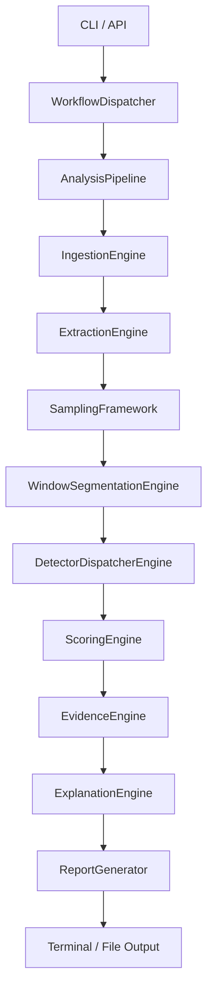
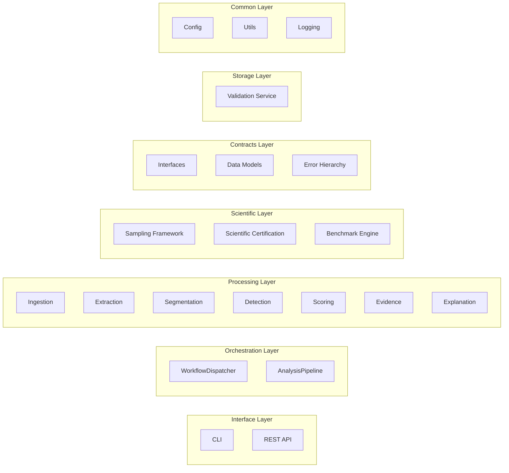
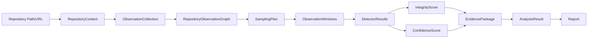
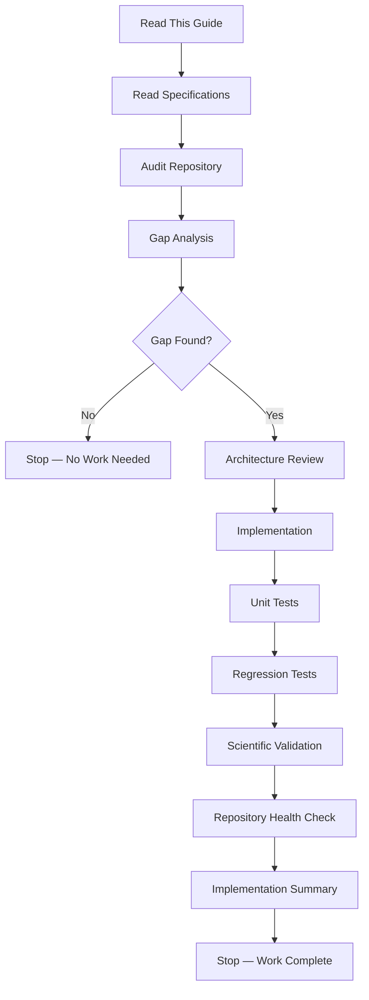
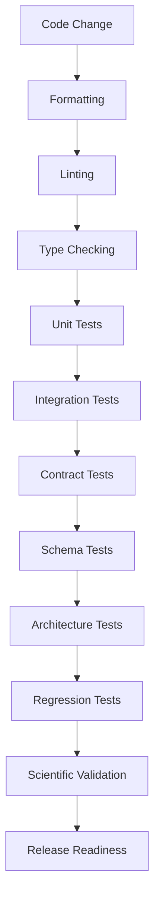
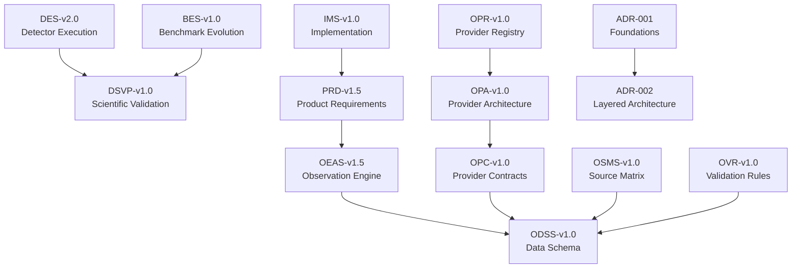

# MIIE v1.6 — Implementation Guide

**Repository Engineering Constitution & AI Agent Operating Manual**

| Field | Value |
|-------|-------|
| Document Type | Permanent Engineering Constitution |
| Version | 1.6.0 |
| Audience | Autonomous AI agents, experienced maintainers |
| Status | Canonical |
| Last Updated | 2026-07-05 |

---

## Table of Contents

1. [Repository Mission](#1-repository-mission)
2. [Repository Philosophy](#2-repository-philosophy)
3. [Repository Status](#3-repository-status)
4. [High-Level Architecture](#4-high-level-architecture)
5. [Repository Directory Map](#5-repository-directory-map)
6. [Repository Reading Order](#6-repository-reading-order)
7. [Frozen Architecture](#7-frozen-architecture)
8. [Scientific Principles](#8-scientific-principles)
9. [Implementation Rules](#9-implementation-rules)
10. [Implementation Workflow](#10-implementation-workflow)
11. [Validation Workflow](#11-validation-workflow)
12. [Repository Health Rules](#12-repository-health-rules)
13. [Engineering Standards](#13-engineering-standards)
14. [Scientific Specification Map](#14-scientific-specification-map)
15. [Implementation Decision Tree](#15-implementation-decision-tree)
16. [Repository Lifecycle](#16-repository-lifecycle)
17. [Repository Governance](#17-repository-governance)
18. [Current Focus](#18-current-focus)
19. [Appendices](#19-appendices)

---

## 1. Repository Mission

### 1.1 Scientific Purpose

MIIE — the **Measurement Integrity Intelligence Engine** — is a deterministic analysis pipeline that evaluates the validity of software engineering metrics extracted from version control histories. It detects distribution drift, correlation breakdown, and threshold compression in metric time series, then produces traceable evidence packages with integrity and confidence scores.

MIIE exists because software engineering metrics are routinely collected, reported, and acted upon without validation of their statistical integrity. A commit count can be inflated. A coverage number can be gamed. A review latency metric can be manipulated by merging trivial PRs. MIIE provides the statistical machinery to detect these anomalies.

### 1.2 Engineering Purpose

MIIE is a production-quality Python package (v1.6.0) distributed via PyPI. It provides:

- A **CLI** with 10 commands for local and GitHub analysis
- A **Python API** for programmatic integration
- A **REST API** (FastAPI) for service deployment
- A **Docker image** for containerized execution
- **7 runnable examples** demonstrating every integration path

### 1.3 Research Goals

1. Establish whether software engineering metrics exhibit detectable integrity violations
2. Provide a reproducible, auditable framework for metric validation research
3. Create a reference implementation for statistical anomaly detection in repository telemetry
4. Build a benchmark suite for evaluating detection algorithms against ground truth

### 1.4 Long-Term Vision

MIIE evolves toward a comprehensive metric auditing platform: more providers (GitLab, Bitbucket), more detectors (synthetic commit detection, AI-generated code patterns), more metrics (DORA, Cyclomatic Complexity), and a plugin architecture for community-contributed detectors.

---

## 2. Repository Philosophy

### 2.1 Evidence-First Architecture

Every detection finding must be backed by a statistical test with a computed p-value or effect size. No heuristic-only detections are permitted. The evidence engine packages raw statistical artifacts (KS statistics, PSI values, correlation coefficients, z-scores) alongside derived scores.

### 2.2 Deterministic Execution

Given identical inputs and configuration, MIIE must produce identical outputs across runs, platforms, and Python versions. Determinism is enforced through:

- Centralized seed management (`SeedManager` with `numpy.random.default_rng(seed)`)
- Deterministic serialization (`json.dumps` with `sort_keys=True, separators=(",",":")`)
- Frozen dataclasses for all data models
- Deterministic graph construction (deduplication by `highest_confidence` policy)
- Deterministic window building (sorted by timestamp, sequential renumbering)

### 2.3 Statistical Validity Before Convenience

Detection thresholds are derived from statistical significance levels, not arbitrary constants. The KS test uses α=0.05. PSI uses the established 0.25 threshold. The excess mass z-test uses α=0.05 one-tailed. These are frozen — changing them requires scientific justification through the RFC process.

### 2.4 Reproducibility

Every analysis run produces a deterministic `EvidencePackage` containing:

- A reproducibility seed
- A config hash (SHA-256 of canonical JSON)
- A dependency hash
- Platform and Python version metadata
- A deterministic evidence ID (`sha256(seed:config_hash)[:8]`)

### 2.5 Scientific Transparency

All statistical algorithms are implemented in pure Python with NumPy/SciPy. No black-box libraries. The `statistics.py` module contains every shared function (KS test, PSI, Fisher z, dip test approximation, excess mass test) with full mathematical documentation.

### 2.6 Backward Compatibility

The public CLI interface, Python API, configuration schema, and output formats are versioned contracts. Breaking changes require a major version bump and migration guide.

### 2.7 Minimal Hidden Assumptions

Every threshold, weight, and algorithm parameter is documented in code, in specifications, and in this guide. No magic numbers. No undocumented defaults.

---

## 3. Repository Status

### 3.1 Current Scientific Completion

| Component | Status | Notes |
|-----------|--------|-------|
| D-01 Distribution Drift | **Complete** | KS two-sample test + PSI, validated against synthetic datasets |
| D-02 Correlation Breakdown | **Complete** | Pearson r + Spearman ρ + Fisher z, 4 breakdown types |
| D-03 Threshold Compression | **Complete** | Excess mass z-test + dip test approximation (KS-based) |
| Scoring Engine | **Complete** | IntegrityScore + ConfidenceScore with observation-aware adjustment |
| Evidence Engine | **Complete** | Full provenance, observation summaries, statistical artifacts |
| Scientific Certification | **Complete** | Readiness engine + verdict interpreter |

### 3.2 Current Engineering Completion

| Component | Status | Notes |
|-----------|--------|-------|
| CLI | **Complete** | 10 commands, Rich terminal UI |
| Python API | **Complete** | Programmatic integration |
| REST API | **Complete** | FastAPI with 6 endpoints |
| Docker | **Complete** | Dockerfile + docker-compose.yml |
| PyPI Packaging | **Complete** | v1.6.0 build + release workflow |
| CI/CD | **Complete** | GitHub Actions: lint, typecheck, test, release |
| Examples | **Complete** | 7 runnable examples |
| Documentation | **Complete** | Specifications, ADRs, validation reports |

### 3.3 Certification Status

- **Repository Health:** 94/100 maturity, 92/100 directory health, 95/100 documentation
- **Release Status:** v1.6.0 RELEASE_CANDIDATE APPROVED
- **Test Count:** 2,286 tests passing across 107 test files

### 3.4 Supported Workflows

| Workflow | ID | Description |
|----------|-----|-------------|
| Full Analysis | WF-03 | Complete pipeline: ingest → extract → sample → detect → score → evidence → report |
| Ingestion Only | WF-01 | Repository acquisition and validation |
| Detection Only | WF-02 | Detector execution on pre-segmented data |
| Benchmark | WF-04 | Synthetic benchmark execution and evaluation |
| Evaluation | WF-05 | Accuracy, precision, recall, F1 computation |

### 3.5 Current Architectural Maturity

The codebase is at **v1.6.0** — a release engineering milestone. The scientific engine (v1.5.0) is frozen. The provider framework, observation graph, sampling framework, and scientific certification modules are operational. The legacy extraction module is deprecated but still actively used by the CLI pipeline.

---

## 4. High-Level Architecture

### 4.1 Pipeline Overview



### 4.2 Pipeline Stages

| Stage | Engine | Input | Output |
|-------|--------|-------|--------|
| 1. Ingestion | `RepositoryIngestionEngine` | Path or URL | `RepositoryContext` |
| 2. Extraction | `ExtractionEngine` + Providers | `RepositoryContext` | `ObservationCollection` + `MetricDataFrame` |
| 3. Sampling | `SamplingFramework` (PR-7B) | `ObservationCollection` | `SamplingPlan` + `WindowDiagnostics` |
| 4. Segmentation | `WindowSegmentationEngine` | `MetricDataFrame` | `List[WindowDefinition]` |
| 5. Detection | `DetectorDispatcherEngine` | Windows | `DetectorResults` |
| 6. Scoring | `ScoringEngine` | `DetectorResults` | `IntegrityScore` + `ConfidenceScore` |
| 7. Evidence | `EvidenceEngine` | All artifacts | `EvidencePackage` |
| 8. Explanation | `ExplanationEngine` | Evidence | Narratives + Recommendations |
| 9. Reporting | `ReportGenerator` | All results | JSON / Markdown / CSV / Terminal |

### 4.3 Component Hierarchy



### 4.4 Data Flow



### 4.5 Dependency Rules

The layered architecture enforces strict dependency direction:

| Layer | May Depend On | Must Not Depend On |
|-------|---------------|-------------------|
| Interface | Orchestration, Processing, Contracts | Storage, Common |
| Orchestration | Processing, Contracts, Common | Storage |
| Processing | Contracts, Common | Storage, Orchestration, Interface |
| Scientific | Processing, Contracts, Common | Storage, Interface |
| Contracts | (none) | Everything else |
| Storage | Contracts | Everything else |
| Common | Contracts | Everything else |

**Invariant:** The Contracts and Schemas layers are dependency-free. They define all shared types. No circular imports are permitted.

---

## 5. Repository Directory Map

### 5.1 Top-Level Structure

```
MIIE/
├── src/miie/           # Production source code
├── tests/              # Test suite (13 categories)
├── docs/               # Documentation, specifications, ADRs
├── reports/            # Validation campaign outputs
├── validation/         # Active validation data and scripts
├── archive/            # Historical preservation
├── benchmarks/         # Benchmark suite and evaluation
├── examples/           # 7 runnable examples
├── scripts/            # Development-only utilities (gitignored)
├── release/            # Release artifacts and checklists
├── .github/            # CI/CD workflows
├── pyproject.toml      # Package configuration
├── Makefile            # Development commands
├── Dockerfile          # Container build
├── docker-compose.yml  # Multi-service orchestration
└── README.md           # User documentation
```

### 5.2 `src/miie/` — Production Source

| Directory | Purpose | Ownership | Allowed Contents | Forbidden Contents |
|-----------|---------|-----------|------------------|-------------------|
| `src/miie/` | Package root | Architecture | `__init__.py`, `__main__.py` | Business logic |
| `src/miie/api/` | REST API server | API Team | FastAPI app, Pydantic models, dependencies | Business logic (delegates to processing) |
| `src/miie/benchmark/` | Benchmark runner | Scientific | Runner, generator, evaluation engine | Production detection logic |
| `src/miie/cli/` | Command-line interface | CLI Team | Click commands, display, dashboard, formatting | Business logic (delegates to orchestration) |
| `src/miie/config/` | Configuration | Core | Loader, schema, frozen Config dataclass | Runtime state |
| `src/miie/contracts/` | Interfaces & errors | Architecture | Protocol classes, error hierarchy, validators | Implementations |
| `src/miie/metrics/` | Metric engine | Scientific | Engine, registry, models, computation/ | Detector logic |
| `src/miie/metrics/computation/` | Metric computers | Scientific | BaseMetricComputer + M-01 through M-07 | External dependencies |
| `src/miie/observation_graph/` | Graph representation | Core | Graph, builder, correlation, models | Detection logic |
| `src/miie/orchestration/` | Pipeline control | Architecture | Pipeline, workflow dispatcher | Business logic |
| `src/miie/processing/` | Core engines | Scientific | Detection, extraction, scoring, evidence, explanation | Interface definitions |
| `src/miie/processing/detection/` | Detectors | Scientific | D-01, D-02, D-03, statistics, registry | Provider logic |
| `src/miie/processing/extraction/` | Data extraction | Core | ExtractionEngine, MetricExtractor, CommitExtractor | Detection logic |
| `src/miie/processing/observation/` | Observation schema | Scientific | ODSS models, window builder, adapter, store | Detection logic |
| `src/miie/processing/scoring/` | Scoring engine | Scientific | ScoringEngine, utils | Evidence logic |
| `src/miie/providers/` | Data providers | Core | Git, GitHub, Repository providers, orchestrator | Detection logic |
| `src/miie/reporting/` | Output generation | Core | Jinja2 templates | Business logic |
| `src/miie/sampling/` | Sampling framework | Scientific | Planner, strategy, window builder, readiness | Detection logic |
| `src/miie/schemas/` | Data models | Architecture | 20+ dataclasses, metric registry, serialization | Business logic |
| `src/miie/scientific/` | Certification | Scientific | Readiness engine, verdict interpreter | Detection logic |
| `src/miie/utils/` | Utilities | Core | Git, hashing, seed management | Business logic |
| `src/miie/validation/` | Schema validation | Core | JSON Schema validation service | Business logic |

### 5.3 `tests/` — Test Suite

| Directory | Category | Purpose |
|-----------|----------|---------|
| `tests/unit/` | Unit | Core engine components (42 test files) |
| `tests/integration/` | Integration | Pipeline stage chaining (8 test files) |
| `tests/contract/` | Contract | Interface compliance, DTO validation (5 test files) |
| `tests/contracts/` | Contracts (alt) | Observation types, quality state machine (5 test files) |
| `tests/schema/` | Schema | BSD v1.0 schema validation (7 test files) |
| `tests/benchmark/` | Benchmark | Evaluation framework (8 test files) |
| `tests/regression/` | Regression | FERA critical findings (1 test file) |
| `tests/workflow/` | Workflow | End-to-end workflow tests (2 test files) |
| `tests/architecture/` | Architecture | Layer dependencies, circular imports (3 test files) |
| `tests/providers/` | Providers | Provider framework (20 test files) |
| `tests/performance/` | Performance | Profiling (1 test file) |
| `tests/api/` | API | FastAPI server (1 test file) |
| `tests/reproducibility/` | Reproducibility | Manifest provenance (1 test file) |
| `tests/fixtures/` | Fixtures | Mock services, sample data |

### 5.4 `docs/` — Documentation

| Directory | Purpose |
|-----------|---------|
| `docs/specifications/` | 7 scientific specifications (DES, DSVP, OEAS, ODSS, PRD, IMS, BES) |
| `docs/specifications/v1.6/` | 7 v1.6 provider specifications |
| `docs/adr/` | Architecture Decision Records (ADR-001, ADR-002) |
| `docs/architecture/` | Architecture documentation (dependency rules, import policy, module responsibilities) |
| `docs/release/` | 14 release engineering documents |
| `docs/validation/` | 100+ validation reports across 8 subdirectories |

### 5.5 `reports/` — Validation Outputs

| Directory | Purpose |
|-----------|---------|
| `reports/validation/` | Aggregate validation summary, per-repo certification, calibration analysis |
| `reports/PR-13*` | PR-13 scientific observation expansion reports |

### 5.6 `validation/` — Active Validation

| Directory | Purpose |
|-----------|---------|
| `validation/metric_campaign/` | Full pipeline campaign against real GitHub repos (run_campaign.py) |
| `validation/pr12b/` | PR-12B campaign data |
| `validation/pr13a/` | PR-13A campaign data |

### 5.7 `benchmarks/` — Benchmark Suite

| Directory | Purpose |
|-----------|---------|
| `benchmarks/runners/` | BenchmarkRunner class |
| `benchmarks/annotations/` | Ground truth annotations |
| `benchmarks/candidates/` | Benchmark candidate definitions |
| `benchmarks/ground_truth/` | Ground truth data |
| `benchmarks/metadata/` | candidate_manifest.json |
| `benchmarks/pr14/` | PR-14 benchmark runs with 50+ cloned repos |

### 5.8 `archive/` — Historical Preservation

| Directory | Purpose |
|-----------|---------|
| `archive/debug/` | Debug artifacts |
| `archive/experimental/` | Experimental code |
| `archive/legacy/` | Deprecated code |
| `archive/temporary/` | Temporary benchmark outputs |

### 5.9 `scripts/` — Development Utilities

All contents are gitignored. Development-only scripts for validation campaigns, analysis, and debugging.

### 5.10 `release/` — Release Artifacts

| File | Purpose |
|------|---------|
| `FINAL_RELEASE_READINESS.md` | Release readiness verdict |
| `RELEASE_CANDIDATE_CHECKLIST.md` | Pre-release checklist |
| `PACKAGE_VALIDATION.md` | Package build verification |
| `INSTALLATION_VALIDATION.md` | Install verification |
| `DISTRIBUTION_REPORT.md` | Distribution readiness |
| `CI_STATUS.md` | CI pipeline status |
| `KNOWN_LIMITATIONS.md` | Known limitations |
| `dependency_report.json` | Dependency analysis |
| `package_manifest.json` | Package manifest |
| `release_summary.json` | Release summary data |

---

## 6. Repository Reading Order

Every future implementation must begin by reading the documents in this sequence. The order exists because each document builds context required by subsequent documents.

### Phase 1: Constitution

| Order | Document | Purpose |
|-------|----------|---------|
| 1 | `00_IMPLEMENTATION_GUIDE.md` | This document. The engineering constitution. |
| 2 | `README.md` | User-facing overview, installation, CLI reference |

### Phase 2: Scientific Specifications

| Order | Document | Purpose |
|-------|----------|---------|
| 3 | `docs/specifications/DES_v2.0_Detector_Execution_Specification.md` | Detector lifecycle, algorithms, thresholds, confidence contracts |
| 4 | `docs/specifications/DSVP_v1.0_Detector_Scientific_Validation_Protocol.md` | Validation methodology, acceptance criteria, false positive analysis |
| 5 | `docs/specifications/OEAS_v1.5_Observation_Engine.md` | Observation engine architecture |
| 6 | `docs/specifications/ODSS_v1.0_Observation_Data_Schema_Specification.md` | Observation data schema |
| 7 | `docs/specifications/PRD_v1.5_Observation_Engine.md` | Product requirements for observation engine |
| 8 | `docs/specifications/IMS_v1.0_Implementation_and_Migration_Specification.md` | Migration strategy |
| 9 | `docs/specifications/BES_v1.0_Benchmark_Evolution_Specification.md` | Benchmark evolution |

### Phase 3: Provider Specifications (v1.6)

| Order | Document | Purpose |
|-------|----------|---------|
| 10 | `docs/specifications/v1.6/OPA_v1.0_Observation_Provider_Architecture.md` | Provider architecture |
| 11 | `docs/specifications/v1.6/OPC_v1.0_Observation_Provider_Contracts.md` | Provider contracts |
| 12 | `docs/specifications/v1.6/OPR_v1.0_Observation_Provider_Registry.md` | Provider registry |
| 13 | `docs/specifications/v1.6/OSMS_v1.0_Observation_Source_Matrix.md` | Source matrix |
| 14 | `docs/specifications/v1.6/OVR_v1.0_Observation_Validation_Rules.md` | Validation rules |
| 15 | `docs/specifications/v1.6/OBSERVATION_LIFECYCLE.md` | Observation lifecycle |

### Phase 4: Architecture

| Order | Document | Purpose |
|-------|----------|---------|
| 16 | `docs/adr/ADR-001-project-foundations.md` | Foundational architectural decisions |
| 17 | `docs/adr/ADR-002-layered-architecture.md` | Layered architecture definition |
| 18 | `docs/adr/ADR-003-cli-api-pipeline-bypass.md` | CLI/API pipeline bypass classification |
| 18 | `docs/architecture.md` | High-level architecture overview |
| 19 | `docs/architecture/dependency_rules.md` | Formal dependency specifications |
| 20 | `docs/architecture/import_policy.md` | Import governance |
| 21 | `docs/architecture/module_responsibilities.md` | Responsibility definitions |

### Phase 5: Repository Navigation

| Order | Document | Purpose |
|-------|----------|---------|
| 22 | `docs/DOCUMENT_INDEX.md` | Master index of all documentation |
| 23 | `docs/REPOSITORY_STRUCTURE.md` | Directory tree with navigation guides |
| 24 | `docs/DOCUMENT_CLASSIFICATION_MATRIX.md` | File classification across 15 categories |

### Phase 6: Release Engineering

| Order | Document | Purpose |
|-------|----------|---------|
| 25 | `docs/release/RELEASE_NOTES_v1.6.md` | Current release notes |
| 26 | `docs/release/VERSION_HISTORY.md` | Semantic versioning timeline |
| 27 | `docs/release/KNOWN_LIMITATIONS.md` | Known limitations |
| 28 | `docs/release/MIGRATION_GUIDE.md` | Migration guide |

**Rationale:** An agent that reads in this order will understand what MIIE is (1-2), how its detectors work (3-4), how observations flow (5-9), how providers work (10-15), why the architecture is structured as it is (16-21), where everything lives (22-24), and what the current state is (25-28). Skipping any phase produces incomplete context that leads to architectural regressions.

---

## 7. Frozen Architecture

### 7.1 Definition

A **frozen** component is one whose interface, algorithm, or data schema must not change without explicit scientific justification, RFC approval, and version bump.

### 7.2 Frozen Components

| Component | What is Frozen | Why |
|-----------|---------------|-----|
| **Detector Mathematics** | KS test algorithm, PSI computation, Pearson/Spearman/Fisher z, excess mass z-test, dip test approximation | These implement peer-reviewed statistical methods. Changing the algorithm changes scientific validity. |
| **Detection Thresholds** | α=0.05 (KS), PSI=0.25, sudden_drop=0.3, sign_reversal_min=0.2, excess_mass_z=1.645, dip_test_p=0.05 | These are derived from statistical significance levels. Changing them changes detection sensitivity. Enforced in `contracts/validators.py`. |
| **Scoring Weights** | D-01=0.40, D-02=0.35, D-03=0.25 | These determine the relative contribution of each detector to the integrity score. Changing them changes the overall assessment. |
| **Observation Schema** | ODSS v1.0 schema (Observation, ObservationWindow, ObservationCollection) | Downstream consumers depend on this schema. Breaking changes affect all providers and detectors. |
| **Metric Definitions** | M-01 through M-07: IDs, names, units, ranges, aggregation methods, dependency graph | These are the scientific measurement contracts. Changing them changes what MIIE measures. |
| **Provider Contracts** | `IObservationProvider` protocol, `ProviderCapability`, lifecycle states | Providers implement these contracts. Changing them breaks all provider implementations. |
| **Public APIs** | CLI commands, Python API signatures, REST API endpoints, configuration schema | External consumers depend on these interfaces. Breaking changes require major version bumps. |
| **Evidence Package Schema** | Provenance fields, observation summaries, statistical artifacts | Evidence consumers depend on this structure. |
| **Confidence Formula** | `C_m = 0.3·α₁ + 0.3·α₂ + 0.2·α₃ + 0.2·α₄` (metric), `C_s = β₁ × β₂ × β₃ × β₄ × β₅ × β₆` (score) | This determines how confidence is computed. Changing it changes score interpretation. |
| **Integrity Score Formula** | `IS = 1.0 - (w1*d1 + w2*d2 + w3*d3)` with observation-aware adjustment | This is the core scientific output. |

### 7.3 What is NOT Frozen

| Component | Why Not Frozen |
|-----------|---------------|
| CLI display format | User-facing presentation can evolve |
| Reporting templates | Output formatting can improve |
| Provider implementations | New providers can be added |
| Windowing strategies | New strategies can be added |
| Benchmark datasets | New datasets can be added |
| Test infrastructure | Test improvements are always welcome |
| Documentation | Documentation should continuously improve |
| Performance optimizations | Non-breaking optimizations are welcome |

### 7.4 How to Change Frozen Components

1. Write an RFC (Request for Comments) documenting the proposed change
2. Include scientific justification with citations
3. Analyze impact on all downstream components
4. Obtain approval from the scientific review board
5. Implement with full regression testing
6. Bump the appropriate version (major for breaking, minor for additive)
7. Update all affected specifications
8. Document the change in CHANGELOG.md

---

## 8. Scientific Principles

### 8.1 Scientific Reproducibility

Every analysis must be reproducible. Given identical inputs, configuration, and seed, MIIE must produce byte-identical outputs. Reproducibility is enforced through:

- Deterministic RNG via `SeedManager`
- Deterministic serialization via `json_dumps(sort_keys=True, separators=(",",":"))`
- Deterministic graph construction via ordered deduplication
- Deterministic window building via timestamp-sorted, sequentially-numbered windows
- Evidence ID computation: `sha256(seed:config_hash)[:8]`

### 8.2 Determinism

Determinism is a hard invariant, not a soft preference. The codebase enforces it through:

- Frozen dataclasses for all data models
- Pure statistical functions (no side effects, no global state)
- Centralized seed management
- Deterministic dictionary ordering in serialization
- Deterministic merge policies in graph construction

### 8.3 Traceability

Every detection finding must trace back to:

1. The raw observations that produced it
2. The statistical test that detected it
3. The threshold that was exceeded
4. The window in which it occurred
5. The configuration that governed execution

The `EvidencePackage` captures this complete provenance chain.

### 8.4 Provenance

Every artifact records:

- `miie_version`: The version that produced it
- `config_hash`: SHA-256 of the configuration
- `seed`: The reproducibility seed
- `timestamp`: ISO 8601 generation time
- `platform`: Operating system
- `python_version`: Python interpreter version
- `dependency_hash`: Hash of runtime dependencies

### 8.5 Measurement Integrity

MIIE measures the integrity of metrics, not the metrics themselves. The integrity score answers: "Is this metric time series behaving in a way that suggests manipulation or natural drift?" It does not answer: "Is this metric a good measure of engineering quality?"

### 8.6 Statistical Rigor

All detection algorithms use established statistical tests:

| Test | Purpose | Reference |
|------|---------|-----------|
| Kolmogorov-Smirnov two-sample | Distribution comparison | DES §25 |
| Population Stability Index | Distribution shift | DES §21.2 |
| Pearson correlation | Linear association | Standard |
| Spearman rank correlation | Monotonic association | Standard |
| Fisher z-transformation | Correlation CI computation | Standard |
| Excess mass z-test | Threshold clustering | DES §22.3 |
| Dip test (KS approximation) | Multimodality detection | DSVP §15.4 |

### 8.7 Confidence

MIIE uses a five-level confidence hierarchy. Each level measures a different property at a different abstraction layer.

**Confidence Levels:**

| Level | Name | Symbol | Formula | Purpose |
|-------|------|--------|---------|---------|
| L1 | Observation Confidence | C_o | `0.3·src + 0.25·cv + 0.2·stat + 0.15·prov + 0.1·qual` | Probability observation is correct |
| L2 | Provider Confidence | C_p | `max(0.5, n/10)` | Quality of provider extraction |
| L3 | Metric Confidence | C_m | `0.3·α₁ + 0.3·α₂ + 0.2·α₃ + 0.2·α₄` | Reliability of metric value |
| L4 | Score Confidence | C_s | `β₁ × β₂ × β₃ × β₄ × β₅ × β₆` | Reliability of integrity assessment |
| L5 | Repository Confidence | C_r | TBD | Overall trust in results |

**Metric Confidence (C_m) — Additive Composition:**

| Factor | Name | Weight | Formula |
|--------|------|--------|---------|
| α₁ | Sample Sufficiency | 0.30 | `min(1, n/20)` — asymptotes at 20 observations |
| α₂ | Observation Quality | 0.30 | Mean observation quality score |
| α₃ | Value Stability | 0.20 | `max(0, 1 - |σ/μ|)` — inverse relative uncertainty |
| α₄ | Provider Diversity | 0.20 | `min(1, num_providers/2)` — multi-source bonus |

**Formula:** `C_m = 0.3·α₁ + 0.3·α₂ + 0.2·α₃ + 0.2·α₄`, clamped to [0, 1]

**Composition rationale:** Additive because factors represent independent quality dimensions that contribute to reliability. A low sample size reduces confidence but does not invalidate it entirely.

**Score Confidence (C_s) — Multiplicative Composition:**

| Factor | Name | Formula |
|--------|------|---------|
| β₁ | Sample Size Adequacy | `min(1, mean_n/50)` |
| β₂ | Variance Stability | `1 - min(1, mean_CV/0.5)` |
| β₃ | Data Completeness | `1 - (missing/total)` |
| β₄ | Window Balance | `1 - min(1, std/mean)` |
| β₅ | Detector Coverage | `successful/total` |
| β₆ | Evidence Quality | `(complete + 0.5·partial)/total` |

**Formula:** `C_s = β₁ × β₂ × β₃ × β₄ × β₅ × β₆`, clamped to [0, 1]

**Composition rationale:** Multiplicative because all factors are necessary conditions. If any factor is zero (e.g., no detectors executed), the entire score confidence must be zero.

**Confidence Propagation Chain:**

```
Raw Data → [Provider Extraction] → C_p
    → [Observation Creation] → C_o (not yet implemented)
    → [Metric Computation] → C_m
    → [Scoring] → C_s (consumes C_m via β₆)
    → [Final Report] → Uses C_s
```

Reference: `01_CONFIDENCE_MODEL_UNIFICATION.md` for full derivation.

### 8.8 Uncertainty

Uncertainty is the population standard deviation of observation values: `σ = √(Σ(xᵢ - μ)² / n)`. It is reported alongside every metric value and used in confidence computation.

### 8.9 Validation Philosophy

Validation operates at three levels:

1. **Unit validation:** Each component validates its own inputs and outputs
2. **Integration validation:** Pipeline stages validate handoff contracts
3. **Scientific validation:** Benchmark campaigns validate detection accuracy against ground truth

The scientific validation protocol (DSVP) defines:

- False Positive Rate target: ≤ 0.05
- True Positive Rate target: ≥ 0.80
- Reproducibility target: 100% identical across 100 runs

---

## 9. Implementation Rules

### 9.1 Absolute Rules

These rules must never be violated. Violation of any rule constitutes an architectural regression.

| Rule | Rationale |
|------|-----------|
| **R-01:** Never duplicate statistical algorithms. All statistical functions live in `processing/detection/statistics.py`. | Duplication creates divergence risk. |
| **R-02:** Never hardcode scientific constants without documentation. Every threshold must reference its specification section. | Undocumented constants are invisible to future maintainers. |
| **R-03:** Never fabricate observations. Every observation must trace to a real data source. | Fabricated observations destroy scientific validity. |
| **R-04:** Never lower thresholds simply to increase detections. Thresholds are derived from significance levels. | Lowering thresholds increases false positives without scientific justification. |
| **R-05:** Always preserve provenance. Every artifact must record its generation parameters. | Without provenance, results are unreproducible. |
| **R-06:** Always maintain deterministic ordering. Use `sort_keys=True` in serialization, sorted iteration in loops. | Non-deterministic output breaks reproducibility. |
| **R-07:** Always document scientific assumptions. Every formula, threshold, and algorithm parameter must be documented. | Undocumented assumptions become invisible technical debt. |
| **R-08:** Never modify frozen components without RFC approval. | Frozen components are scientific contracts. |
| **R-09:** Never import from higher layers to lower layers. Dependencies flow downward only. | Circular dependencies destroy architecture. |
| **R-10:** Never use `Optional` without explicit `None` handling. | Silent None propagation creates subtle bugs. |

### 9.2 Strong Guidelines

These guidelines should be followed in all cases. Exceptions require documented justification.

| Guideline | Rationale |
|-----------|-----------|
| **G-01:** Use frozen dataclasses for all data models. | Immutability prevents accidental mutation. |
| **G-02:** Use Protocol classes for all interfaces. | Structural typing enables loose coupling. |
| **G-03:** Use `@abstractmethod` for all interface methods. | Forces implementors to provide implementations. |
| **G-04:** Use `typing` annotations everywhere. | Type safety catches errors at import time. |
| **G-05:** Use `pytest` for all tests. | Consistent test framework. |
| **G-06:** Use `black` formatting with 120-char lines. | Consistent code style. |
| **G-07:** Use `isort` for import ordering. | Consistent import organization. |
| **G-08:** Use `flake8` for linting. | Catch common errors. |
| **G-09:** Use `mypy` for type checking. | Catch type errors. |
| **G-10:** Write tests for every new function. | Maintain test coverage. |

### 9.3 Forbidden Patterns

These patterns must never appear in the codebase:

| Pattern | Why Forbidden |
|---------|--------------|
| `import *` | Namespace pollution, unclear dependencies |
| `# type: ignore` (without justification) | Suppresses type errors |
| `print()` in production code | Use logging instead |
| `except Exception: pass` | Silent error swallowing |
| `eval()` or `exec()` | Code injection risk |
| `os.system()` | Command injection risk |
| Hardcoded file paths | Platform incompatibility |
| Global mutable state | Breaks determinism |
| `random` module without seed | Non-deterministic |
| `time.time()` without seed | Non-deterministic timestamps |

---

## 10. Implementation Workflow

### 10.1 Complete Workflow



### 10.2 Detailed Steps

| Step | Action | Exit Criteria |
|------|--------|---------------|
| 1. Read This Guide | Read `00_IMPLEMENTATION_GUIDE.md` completely | Understanding of frozen architecture, rules, and workflow |
| 2. Read Specifications | Read relevant specifications per Decision Tree (§15) | Understanding of the scientific contracts |
| 3. Audit Repository | Inspect current codebase state | Inventory of what exists and what is missing |
| 4. Gap Analysis | Compare current state against specifications | Prioritized list of gaps |
| 5. Architecture Review | Verify proposed changes respect layer boundaries | Architecture compatibility confirmed |
| 6. Implementation | Write code following all rules (§9) | Code passes lint, typecheck, and formatting |
| 7. Unit Tests | Write tests for all new functions | All new tests pass |
| 8. Regression Tests | Run full test suite | All 2,286+ tests pass |
| 9. Scientific Validation | Run benchmark campaigns if detector/scoring changes | Detection accuracy meets DSVP targets |
| 10. Repository Health | Verify directory structure, documentation, version | Health score ≥ 90/100 |
| 11. Implementation Summary | Document what was done and why | Summary written |

### 10.3 Workflow Rules

- **Never skip the reading phase.** An agent that implements without reading specifications produces regressions.
- **Never skip the audit phase.** An agent that implements without auditing the current state duplicates work or breaks existing functionality.
- **Never skip the regression phase.** An agent that implements without running tests introduces silent failures.
- **Never commit without user approval.** All commits must be explicitly requested.

---

## 11. Validation Workflow

### 11.1 Validation Layers



### 11.2 Tools and When to Run

| Tool | Command | When | Purpose |
|------|---------|------|---------|
| **black** | `black src/ tests/` | Before every commit | Code formatting |
| **isort** | `isort src/ tests/` | Before every commit | Import ordering |
| **flake8** | `flake8 src/ tests/` | Before every commit | Linting |
| **mypy** | `mypy src/miie/ --ignore-missing-imports` | Before every commit | Type checking |
| **pytest (unit)** | `pytest tests/unit/ -x -q --tb=short` | Every code change | Unit validation |
| **pytest (integration)** | `pytest tests/integration/ -x -q --tb=short` | Every pipeline change | Integration validation |
| **pytest (contract)** | `pytest tests/contract/ -x -q --tb=short` | Every interface change | Contract validation |
| **pytest (schema)** | `pytest tests/schema/ -x -q --tb=short` | Every model change | Schema validation |
| **pytest (architecture)** | `pytest tests/architecture/ -x -q --tb=short` | Every structural change | Architecture validation |
| **pytest (regression)** | `pytest tests/regression/ -x -q --tb=short` | Every release | Regression validation |
| **pytest (all)** | `pytest tests/ -x -q --tb=short` | Before release | Full validation |
| **make check** | `make check` | Before release | Complete validation pipeline |

### 11.3 CI/CD Pipeline

The GitHub Actions CI pipeline (`.github/workflows/ci.yml`) runs:

| Job | Python | Trigger | What It Runs |
|-----|--------|---------|-------------|
| `lint` | 3.12 | Every push/PR | isort, black --check, flake8 |
| `typecheck` | 3.12 | Every push/PR | mypy |
| `unit-tests` | 3.10, 3.11, 3.12 | Every push/PR | unit + schema + contract + architecture tests |
| `integration-tests` | 3.12 | Every push/PR | integration tests |
| `regression` | 3.12 | Every push/PR | regression + workflow tests |
| `security` | 3.12 | Every push/PR | pip-audit, safety check |

### 11.4 Release Pipeline

The GitHub Actions release pipeline (`.github/workflows/release.yml`) runs on tag push:

1. Validate tag format
2. Run full test matrix (3.10, 3.11, 3.12)
3. Build package (`python -m build`)
4. Publish to PyPI
5. Create GitHub release

### 11.5 Scientific Validation

For changes to detectors, scoring, or statistical functions:

1. Run `validation/metric_campaign/run_campaign.py` against real GitHub repos
2. Run `benchmarks/run_evaluation.py` against benchmark datasets
3. Verify detection accuracy meets DSVP targets:
   - D-01: precision ≥ 0.80, recall ≥ 0.75
   - D-02: precision ≥ 0.75, recall ≥ 0.70
   - D-03: precision ≥ 0.85, recall ≥ 0.80
4. Verify reproducibility: 100 identical runs produce identical outputs

---

## 12. Repository Health Rules

### 12.1 Directory Hygiene

| Rule | Description |
|------|-------------|
| **H-01:** Every directory must have a clear purpose. | No orphan directories. |
| **H-02:** Generated artifacts must not be committed. | `output/`, `tmp_output*/`, `*.egg-info/`, `dist/`, `build/` are gitignored. |
| **H-03:** Temporary files must not accumulate. | Clean up after debugging sessions. |
| **H-04:** Archive must be reviewed quarterly. | Move stale artifacts to archive or delete. |
| **H-05:** Scripts directory is gitignored. | Development-only utilities stay local. |

### 12.2 Generated Artifacts

| Artifact | Location | Committed? |
|----------|----------|-----------|
| `output/` | Root | No |
| `tmp_output*/` | Root | No |
| `*.egg-info/` | Root | No |
| `dist/` | Root | No |
| `build/` | Root | No |
| `__pycache__/` | Everywhere | No |
| `.pytest_cache/` | Everywhere | No |
| `.mypy_cache/` | Everywhere | No |
| `benchmarks/datasets/` | Benchmarks | No |
| `benchmarks/results/` | Benchmarks | No |
| `campaign_clones/` | Validation | No |
| `campaign_output/` | Validation | No |

### 12.3 Documentation Policy

- Every public module must have a module docstring
- Every public class must have a class docstring
- Every public function must have a docstring with Args/Returns/Raises
- Every threshold must reference its specification section
- Every frozen component must be annotated as frozen

### 12.4 Commit Readiness

A commit is ready when:

1. All tests pass (`pytest tests/ -x -q --tb=short`)
2. Formatting is clean (`black --check src/ tests/`)
3. Imports are sorted (`isort --check-only src/ tests/`)
4. No lint errors (`flake8 src/ tests/`)
5. Types check (`mypy src/miie/ --ignore-missing-imports`)
6. No secrets or credentials are included
7. Documentation is updated if public API changed
8. Version is bumped if release-worthy

### 12.5 Release Readiness

A release is ready when:

1. All CI jobs pass
2. All 2,286+ tests pass on all Python versions (3.10, 3.11, 3.12)
3. Package builds cleanly (`python -m build`)
4. Package installs cleanly (`pip install dist/*.whl`)
5. CLI runs (`miie --help`)
6. API starts (`miie-api`)
7. Examples run successfully
8. Documentation is complete and accurate
9. CHANGELOG.md is updated
10. Release notes are written
11. SECURITY.md version table is updated

---

## 13. Engineering Standards

### 13.1 Typing

- All function signatures must have type annotations
- All return types must be annotated
- Use `typing.Protocol` for structural interfaces
- Use `typing.Optional[X]` for nullable values (with explicit None handling)
- Use `typing.List`, `typing.Dict`, `typing.Tuple` for collections (or built-in `list`, `dict`, `tuple` in Python 3.10+)
- Use `typing.FrozenSet` for immutable collections

### 13.2 Dependency Injection

- Use Protocol-based dependency injection
- Never import concrete implementations in interface modules
- Use factory functions for complex object creation
- Register dependencies in the appropriate registry

### 13.3 Error Handling

- Use the error hierarchy defined in `contracts/errors.py`
- Never catch `Exception` without re-raising or logging
- Never use bare `except:` clauses
- Always include context in error messages
- Use `ValueError` for invalid arguments, `TypeError` for type mismatches

### 13.4 Logging

- Use `logging` module, not `print()`
- Use appropriate log levels: DEBUG for development, INFO for progress, WARNING for recoverable issues, ERROR for failures
- Include structured context in log messages
- Never log secrets or credentials

### 13.5 Testing Philosophy

- Every new function must have at least one test
- Tests must be deterministic (seeded RNG, fixed data)
- Tests must be independent (no shared state)
- Tests must be fast (unit tests < 100ms each)
- Use descriptive test names: `test_<unit>_<scenario>_<expected>`
- Use fixtures for shared test data
- Use mocks for external dependencies

### 13.6 Performance Expectations

- Unit tests: < 100ms each
- Integration tests: < 5s each
- Full test suite: < 60s
- CLI response time: < 2s for small repos
- Memory usage: < 500MB for typical analysis

### 13.7 Cross-Platform Compatibility

- Must work on Windows, macOS, and Linux
- Use `pathlib.Path` for file paths
- Use `os.path` for path operations that need platform-specific behavior
- Test on Windows (cp1252 encoding), macOS (UTF-8), and Linux (UTF-8)
- Handle line endings correctly (`\r\n` on Windows, `\n` on Unix)

### 13.8 Windows Compatibility

- All file I/O must use UTF-8 encoding explicitly
- Use `subprocess.run(..., encoding='utf-8')` for subprocess calls
- Handle `cp1252` encoding on Windows terminal
- Use `pathlib.Path` instead of string manipulation for paths
- Test on Windows before release

### 13.9 Deterministic Serialization

- All JSON output must use `json.dumps(sort_keys=True, separators=(",",":"))`
- All evidence IDs must be computed from deterministic hashes
- All config hashes must use SHA-256 of canonical JSON
- All observation IDs must be computed from `sha256("{source_type}:{source_id}:{metric_id}")[:16]`

---

## 14. Scientific Specification Map

### 14.1 Navigation Table

| Specification | Document ID | Scope | Dependencies | When to Consult |
|--------------|-------------|-------|-------------|----------------|
| Detector Execution Specification | DES-v2.0 | Detector lifecycle, algorithms, thresholds, confidence contracts | DSVP-v1.0 | Modifying any detector (D-01, D-02, D-03) |
| Detector Scientific Validation Protocol | DSVP-v1.0 | Validation methodology, acceptance criteria, false positive analysis | DES-v2.0 | Validating detector changes, running benchmark campaigns |
| Observation Engine Architecture | OEAS-v1.5 | Observation engine architecture, provider framework | ODSS-v1.0 | Modifying providers, observation pipeline |
| Observation Data Schema | ODSS-v1.0 | Observation data models, schema definitions | — | Modifying observation types, window models |
| Product Requirements | PRD-v1.5 | Product requirements for observation engine | OEAS-v1.5 | Planning observation engine features |
| Implementation & Migration | IMS-v1.0 | Migration strategy, implementation plan | PRD-v1.5 | Migrating from legacy to v1.5 architecture |
| Benchmark Evolution | BES-v1.0 | Benchmark framework, evaluation methodology | DSVP-v1.0 | Modifying benchmark suite, evaluation criteria |
| Provider Architecture | OPA-v1.0 | Provider architecture, lifecycle, context | OPC-v1.0 | Building new providers |
| Provider Contracts | OPC-v1.0 | Provider protocols, capabilities, health | ODSS-v1.0 | Implementing provider interfaces |
| Provider Registry | OPR-v1.0 | Provider registration, discovery, selection | OPA-v1.0 | Registering new providers |
| Source Matrix | OSMS-v1.0 | Source types, metric mapping, provider coverage | ODSS-v1.0 | Adding new source types |
| Validation Rules | OVR-v1.0 | Observation validation rules, quality states | ODSS-v1.0 | Modifying validation logic |
| Observation Lifecycle | — | Observation creation, processing, storage | ODSS-v1.0 | Understanding observation flow |
| ADR-001 | ADR-001 | Project foundations, core principles | — | Making architectural decisions |
| ADR-002 | ADR-002 | Layered architecture, dependency rules | ADR-001 | Modifying architecture |

### 14.2 Specification Hierarchy



---

## 15. Implementation Decision Tree

### 15.1 Deterministic Routing

Use this decision tree to determine which specifications to read and which components to modify.

```
What are you modifying?
│
├─ Detector D-01 (Distribution Drift)
│   ├─ Read: DES-v2.0 §D-01, DSVP-v1.0 §D-01
│   ├─ Modify: processing/detection/distribution_drift_detector.py
│   ├─ Modify: processing/detection/statistics.py (if algorithm changes)
│   ├─ Test: tests/unit/test_distribution_drift_detector.py
│   └─ Validate: benchmarks/run_evaluation.py
│
├─ Detector D-02 (Correlation Breakdown)
│   ├─ Read: DES-v2.0 §D-02, DSVP-v1.0 §D-02
│   ├─ Modify: processing/detection/correlation_breakdown_detector.py
│   ├─ Modify: processing/detection/statistics.py (if algorithm changes)
│   ├─ Test: tests/unit/test_correlation_breakdown_detector.py
│   └─ Validate: benchmarks/run_evaluation.py
│
├─ Detector D-03 (Threshold Compression)
│   ├─ Read: DES-v2.0 §D-03, DSVP-v1.0 §D-03
│   ├─ Modify: processing/detection/threshold_compression_detector.py
│   ├─ Modify: processing/detection/statistics.py (if algorithm changes)
│   ├─ Test: tests/unit/test_threshold_compression_detector.py
│   └─ Validate: benchmarks/run_evaluation.py
│
├─ Metric (M-01 through M-07)
│   ├─ Read: DES-v2.0 §Metrics, metrics/computation/base.py
│   ├─ Modify: metrics/computation/m{XX}_{name}.py
│   ├─ Modify: metrics/registry.py (if adding new metric)
│   ├─ Test: tests/unit/test_metric_engine.py
│   └─ Validate: validation/metric_campaign/run_campaign.py
│
├─ Provider (Git, GitHub, Repository)
│   ├─ Read: OPA-v1.0, OPC-v1.0, OPR-v1.0
│   ├─ Modify: providers/{name}/provider.py
│   ├─ Modify: providers/registry.py (if adding new provider)
│   ├─ Test: tests/providers/test_{name}.py
│   └─ Validate: validation/metric_campaign/run_campaign.py
│
├─ Scoring
│   ├─ Read: DES-v2.0 §Scoring, processing/scoring/engine.py
│   ├─ Modify: processing/scoring/engine.py
│   ├─ Modify: processing/scoring/utils.py
│   ├─ Test: tests/unit/test_scoring_engine.py
│   └─ Validate: benchmarks/run_evaluation.py
│
├─ Evidence
│   ├─ Read: processing/evidence.py
│   ├─ Modify: processing/evidence.py
│   ├─ Test: tests/unit/test_evidence_engine.py
│   └─ Validate: tests/integration/test_evidence_integration.py
│
├─ Sampling
│   ├─ Read: sampling/models.py, sampling/planner.py, sampling/strategy.py
│   ├─ Modify: sampling/{module}.py
│   ├─ Test: tests/unit/test_sampling_*.py
│   └─ Validate: validation/metric_campaign/run_campaign.py
│
├─ Observation Graph
│   ├─ Read: ODSS-v1.0, observation_graph/graph.py
│   ├─ Modify: observation_graph/{module}.py
│   ├─ Test: tests/unit/test_observation_graph.py
│   └─ Validate: tests/integration/test_pipeline_skeleton.py
│
├─ CLI
│   ├─ Read: cli/__init__.py, cli/display.py
│   ├─ Modify: cli/{module}.py
│   ├─ Test: tests/unit/test_cli_usability.py
│   └─ Validate: manual CLI testing
│
├─ API
│   ├─ Read: api/server.py, api/models.py
│   ├─ Modify: api/{module}.py
│   ├─ Test: tests/api/test_server.py
│   └─ Validate: manual API testing
│
├─ Configuration
│   ├─ Read: config/loader.py
│   ├─ Modify: config/loader.py
│   ├─ Test: tests/unit/test_config.py
│   └─ Validate: tests/contract/test_validators.py
│
├─ Schemas / Models
│   ├─ Read: schemas/models.py, schemas/metric_registry.py
│   ├─ Modify: schemas/{module}.py
│   ├─ Test: tests/schema/test_all_schemas.py
│   └─ Validate: tests/contract/test_dtos.py
│
├─ Contracts / Interfaces
│   ├─ Read: contracts/interfaces.py, contracts/errors.py
│   ├─ Modify: contracts/{module}.py
│   ├─ Test: tests/contract/test_interfaces.py, tests/contract/test_errors.py
│   └─ Validate: tests/contract/test_validators.py
│
└─ Unknown / Unclear
    ├─ Read: 00_IMPLEMENTATION_GUIDE.md (this document)
    ├─ Read: docs/DOCUMENT_INDEX.md
    ├─ Audit: Full codebase exploration
    └─ Ask: Request clarification before proceeding
```

---

## 16. Repository Lifecycle

### 16.1 Feature Design

1. Identify the gap in the current implementation
2. Read the relevant specifications
3. Write an RFC if the change affects frozen components
4. Get approval before implementing

### 16.2 Implementation

1. Create a feature branch (`feature/<name>`)
2. Implement following all rules (§9)
3. Write tests for all new code
4. Run the full test suite
5. Update documentation

### 16.3 Validation

1. Run unit tests: `pytest tests/unit/ -x -q --tb=short`
2. Run integration tests: `pytest tests/integration/ -x -q --tb=short`
3. Run contract tests: `pytest tests/contract/ -x -q --tb=short`
4. Run architecture tests: `pytest tests/architecture/ -x -q --tb=short`
5. Run regression tests: `pytest tests/regression/ -x -q --tb=short`
6. If detector/scoring changes: run scientific validation

### 16.4 Certification

1. Verify all CI jobs pass
2. Verify directory health
3. Verify documentation completeness
4. Verify version is bumped
5. Verify CHANGELOG.md is updated

### 16.5 Release

1. Create a release branch (`release/<version>`)
2. Run final validation
3. Create a tag (`v<version>`)
4. Push tag to trigger release pipeline
5. Verify PyPI publication
6. Verify GitHub release creation

### 16.6 Maintenance

1. Monitor for issues
2. Respond to bug reports
3. Backport critical fixes
4. Deprecate outdated features
5. Archive completed work

---

## 17. Repository Governance

### 17.1 Who May Modify Frozen Modules

Only changes approved through the RFC process may modify frozen components. The RFC must include:

- Scientific justification with citations
- Impact analysis on all downstream components
- Regression test results
- Version bump plan

### 17.2 Required Validation

| Change Type | Required Validation |
|------------|-------------------|
| Detector algorithm | DSVP validation + benchmark campaign |
| Scoring formula | Benchmark campaign + manual review |
| Observation schema | Full test suite + migration guide |
| Provider contract | Provider tests + integration tests |
| Public API | Full test suite + documentation update |
| Configuration schema | Config tests + migration guide |

### 17.3 Scientific Review Expectations

Every change to scientific components must:

1. Be accompanied by a specification update
2. Include mathematical documentation of any new formulas
3. Include threshold justification with statistical references
4. Pass reproducibility testing (100 identical runs)
5. Pass benchmark validation (precision/recall targets)

### 17.4 Documentation Requirements

Every change must:

1. Update the relevant specification document
2. Update CHANGELOG.md
3. Update this guide if architectural decisions changed
4. Include docstrings for all new public functions
5. Include inline comments for non-obvious algorithm steps

### 17.5 Acceptance Criteria

A change is accepted when:

1. All tests pass (2,286+ tests)
2. No architectural regressions
3. No frozen component violations
4. Documentation is complete
5. Version is bumped appropriately
6. CHANGELOG.md is updated
7. Release readiness is confirmed

---

## 18. Current Focus

### 18.1 Current Development Phase

**Release Engineering — v1.6.0 Complete**

The repository is at v1.6.0. The scientific engine (detectors, metrics, scoring, evidence) was completed in v1.5.0 and is frozen. The v1.6.0 release added packaging, CI/CD, documentation, Docker support, and runnable examples.

### 18.2 Current State

- **2,286 tests passing** across 107 test files
- **13 test categories:** unit, integration, contract, contracts, schema, benchmark, regression, workflow, architecture, providers, performance, api, reproducibility
- **3 detectors operational:** D-01 (Distribution Drift), D-02 (Correlation Breakdown), D-03 (Threshold Compression)
- **7 metrics defined:** M-01 through M-07
- **3 providers:** Git, GitHub Pull Requests, Repository Metadata
- **CI/CD:** GitHub Actions with lint, typecheck, test, release pipelines
- **Package:** Published to PyPI as `miie` v1.6.0

### 18.3 Next Opportunities

- Add GitLab and Bitbucket providers
- Implement synthetic/LLM-generated commit detection
- Add configurable scoring weights
- Implement incremental/streaming analysis
- Add metric cross-validation
- Include raw observations in evidence packages
- Add multiple-comparison correction (Bonferroni/FDR)
- Implement true Hartigan's dip test (replace KS approximation)

---

## 19. Appendices

### 19.1 Architecture Glossary

| Term | Definition |
|------|-----------|
| **Observation** | A single data point extracted from a repository, associated with a metric and source |
| **ObservationCollection** | A set of observations from a single provider extraction |
| **ObservationWindow** | A temporal or commit-count segment of observations |
| **RepositoryObservationGraph** | A directed acyclic graph of all observations across providers |
| **MetricDataFrame** | A tabular representation of metric values over time |
| **WindowDefinition** | A defined time or commit range for analysis |
| **DetectionFinding** | A statistical anomaly detected by a detector |
| **IntegrityScore** | A [0,1] score indicating metric integrity (1.0 = fully intact) |
| **ConfidenceScore** | A [0,1] score indicating reliability of the integrity assessment |
| **EvidencePackage** | A complete provenance package for an analysis run |
| **SamplingPlan** | A plan for how to segment observations into windows |
| **DetectorReadiness** | Assessment of whether a detector has sufficient data to operate |

### 19.2 Directory Glossary

| Directory | Purpose |
|-----------|---------|
| `src/miie/` | Production source code |
| `tests/` | Test suite |
| `docs/` | Documentation and specifications |
| `reports/` | Validation campaign outputs |
| `validation/` | Active validation data and scripts |
| `archive/` | Historical preservation |
| `benchmarks/` | Benchmark suite and evaluation |
| `examples/` | Runnable examples |
| `scripts/` | Development-only utilities (gitignored) |
| `release/` | Release artifacts and checklists |

### 19.3 Scientific Terminology

| Term | Definition |
|------|-----------|
| **Kolmogorov-Smirnov test** | A non-parametric test comparing two probability distributions |
| **Population Stability Index** | A measure of distribution shift between two samples |
| **Pearson correlation coefficient** | A measure of linear association between two variables |
| **Spearman rank correlation** | A measure of monotonic association between two variables |
| **Fisher z-transformation** | A transformation that normalizes the distribution of correlation coefficients |
| **Excess mass** | A measure of concentration around a threshold |
| **Dip test** | A test for multimodality in a distribution |
| **Shannon entropy** | A measure of information content or uncertainty |
| **Confidence interval** | A range of values likely to contain the true parameter |
| **P-value** | The probability of observing results at least as extreme as the data, assuming the null hypothesis |

### 19.4 Repository Conventions

| Convention | Description |
|-----------|-------------|
| Version format | Semantic versioning: MAJOR.MINOR.PATCH |
| Branch naming | `feature/<name>`, `fix/<name>`, `release/<version>` |
| Commit messages | Conventional commits: `type(scope): description` |
| Test naming | `test_<unit>_<scenario>_<expected>` |
| File naming | `snake_case.py` for modules, `test_*.py` for tests |
| Class naming | `PascalCase` for classes, `_UPPER_CASE` for constants |
| Function naming | `snake_case` for functions and methods |
| Type annotations | Required for all public functions |
| Docstrings | Required for all public classes and functions |

### 19.5 Common Abbreviations

| Abbreviation | Full Form |
|-------------|-----------|
| MIIE | Measurement Integrity Intelligence Engine |
| IS | Integrity Score |
| CS | Confidence Score |
| KS | Kolmogorov-Smirnov |
| PSI | Population Stability Index |
| ODSS | Observation Data Schema Specification |
| DES | Detector Execution Specification |
| DSVP | Detector Scientific Validation Protocol |
| OEAS | Observation Engine Architecture Specification |
| PRD | Product Requirements Document |
| IMS | Implementation and Migration Specification |
| BES | Benchmark Evolution Specification |
| OPA | Observation Provider Architecture |
| OPC | Observation Provider Contracts |
| OPR | Observation Provider Registry |
| OSMS | Observation Source Matrix |
| OVR | Observation Validation Rules |
| ADR | Architecture Decision Record |
| RFC | Request for Comments |
| FPR | False Positive Rate |
| TPR | True Positive Rate (Recall) |
| CI | Confidence Interval |
| CV | Coefficient of Variation |
| ROG | Repository Observation Graph |

---

*This document is the permanent engineering constitution of the MIIE repository. Every future implementation must begin by reading it.*
