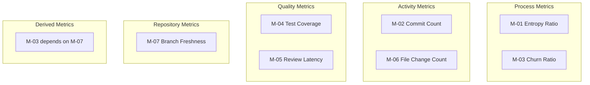
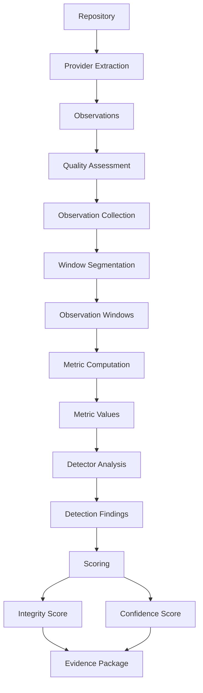
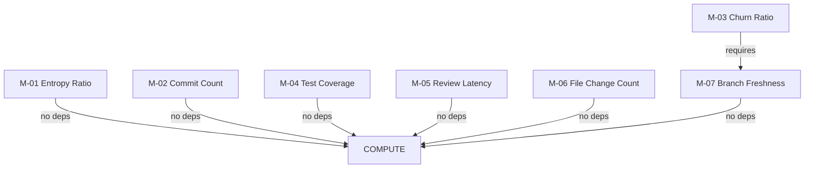

# MIIE v1.6 — Metric Formal Specification

**Formal Scientific Metric Specification & Measurement Contract**

| Field | Value |
|-------|-------|
| Document Type | Scientific Measurement Constitution |
| Version | 1.6.0 |
| Status | Canonical |
| Scope | All metrics (M-01 through M-07), measurement contracts, validation criteria |
| Audience | Measurement scientists, scientific software engineers, AI agents performing metric work |
| Last Updated | 2026-07-05 |

---

## Table of Contents

1. [Purpose of Measurement](#1-purpose-of-measurement)
2. [Metric Taxonomy](#2-metric-taxonomy)
3. [Measurement Lifecycle](#3-measurement-lifecycle)
4. [Common Metric Framework](#4-common-metric-framework)
5. [Metric Specifications](#5-metric-specifications)
6. [Metric Dependency Graph](#6-metric-dependency-graph)
7. [Observation Requirements](#7-observation-requirements)
8. [Aggregation Rules](#8-aggregation-rules)
9. [Confidence & Uncertainty](#9-confidence--uncertainty)
10. [Metric Validation](#10-metric-validation)
11. [Cross-Metric Consistency](#11-cross-metric-consistency)
12. [Scientific Interpretation Guide](#12-scientific-interpretation-guide)
13. [Threats to Validity](#13-threats-to-validity)
14. [Future Metric Evolution](#14-future-metric-evolution)
15. [Metric Glossary](#15-metric-glossary)
16. [Appendices](#16-appendices)

---

## 1. Purpose of Measurement

### 1.1 Why Software Metrics Exist

Software engineering metrics quantify attributes of software development processes and products that are otherwise opaque. A commit count quantifies development activity. A coverage ratio quantifies testing thoroughness. A review latency quantifies review responsiveness. These measurements enable comparison, monitoring, and decision-making that would be impossible through qualitative observation alone.

However, metrics are not the phenomena they measure. A commit count is not "development quality" — it is a count of commits. The relationship between the metric and the underlying construct is mediated by measurement procedures, tool limitations, and human behaviour. MIIE exists to evaluate whether this relationship is intact: whether the metric faithfully represents the construct it claims to measure.

### 1.2 Why Metric Integrity Matters

Organisations make decisions based on metrics. Teams are evaluated on commit frequency. Projects are assessed on test coverage. Release readiness is judged by review completion rates. If these metrics are unreliable — if they have been inadvertently inflated, manipulated, or distorted — the decisions based on them are unfounded.

Metric integrity is the property that a metric time series behaves consistently with the natural development process it represents. An integrity violation is a deviation from this natural behaviour that suggests the metric no longer faithfully represents the underlying construct.

### 1.3 Measurement, Indicator, Proxy, Derived Metric, Latent Construct

**Measurement**: The act of assigning a numerical value to an attribute of an entity according to a defined procedure. Measurement requires a defined procedure, a unit, and a scale.

**Indicator**: A metric that indirectly measures a construct. Test coverage is an indicator of testing thoroughness, not a direct measurement of it. Indicators are subject to construct validity concerns.

**Proxy**: A metric used in place of another metric that is difficult to measure directly. Commit count may serve as a proxy for development activity, but it does not capture code review, design, or planning effort.

**Derived Metric**: A metric computed from other metrics or observations. The churn ratio is derived from insertions, deletions, and total lines. Derived metrics inherit the uncertainties of their source metrics.

**Latent Construct**: An underlying attribute that cannot be directly observed but is inferred from measurable indicators. "Development quality" is a latent construct that cannot be measured directly but is approximated by metrics such as review latency, test coverage, and code churn.

### 1.4 Philosophy Behind MIIE Metrics

MIIE metrics are designed with the following principles:

- **Observability**: Each metric must be computable from observable repository data (commits, PRs, file changes)
- **Interpretability**: Each metric must have a clear, non-technical interpretation
- **Non-parametric computation**: Metrics should be computed using simple, robust operations (sum, mean, ratio) rather than complex statistical models
- **Boundedness**: Ratio metrics are bounded in [0, 1]; count metrics are bounded below by 0
- **Determinism**: Given identical observations, every metric must produce identical values
- **Independence**: Metrics should be computable independently where possible, with explicit dependency documentation where independence is violated

---

## 2. Metric Taxonomy

### 2.1 Categories

MIIE metrics fall into five categories:



### 2.2 Process Metrics

Process metrics measure characteristics of the development process itself. They describe how work is performed rather than what is produced.

| Metric | Name | What It Measures |
|--------|------|-----------------|
| M-01 | Commit Entropy Ratio | Diversity of commit message content |
| M-03 | Code Churn Ratio | Intensity of code modification relative to codebase size |

### 2.3 Activity Metrics

Activity metrics count discrete development events. They measure the volume of development activity.

| Metric | Name | What It Measures |
|--------|------|-----------------|
| M-02 | Commit Count | Number of commits in a period |
| M-06 | File Change Count | Number of files modified in a period |

### 2.4 Quality Metrics

Quality metrics assess characteristics of the development output that relate to quality attributes.

| Metric | Name | What It Measures |
|--------|------|-----------------|
| M-04 | Test Coverage Ratio | Fraction of code covered by tests |
| M-05 | Review Latency | Time between PR creation and review completion |

### 2.5 Repository Metrics

Repository metrics describe the state of the repository itself.

| Metric | Name | What It Measures |
|--------|------|-----------------|
| M-07 | Branch Freshness Ratio | Recency of branch activity relative to a reference window |

### 2.6 Derived Metrics

Derived metrics depend on other metrics for their computation.

| Metric | Name | Dependency |
|--------|------|-----------|
| M-03 | Code Churn Ratio | M-07 (Branch Freshness) — requires branch context for accurate line counts |

---

## 3. Measurement Lifecycle

### 3.1 From Repository to Score



### 3.2 Stage Descriptions

**Provider Extraction**: Providers (Git, GitHub, Repository) extract raw observations from the repository. Each observation is a data point associated with a metric, source, and timestamp.

**Quality Assessment**: Each observation is tagged with a quality level: complete (directly extracted), estimated (derived from partial data), derived (computed from other observations), or missing (not available).

**Observation Collection**: Validated observations are assembled into a collection, ready for metric computation.

**Window Segmentation**: The observation timeline is partitioned into analysis windows. Windows are the unit of analysis for detectors.

**Metric Computation**: For each window, observations are aggregated into metric values using the metric's aggregation strategy (sum or mean). The metric value is clamped to the valid range, and uncertainty and confidence are computed.

**Detector Analysis**: Detectors (D-01, D-02, D-03) analyse metric time series across windows to identify integrity violations.

**Scoring**: The integrity score (0–1) and confidence score (0–1) are computed from detector findings and observation metadata.

---

## 4. Common Metric Framework

Every metric in MIIE inherits a common framework of properties, constraints, and behaviours.

### 4.1 Metric Identifier

Each metric has a unique identifier in the format `M-XX`, where XX is a two-digit number. Identifiers are immutable — they never change across versions.

### 4.2 Unit

Each metric has a defined unit that specifies the scale of measurement:

- **count**: Discrete events (commit count, file change count)
- **ratio [0, 1]**: Proportion bounded between 0 and 1 (entropy ratio, churn ratio, test coverage, branch freshness)
- **hours**: Continuous time measurement (review latency)

### 4.3 Aggregation

Each metric specifies how observations within a window are combined:

- **sum**: Observations are summed (count metrics)
- **mean**: Observations are averaged (ratio and time metrics)

### 4.4 Confidence

Each metric produces a confidence value in [0, 1] quantifying the reliability of the computed value. Confidence is computed from four factors:

```
confidence = 0.3 × sample_size + 0.3 × quality + 0.2 × uncertainty + 0.2 × provider_diversity
```

### 4.5 Uncertainty

Each metric reports uncertainty as the population standard deviation of observation values:

```
σ = √(Σ(xᵢ - μ)² / n)
```

### 4.6 Dependencies

Each metric declares its dependencies on other metrics. Dependencies are resolved through topological sort before computation.

### 4.7 Validation

Each metric validates its observations before computation:

- Unit must match the metric's expected unit
- Metric ID must match
- Values must be within the valid range (warning for out-of-range)
- No NaN values permitted

### 4.8 Quality

Observation quality is tracked throughout the metric lifecycle:

| Quality Level | Description | Confidence Weight |
|--------------|-------------|-------------------|
| complete | Directly extracted from the source | 1.0 |
| estimated | Derived from partial data | 0.5 |
| derived | Computed from other observations | 0.7 |
| missing | Not available | 0.0 |

### 4.9 Provider Provenance

Every metric value records which providers contributed observations. Provider provenance enables:

- Auditability: tracing values back to their source
- Diversity assessment: multiple providers increase confidence
- Failure detection: provider-specific failures are isolated

---

## 5. Metric Specifications

### 5.1 M-01: Commit Entropy Ratio

#### Purpose

M-01 quantifies the diversity of commit message content within an analysis window. It measures how varied the commit messages are, providing a proxy for the breadth of development activity.

#### Scientific Interpretation

A high entropy ratio indicates diverse commit messages — the development activity spans multiple types of changes (features, fixes, refactoring, documentation). A low entropy ratio indicates repetitive or homogeneous commit messages — the development activity is concentrated on a single type of change.

Entropy ratios near 0 suggest low diversity (e.g., repeated "fix typo" commits). Entropy ratios near 1 suggest high diversity (e.g., varied feature, fix, and refactor messages). Extreme values in either direction may indicate integrity violations: artificially inflated diversity (high) or artificially compressed diversity (low).

#### Construct Measured

**Commit message diversity** — the degree to which commit messages vary in content within a time period. This is a proxy for the breadth of development activity, not its quality or correctness.

#### Mathematical Definition

Given a set of commit messages C = {c₁, c₂, ..., cₙ} within a window:

1. Tokenize each message into words or n-grams
2. Compute the frequency distribution of tokens: f(tᵢ) = count(tᵢ) / total_tokens
3. Compute Shannon entropy: H = -Σᵢ f(tᵢ) × log₂(f(tᵢ))
4. Normalize by maximum entropy: H_max = log₂(|V|) where |V| is the vocabulary size
5. Entropy ratio: ER = H / H_max

For a uniform distribution over V tokens: ER = 1.0
For a single token repeated: ER = 0.0

#### Expected Observation Sources

| Source | Observation Type | Quality |
|--------|-----------------|---------|
| Git | Per-commit message tokens | complete |
| GitHub | Per-PR title/description tokens | estimated (PR ≠ commit) |

#### Required Providers

- **Primary**: GitObservationProvider (commit messages)
- **Optional**: GitHubPullRequestProvider (PR descriptions)

#### Units

Ratio: [0, 1]

#### Valid Range

[0.0, 1.0]

#### Normalization

Normalized by log₂(vocabulary_size) to produce a ratio. Values outside [0, 1] are clamped.

#### Aggregation

**Within window**: Mean of per-commit entropy ratios.

**Across windows**: Mean of per-window entropy ratios.

#### Confidence

Standard metric confidence (0.3 × sample_size + 0.3 × quality + 0.2 × uncertainty + 0.2 × provider_diversity).

**Special consideration**: Commit messages with very short length (e.g., single-word messages) may produce artificially low entropy. The confidence score does not currently account for message length.

#### Dependencies

None.

#### Edge Cases

| Case | Behaviour |
|------|-----------|
| Zero commits in window | No observations; metric not computed |
| All identical messages | Entropy ratio = 0.0 |
| All unique single-word messages | Entropy ratio = 1.0 |
| Empty commit messages | Excluded from computation |
| Non-ASCII characters | Included in tokenization; may affect vocabulary size |
| Merged commits | Included if present in git log |

#### Limitations

- **Tokenization sensitivity**: The entropy ratio depends on the tokenization strategy. Word-level, character-level, and n-gram tokenization produce different results.
- **Language dependence**: Commit messages in different languages have different vocabulary sizes, affecting normalization.
- **Message quality**: Entropy measures diversity, not quality. A diverse set of meaningless messages produces high entropy.
- **Merge commits**: Merge commits may inflate commit counts and introduce non-representative messages.

#### Threats to Validity

- **Construct validity**: Commit message diversity may not accurately reflect development activity breadth.
- **Measurement bias**: Tokenization strategy introduces systematic bias.
- **Provider bias**: Git commit messages may differ from PR descriptions.

#### Acceptance Criteria

- ER ∈ [0, 1] for all valid inputs
- ER = 0 for identical messages
- ER = 1 for uniformly distributed tokens
- Deterministic: identical messages produce identical ER values

#### Future Evolution

- Character-level entropy as alternative measure
- Semantic entropy using embedding similarity
- Per-file entropy to detect concentrated changes
- Entropy rate (change in entropy over time)

---

### 5.2 M-02: Commit Count

#### Purpose

M-02 counts the number of commits within an analysis window. It is the most fundamental activity metric, providing a direct measure of development activity volume.

#### Scientific Interpretation

A high commit count indicates active development. A low commit count indicates reduced activity. Sudden changes in commit count may indicate workflow changes, team changes, or artificial inflation.

Commit count is the most directly observable metric — it requires no transformation or normalisation beyond counting. However, its interpretation depends on context: a commit count of 100 may be normal for a large active project but anomalous for a small maintenance project.

#### Construct Measured

**Development activity volume** — the number of discrete development events (commits) recorded in the version control system during a time period.

#### Mathematical Definition

Given a set of commits C = {c₁, c₂, ..., cₙ} within a window:

```
commit_count = |C| = n
```

No transformation, normalisation, or weighting is applied.

#### Expected Observation Sources

| Source | Observation Type | Quality |
|--------|-----------------|---------|
| Git | Per-commit count | complete |
| GitHub | Per-PR count (proxy) | estimated (PR ≠ commit) |

#### Required Providers

- **Primary**: GitObservationProvider (commit log)
- **Optional**: GitHubPullRequestProvider (PR count as proxy)

#### Units

Count: [0, ∞)

#### Valid Range

[0, +∞)

#### Normalization

None. Raw count is used directly.

#### Aggregation

**Within window**: Sum of per-commit-count observations (typically 1 per commit).

**Across windows**: Sum of per-window commit counts.

#### Confidence

Standard metric confidence. For commit count, the confidence is typically high because:

- Observations are complete (directly counted from git log)
- The measurement is deterministic (identical git log produces identical count)
- Provider diversity is limited (Git is the primary source)

#### Dependencies

None.

#### Edge Cases

| Case | Behaviour |
|------|-----------|
| Zero commits in window | Count = 0 |
| Shallow clone | May undercount if history is truncated |
| Squashed commits | Count reflects squashed commits, not original commits |
| Amended commits | Count depends on whether amends are preserved |
| Bot commits | Included unless excluded by configuration |

#### Limitations

- **Commit granularity**: A commit may represent anything from a one-line fix to a major feature. Commit count does not capture the magnitude of changes.
- **Squash merging**: Squash merges reduce commit count, potentially underrepresenting activity.
- **Work splitting**: Developers may split work into many small commits or combine into few large commits, affecting count without changing activity.
- **Temporal aggregation**: Count depends on window boundaries. Different windowing strategies produce different counts.

#### Threats to Validity

- **Construct validity**: Commit count is a proxy for activity, not a measure of productivity or quality.
- **Measurement bias**: Squash merging and commit squashing introduce systematic bias.
- **External validity**: Commit practices vary across teams and organisations.

#### Acceptance Criteria

- commit_count ≥ 0 for all valid inputs
- commit_count is an integer
- Identical git logs produce identical counts
- Count is independent of commit message content

#### Future Evolution

- Weighted commit count (weighted by file change count or lines changed)
- Author-disambiguated commit count
- Commit type classification (feature, fix, refactor, etc.)
- Commit size distribution metrics

---

### 5.3 M-03: Code Churn Ratio

#### Purpose

M-03 quantifies the intensity of code modification relative to the total codebase size. It measures how much of the existing code is being changed, providing a proxy for the scale of refactoring, feature development, or bug fixing.

#### Scientific Interpretation

A high churn ratio indicates intensive modification — a large fraction of the codebase is being changed. This may indicate active feature development, major refactoring, or widespread bug fixing. A low churn ratio indicates minimal modification relative to codebase size.

Extreme churn values may indicate integrity violations: artificially inflated churn (merging large unrelated changes) or artificially suppressed churn (splitting changes across many PRs to reduce apparent impact).

#### Construct Measured

**Code modification intensity** — the proportion of the codebase that is modified in a given time period. This is a derived metric that depends on both the volume of changes and the size of the codebase.

#### Mathematical Definition

Given insertions (I), deletions (D), and total lines (L) in a window:

```
churn_ratio = min(1.0, (I + D) / L)
```

The ratio is clamped to [0, 1] to handle the case where insertions plus deletions exceed total lines (which can occur during large-scale refactoring).

**Dependence on M-07**: The total lines count (L) should reflect the branch state at the time of analysis. M-07 (Branch Freshness) provides context for the recency of the branch state.

#### Expected Observation Sources

| Source | Observation Type | Quality |
|--------|-----------------|---------|
| Git | Per-commit insertions, deletions, total lines | complete |
| GitHub | Per-PR additions, deletions, changed files | estimated (PR-level granularity) |

#### Required Providers

- **Primary**: GitObservationProvider (git diff statistics)
- **Optional**: GitHubPullRequestProvider (PR change statistics)

#### Units

Ratio: [0, 1]

#### Valid Range

[0.0, 1.0]

#### Normalization

Clamped to [0, 1] by `min(1.0, (I + D) / L)`.

#### Aggregation

**Within window**: Mean of per-commit churn ratios (each commit's I, D, L values contribute to a per-commit ratio, then averaged).

**Across windows**: Mean of per-window churn ratios.

#### Confidence

Standard metric confidence with special considerations:

- **Sample size**: Requires ≥5 observations for meaningful computation (minimum for variance estimation)
- **Quality**: Git diff statistics are complete; PR statistics are estimated
- **Uncertainty**: High variance in per-commit churn ratios reduces confidence

#### Dependencies

- **M-07 (Branch Freshness)**: Required for accurate total-lines denominator. The branch freshness provides context for whether the codebase size is current or stale.

#### Edge Cases

| Case | Behaviour |
|------|-----------|
| Zero insertions and deletions | Churn ratio = 0.0 |
| All lines changed | Churn ratio = 1.0 (clamped) |
| Binary files | Excluded from line counts; may underestimate churn |
| Renamed files | Counted as deletions + insertions |
| Empty codebase | Division by zero; prevented by clamping |
| Generated code | Included unless excluded by configuration |

#### Limitations

- **Line-level granularity**: Churn ratio does not distinguish between trivial changes (whitespace) and substantial changes (logic).
- **Binary files**: Binary file changes are not captured in line counts.
- **Generated code**: Auto-generated files inflate churn without reflecting meaningful changes.
- **Rename detection**: File renames may inflate churn by counting as deletions + insertions.

#### Threats to Validity

- **Construct validity**: Line-level changes may not reflect the magnitude of semantic changes.
- **Measurement bias**: Renaming and whitespace changes inflate churn.
- **Provider bias**: Git and GitHub may report different change statistics.

#### Acceptance Criteria

- churn_ratio ∈ [0, 1] for all valid inputs
- churn_ratio = 0 when no changes are made
- churn_ratio ≤ 1.0 when all lines are changed (clamped)
- Identical diffs produce identical churn ratios

#### Future Evolution

- Weighted churn (by file importance or change type)
- Semantic churn (measuring logical rather than textual changes)
- Churn velocity (rate of change in churn over time)
- Per-language churn breakdown

---

### 5.4 M-04: Test Coverage Ratio

#### Purpose

M-04 quantifies the proportion of code that is covered by automated tests. It provides a proxy for testing thoroughness and is one of the most widely reported software quality metrics.

#### Scientific Interpretation

A high test coverage ratio indicates that most code paths are exercised by tests. A low test coverage ratio indicates significant untested code. However, coverage does not guarantee test quality — 100% coverage with trivial assertions provides less confidence than 80% coverage with thorough assertions.

Test coverage is reported in different ways by different tools (line coverage, branch coverage, function coverage). MIIE normalises coverage to a [0, 1] ratio to enable comparison across tools and projects.

#### Construct Measured

**Testing thoroughness** — the fraction of code that is exercised by automated tests. This is an indicator of testing effort, not a direct measure of test quality or code quality.

#### Mathematical Definition

Given a coverage metric from the testing tool (e.g., line coverage percentage):

```
coverage_ratio = coverage_percentage / 100.0
```

For line coverage: coverage_ratio = lines_covered / total_lines
For branch coverage: coverage_ratio = branches_covered / total_branches
For function coverage: coverage_ratio = functions_covered / total_functions

MIIE normalises all coverage types to a [0, 1] ratio.

#### Expected Observation Sources

| Source | Observation Type | Quality |
|--------|-----------------|---------|
| CI system | Coverage percentage from test reports | complete |
| Git | Coverage from coverage files (.coverage, lcov.info, Cobertura XML) | estimated (may be stale) |
| GitHub | Coverage from PR checks | estimated (PR-level) |

#### Required Providers

- **Primary**: CI system coverage reports (if available)
- **Secondary**: Git coverage files (Cobertura XML, lcov.info, .coverage JSON)
- **Optional**: GitHub PR check coverage

#### Units

Ratio: [0, 1]

#### Valid Range

[0.0, 1.0]

#### Normalization

Divided by 100 if reported as percentage. Clamped to [0, 1].

#### Aggregation

**Within window**: Mean of per-commit or per-PR coverage ratios.

**Across windows**: Mean of per-window coverage ratios.

#### Confidence

Standard metric confidence with special considerations:

- **Source variability**: Coverage values from different tools or configurations may not be comparable
- **Temporal staleness**: Coverage files may reflect a previous state, not the current state
- **Configuration sensitivity**: Coverage thresholds and exclusions affect the reported value

#### Dependencies

None.

#### Edge Cases

| Case | Behaviour |
|------|-----------|
| No coverage data available | Metric not computed; quality = missing |
| Coverage = 0% | Coverage ratio = 0.0 |
| Coverage = 100% | Coverage ratio = 1.0 |
| Multiple coverage tools | Most recent value used |
| Coverage configuration changes | May produce discontinuities in the time series |

#### Limitations

- **Tool dependence**: Different coverage tools report different values for the same code
- **Configuration sensitivity**: Excluding files or directories from coverage affects the ratio
- **Coverage ≠ quality**: High coverage does not guarantee thorough testing
- **Temporal staleness**: Coverage files may not reflect the latest code state
- **Language dependence**: Coverage tool availability varies by language

#### Threats to Validity

- **Construct validity**: Coverage measures code execution, not test quality or correctness
- **Measurement bias**: Coverage tool configuration introduces systematic bias
- **External validity**: Coverage practices vary across organisations

#### Acceptance Criteria

- coverage_ratio ∈ [0, 1] for all valid inputs
- coverage_ratio is independent of coverage tool (normalised)
- Identical coverage reports produce identical ratios

#### Future Evolution

- Mutation score as complement to coverage
- Coverage delta (change in coverage over time)
- Per-file coverage breakdown
- Coverage trend analysis

---

### 5.5 M-05: Review Latency

#### Purpose

M-05 measures the time between pull request creation and review completion. It provides a proxy for review responsiveness and process efficiency.

#### Scientific Interpretation

Low review latency indicates responsive code review — PRs are reviewed quickly, enabling rapid feedback loops. High review latency indicates delayed reviews — PRs wait in queues, slowing the development cycle.

Review latency is influenced by many factors: PR complexity, reviewer availability, team size, time zones, and organisational culture. Extreme values may indicate process breakdowns (very high latency) or insufficient review (very low latency — merged without review).

#### Construct Measured

**Review responsiveness** — the time elapsed between a pull request being opened and receiving a review decision. This is a process metric, not a quality metric.

#### Mathematical Definition

Given a pull request created at time t_create and reviewed/completed at time t_review:

```
review_latency_hours = (t_review - t_create) / 3600
```

For PRs with multiple reviews, the time of the first review is used (earliest review response).

For PRs without reviews, the latency is the time until merge or close.

#### Expected Observation Sources

| Source | Observation Type | Quality |
|--------|-----------------|---------|
| GitHub | PR creation time, review time, merge/close time | complete |
| Git | Commit timestamps (proxy, less accurate) | estimated |

#### Required Providers

- **Primary**: GitHubPullRequestProvider (PR and review timestamps)
- **Optional**: GitObservationProvider (commit timestamps as proxy)

#### Units

Hours: [0, ∞)

#### Valid Range

[0, +∞)

#### Normalization

None. Raw hours are used directly.

#### Aggregation

**Within window**: Mean of per-PR review latencies.

**Across windows**: Mean of per-window mean latencies.

#### Confidence

Standard metric confidence with special considerations:

- **Minimum observations**: Requires ≥2 PRs for meaningful variance estimation
- **Provider dependence**: Requires GitHub provider for accurate timestamps
- **Weekend/holiday effects**: Review latency may be inflated during non-working periods

#### Dependencies

None.

#### Edge Cases

| Case | Behaviour |
|------|-----------|
| Zero PRs in window | No observations; metric not computed |
| PR merged without review | Latency = time until merge |
| PR closed without review | Latency = time until close |
| Review after merge | Latency = time of first review (may be > merge time) |
| Multiple reviews | Time of first review used |
| Draft PRs | Included unless excluded by configuration |

#### Limitations

- **Platform dependence**: Requires GitHub (or similar) for accurate review timestamps
- **Weekend effects**: Reviews during weekends inflate latency without indicating slowness
- **PR batching**: Reviews of multiple PRs in a single session produce similar latencies
- **Time zones**: Global teams may have systematically different latencies
- **Self-merges**: PRs merged by the author without external review

#### Threats to Validity

- **Construct validity**: Review latency measures time, not review quality
- **Measurement bias**: Weekend/holiday effects introduce systematic bias
- **External validity**: Review practices vary across organisations and cultures

#### Acceptance Criteria

- review_latency ≥ 0 for all valid inputs
- review_latency is in hours
- Identical PR timelines produce identical latencies
- Minimum 2 observations for meaningful computation

#### Future Evolution

- Review quality metrics (comment count, approval ratio)
- Review cycle time (time between review rounds)
- Time-zone-adjusted latency
- Review throughput (reviews per reviewer per period)

---

### 5.6 M-06: File Change Count

#### Purpose

M-06 counts the number of distinct files modified within an analysis window. It provides a measure of the breadth of changes across the codebase.

#### Scientific Interpretation

A high file change count indicates changes spread across many files — a broad modification that may indicate refactoring, cross-cutting changes, or widespread updates. A low file change count indicates concentrated changes — modifications to a small number of files, suggesting focused work.

Extreme file change counts may indicate integrity violations: artificially inflated counts (splitting changes across many files) or artificially suppressed counts (combining unrelated changes into single files).

#### Construct Measured

**Change breadth** — the number of distinct files affected by development activity in a time period. This measures how widely changes are distributed across the codebase.

#### Mathematical Definition

Given a set of changed files F = {f₁, f₂, ..., fₙ} within a window:

```
file_change_count = |F| = n
```

Each file is counted once regardless of how many times it was modified within the window.

#### Expected Observation Sources

| Source | Observation Type | Quality |
|--------|-----------------|---------|
| Git | Per-commit changed files | complete |
| GitHub | Per-PR changed files | complete |

#### Required Providers

- **Primary**: GitObservationProvider (git diff --stat)
- **Secondary**: GitHubPullRequestProvider (PR file changes)

#### Units

Count: [0, ∞)

#### Valid Range

[0, +∞)

#### Normalization

None. Raw count is used directly.

#### Aggregation

**Within window**: Sum of per-commit file change counts (with deduplication — each file counted once per window).

**Across windows**: Sum of per-window file change counts (with deduplication).

#### Confidence

Standard metric confidence. For file change count, confidence is typically high because:

- Observations are complete (directly counted from git diff)
- The measurement is deterministic
- Provider diversity is limited

#### Dependencies

None.

#### Edge Cases

| Case | Behaviour |
|------|-----------|
| Zero files changed | Count = 0 |
| Binary files | Included in file count |
| Generated files | Included unless excluded by configuration |
| Renamed files | Counted as one changed file |
| Copied files | Counted as one changed file |

#### Limitations

- **File size insensitivity**: A one-line change and a complete rewrite both count as one file change
- **Generated code**: Auto-generated files inflate the count
- **Rename detection**: File renames may or may not be detected depending on git configuration

#### Threats to Validity

- **Construct validity**: File count measures breadth, not depth or significance of changes
- **Measurement bias**: Git rename detection settings affect the count
- **External validity**: File organisation varies across projects

#### Acceptance Criteria

- file_change_count ≥ 0 for all valid inputs
- file_change_count is an integer
- Identical diffs produce identical counts
- Deduplication: each file counted once per window

#### Future Evolution

- Weighted file change count (by file size or importance)
- Per-directory file change breakdown
- File change frequency (how often each file is changed)
- Change concentration (Gini coefficient of file changes)

---

### 5.7 M-07: Branch Freshness Ratio

#### Purpose

M-07 measures how recently the analysis branch has been updated relative to a reference window. It provides context for the timeliness of the data being analysed.

#### Scientific Interpretation

A high branch freshness ratio indicates recent activity — the branch was updated recently and the analysis reflects current state. A low branch freshness ratio indicates stale data — the branch has not been updated for a long time and the analysis may not reflect the current state.

Branch freshness is a meta-metric that provides context for other metrics. A metric value computed from stale data (low branch freshness) should be interpreted with caution.

#### Construct Measured

**Data recency** — the degree to which the branch state reflects recent development activity. This is a contextual metric that qualifies the interpretation of other metrics.

#### Mathematical Definition

Given the age of the branch in days (days_since_last_commit) and a reference window of 180 days:

```
branch_freshness = max(0.0, 1.0 - (days_since_last_commit / 180))
```

Where `days_since_last_commit` is the number of days between the most recent commit on the analysis branch and the analysis date.

The reference window of 180 days (approximately 6 months) is a frozen constant.

#### Expected Observation Sources

| Source | Observation Type | Quality |
|--------|-----------------|---------|
| Git | Most recent commit timestamp on branch | complete |
| GitHub | Most recent push timestamp | complete |

#### Required Providers

- **Primary**: GitObservationProvider (commit timestamps)
- **Secondary**: GitHubPullRequestProvider (push timestamps)

#### Units

Ratio: [0, 1]

#### Valid Range

[0.0, 1.0]

#### Normalization

Clamped to [0, 1] by `max(0.0, ...)`.

#### Aggregation

**Within window**: Mean of per-commit freshness values (computed from the most recent commit in each observation period).

**Across windows**: Mean of per-window freshness values.

#### Confidence

Standard metric confidence. For branch freshness, confidence is typically high because:

- The measurement is deterministic (timestamp comparison)
- No statistical estimation is involved
- Provider diversity provides cross-validation

#### Dependencies

None. M-07 is a primary metric with no dependencies on other metrics.

#### Edge Cases

| Case | Behaviour |
|------|-----------|
| Branch just committed | Freshness ≈ 1.0 |
| Branch committed 180 days ago | Freshness ≈ 0.0 |
| Branch committed > 180 days ago | Freshness = 0.0 (clamped) |
| No commits on branch | Freshness = 0.0 |
| Multiple branches | Analysis branch freshness is used |

#### Limitations

- **Fixed reference window**: The 180-day window is a convention, not a theoretically derived constant
- **Branch selection**: The analysis may use a different branch than the main development branch
- **Merge activity**: Merges may update the branch without representing new development

#### Threats to Validity

- **Construct validity**: Branch freshness measures recency of git activity, not recency of development
- **Measurement bias**: The 180-day window may not be appropriate for all project cadences
- **External validity**: Branching strategies vary across teams

#### Acceptance Criteria

- branch_freshness ∈ [0, 1] for all valid inputs
- branch_freshness = 1.0 for branches committed today
- branch_freshness = 0.0 for branches not committed in ≥ 180 days
- Deterministic: identical timestamps produce identical freshness

#### Future Evolution

- Adaptive reference window (based on project commit frequency)
- Multi-branch freshness (main, develop, feature branches)
- Freshness velocity (rate of change in freshness)
- Freshness-adjusted metrics (other metrics weighted by freshness)

---

## 6. Metric Dependency Graph

### 6.1 Primary Dependencies



### 6.2 Dependency Resolution

Dependencies are resolved through topological sort (Kahn's algorithm):

1. Metrics with no dependencies are computed first (M-01, M-02, M-04, M-05, M-06, M-07)
2. Metrics with dependencies are computed after their dependencies (M-03 depends on M-07)
3. Cyclic dependencies raise a `CyclicDependencyError`

### 6.3 Computation Order

```
Level 0: M-01, M-02, M-04, M-05, M-06, M-07 (independent)
Level 1: M-03 (depends on M-07)
```

### 6.4 Cross-Metric Relationships

| Relationship | Nature | Strength |
|-------------|--------|----------|
| M-02 (commit count) ↔ M-06 (file change count) | Positive correlation expected | Moderate |
| M-02 (commit count) ↔ M-03 (churn ratio) | Weak positive correlation | Low |
| M-05 (review latency) ↔ M-02 (commit count) | May be inversely correlated | Context-dependent |
| M-04 (test coverage) ↔ M-03 (churn ratio) | High churn may reduce coverage | Moderate |

### 6.5 Validation Dependencies

| Validation Check | Metrics Involved | Rule |
|-----------------|-----------------|------|
| Coverage-churn consistency | M-03, M-04 | High churn should not coincide with increasing coverage |
| Count-breadth consistency | M-02, M-06 | Higher commit count should correlate with higher file change count |
| Freshness-churn consistency | M-03, M-07 | High churn on stale branches may indicate incomplete refactoring |

---

## 7. Observation Requirements

### 7.1 Per-Metric Requirements

| Metric | Minimum Obs | Recommended Obs | Provider Diversity | Quality Threshold |
|--------|------------|----------------|-------------------|-------------------|
| M-01 | 1 | ≥ 20 | ≥ 1 (Git) | complete or estimated |
| M-02 | 1 | ≥ 20 | ≥ 1 (Git) | complete |
| M-03 | 5 | ≥ 20 | ≥ 1 (Git) | complete or estimated |
| M-04 | 1 | ≥ 20 | ≥ 1 (CI/Git) | complete or estimated |
| M-05 | 2 | ≥ 10 | ≥ 1 (GitHub) | complete |
| M-06 | 1 | ≥ 20 | ≥ 1 (Git) | complete |
| M-07 | 1 | ≥ 20 | ≥ 1 (Git) | complete |

### 7.2 Observation Provenance

Every observation must record:

| Field | Description |
|-------|-------------|
| observation_id | Deterministic hash: sha256("{source_type}:{source_id}:{metric_id}")[:16] |
| metric_id | The metric this observation supports |
| value | The numerical observation value |
| unit | The unit of measurement |
| quality | Quality level (complete, estimated, derived, missing) |
| source_type | The type of data source (git_commit, git_pr, github_pr, etc.) |
| source_id | The identifier of the specific source (commit SHA, PR number) |
| timestamp | ISO 8601 timestamp of the observation |
| provider_id | The provider that extracted this observation |

### 7.3 Missing Observation Behaviour

When observations are missing for a metric-window pair:

1. The metric is not computed for that window
2. The missing pair is counted in the coverage calculation
3. The confidence score is reduced proportionally
4. Detectors skip the window for that metric
5. The evidence package records the missing pair

### 7.4 Quality Thresholds

| Quality Level | Acceptable For | Confidence Impact |
|--------------|---------------|-------------------|
| complete | All metrics | Full confidence |
| estimated | M-01, M-03, M-04 | Reduced confidence (0.5 weight) |
| derived | M-03 (from other metrics) | Reduced confidence (0.7 weight) |
| missing | None | No confidence contribution |

---

## 8. Aggregation Rules

### 8.1 Sum Aggregation

Used for count metrics (M-02, M-06):

```
aggregated_value = Σᵢ xᵢ
```

Sum aggregation is appropriate when:
- Each observation represents a discrete event
- The total count is the meaningful quantity
- Observations are independent and additive

### 8.2 Mean Aggregation

Used for ratio and time metrics (M-01, M-03, M-04, M-05, M-07):

```
aggregated_value = (1/n) Σᵢ xᵢ
```

Mean aggregation is appropriate when:
- Each observation represents a measurement on a continuous scale
- The average value is the meaningful quantity
- Observations are exchangeable

### 8.3 Clamping

All metric values are clamped to their valid range:

```
clamped_value = max(min_value, min(max_value, value))
```

Clamping prevents out-of-range values from propagating through the system.

### 8.4 Window Aggregation

Within a window, observations are aggregated using the metric's specified aggregation (sum or mean).

### 8.5 Repository Aggregation

Across windows, per-window metric values are aggregated using the same aggregation strategy. For ratio metrics, this produces a mean-of-means (not a weighted mean).

### 8.6 Future Aggregation Strategies

| Strategy | Description | Applicable Metrics |
|----------|-------------|-------------------|
| Weighted mean | Weight by observation count or quality | All |
| Median | Robust to outliers | M-01, M-03, M-05 |
| Trimmed mean | Excludes extreme values | M-01, M-03, M-05 |
| Exponential moving average | Recent observations weighted more | All |

---

## 9. Confidence & Uncertainty

### 9.1 Confidence Calculation

The metric-level confidence is computed as:

```
confidence = 0.3 × f₁ + 0.3 × f₂ + 0.2 × f₃ + 0.2 × f₄
```

where:

| Factor | Formula | Range | Interpretation |
|--------|---------|-------|---------------|
| f₁ (sample size) | min(1.0, n / 20) | [0, 1] | More observations → higher confidence |
| f₂ (quality) | mean(quality_scores) | [0, 1] | Higher quality → higher confidence |
| f₃ (uncertainty) | max(0, 1 - \|σ/μ\|) | [0, 1] | Lower relative uncertainty → higher confidence |
| f₄ (provider diversity) | min(1.0, num_providers / 2) | [0, 1] | More providers → higher confidence |

### 9.2 Uncertainty Estimation

Uncertainty is the population standard deviation:

```
σ = √(Σ(xᵢ - μ)² / n)
```

where xᵢ are the observation values and μ is the mean.

### 9.3 Quality Weighting

Quality scores are mapped to weights:

| Quality | Weight |
|---------|--------|
| complete | 1.0 |
| derived | 0.7 |
| estimated | 0.5 |
| missing | 0.0 |

The quality factor f₂ is the mean of these weights across all observations.

### 9.4 Provider Diversity

The provider diversity factor rewards multi-source validation:

```
f₄ = min(1.0, num_providers / 2)
```

At 1 provider: f₄ = 0.5
At 2 providers: f₄ = 1.0 (maximum)
At ≥2 providers: f₄ = 1.0

### 9.5 Sample Size Effects

| Observations | f₁ | Interpretation |
|-------------|-----|---------------|
| 1 | 0.05 | Very low confidence |
| 5 | 0.25 | Low confidence |
| 10 | 0.50 | Moderate confidence |
| 20 | 1.00 | Full confidence |

### 9.6 Scientific Interpretation

Confidence should be interpreted as:

- **High confidence (≥ 0.7)**: The metric value is reliable. Detection findings based on this metric can be trusted.
- **Medium confidence (0.3 – 0.7)**: The metric value is moderately reliable. Detection findings should be interpreted with caution.
- **Low confidence (< 0.3)**: The metric value is unreliable. Detection findings based on this metric should be treated as preliminary.

Confidence is not a probability. It does not answer "what is the probability that this value is correct?" It answers "how much should this value be trusted given the available evidence?"

---

## 10. Metric Validation

### 10.1 Expected Ranges

| Metric | Expected Range | Normal Range | Alert Range |
|--------|---------------|-------------|-------------|
| M-01 | [0, 1] | [0.3, 0.9] | < 0.1 or > 0.95 |
| M-02 | [0, ∞) | [1, 1000] per window | > 10000 |
| M-03 | [0, 1] | [0.01, 0.5] | > 0.8 |
| M-04 | [0, 1] | [0.3, 0.95] | < 0.1 |
| M-05 | [0, ∞) | [1, 168] hours | > 720 (30 days) |
| M-06 | [0, ∞) | [1, 500] per window | > 5000 |
| M-07 | [0, 1] | [0.5, 1.0] | < 0.2 |

### 10.2 Synthetic Datasets

Validation datasets should include:

| Dataset | Purpose | Expected Behaviour |
|---------|---------|-------------------|
| Uniform commits | Baseline activity | M-02 constant, M-01 high |
| Bursty commits | Activity spikes | M-02 variable, M-01 stable |
| High churn | Large refactoring | M-03 high, M-06 high |
| No tests | Missing coverage | M-04 = 0 |
| 100% tests | Full coverage | M-04 = 1.0 |
| Instant review | Fast reviews | M-05 ≈ 0 |
| No review | Delayed reviews | M-05 high |
| Stale branch | Inactive branch | M-07 = 0 |
| Fresh branch | Active branch | M-07 ≈ 1.0 |

### 10.3 Benchmark Datasets

The benchmark framework evaluates metrics against ground truth:

- Synthetic repositories with known metric values
- Real repositories with manual annotation
- Edge cases (empty repos, single-commit repos, massive repos)

### 10.4 Validation Procedure

For each metric:

1. Generate synthetic observations with known values
2. Compute the metric using the metric computer
3. Compare computed value against expected value
4. Verify clamping, confidence, and uncertainty
5. Test edge cases (empty input, single observation, extreme values)

### 10.5 Cross-Validation

Cross-metric validation checks consistency:

- M-02 and M-06 should be positively correlated
- M-03 should increase when M-02 increases (more commits → more churn)
- M-04 should decrease when M-03 increases (more churn → less coverage)
- M-07 should decrease monotonically with time since last commit

### 10.6 Scientific Acceptance Criteria

| Criterion | Target |
|-----------|--------|
| Value range compliance | 100% of values within valid range |
| Determinism | 100% identical results across 100 runs |
| Confidence range | All confidence values in [0, 1] |
| Uncertainty range | All uncertainty values ≥ 0 |
| Edge case handling | No NaN, no Inf, no exceptions for valid inputs |
| Performance | Computation time < 100ms per metric per window |

---

## 11. Cross-Metric Consistency

### 11.1 M-03 Depends on M-07

M-03 (Churn Ratio) declares a dependency on M-07 (Branch Freshness). This dependency exists because:

- The total-lines denominator in the churn ratio depends on the branch state
- M-07 provides context for whether the branch state is current
- Stale branches may have outdated line counts, affecting churn ratio accuracy

The dependency is currently structural (M-03 is computed after M-07) but not functional (M-03 does not use M-07's value in its computation). This is a known limitation.

### 11.2 Expected Relationships

| Relationship | Expected Direction | Strength | Basis |
|-------------|-------------------|----------|-------|
| M-02 ↑ → M-06 ↑ | Positive | Moderate | More commits typically modify more files |
| M-02 ↑ → M-03 ↑ | Positive | Low | More commits may indicate more churn |
| M-03 ↑ → M-04 ↓ | Negative | Moderate | High churn may reduce test coverage |
| M-05 ↓ → M-02 ↑ | Negative | Low | Fast reviews may enable more commits |
| M-07 ↓ → M-03 ↑ | Negative | Low | Stale branches may accumulate churn |

### 11.3 Potential Contradictions

| Contradiction | Possible Explanation | Action |
|--------------|---------------------|--------|
| M-02 high, M-06 low | Many commits modifying few files (focused work) | Normal; no action |
| M-02 low, M-06 high | Few commits modifying many files (large refactoring) | Normal; no action |
| M-03 high, M-04 high | High churn with maintained coverage (disciplined development) | Normal; no action |
| M-05 low, M-02 low | Fast reviews but low activity (small team) | Normal; no action |

### 11.4 Consistency Validation Rules

| Rule | Metrics | Condition | Status |
|------|---------|-----------|--------|
| R1 | M-02, M-06 | If M-02 > 100, M-06 should be > 1 | Recommended |
| R2 | M-03, M-04 | If M-03 > 0.8, M-04 should not increase | Recommended |
| R3 | M-07 | M-07 should decrease monotonically across windows (without new commits) | Recommended |

### 11.5 Future Consistency Checks

- Automated cross-metric correlation monitoring
- Anomaly detection across metric pairs
- Consistency scoring (penalise contradictory metric patterns)

---

## 12. Scientific Interpretation Guide

### 12.1 High Values

| Metric | High Value | Possible Interpretation | Possible Concern |
|--------|-----------|----------------------|-----------------|
| M-01 | > 0.9 | Very diverse commit messages | May indicate unfocused development |
| M-02 | > 1000 | Very high activity | May indicate artificial inflation |
| M-03 | > 0.8 | Very high churn | May indicate unstable codebase |
| M-04 | > 0.95 | Very high coverage | May indicate test-focused development |
| M-05 | > 168h | Very slow reviews | May indicate process bottleneck |
| M-06 | > 500 | Very broad changes | May indicate large-scale refactoring |
| M-07 | > 0.9 | Very fresh branch | Normal for active development |

### 12.2 Low Values

| Metric | Low Value | Possible Interpretation | Possible Concern |
|--------|----------|----------------------|-----------------|
| M-01 | < 0.1 | Very homogeneous messages | May indicate repetitive work |
| M-02 | < 5 | Very low activity | May indicate project stagnation |
| M-03 | < 0.01 | Very low churn | May indicate maintenance mode |
| M-04 | < 0.2 | Very low coverage | May indicate insufficient testing |
| M-05 | < 1h | Very fast reviews | May indicate insufficient review |
| M-06 | < 3 | Very narrow changes | Normal for focused fixes |
| M-07 | < 0.2 | Very stale branch | May indicate abandoned work |

### 12.3 Unexpected Values

Unexpected values are those that deviate significantly from the expected range for the repository context. They may indicate:

- **Integrity violations**: The metric is being artificially manipulated
- **Process changes**: The team has changed its development practices
- **Tool changes**: The measurement tool or configuration has changed
- **Data quality issues**: The observations are incomplete or incorrect

### 12.4 Missing Values

Missing values for a metric-window pair indicate:

- The provider could not extract data for that metric in that window
- The metric's minimum observation requirements were not met
- The data source was unavailable (API failure, rate limiting)

Missing values reduce coverage and confidence. They do not indicate a zero value.

### 12.5 Partial Confidence

When confidence is medium (0.3 – 0.7), the metric value should be interpreted as an estimate, not a precise measurement. Detection findings based on low-confidence metrics should be flagged as preliminary.

### 12.6 Uncertain Measurements

High uncertainty (σ > 0.5 × |μ|) indicates that observations vary widely within the window. This may reflect:

- Natural variability in the development process
- Heterogeneous commit sizes or types
- Mixed activity from multiple developers

High uncertainty reduces the relative uncertainty factor in the confidence score.

---

## 13. Threats to Validity

### 13.1 Construct Validity

| Metric | Threat | Mitigation |
|--------|--------|------------|
| M-01 | Commit message diversity ≠ development breadth | Multiple interpretation angles |
| M-02 | Commit count ≠ productivity | Context-dependent interpretation |
| M-03 | Line changes ≠ semantic changes | Limitation documented |
| M-04 | Coverage ≠ test quality | Complementary metrics recommended |
| M-05 | Review time ≠ review quality | Quality metrics recommended |
| M-06 | File count ≠ change significance | Weighted variants recommended |
| M-07 | Git activity ≠ development activity | Contextual interpretation |

### 13.2 Internal Validity

| Threat | Affected Metrics | Impact |
|--------|-----------------|--------|
| Confounding variables | All | Changes in team, tools, or process may affect metrics |
| Selection bias | All | Window boundaries may selectively include/exclude data |
| Maturation | All | Natural codebase evolution may produce metric changes |

### 13.3 External Validity

| Threat | Affected Metrics | Impact |
|--------|-----------------|--------|
| Repository type | All | Open-source vs proprietary may differ |
| Language | M-03, M-06 | Different languages have different file structures |
| Team size | M-02, M-05 | Solo vs distributed teams differ |
| Organisation | All | Different practices produce different metric distributions |

### 13.4 Measurement Bias

| Source | Affected Metrics | Direction |
|--------|-----------------|-----------|
| Squash merging | M-02 | Undercount |
| Rename detection | M-03, M-06 | Inflation |
| Coverage tool config | M-04 | Variable |
| Weekend effects | M-05 | Inflation |
| Shallow clone | M-02, M-03 | Undercount |

### 13.5 Provider Limitations

| Provider | Limitation | Affected Metrics |
|----------|-----------|-----------------|
| Git | No review data | M-05 (estimated only) |
| GitHub | API rate limits | All (partial extraction) |
| GitHub | No coverage data | M-04 (may be missing) |
| Repository | Metadata only | M-05 (limited) |

### 13.6 Sampling Limitations

| Limitation | Impact | Mitigation |
|-----------|--------|------------|
| Window size | Affects granularity | Adaptive window sizing |
| Window boundaries | May split natural periods | Flexible windowing |
| Time range | May miss historical context | Configurable range |
| Commit selection | May include/exclude commits | Bot exclusion, merge handling |

---

## 14. Future Metric Evolution

### 14.1 Developer Entropy

**Concept**: Entropy of code change patterns per developer, measuring the diversity of files and modules each developer touches.

**Purpose**: Detect concentration of knowledge (bus factor risk) and detect unusual change patterns.

**Status**: Conceptual only. No implementation planned.

### 14.2 Review Quality

**Concept**: Multi-dimensional measure of review thoroughness incorporating comment depth, approval patterns, and review coverage.

**Purpose**: Complement review latency (M-05) with quality assessment.

**Status**: Conceptual only. No implementation planned.

### 14.3 Release Stability

**Concept**: Frequency and magnitude of post-release fixes, measuring the stability of releases.

**Purpose**: Detect release quality trends and predict future release risk.

**Status**: Conceptual only. No implementation planned.

### 14.4 Architecture Volatility

**Concept**: Rate of change in code structure metrics (module coupling, dependency depth, interface stability).

**Purpose**: Detect architectural drift and instability.

**Status**: Conceptual only. No implementation planned.

### 14.5 AI-Assisted Development Indicators

**Concept**: Metrics that detect patterns consistent with AI-assisted code generation (uniform code style, unusual commit patterns, specific file change distributions).

**Purpose**: Understand the impact of AI tools on development metrics.

**Status**: Conceptual only. No implementation planned.

### 14.6 Commit Semantic Entropy

**Concept**: Entropy of commit message semantics using embedding similarity rather than token frequency.

**Purpose**: More robust measure of commit diversity that is language-independent.

**Status**: Conceptual only. No implementation planned.

### 14.7 Change Concentration Index

**Concept**: Gini coefficient or Herfindahl index of file changes, measuring whether changes are concentrated in a few files or spread across many.

**Purpose**: Detect focused vs unfocused development patterns.

**Status**: Conceptual only. No implementation planned.

### 14.8 Review Cycle Time

**Concept**: Time between review rounds (first review to approval), measuring review iteration speed.

**Purpose**: Complement review latency (M-05) with iteration-level measurement.

**Status**: Conceptual only. No implementation planned.

---

## 15. Metric Glossary

| Term | Definition |
|------|-----------|
| **Aggregation** | The operation of combining multiple observations into a single metric value (sum or mean). |
| **Branch Freshness** | The recency of a branch's last commit relative to a reference window. |
| **Churn Ratio** | The proportion of codebase lines changed relative to total lines. |
| **Code Churn** | The amount of code added, modified, or deleted in a time period. |
| **Commit Count** | The number of discrete commits in a time period. |
| **Commit Entropy** | The diversity of commit message content, measured by Shannon entropy. |
| **Confidence** | A [0, 1] value quantifying the reliability of a metric value. |
| **Coverage Ratio** | The proportion of code exercised by automated tests. |
| **Derived Metric** | A metric computed from other metrics or observations. |
| **File Change Count** | The number of distinct files modified in a time period. |
| **Indicator** | A metric that indirectly measures a construct. |
| **Latent Construct** | An underlying attribute that cannot be directly observed. |
| **Measurement** | The act of assigning a numerical value to an attribute. |
| **Observation** | A single data point extracted from the repository. |
| **Observation Window** | A temporal segment of the observation series. |
| **Population** | The theoretical complete set of all possible observations. |
| **Proxy** | A metric used in place of a more difficult-to-measure metric. |
| **Review Latency** | The time between PR creation and review completion. |
| **Sample** | A subset of observations selected for analysis. |
| **Shannon Entropy** | A measure of information content or uncertainty: H = -Σ p(x) log p(x). |
| **Sum Aggregation** | Combining observations by addition. |
| **Mean Aggregation** | Combining observations by averaging. |
| **Uncertainty** | The population standard deviation of observation values. |
| **Valid Range** | The acceptable range of values for a metric. |

---

## 16. Appendices

### Appendix A: Complete Metric Matrix

| Metric | Purpose | Primary Provider | Unit | Aggregation | Dependencies | Min Obs | Confidence Model |
|--------|---------|-----------------|------|-------------|-------------|---------|-----------------|
| M-01 | Commit Entropy Ratio | Git | ratio [0,1] | mean | none | 1 | standard |
| M-02 | Commit Count | Git | count | sum | none | 1 | standard |
| M-03 | Code Churn Ratio | Git | ratio [0,1] | mean | M-07 | 5 | standard (high min obs) |
| M-04 | Test Coverage Ratio | CI/Git | ratio [0,1] | mean | none | 1 | standard |
| M-05 | Review Latency | GitHub | hours | mean | none | 2 | standard (min 2 obs) |
| M-06 | File Change Count | Git | count | sum | none | 1 | standard |
| M-07 | Branch Freshness | Git | ratio [0,1] | mean | none | 1 | standard |

### Appendix B: Mathematical Formula Summary

| Formula | Expression | Metric |
|---------|-----------|--------|
| Entropy ratio | ER = H / H_max = -Σ p(x) log₂ p(x) / log₂ \|V\| | M-01 |
| Commit count | CC = \|{commits in window}\| | M-02 |
| Churn ratio | CR = min(1.0, (I + D) / L) | M-03 |
| Coverage ratio | CovR = coverage_percentage / 100 | M-04 |
| Review latency | RL = (t_review - t_create) / 3600 | M-05 |
| File change count | FCC = \|{files changed in window}\| | M-06 |
| Branch freshness | BF = max(0.0, 1.0 - days_since / 180) | M-07 |
| Confidence | c = 0.3f₁ + 0.3f₂ + 0.2f₃ + 0.2f₄ | all |
| Uncertainty | σ = √(Σ(xᵢ - μ)² / n) | all |
| Clamping | v' = max(min, min(max, v)) | all |

### Appendix C: Metric-to-Provider Mapping

| Metric | Git Provider | GitHub Provider | Repository Provider | CI Provider |
|--------|-------------|----------------|--------------------|----|
| M-01 | commit messages | PR titles/desc | — | — |
| M-02 | commit log | PR count | — | — |
| M-03 | git diff stats | PR additions/dels | — | — |
| M-04 | coverage files | PR check coverage | — | CI reports |
| M-05 | commit timestamps | PR + review times | — | — |
| M-06 | git diff --stat | PR file changes | — | — |
| M-07 | commit timestamps | push timestamps | — | — |

### Appendix D: Metric-to-Detector Mapping

| Metric | D-01 (Drift) | D-02 (Correlation) | D-03 (Compression) |
|--------|-------------|-------------------|-------------------|
| M-01 | ✓ | ✓ (paired) | ✓ |
| M-02 | ✓ | ✓ (paired) | ✓ |
| M-03 | ✓ | ✓ (paired) | ✓ |
| M-04 | ✓ | ✓ (paired) | ✓ |
| M-05 | ✓ | ✓ (paired) | ✓ |
| M-06 | ✓ | ✓ (paired) | ✓ |
| M-07 | ✓ | ✓ (paired) | ✓ |

### Appendix E: Metric Validation Checklist

| Check | M-01 | M-02 | M-03 | M-04 | M-05 | M-06 | M-07 |
|-------|------|------|------|------|------|------|------|
| Value in valid range | ✓ | ✓ | ✓ | ✓ | ✓ | ✓ | ✓ |
| Confidence in [0,1] | ✓ | ✓ | ✓ | ✓ | ✓ | ✓ | ✓ |
| Uncertainty ≥ 0 | ✓ | ✓ | ✓ | ✓ | ✓ | ✓ | ✓ |
| Deterministic output | ✓ | ✓ | ✓ | ✓ | ✓ | ✓ | ✓ |
| Edge cases handled | ✓ | ✓ | ✓ | ✓ | ✓ | ✓ | ✓ |
| Dependencies resolved | — | — | M-07 | — | — | — | — |
| Synthetic validation | ✓ | ✓ | ✓ | ✓ | ✓ | ✓ | ✓ |
| Benchmark validation | ✓ | ✓ | ✓ | ✓ | ✓ | ✓ | ✓ |

---

*This document is the scientific measurement constitution of the MIIE repository. Every metric implementation must satisfy this specification.*
