# MIIE v1.6

## 03_OBSERVATION_ARCHITECTURE_V2.md

### Observation-First Architecture Specification & Next-Generation Processing Model

| Field | Value |
|-------|-------|
| Document Type | Architectural Specification |
| Version | 1.6.0 |
| Status | Canonical |
| Scope | Observation Architecture, Processing Model, Provider Framework, Graph System, Window Model |
| Audience | Scientific Software Architects, Distributed Systems Engineers, AI Agents performing architecture work |
| Last Updated | 2026-07-05 |
| Replaces | MetricDataFrame conceptual architecture |

---

## Table of Contents

1. [Purpose](#1-purpose)
2. [Observation Philosophy](#2-observation-philosophy)
3. [Architecture Overview](#3-architecture-overview)
4. [Observation Model](#4-observation-model)
5. [Observation Lifecycle](#5-observation-lifecycle)
6. [Observation Providers](#6-observation-providers)
7. [Observation Orchestrator](#7-observation-orchestrator)
8. [Observation Graph](#8-observation-graph)
9. [Observation Window Architecture](#9-observation-window-architecture)
10. [Detector Integration](#10-detector-integration)
11. [Metric Engine Integration](#11-metric-engine-integration)
12. [Evidence Integration](#12-evidence-integration)
13. [Architectural Constraints](#13-architectural-constraints)
14. [Migration Strategy](#14-migration-strategy)
15. [Future Evolution](#15-future-evolution)
16. [Architecture Validation](#16-architecture-validation)
17. [Threats to Architecture](#17-threats-to-architecture)
18. [Architecture Decision Summary](#18-architecture-decision-summary)
19. [Appendices](#19-appendices)

---

## 1. Purpose

### 1.1 Why MIIE Is Observation-First

The Measurement Integrity Intelligence Engine (MIIE) exists to evaluate whether software development metrics faithfully represent the phenomena they claim to measure. This evaluation requires a rigorous foundation: a model of reality from which metrics are derived, not the reverse.

An observation is a recorded fact about a repository at a specific point in time. A commit hash, a file change count, a review timestamp — these are observations. They exist independently of any metric, detector, or scoring algorithm. A metric is a transformation of observations into a quantitative indicator. A detector is a transformation of metric time series into signals about integrity violations. A score is a aggregation of detector outputs into a single assessment.

The observation-first principle states that every scientific computation in MIIE must originate from observations. No metric may be computed from another metric without explicit observation provenance. No detector may operate on data that lacks observation-level traceability. No score may be produced without a complete observation lineage from source to output.

This principle is not merely a design preference. It is an epistemological requirement. Scientific validity demands that every claim about metric integrity can be traced back to the raw observations from which it was derived. Without this traceability, MIIE's outputs are unverifiable assertions, not scientific conclusions.

### 1.2 Raw Data vs. Observations vs. Metrics vs. Detectors vs. Scientific Evidence

The distinction between these five concepts is foundational.

**Raw Data** is the unprocessed output of repository tools. Git log output, GitHub API responses, file system snapshots. Raw data is tool-specific, format-dependent, and not yet suitable for scientific computation. Raw data is the substrate from which observations are extracted.

**Observations** are normalized, validated, and provenanced facts extracted from raw data. An observation carries metadata: its source provider, extraction timestamp, quality assessment, and relationships to other observations. Observations are the atomic scientific entity in MIIE. They are immutable once created.

**Metrics** are computed from observations. A metric transforms a collection of observations into a single quantitative value with a defined unit, range, and interpretation. Metrics are derived; they do not exist independently of their source observations.

**Detectors** are algorithms that analyze metric time series to identify patterns suggesting integrity violations. Detectors produce signals, not conclusions. A signal is a statistical finding that requires interpretation.

**Scientific Evidence** is the complete package of observations, metrics, detector signals, confidence assessments, and provenance required to support a scientific conclusion about metric integrity. Evidence is the output of MIIE's analytical pipeline.

The flow is unidirectional:

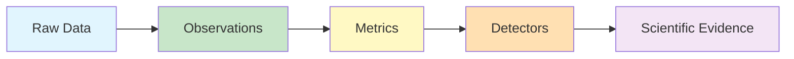

No arrow may point upstream. Metrics cannot influence observations. Detectors cannot influence metrics. Evidence cannot influence detectors. This unidirectionality is an architectural invariant.

### 1.3 Why Observations Are the Atomic Scientific Entity

An observation is atomic because it cannot be decomposed further without losing scientific meaning. A commit hash is atomic. A file change count is atomic. A review latency measurement is atomic. These facts exist independently and can be combined in multiple ways to support different metrics and analyses.

Atomicity provides three architectural benefits:

**Reproducibility**: Given the same observations, any metric computation will produce the same result. This enables verification of MIIE's outputs by independent recomputation.

**Composability**: Atomic observations can be combined in arbitrary ways to support new metrics, detectors, or analyses without re-extracting from raw data. This enables extensibility without data duplication.

**Traceability**: Every metric value can be traced back to the specific observations from which it was computed. This enables scientific audit and error diagnosis.

The alternative — computing metrics directly from raw data without an observation layer — would destroy reproducibility (raw data formats change), composability (each metric would require its own extraction logic), and traceability (the relationship between raw data and metric output would be opaque).

---

## 2. Observation Philosophy

### 2.1 Observation

An observation is a normalized, validated, and provenanced fact extracted from repository data. An observation has the following essential properties:

**Identity**: Every observation has a unique identifier derived from its source data and extraction context. Two observations extracted from different sources but representing the same fact will have different identities, because their provenance differs.

**Content**: Every observation carries a typed value — a number, a string, a timestamp, a set of file paths. The content is the fact itself.

**Provenance**: Every observation records its source provider, extraction timestamp, source data reference, and extraction procedure. Provenance enables audit and verification.

**Quality**: Every observation carries a quality assessment reflecting the completeness, accuracy, and reliability of the extraction. Quality assessments are themselves observations about observations.

**Timestamp**: Every observation carries an observation time — the moment at which the fact was recorded in the repository. This is distinct from extraction time — the moment at which MIIE extracted the fact.

**Window Membership**: Every observation belongs to one or more observation windows. Window membership is determined after extraction and may change as windows are redefined.

An observation is immutable. Once created, its content, provenance, and quality cannot be modified. If a fact is re-extracted and found to differ, a new observation is created with new identity and provenance. The original observation is retained for audit purposes.

### 2.2 Observation Source

An observation source is the origin point from which observations are extracted. Sources include:

**Repository Sources**: Git commits, branches, tags, file trees, diff statistics, blame annotations.

**Platform Sources**: GitHub pull requests, reviews, checks, issues, milestones, releases.

**External Sources**: CI pipeline results, coverage reports, static analysis outputs, dependency manifests.

Each source has characteristic properties:

**Reliability**: How consistently does this source produce accurate observations? Git commit data is highly reliable. GitHub API data may be incomplete or delayed. CI coverage reports may be outdated.

**Completeness**: What fraction of the relevant facts does this source provide? Git provides complete commit history. GitHub provides complete PR history but may lack historical issue data.

**Granularity**: At what level of detail does this source report facts? Git commits are fine-grained. Release tags are coarse-grained.

**Latency**: How quickly does this source reflect repository changes? Git is immediate. GitHub may have API caching delays. CI is asynchronous.

**Format**: In what structure does this source report facts? Each source has a unique format that must be understood and normalized.

Sources are registered in the observation source registry. Each source is associated with a provider that知道如何提取和规范化来自该源的观察。

### 2.3 Observation Quality

Observation quality is a multi-dimensional assessment of how well an observation represents the fact it claims to capture. Quality dimensions include:

**Completeness**: What fraction of the expected observations were actually extracted? If a provider expects to extract 100 commit observations but only 95 are available, completeness is 0.95.

**Accuracy**: How closely does the extracted value match the true value? Accuracy is difficult to assess directly, but can be approximated by cross-validation between providers.

**Timeliness**: How recently was the observation extracted? Stale observations may not reflect current repository state.

**Consistency**: Do observations from the same source agree with observations from other sources about the same fact? Inconsistency suggests extraction errors.

**Reliability**: How likely is this observation to be correct, given the known characteristics of its source? Git observations are generally reliable. External tool observations may be less so.

Quality assessments are propagated through the observation pipeline. Metrics inherit the minimum quality of their source observations. Detectors inherit the minimum quality of their source metrics. Evidence inherits the minimum quality of its source observations, metrics, and detector signals.

### 2.4 Observation Confidence

Observation confidence is a quantitative measure of how certain MIIE is that an observation accurately represents the fact it claims to capture. Confidence is distinct from quality:

**Quality** is an assessment of the observation's fitness for use — its completeness, accuracy, timeliness, consistency, and reliability.

**Confidence** is a probability estimate — the likelihood that the observation is correct given the available evidence.

Confidence is computed from multiple factors:

**Source reliability**: Observations from highly reliable sources receive higher confidence.

**Cross-validation**: Observations confirmed by multiple providers receive higher confidence.

**Statistical evidence**: Observations supported by strong statistical evidence (large sample sizes, low variance) receive higher confidence.

**Provenance completeness**: Observations with complete provenance receive higher confidence.

Confidence is propagated through the pipeline. The confidence of a metric is a function of the confidence of its source observations and the quality of the computation. The confidence of a detector signal is a function of the confidence of its source metrics and the power of the statistical test.

### 2.5 Observation Provenance

Observation provenance is the complete record of how an observation was created, from raw data to final form. Provenance includes:

**Source**: The raw data from which the observation was extracted.

**Provider**: The provider that performed the extraction.

**Procedure**: The extraction algorithm applied.

**Timestamp**: When the extraction occurred.

**Context**: The repository state at the time of extraction.

**Dependencies**: Other observations that influenced this observation.

**Transformations**: Any normalizations, validations, or quality assessments applied.

Provenance is itself an observation — a fact about how an observation was created. Provenance enables:

**Audit**: Verifying that an observation was created correctly.

**Reproducibility**: Recreating an observation from the same raw data.

**Debugging**: Identifying the source of errors in observation extraction.

**Scientific integrity**: Demonstrating that observations are not fabricated or manipulated.

Provenance is stored alongside observations and propagated through the pipeline. Every metric, detector, and evidence package includes complete provenance information.

### 2.6 Observation Relationships

Observations do not exist in isolation. They participate in relationships with other observations:

**Temporal relationships**: Observations extracted from the same time period are temporally related. Commit observations from the same day are temporal siblings.

**Causal relationships**: Some observations are causally related. A pull request observation causes a merge commit observation. A review observation causes a pull request state change observation.

**Derivation relationships**: Some observations are derived from others. A file change count observation is derived from a diff statistics observation. A churn ratio observation is derived from insertion count, deletion count, and total lines observations.

**Aggregation relationships**: Some observations are aggregations of others. A commit count observation is an aggregation of individual commit observations. A mean review latency observation is an aggregation of individual review latency observations.

**Conflict relationships**: Some observations conflict. Two providers may extract different values for the same fact. Conflict relationships require resolution.

Relationships are stored in the observation graph and traversed during metric computation, detector analysis, and evidence assembly.

### 2.7 Observation Integrity

Observation integrity is the property that observations have not been altered, fabricated, or selectively removed after creation. Integrity is maintained through:

**Immutability**: Once created, observations cannot be modified. Changes produce new observations.

**Provenance**: Every observation carries complete provenance, enabling verification of its creation.

**Chain of custody**: Observations are tracked from extraction through processing, with no opportunity for silent modification.

**Deduplication**: Duplicate observations are identified and resolved without destroying originals.

**Validation**: Observations are validated against defined schemas and constraints.

Integrity violations are themselves observations — facts about the observation pipeline that indicate problems. Integrity violations trigger alerts and may invalidate downstream metrics and evidence.

### 2.8 Observation Lifecycle

The observation lifecycle describes the states an observation passes through from creation to archival:

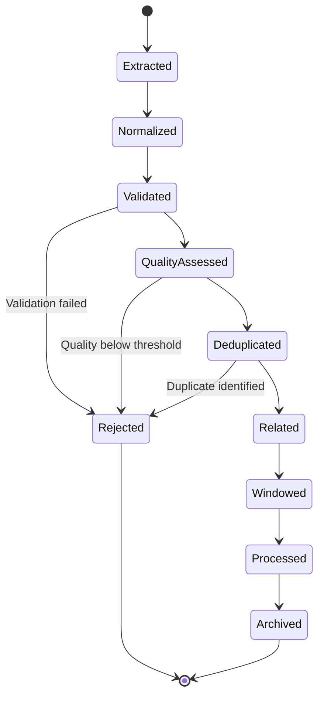

Each state transition is recorded in the observation's provenance. The lifecycle is linear — observations do not cycle between states. Rejected observations are retained for audit but excluded from processing.

---

## 3. Architecture Overview

### 3.1 High-Level Architecture

The MIIE Observation Architecture consists of eleven major components arranged in a unidirectional processing pipeline:

```mermaid
graph TB
    subgraph "Data Sources"
        R[Repository]
        P[Platform]
        E[External]
    end
    
    subgraph "Extraction Layer"
        GP[Git Provider]
        GHP[GitHub Provider]
        RMP[Repository Metadata Provider]
        FP[Future Providers]
    end
    
    subgraph "Observation Layer"
        OR[Observation Registry]
        OO[Observation Orchestrator]
        OG[Observation Graph]
        OWB[Observation Window Builder]
    end
    
    subgraph "Analysis Layer"
        ME[Metric Engine]
        D[Detectors]
        EV[Evidence Engine]
        S[Scoring Engine]
    end
    
    subgraph "Output Layer"
        RP[Reporting]
    
    R --> GP
    P --> GHP
    E --> RMP
    FP --> OR
    
    GP --> OR
    GHP --> OR
    RMP --> OR
    
    OR --> OO
    OO --> OG
    OG --> OWB
    
    OWB --> ME
    ME --> D
    D --> EV
    EV --> S
    S --> RP
    
    style R fill:#e1f5fe
    style P fill:#e1f5fe
    style E fill:#e1f5fe
    style GP fill:#c8e6c9
    style GHP fill:#c8e6c9
    style RMP fill:#c8e6c9
    style FP fill:#c8e6c9
    style OR fill:#fff9c4
    style OO fill:#fff9c4
    style OG fill:#fff9c4
    style OWB fill:#fff9c4
    style ME fill:#ffe0b2
    style D fill:#ffe0b2
    style EV fill:#ffe0b2
    style S fill:#ffe0b2
    style RP fill:#f3e5f5
```

### 3.2 Data Flow

The data flow through the architecture follows a strict unidirectional pattern:

1. **Repository State**: The repository exists in a specific state at a specific time.

2. **Provider Extraction**: Providers extract raw data from the repository using external tools (git, GitHub API).

3. **Observation Creation**: Raw data is normalized, validated, and converted into observations with provenance and quality metadata.

4. **Observation Registration**: Observations are registered in the observation registry, which maintains a complete inventory of all observations.

5. **Observation Orchestration**: The orchestrator plans extraction execution, handles dependencies, and coordinates provider interactions.

6. **Graph Construction**: Observations are assembled into a directed acyclic graph (DAG) that captures their relationships.

7. **Window Assignment**: Observations are assigned to analysis windows based on temporal, commit-based, or hybrid strategies.

8. **Metric Computation**: Metrics are computed from observations within each window.

9. **Detector Analysis**: Detectors analyze metric time series to identify integrity violations.

10. **Evidence Assembly**: Evidence packages are assembled from observations, metrics, detector signals, and confidence assessments.

11. **Score Computation**: Integrity and confidence scores are computed from detector outputs and evidence quality.

12. **Reporting**: Results are formatted and delivered to the user.

Each stage produces output that feeds the next stage. No stage may modify the output of a previous stage. The architecture enforces this through immutability constraints and data flow validation.

### 3.3 Component Responsibilities

| Component | Primary Responsibility | Key Interfaces |
|-----------|----------------------|----------------|
| Observation Registry | Store and retrieve observations | register(), query(), get() |
| Observation Orchestrator | Plan and coordinate extraction | plan(), execute(), monitor() |
| Observation Graph | Model observation relationships | add_node(), add_edge(), traverse() |
| Observation Window Builder | Partition observations into windows | build(), validate(), reassign() |
| Metric Engine | Compute metrics from observations | compute(), validate(), aggregate() |
| Detectors | Analyze metric time series | detect(), threshold(), signal() |
| Evidence Engine | Assemble evidence packages | assemble(), verify(), package() |
| Scoring Engine | Compute integrity and confidence | score(), weight(), propagate() |
| Reporting | Format and deliver results | format(), render(), export() |

### 3.4 Architectural Invariants

The architecture maintains the following invariants:

**INV-1: Unidirectional Data Flow**: Data flows from sources to outputs. No backward flow is permitted.

**INV-2: Observation Immutability**: Once created, observations cannot be modified.

**INV-3: Provenance Completeness**: Every output must carry complete provenance from source observations.

**INV-4: Quality Propagation**: Quality assessments propagate through the pipeline without degradation.

**INV-5: Confidence Propagation**: Confidence assessments propagate through the pipeline with appropriate discounting.

**INV-6: Deterministic Processing**: Given identical inputs, all components must produce identical outputs.

**INV-7: Provider Independence**: Providers must not depend on each other's outputs.

**INV-8: Window Containment**: All observations within a window must be from the same temporal period.

**INV-9: Graph Acyclicity**: The observation graph must be a directed acyclic graph.

**INV-10: Separation of Concerns**: Each component has a single, well-defined responsibility.

---

## 4. Observation Model

### 4.1 Observation

The observation is the fundamental data entity in MIIE. An observation represents a single, atomic fact extracted from repository data.

**Essential Attributes**:

| Attribute | Type | Description |
|-----------|------|-------------|
| identity | UUID | Unique identifier for this observation |
| content | Typed value | The fact itself (number, string, timestamp, etc.) |
| observation_time | Timestamp | When the fact was recorded in the repository |
| extraction_time | Timestamp | When MIIE extracted the fact |
| source | Reference | The raw data from which this observation was extracted |
| provider | Identifier | The provider that created this observation |
| quality | Quality assessment | Multi-dimensional quality score |
| confidence | Confidence assessment | Probability estimate of correctness |
| provenance | Provenance record | Complete creation history |
| window_ids | Set of identifiers | Windows to which this observation belongs |

**Invariants**:

- OBS-1: identity is unique across all observations
- OBS-2: observation_time ≤ extraction_time
- OBS-3: content is immutable after creation
- OBS-4: provenance is complete and accurate
- OBS-5: quality is in [0, 1]
- OBS-6: confidence is in [0, 1]

### 4.2 ObservationCollection

An observation collection is an unordered set of observations that share a common context — typically a provider, time period, or analysis scope.

**Essential Attributes**:

| Attribute | Type | Description |
|-----------|------|-------------|
| collection_id | UUID | Unique identifier |
| observations | Set of Observations | The contained observations |
| provider | Identifier | Provider that created this collection |
| time_range | Time range | Temporal extent of the collection |
| metadata | Map | Collection-level metadata |

**Responsibilities**:

- Group related observations for batch processing
- Provide aggregate statistics (count, quality distribution, completeness)
- Support iteration and filtering
- Maintain collection-level provenance

**Constraints**:

- COL-1: All observations in a collection share the same provider
- COL-2: Collection time range is the union of observation time ranges
- COL-3: Collection quality is the minimum observation quality

### 4.3 ObservationWindow

An observation window is a time-bounded partition of observations for analysis. Windows are the unit of analysis in MIIE — detectors operate on metrics computed from observations within windows.

**Essential Attributes**:

| Attribute | Type | Description |
|-----------|------|-------------|
| window_id | UUID | Unique identifier |
| start_time | Timestamp | Window start (inclusive) |
| end_time | Timestamp | Window end (exclusive) |
| observations | Set of Observations | Observations within the window |
| window_type | Enum | Temporal, commit-based, hybrid, or release |
| completeness | Ratio [0,1] | Fraction of expected observations present |
| confidence | Confidence assessment | Window-level confidence |
| provenance | Provenance record | Window creation history |

**Responsibilities**:

- Partition the observation stream into analysis units
- Provide a bounded context for metric computation
- Support different partitioning strategies
- Track window quality and completeness

**Constraints**:

- WIN-1: Windows do not overlap (except during transition periods)
- WIN-2: Windows are ordered temporally
- WIN-3: Window completeness ≤ 1.0
- WIN-4: All observations within a window satisfy the window's time constraints

### 4.4 ObservationRelationship

An observation relationship is a directed connection between two observations that captures a semantic dependency.

**Relationship Types**:

| Type | Source → Target | Semantics |
|------|----------------|-----------|
| temporal | Commit → Commit | Target follows source in time |
| causal | PR → Merge Commit | Target was caused by source |
| derived | Diff Stats → Churn Ratio | Target is computed from source |
| aggregation | Commits → Commit Count | Target aggregates sources |
| conflict | Provider A → Provider B | Sources disagree on same fact |

**Essential Attributes**:

| Attribute | Type | Description |
|-----------|------|-------------|
| relationship_id | UUID | Unique identifier |
| source_observation | Reference | The source observation |
| target_observation | Reference | The target observation |
| relationship_type | Enum | The type of relationship |
| strength | Ratio [0,1] | Relationship strength |
| metadata | Map | Relationship metadata |

**Constraints**:

- REL-1: Relationships are directed
- REL-2: Relationships are immutable
- REL-3: The relationship graph must be acyclic
- REL-4: Relationship strength is in [0, 1]

### 4.5 ObservationGraph

The observation graph is a directed acyclic graph (DAG) that models the relationships between observations. The graph is the central data structure in MIIE — it enables traversal from any observation back to its source observations and forward to its dependent metrics.

**Essential Attributes**:

| Attribute | Type | Description |
|-----------|------|-------------|
| graph_id | UUID | Unique identifier |
| nodes | Map of ObservationNode | Graph nodes |
| edges | List of ObservationEdge | Graph edges |
| metadata | Map | Graph-level metadata |

**Responsibilities**:

- Model observation dependencies
- Enable traversal for metric computation
- Support window assignment
- Maintain graph invariants (acyclicity, completeness)

**Constraints**:

- GRA-1: The graph is a DAG (no cycles)
- GRA-2: Every node has at least one incoming or outgoing edge (no orphans)
- GRA-3: Edge directions respect causal and temporal ordering
- GRA-4: The graph is immutable after construction

### 4.6 ObservationEdge

An observation edge is a directed connection between two observation nodes in the graph.

**Essential Attributes**:

| Attribute | Type | Description |
|-----------|------|-------------|
| edge_id | UUID | Unique identifier |
| source_node | Reference | Source observation node |
| target_node | Reference | Target observation node |
| edge_type | Enum | Relationship type |
| weight | Ratio [0,1] | Edge weight |
| metadata | Map | Edge metadata |

### 4.7 ObservationNode

An observation node is a vertex in the observation graph that represents an observation.

**Essential Attributes**:

| Attribute | Type | Description |
|-----------|------|-------------|
| node_id | UUID | Unique identifier (matches observation identity) |
| observation | Reference | The contained observation |
| in_edges | Set of Edges | Incoming edges |
| out_edges | Set of Edges | Outgoing edges |
| depth | Integer | Distance from root nodes |
| subtree_size | Integer | Number of downstream nodes |

### 4.8 ObservationSource

An observation source is a registered origin point for observations. Sources are defined by their provider, extraction procedure, and data format.

**Essential Attributes**:

| Attribute | Type | Description |
|-----------|------|-------------|
| source_id | Identifier | Unique source identifier |
| provider | Reference | The provider for this source |
| data_format | Enum | The format of source data |
| reliability | Ratio [0,1] | Source reliability assessment |
| completeness | Ratio [0,1] | Expected completeness |
| latency | Duration | Expected extraction latency |

### 4.9 ObservationMetadata

Observation metadata is contextual information about an observation that is not part of its content but affects its interpretation.

**Metadata Categories**:

| Category | Examples | Purpose |
|----------|---------|---------|
| Extraction | Tool version, extraction parameters | Reproducibility |
| Repository | Repository ID, branch, commit | Context |
| Temporal | Window assignment, time zone | Temporal context |
| Quality | Quality scores, confidence levels | Assessment |
| Provenance | Source references, transformation chain | Audit |

### 4.10 ObservationQuality

Observation quality is a multi-dimensional assessment of observation fitness for use.

**Quality Dimensions**:

| Dimension | Definition | Range | Aggregation |
|-----------|-----------|-------|-------------|
| Completeness | Fraction of expected observations extracted | [0, 1] | Mean |
| Accuracy | Closeness to true value | [0, 1] | Cross-validation |
| Timeliness | Recency of extraction | [0, 1] | Decay function |
| Consistency | Agreement across providers | [0, 1] | Agreement ratio |
| Reliability | Source trustworthiness | [0, 1] | Source assessment |

**Quality Score**: The overall quality score is the weighted mean of dimension scores:

```
Q = 0.3 × Completeness + 0.25 × Accuracy + 0.2 × Timeliness + 0.15 × Consistency + 0.1 × Reliability
```

### 4.11 ObservationConfidence

Observation confidence is a probability estimate that an observation correctly represents the fact it claims to capture.

**Confidence Factors**:

| Factor | Weight | Description |
|--------|--------|-------------|
| Source reliability | 0.3 | Trust in the source |
| Cross-validation | 0.25 | Agreement across providers |
| Statistical evidence | 0.2 | Sample size and variance |
| Provenance completeness | 0.15 | Completeness of creation record |
| Quality assessment | 0.1 | Overall quality score |

**Confidence Score**: The confidence score is the weighted sum of factor scores:

```
C = 0.3 × R + 0.25 × V + 0.2 × S + 0.15 × P + 0.1 × Q
```

Where R = source reliability, V = cross-validation, S = statistical evidence, P = provenance completeness, Q = quality assessment.

---

## 5. Observation Lifecycle

### 5.1 Complete Lifecycle

The observation lifecycle describes every state an observation passes through from creation to final disposition:

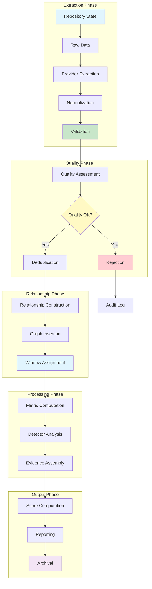

### 5.2 State Definitions

| State | Description | Entry Criteria | Exit Criteria |
|-------|-------------|----------------|---------------|
| Extracted | Raw data converted to observation | Provider execution | Normalization complete |
| Normalized | Observation format standardized | Extraction complete | Validation pass/fail |
| Validated | Observation satisfies schema | Normalization complete | Quality assessment |
| QualityAssessed | Quality dimensions scored | Validation pass | Deduplication check |
| Deduplicated | Conflicts with existing observations resolved | Quality assessment | Relationship construction |
| Related | Relationships to other observations established | Deduplication complete | Graph insertion |
| Windowed | Assigned to analysis window(s) | Relationship construction | Processing |
| Processed | Used in metric computation | Window assignment | Evidence assembly |
| Archived | Retained for audit | Processing complete | End of lifecycle |
| Rejected | Excluded from processing | Validation or quality failure | Audit log |

### 5.3 State Transitions

Each state transition is recorded in the observation's provenance. Transitions are:

**Forward-only**: Observations move forward through states. No backward transitions.

**Atomic**: Transitions are atomic — an observation is in exactly one state at any time.

**Auditable**: Every transition is logged with timestamp, triggering condition, and responsible component.

**Validated**: Transitions are validated against pre-conditions. Invalid transitions are rejected.

### 5.4 Rejection Handling

Observations may be rejected at two points:

**Validation Rejection**: The observation fails schema validation. This indicates extraction errors. Rejected observations are logged but excluded from processing.

**Quality Rejection**: The observation's quality score falls below the configured threshold. This indicates unreliable data. Rejected observations are logged but excluded from processing.

Rejected observations are retained in the audit log for diagnostic purposes. They are never included in metrics, detectors, or evidence.

---

## 6. Observation Providers

### 6.1 Provider Responsibilities

An observation provider is responsible for extracting observations from a specific data source. Providers encapsulate:

**Source Knowledge**: Understanding of the source data format, API, and tool interface.

**Extraction Logic**: Algorithms for converting raw data into normalized observations.

**Quality Assessment**: Heuristics for evaluating extraction quality.

**Error Handling**: Strategies for dealing with source failures, missing data, and format changes.

**Provenance Recording**: Metadata about extraction context, parameters, and results.

### 6.2 Provider Types

| Provider | Source | Observations | Dependencies |
|----------|--------|--------------|--------------|
| Git Provider | Local git repository | Commits, branches, tags, diffs, blame | git CLI |
| GitHub Provider | GitHub API | PRs, reviews, checks, issues, releases | GitHub API |
| Repository Metadata Provider | Repository structure | File tree, directory structure, sizes | File system |
| CI Provider | CI/CD systems | Build results, test results, coverage | CI API |
| Issue Tracker Provider | Issue tracking systems | Issues, milestones, labels | Issue API |

### 6.3 Provider Contracts

Every provider must satisfy the following contracts:

**Determinism Contract**: Given identical input (repository state, time range, parameters), a provider must produce identical observations. Non-determinism violates the reproducibility requirement.

**Quality Contract**: Every observation must include a quality assessment. Providers must not produce observations without quality metadata.

**Provenance Contract**: Every observation must include complete provenance. Providers must record extraction context, parameters, and results.

**Completeness Contract**: Providers must extract all observations available from the source within the specified parameters. Selective extraction without documentation violates transparency.

**Error Contract**: Providers must handle errors gracefully and report them as quality degradation, not as silent data loss.

### 6.4 Provider Independence

Providers must not depend on each other's outputs. The Git Provider must not read GitHub observations. The GitHub Provider must not read Git observations. Independence ensures:

**Parallel Execution**: Providers can execute simultaneously without coordination.

**Fault Isolation**: A provider failure does not cascade to other providers.

**Composability**: Providers can be added, removed, or replaced without affecting others.

**Testing**: Providers can be tested independently with mock sources.

### 6.5 Future Providers

The provider framework is designed for extensibility. Future providers may include:

**Issue Tracker Provider**: Extract observations from Jira, Linear, or similar issue tracking systems.

**CI/CD Provider**: Extract observations from Jenkins, GitHub Actions, or similar CI systems.

**Coverage Provider**: Extract observations from code coverage tools.

**Static Analysis Provider**: Extract observations from linters, formatters, and static analyzers.

**Dependency Provider**: Extract observations from dependency manifests and lock files.

Each future provider must satisfy the provider contracts and be registered in the observation source registry.

---

## 7. Observation Orchestrator

### 7.1 Orchestrator Responsibilities

The observation orchestrator coordinates the extraction of observations from multiple providers. It is the control plane for the extraction layer.

**Provider Discovery**: Identifying available providers and their capabilities.

**Execution Planning**: Determining the order and parameters for provider execution.

**Dependency Handling**: Managing dependencies between providers (if any).

**Scheduling**: Allocating resources and timing for provider execution.

**Conflict Resolution**: Resolving conflicts between providers extracting overlapping observations.

**Deduplication**: Identifying and resolving duplicate observations.

**Merge Policies**: Defining how observations from different providers are combined.

**Failure Handling**: Managing provider failures and partial results.

**Health Monitoring**: Tracking provider health and performance.

### 7.2 Execution Planning

The orchestrator generates an execution plan that specifies:

**Provider Sequence**: The order in which providers execute. Providers with no dependencies execute in parallel. Providers with dependencies execute in dependency order.

**Parameter Configuration**: The repository path, time range, and extraction parameters for each provider.

**Resource Allocation**: Memory, CPU, and network resources for each provider.

**Timeout Configuration**: Maximum execution time for each provider.

**Retry Configuration**: Retry policy for transient failures.

### 7.3 Conflict Resolution

When multiple providers extract observations about the same fact, the orchestrator applies conflict resolution:

**Priority-Based**: The highest-priority provider's observation wins.

**Recency-Based**: The most recently extracted observation wins.

**Quality-Based**: The highest-quality observation wins.

**Merge**: Observations are combined using a defined merge function.

Conflict resolution strategy is configurable per fact type and per provider combination.

### 7.4 Architectural Boundaries

The orchestrator operates within strict boundaries:

**No Computation**: The orchestrator plans and coordinates but does not compute metrics or detectors.

**No Storage**: The orchestrator does not store observations — it delegates to the observation registry.

**No Analysis**: The orchestrator does not analyze observation quality — it delegates to quality assessment.

**No Reporting**: The orchestrator does not produce reports — it delegates to the reporting layer.

These boundaries ensure the orchestrator remains a coordination mechanism, not a processing engine.

---

## 8. Observation Graph

### 8.1 Graph Structure

The observation graph is a directed acyclic graph (DAG) with the following structure:

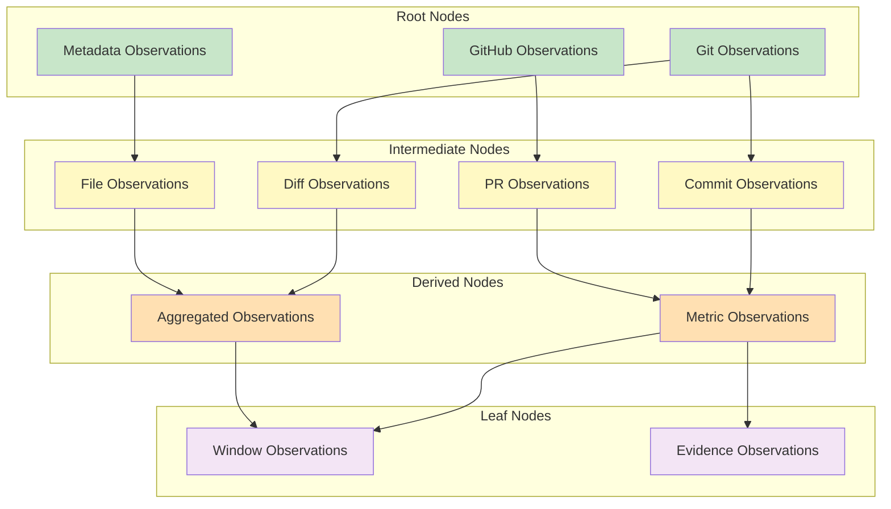

### 8.2 Node Types

| Type | Description | Source | Example |
|------|-------------|--------|---------|
| Source Node | Raw observation from provider | Provider extraction | Git commit observation |
| Intermediate Node | Processed observation | Transformation | Normalized commit observation |
| Derived Node | Computed from other observations | Metric computation | Commit count observation |
| Aggregation Node | Aggregated from multiple observations | Aggregation | Mean churn ratio observation |
| Window Node | Window-level summary | Window construction | Window completeness observation |
| Evidence Node | Evidence package component | Evidence assembly | Detector signal observation |

### 8.3 Edge Types

| Type | Description | Semantics | Example |
|------|-------------|-----------|---------|
| Temporal Edge | Time-ordering relationship | Target follows source | Commit → Commit |
| Causal Edge | Causal dependency | Target caused by source | PR → Merge Commit |
| Derivation Edge | Computation dependency | Target derived from source | Diff Stats → Churn Ratio |
| Aggregation Edge | Aggregation relationship | Target aggregates sources | Commits → Count |
| Conflict Edge | Disagreement between sources | Sources conflict | Provider A → Provider B |

### 8.4 Graph Invariants

The graph maintains the following invariants:

**ACYC-1**: The graph contains no directed cycles.

**ACYC-2**: Topological ordering exists and is unique (up to ordering of independent nodes).

**COMP-1**: Every node is reachable from at least one root node.

**COMP-2**: Every node can reach at least one leaf node.

**EDGE-1**: Edge directions respect causal and temporal ordering.

**EDGE-2**: Edge weights are in [0, 1].

**NODE-1**: Every node contains exactly one observation.

**NODE-2**: Node identity matches observation identity.

### 8.5 Traversal Principles

Graph traversal follows these principles:

**Downstream Traversal**: From any node, traverse to all dependent nodes. Used for metric computation — given a set of observations, find all metrics that depend on them.

**Upstream Traversal**: From any node, traverse to all source nodes. Used for provenance — given a metric, find all observations from which it was derived.

**Window Traversal**: From any window node, traverse to all contained observations. Used for metric computation within a window.

**Evidence Traversal**: From any evidence node, traverse to all source observations, metrics, and detector signals. Used for evidence assembly and audit.

### 8.6 Future Evolution

The observation graph may evolve to support:

**Subgraph Extraction**: Extracting subgraphs for specific analyses without constructing the full graph.

**Incremental Update**: Updating the graph as new observations are extracted without full reconstruction.

**Persistence**: Storing the graph to disk for reuse across analysis sessions.

**Distributed Construction**: Constructing the graph across multiple machines for large repositories.

---

## 9. Observation Window Architecture

### 9.1 Why Windows Exist

Observations exist along a timeline. A repository's commit history spans months or years. Analyzing the entire history as a single unit would:

**Obscure Temporal Patterns**: Integrity violations often manifest as changes in metric behaviour over time. Analysing the entire history would average out these temporal patterns.

**Violate Assumptions**: Statistical detectors assume stationarity — that the underlying process generating observations is stable over the analysis period. Long time series violate this assumption.

**Prevent Comparison**: Comparing the same metric across different time periods requires partitioning the observation stream into periods.

**Limit Sensitivity**: Detectors are more sensitive to local changes when operating on shorter time series.

Windows solve these problems by partitioning the observation stream into bounded, analysable units.

### 9.2 Window Builder

The window builder is responsible for constructing observation windows from the observation graph. It implements multiple windowing strategies:

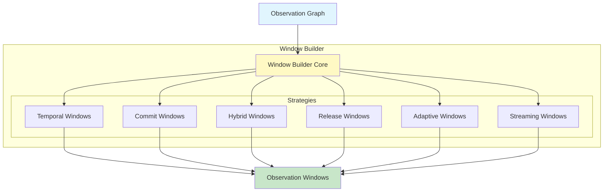

### 9.3 Temporal Windows

Temporal windows partition observations by calendar time. Each window covers a fixed duration — daily, weekly, monthly, or quarterly.

**Characteristics**:

- **Fixed boundaries**: Window start and end times are predetermined.
- **Regular intervals**: All windows have the same duration.
- **Time-zone aware**: Windows respect the repository's time zone.
- **Complete periods**: Windows cover complete periods (no partial weeks or months).

**Use Cases**:

- Trend analysis across regular periods
- Comparison of the same period across different time ranges
- Reporting aligned with business cycles

**Limitations**:

- May not align with development activity patterns
- Low-activity periods produce sparse windows
- High-activity periods may exceed window capacity

### 9.4 Commit Windows

Commit windows partition observations by commit count. Each window contains a fixed number of commits.

**Characteristics**:

- **Activity-aligned**: Windows correspond to development activity, not calendar time.
- **Variable duration**: Window duration varies with commit frequency.
- **Commit-boundary**: Windows start and end at commit boundaries.
- **Fixed size**: All windows contain the same number of commits.

**Use Cases**:

- Analysis of development phases
- Comparison of similar-activity periods
- Detectors that require consistent sample sizes

**Limitations**:

- May span irregular time periods
- Calendar-based comparison is difficult
- Large gaps between commits create long windows

### 9.5 Hybrid Windows

Hybrid windows combine temporal and commit-based strategies. They use temporal boundaries but adjust for activity levels.

**Characteristics**:

- **Temporal bounds**: Windows have maximum and minimum durations.
- **Activity adjustment**: Windows are extended or shortened based on commit frequency.
- **Completeness threshold**: Windows are not closed until a minimum completeness level is achieved.
- **Overlap allowance**: Adjacent windows may overlap during transition periods.

**Use Cases**:

- Balanced analysis that respects both time and activity
- Detectors that require both temporal consistency and sample size
- Adaptive analysis that adjusts to repository activity patterns

**Limitations**:

- More complex to implement and validate
- Window boundaries may be ambiguous
- Overlap management adds complexity

### 9.6 Release Windows

Release windows partition observations by release events. Each window covers the period between two releases.

**Characteristics**:

- **Event-driven**: Window boundaries correspond to release events.
- **Variable duration**: Window duration varies with release frequency.
- **Release-aligned**: Analysis corresponds to software delivery cycles.
- **Natural comparison**: Comparing releases is a natural analytical unit.

**Use Cases**:

- Release-to-release comparison
- Analysis of development between releases
- Detectors calibrated for release cycles

**Limitations**:

- Requires release event data (tags, releases)
- Irregular release schedules create irregular windows
- Pre-release and post-release periods may need special handling

### 9.7 Adaptive Windows

Adaptive windows dynamically adjust their boundaries based on observation characteristics.

**Characteristics**:

- **Data-driven**: Boundaries are determined by observation properties.
- **Quality-aware**: Windows are split or merged based on quality assessments.
- **Completeness-sensitive**: Incomplete windows are extended or flagged.
- **Self-optimizing**: Window parameters are tuned for detector sensitivity.

**Use Cases**:

- Repositories with irregular activity patterns
- Analysis requiring consistent quality across windows
- Automated tuning of analysis parameters

**Limitations**:

- Complex to implement and validate
- May produce inconsistent results across runs
- Difficult to reproduce without exact parameter settings

### 9.8 Streaming Windows

Streaming windows are a future capability for continuous observation processing.

**Characteristics**:

- **Real-time**: Windows are constructed as observations arrive.
- **Sliding**: Windows slide forward in time, dropping old observations.
- **Incremental**: Metrics are updated incrementally as new observations arrive.
- **Low-latency**: Analysis results are available immediately.

**Use Cases**:

- Real-time integrity monitoring
- Continuous integration pipelines
- Live dashboards

**Limitations**:

- Requires streaming infrastructure
- Statistical detectors may not be applicable
- Reproducibility is challenging

### 9.9 Window Validation

Windows are validated against the following criteria:

**Completeness**: The window contains all expected observations. Completeness is measured as the ratio of actual to expected observations.

**Temporal Consistency**: All observations within the window satisfy the window's time constraints. No observation falls outside the window's time range.

**Provider Coverage**: The window contains observations from all expected providers. Missing providers are flagged.

**Quality Threshold**: The window's quality score exceeds the configured threshold. Low-quality windows are flagged for review.

**Sample Size**: The window contains enough observations for statistical analysis. Minimum sample sizes are defined per metric.

### 9.10 Window Confidence

Window confidence is a measure of how reliable the window's observations are for analysis. Window confidence is computed from:

**Observation Confidence**: The minimum confidence of observations within the window.

**Completeness**: Higher completeness increases confidence.

**Quality**: Higher quality increases confidence.

**Sample Size**: Larger samples increase confidence.

**Temporal Coverage**: Longer windows with consistent observation density increase confidence.

Window confidence is propagated to metrics computed from the window. Metrics inherit the window's confidence as a ceiling on their own confidence.

### 9.11 Window Provenance

Every window carries complete provenance:

**Construction Method**: The windowing strategy used (temporal, commit, hybrid, release, adaptive).

**Parameters**: The specific parameters used (duration, commit count, etc.).

**Observation Sources**: The observations included in the window and their sources.

**Validation Results**: The results of window validation checks.

**Confidence Assessment**: The window's confidence score and its computation.

Window provenance enables audit and reproducibility. Given the same observations and parameters, the window builder must produce identical windows.

---

## 10. Detector Integration

### 10.1 Detector-Window Interface

Detectors operate on observation windows. The interface between detectors and windows is:

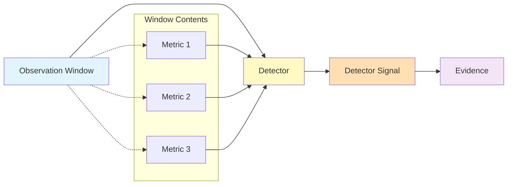

### 10.2 Migration from MetricDataFrame

The current architecture uses MetricDataFrame as an intermediate representation between observations and detectors. The migration path is:

**Current State**: Observations → MetricDataFrame → Detectors

**Target State**: Observations → ObservationWindow → Detectors

**Transitional State**: Observations → MetricDataFrame → Adapter → ObservationWindow → Detectors

The adapter converts MetricDataFrame to ObservationWindow, enabling incremental migration without breaking existing detectors.

### 10.3 Adapter Strategy

The adapter implements the ObservationWindow interface using MetricDataFrame data:

**Window Boundaries**: Derived from MetricDataFrame index (time or commit-based).

**Observation Extraction**: Metric values are converted to observations with appropriate provenance.

**Quality Inheritance**: MetricDataFrame quality metadata is mapped to observation quality.

**Confidence Propagation**: MetricDataFrame confidence is mapped to observation confidence.

### 10.4 Future Removal of MetricDataFrame

MetricDataFrame will be removed when:

- All detectors accept ObservationWindow directly
- All metric computations produce ObservationWindow-compatible output
- All tests pass with ObservationWindow input
- Performance benchmarks confirm no regression

Removal will be a separate, carefully validated change.

---

## 11. Metric Engine Integration

### 11.1 Observation → Metric → MetricCollection

The metric engine transforms observations into metrics:

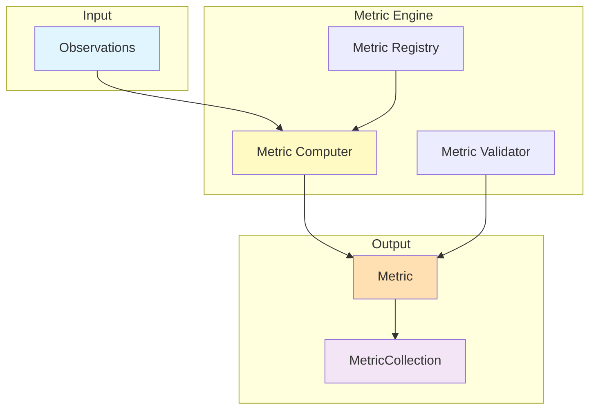

### 11.2 Metric Dependencies

Metrics may depend on other metrics. Dependencies are:

**Direct Dependencies**: A metric requires another metric's output as input. M-03 (Churn Ratio) depends on M-07 (Branch Freshness).

**Indirect Dependencies**: A metric depends on a metric that depends on another metric. The dependency chain must be resolved before computation.

**Cyclic Dependencies**: Not permitted. The metric dependency graph must be a DAG.

Dependencies are resolved at registration time. The metric registry performs topological sorting to determine computation order.

### 11.3 Provider Diversity

Metrics may be computed from observations from multiple providers. Provider diversity increases robustness:

**Git Observations**: Provide commit-level data.

**GitHub Observations**: Provide PR-level data.

**Metadata Observations**: Provide file-level data.

When multiple providers contribute observations to a metric, the metric inherits the quality and confidence of the lowest-quality provider.

### 11.4 Cross-Metric Validation

Metrics are validated against cross-metric consistency constraints:

**Range Validation**: Ratio metrics must be in [0, 1]. Count metrics must be ≥ 0.

**Correlation Validation**: Highly correlated metrics should produce consistent detector signals.

**Temporal Validation**: Metric trends should be temporally consistent.

**Provider Validation**: Metrics from different providers should agree within tolerance.

Validation failures are logged and propagated as quality degradation.

### 11.5 Future Extensibility

The metric engine is designed for extensibility:

**New Metrics**: New metrics can be added by implementing the metric computer interface and registering with the metric registry.

**New Providers**: New providers can contribute observations to existing metrics without modifying the metric computers.

**New Aggregations**: New aggregation functions can be added to the base metric computer.

**New Validation Rules**: New validation rules can be added to the metric validator.

---

## 12. Evidence Integration

### 12.1 Observation → Evidence → Scientific Conclusions

Evidence is the complete package of data required to support a scientific conclusion:

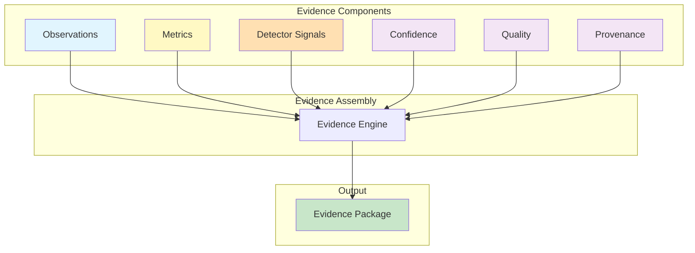

### 12.2 Traceability

Every element of an evidence package must be traceable to its source:

**Observation Traceability**: Every observation in the evidence can be traced back to the raw data from which it was extracted.

**Metric Traceability**: Every metric in the evidence can be traced back to the observations from which it was computed.

**Detector Traceability**: Every detector signal can be traced back to the metrics and parameters that produced it.

**Confidence Traceability**: Every confidence assessment can be traced back to the factors from which it was computed.

Traceability enables independent verification of MIIE's conclusions.

### 12.3 Provenance

Evidence packages carry complete provenance:

**Extraction Provenance**: How each observation was extracted.

**Computation Provenance**: How each metric was computed.

**Detection Provenance**: How each detector signal was produced.

**Assembly Provenance**: How the evidence package was assembled.

Provenance enables audit and debugging of the entire analytical pipeline.

### 12.4 Confidence Propagation

Confidence propagates through the evidence assembly:

**Observation Confidence**: The confidence of each observation.

**Metric Confidence**: A function of observation confidence and computation quality.

**Detector Confidence**: A function of metric confidence and detector power.

**Evidence Confidence**: The minimum confidence across all evidence components.

**Conclusion Confidence**: A function of evidence confidence and the strength of the conclusion.

Confidence propagation ensures that uncertainty is never hidden or lost.

### 12.5 Quality Propagation

Quality propagates through the evidence assembly:

**Observation Quality**: The quality of each observation.

**Metric Quality**: A function of observation quality and computation quality.

**Detector Quality**: A function of metric quality and detector quality.

**Evidence Quality**: The minimum quality across all evidence components.

**Conclusion Quality**: A function of evidence quality and the quality of the conclusion.

Quality propagation ensures that unreliable data is never presented as reliable.

---

## 13. Architectural Constraints

### 13.1 Allowed Dependencies

| Component | Allowed Dependencies |
|-----------|---------------------|
| Observation Registry | None (leaf component) |
| Observation Orchestrator | Observation Registry |
| Observation Graph | Observation Registry |
| Observation Window Builder | Observation Graph |
| Metric Engine | Observation Window Builder |
| Detectors | Observation Window Builder |
| Evidence Engine | Metric Engine, Detectors |
| Scoring Engine | Evidence Engine |
| Reporting | Scoring Engine |

### 13.2 Forbidden Dependencies

| Component | Forbidden Dependencies |
|-----------|----------------------|
| Observation Registry | Any component except raw storage |
| Observation Orchestrator | Metric Engine, Detectors, Evidence, Scoring, Reporting |
| Observation Graph | Metric Engine, Detectors, Evidence, Scoring, Reporting |
| Observation Window Builder | Metric Engine, Detectors, Evidence, Scoring, Reporting |
| Metric Engine | Detectors, Evidence, Scoring, Reporting |
| Detectors | Evidence, Scoring, Reporting |
| Evidence Engine | Scoring, Reporting |
| Scoring Engine | Reporting |

### 13.3 Layer Boundaries

The architecture is organized into four layers:

**Extraction Layer**: Providers and orchestrator. Responsible for data acquisition.

**Observation Layer**: Registry, graph, window builder. Responsible for data modeling.

**Analysis Layer**: Metric engine, detectors, evidence, scoring. Responsible for computation.

**Output Layer**: Reporting. Responsible for presentation.

Layers communicate only through their defined interfaces. No layer may directly access the internals of another layer.

### 13.4 Immutability

All data entities in the architecture are immutable:

**Observations**: Once created, never modified.

**Relationships**: Once established, never altered.

**Windows**: Once constructed, never changed (except during reanalysis).

**Metrics**: Once computed, never updated (except during reanalysis).

**Evidence**: Once assembled, never modified.

Immutability ensures reproducibility and auditability.

### 13.5 Ownership

Each data entity has a single owner:

| Entity | Owner |
|--------|-------|
| Observation | Creating provider |
| Relationship | Graph builder |
| Window | Window builder |
| Metric | Metric computer |
| Detector signal | Detector |
| Evidence | Evidence engine |
| Score | Scoring engine |

Owners are responsible for creation, validation, and provenance of their entities.

### 13.6 Deterministic Ordering

Where ordering is required, it is deterministic:

**Graph Traversal**: Topological ordering is unique (up to independent nodes).

**Metric Computation**: Metrics are computed in dependency order.

**Window Construction**: Windows are constructed in temporal order.

**Evidence Assembly**: Evidence components are assembled in a defined sequence.

Deterministic ordering ensures reproducibility.

### 13.7 Serialization

All data entities support serialization:

**Format**: JSON is the primary serialization format.

**Completeness**: Serialized entities must contain all required fields.

**Round-trip**: Deserialization must produce entities identical to the originals.

**Versioning**: Serialization format is versioned for backward compatibility.

### 13.8 Thread Safety

The architecture supports concurrent execution:

**Provider Parallelism**: Providers execute concurrently without shared state.

**Graph Construction**: Graph operations are thread-safe (single-writer).

**Window Construction**: Window operations are thread-safe (single-writer).

**Metric Computation**: Metrics are computed independently and can be parallelized.

Thread safety enables performance optimization through parallelism.

---

## 14. Migration Strategy

### 14.1 Current Architecture

The current architecture uses MetricDataFrame as the primary data structure:

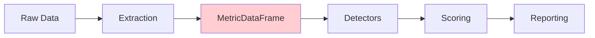

MetricDataFrame is a two-dimensional data structure (rows = time periods, columns = metrics) that:
- Combines observations and metrics in a single structure
- Loses observation-level provenance
- Cannot represent complex observation relationships
- Limits the number of concurrent observations

### 14.2 Transitional Architecture

The transitional architecture introduces an adapter between MetricDataFrame and ObservationWindow:

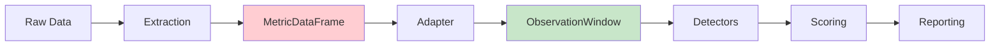

The adapter:
- Converts MetricDataFrame to ObservationWindow
- Preserves observation-level provenance
- Enables new detectors to use ObservationWindow directly
- Maintains backward compatibility with existing detectors

### 14.3 Observation Architecture V2

The target architecture uses ObservationWindow exclusively:

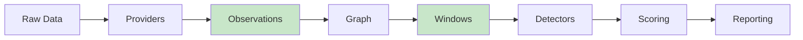

MetricDataFrame is removed entirely. All detectors accept ObservationWindow directly.

### 14.4 Compatibility

During migration:
- Existing detectors continue to work with MetricDataFrame through the adapter
- New detectors are written for ObservationWindow directly
- Tests cover both MetricDataFrame and ObservationWindow paths
- Performance benchmarks confirm no regression

### 14.5 Deprecation

MetricDataFrame deprecation follows a structured timeline:
1. MetricDataFrame marked as deprecated (documentation)
2. Adapter introduced (no functional change)
3. New detectors use ObservationWindow exclusively
4. Existing detectors migrated to ObservationWindow
5. Adapter removed
6. MetricDataFrame removed

Each step requires passing all tests and benchmarks.

### 14.6 Acceptance Criteria

Migration is complete when:
- All detectors accept ObservationWindow directly
- All metric computations produce ObservationWindow-compatible output
- All tests pass with ObservationWindow input
- Performance benchmarks confirm no regression
- Documentation is updated

### 14.7 Validation

Migration is validated through:
- Unit tests for the adapter
- Integration tests for the full pipeline
- Regression tests for existing detectors
- Performance benchmarks
- Scientific validation of detector outputs

### 14.8 Rollback Strategy

If migration fails:
- Adapter remains in place
- MetricDataFrame is restored
- All tests are re-run
- Root cause is investigated
- Migration is re-attempted after fixes

---

## 15. Future Evolution

### 15.1 Streaming Observations

The architecture may evolve to support streaming observations — observations that arrive continuously from real-time sources.

**Characteristics**:
- Observations arrive as they are generated
- Windows are constructed dynamically
- Metrics are updated incrementally
- Results are available in near-real-time

**Challenges**:
- Statistical detectors may not be applicable
- Reproducibility is difficult
- Resource management is complex

### 15.2 Incremental Windows

The architecture may evolve to support incremental window construction — windows that are updated as new observations arrive without full reconstruction.

**Characteristics**:
- Windows grow as observations arrive
- Metrics are recomputed incrementally
- Old observations are expired as windows slide
- Resource usage is bounded

**Challenges**:
- Window completeness is dynamic
- Confidence assessments change over time
- Historical analysis is limited

### 15.3 Real-Time Repositories

The architecture may evolve to support real-time repositories — repositories that are actively being modified during analysis.

**Characteristics**:
- Observations are extracted continuously
- Windows are constructed in near-real-time
- Results reflect current repository state
- Analysis is continuous

**Challenges**:
- Repository state is not stable
- Observations may be incomplete
- Reproducibility is limited

### 15.4 Event Sourcing

The architecture may evolve to use event sourcing — recording all observation events for replay and audit.

**Characteristics**:
- All observation events are recorded
- State can be reconstructed from events
- Audit is complete and verifiable
- Time-travel analysis is possible

**Challenges**:
- Storage requirements grow without bound
- Event processing overhead is significant
- Complexity increases

### 15.5 Knowledge Graph Evolution

The observation graph may evolve into a knowledge graph — a graph that captures not just observation relationships but also domain knowledge about software development.

**Characteristics**:
- Relationships are semantically typed
- Inferences can be drawn from the graph
- Domain knowledge is encoded
- Reasoning is possible

**Challenges**:
- Complexity increases significantly
- Validation is difficult
- Performance may degrade

### 15.6 Semantic Observations

Observations may evolve to include semantic information — information about the meaning of observations, not just their values.

**Characteristics**:
- Observations carry semantic annotations
- Meaning is explicitly represented
- Reasoning is possible
- Interoperability improves

**Challenges**:
- Semantic models are complex
- Annotation overhead is significant
- Standardization is lacking

### 15.7 Distributed Execution

The architecture may evolve to support distributed execution — extracting and processing observations across multiple machines.

**Characteristics**:
- Extraction is parallelized across machines
- Processing is distributed
- Scalability improves
- Fault tolerance improves

**Challenges**:
- Coordination is complex
- Consistency is difficult
- Network overhead is significant

### 15.8 Cloud-Native Processing

The architecture may evolve to use cloud-native processing — leveraging cloud infrastructure for scalability and resilience.

**Characteristics**:
- Infrastructure is managed
- Scaling is automatic
- Resilience is built-in
- Cost is proportional to usage

**Challenges**:
- Vendor lock-in
- Cost management
- Data sovereignty

---

## 16. Architecture Validation

### 16.1 Unit Validation

Each component is validated independently:

**Observation Registry**: Validates observation storage, retrieval, and query operations.

**Observation Orchestrator**: Validates provider coordination, conflict resolution, and failure handling.

**Observation Graph**: Validates graph construction, traversal, and invariant maintenance.

**Observation Window Builder**: Validates window construction, validation, and assignment.

**Metric Engine**: Validates metric computation, aggregation, and validation.

**Detectors**: Validate detection algorithms, threshold application, and signal production.

**Evidence Engine**: Validates evidence assembly, provenance recording, and quality propagation.

**Scoring Engine**: Validates score computation, weighting, and propagation.

### 16.2 Integration Validation

The full pipeline is validated end-to-end:

**Provider Integration**: Validates provider execution and observation production.

**Graph Integration**: Validates graph construction from provider observations.

**Window Integration**: Validates window construction from the observation graph.

**Metric Integration**: Validates metric computation from windowed observations.

**Detector Integration**: Validates detector analysis of metric time series.

**Evidence Integration**: Validates evidence assembly from all pipeline stages.

**Scoring Integration**: Validates score computation from detector outputs.

### 16.3 Graph Validation

The observation graph is validated against structural invariants:

**Acyclicity**: The graph contains no directed cycles.

**Completeness**: Every node is reachable from a root and can reach a leaf.

**Edge Validity**: Edge types are consistent with node types.

**Node Validity**: Every node contains a valid observation.

### 16.4 Window Validation

Observation windows are validated against quality criteria:

**Completeness**: The window contains all expected observations.

**Temporal Consistency**: All observations satisfy the window's time constraints.

**Provider Coverage**: The window contains observations from all expected providers.

**Quality Threshold**: The window's quality score exceeds the configured threshold.

**Sample Size**: The window contains enough observations for analysis.

### 16.5 Performance Validation

The architecture is validated for performance:

**Extraction Throughput**: Observations per second from each provider.

**Graph Construction Time**: Time to construct the observation graph.

**Window Construction Time**: Time to construct observation windows.

**Metric Computation Time**: Time to compute all metrics.

**End-to-End Latency**: Total time from extraction to reporting.

### 16.6 Scientific Validation

The architecture is validated for scientific integrity:

**Reproducibility**: Identical inputs produce identical outputs.

**Traceability**: Every output can be traced to source observations.

**Confidence Propagation**: Confidence assessments are correctly propagated.

**Quality Propagation**: Quality assessments are correctly propagated.

**Provenance Completeness**: Every entity carries complete provenance.

### 16.7 Acceptance Criteria

The architecture is accepted when:

- All unit tests pass
- All integration tests pass
- Graph invariants are maintained
- Window quality criteria are satisfied
- Performance benchmarks are met
- Scientific validation criteria are satisfied
- Documentation is complete

---

## 17. Threats to Architecture

### 17.1 Legacy Compatibility

**Threat**: MetricDataFrame and ObservationWindow coexistence creates complexity.

**Mitigation**: Adapter pattern with clear deprecation timeline.

**Risk**: Medium — complexity is manageable with disciplined migration.

### 17.2 Provider Inconsistency

**Threat**: Providers produce inconsistent observations about the same facts.

**Mitigation**: Conflict resolution strategies and cross-validation.

**Risk**: Medium — inconsistency is detectable and resolvable.

### 17.3 Graph Complexity

**Threat**: The observation graph grows complex with many nodes and edges.

**Mitigation**: Graph pruning, subgraph extraction, and incremental construction.

**Risk**: Low — graph complexity is bounded by repository size.

### 17.4 Window Quality

**Threat**: Windows contain low-quality or incomplete observations.

**Mitigation**: Window validation and quality thresholds.

**Risk**: Medium — quality issues are detectable and flaggable.

### 17.5 Observation Sparsity

**Threat**: Some time periods have few observations, reducing statistical power.

**Mitigation**: Adaptive windowing and minimum sample size requirements.

**Risk**: Medium — sparsity is inherent in some data sources.

### 17.6 Dependency Cycles

**Threat**: Metric or observation dependencies form cycles.

**Mitigation**: Cycle detection at registration time and DAG enforcement.

**Risk**: Low — cycles are preventable through design.

### 17.7 Future Risks

**Threat**: Future requirements may invalidate current architectural decisions.

**Mitigation**: Extensibility points and modular design.

**Risk**: Low — architecture is designed for evolution.

---

## 18. Architecture Decision Summary

### 18.1 ADR-001: Observation-First Architecture

**Decision**: MIIE uses an observation-first architecture where every scientific computation originates from observations.

**Rationale**: Scientific validity requires traceability from conclusions to raw data. Observations provide the atomic, immutable, provenanced entity required for this traceability.

**Trade-offs**:
- (+) Complete traceability from source to conclusion
- (+) Reproducibility of all computations
- (+) Extensibility without data duplication
- (-) Additional abstraction layer
- (-) Storage overhead for provenance

**Implications**: All components must operate on observations. No component may bypass the observation layer.

### 18.2 ADR-002: Observation Immutability

**Decision**: Observations are immutable once created.

**Rationale**: Immutability ensures reproducibility and auditability. Changes produce new observations, preserving the complete history.

**Trade-offs**:
- (+) Complete audit trail
- (+) Reproducibility guaranteed
- (+) No race conditions
- (-) Storage overhead for versioning
- (-) Complexity for updates

**Implications**: All components must handle observation versioning.

### 18.3 ADR-003: Directed Acyclic Graph

**Decision**: The observation graph is a directed acyclic graph.

**Rationale**: DAGs enable topological ordering, cycle-free traversal, and deterministic processing. Cycles would create circular dependencies that prevent computation.

**Trade-offs**:
- (+) Deterministic traversal order
- (+) Cycle-free processing
- (+) Efficient dependency resolution
- (-) No circular relationships
- (-) Limited expressiveness for some patterns

**Implications**: Circular relationships must be modeled differently (e.g., as separate nodes).

### 18.4 ADR-004: Window-Based Analysis

**Decision**: Analysis is performed on observation windows, not the full observation stream.

**Rationale**: Windows enable temporal comparison, satisfy statistical stationarity assumptions, and improve detector sensitivity.

**Trade-offs**:
- (+) Temporal comparison enabled
- (+) Statistical assumptions satisfied
- (+) Detector sensitivity improved
- (-) Window boundary effects
- (-) Complexity of window construction

**Implications**: All detectors must operate on windows.

### 18.5 ADR-005: Provider Independence

**Decision**: Providers must not depend on each other's outputs.

**Rationale**: Independence enables parallel execution, fault isolation, and independent testing.

**Trade-offs**:
- (+) Parallel execution
- (+) Fault isolation
- (+) Independent testing
- (-) Potential duplication
- (-) Conflict resolution complexity

**Implications**: Conflict resolution must be handled by the orchestrator.

### 18.6 ADR-006: MetricDataFrame Deprecation

**Decision**: MetricDataFrame will be deprecated and removed in favor of ObservationWindow.

**Rationale**: MetricDataFrame loses observation-level provenance and cannot represent complex relationships. ObservationWindow provides the necessary foundation for scientific rigor.

**Trade-offs**:
- (+) Full observation provenance
- (+) Complex relationship support
- (+) Scientific rigor
- (-) Migration effort
- (-) Backward compatibility challenges

**Implications**: Migration must be carefully managed with adapter pattern.

---

## 19. Appendices

### Appendix A: Component Matrix

| Component | Layer | Input | Output | Owner | Thread Safety |
|-----------|-------|-------|--------|-------|---------------|
| Git Provider | Extraction | Repository | Observations | Provider | Yes |
| GitHub Provider | Extraction | API | Observations | Provider | Yes |
| Metadata Provider | Extraction | File System | Observations | Provider | Yes |
| Orchestrator | Extraction | Providers | Plan | Orchestrator | Yes |
| Registry | Observation | Observations | Stored Observations | Registry | Yes |
| Graph | Observation | Observations | DAG | Graph Builder | Single-writer |
| Window Builder | Observation | Graph | Windows | Window Builder | Single-writer |
| Metric Engine | Analysis | Windows | Metrics | Metric Computer | Yes (parallel) |
| Detectors | Analysis | Windows | Signals | Detector | Yes (parallel) |
| Evidence Engine | Analysis | All Components | Evidence | Evidence Engine | Single-writer |
| Scoring Engine | Analysis | Evidence | Scores | Scoring Engine | Single-writer |
| Reporting | Output | Scores | Reports | Reporter | Yes |

### Appendix B: Observation Entity Matrix

| Entity | Attributes | Relationships | Lifecycle |
|--------|-----------|---------------|-----------|
| Observation | identity, content, time, source, provider, quality, confidence, provenance | Temporal, Causal, Derived, Aggregation, Conflict | Extracted → Archived |
| Collection | id, observations, provider, time_range, metadata | Contains | Created → Archived |
| Window | id, start_time, end_time, observations, type, completeness, confidence, provenance | Contains, Precedes, Follows | Created → Archived |
| Relationship | id, source, target, type, strength, metadata | Connects | Created → Immutable |
| Graph | id, nodes, edges, metadata | Contains | Created → Archived |
| Node | id, observation, in_edges, out_edges, depth, subtree_size | Connected | Created → Archived |
| Edge | id, source_node, target_node, type, weight, metadata | Connects | Created → Immutable |

### Appendix C: Provider Capability Matrix

| Provider | Observations | Reliability | Completeness | Latency | Format |
|----------|-------------|-------------|--------------|---------|--------|
| Git | Commits, branches, tags, diffs, blame | High | High | Low | Git CLI |
| GitHub | PRs, reviews, checks, issues, releases | Medium | Medium | Medium | REST API |
| Metadata | File tree, directory structure, sizes | High | High | Low | File System |
| CI | Build results, test results, coverage | Medium | Low | High | API |
| Issue Tracker | Issues, milestones, labels | Medium | Low | Medium | API |

### Appendix D: Observation Lifecycle Diagram

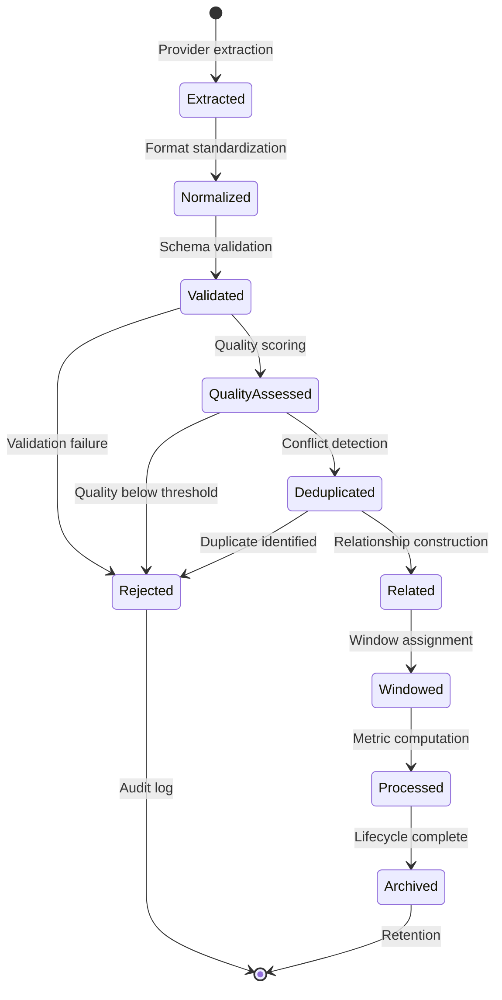

### Appendix E: Window Strategy Matrix

| Strategy | Boundaries | Duration | Use Cases | Limitations |
|----------|-----------|----------|-----------|-------------|
| Temporal | Fixed time | Fixed | Trend analysis, business cycles | May not align with activity |
| Commit | Commit count | Variable | Development phases, sample size | Irregular time periods |
| Hybrid | Time + activity | Adjustable | Balanced analysis | Complex implementation |
| Release | Release events | Variable | Release comparison | Requires release data |
| Adaptive | Data-driven | Dynamic | Irregular repositories | Reproducibility challenges |
| Streaming | Sliding time | Variable | Real-time monitoring | Statistical limitations |

### Appendix F: Migration Checklist

| Step | Description | Validation | Rollback |
|------|-------------|------------|----------|
| 1 | Mark MetricDataFrame as deprecated | Documentation | Remove deprecation |
| 2 | Introduce adapter | Unit tests | Remove adapter |
| 3 | New detectors use ObservationWindow | Integration tests | Revert detectors |
| 4 | Migrate existing detectors | Regression tests | Revert detectors |
| 5 | Remove adapter | All tests pass | Restore adapter |
| 6 | Remove MetricDataFrame | All tests pass | Restore MetricDataFrame |

### Appendix G: Architecture Validation Checklist

| Check | Method | Frequency | Owner |
|-------|--------|-----------|-------|
| Graph acyclicity | Topological sort | Every construction | Graph Builder |
| Graph completeness | Reachability analysis | Every construction | Graph Builder |
| Window completeness | Observation count | Every window | Window Builder |
| Window temporal consistency | Time range check | Every window | Window Builder |
| Metric range validation | Value check | Every computation | Metric Engine |
| Detector threshold validation | Threshold check | Every detection | Detector |
| Evidence provenance completeness | Provenance check | Every assembly | Evidence Engine |
| Confidence propagation correctness | Factor verification | Every computation | Scoring Engine |
| Quality propagation correctness | Factor verification | Every computation | Scoring Engine |
| End-to-end reproducibility | Deterministic replay | Periodic | Architecture Team |

---

*This document is the architectural constitution of the MIIE Observation Architecture V2. Every architectural decision must satisfy this specification.*
