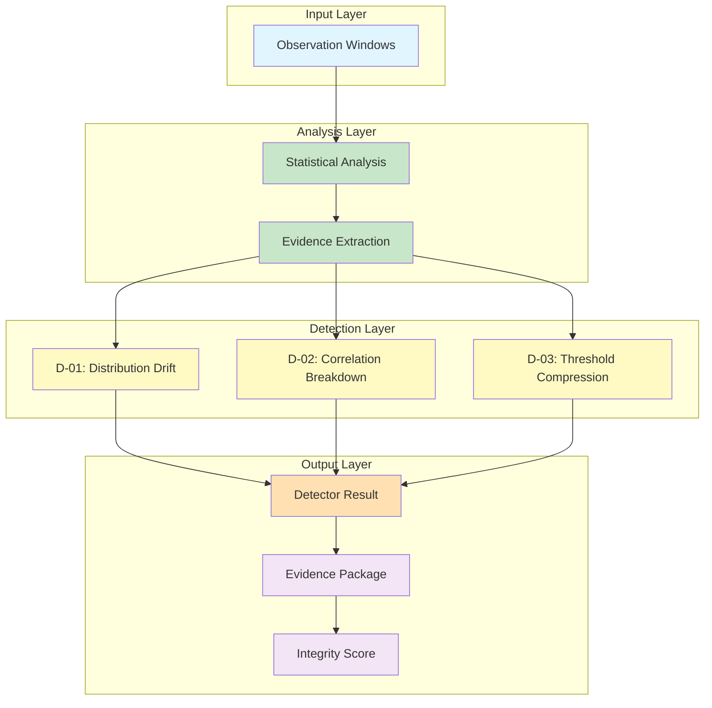
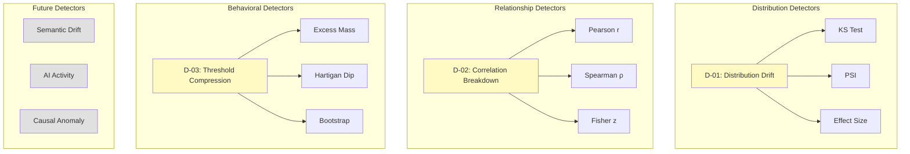
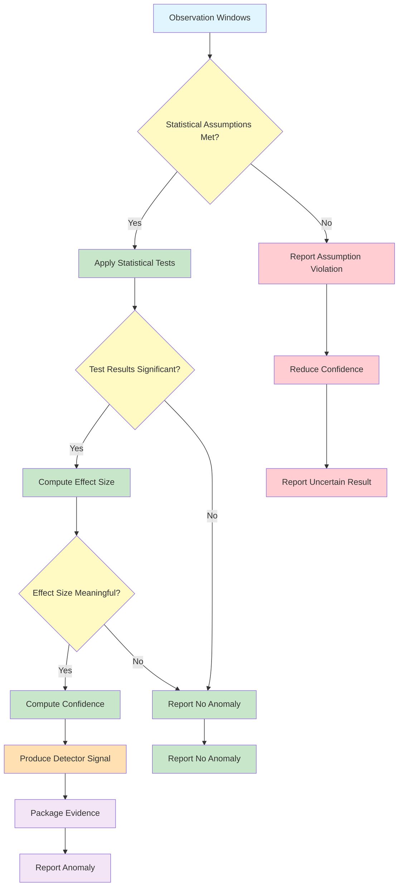

# MIIE v1.6

## 04_DETECTOR_SCIENTIFIC_SPECIFICATION.md

### Scientific Detector Framework & Measurement Integrity Detection Specification

| Field | Value |
|-------|-------|
| Document Type | Scientific Specification |
| Version | 1.6.0 |
| Status | Canonical |
| Scope | Detector Framework, Statistical Methodology, Validation Strategy, Scientific Interpretation |
| Audience | Measurement Scientists, Empirical Software Engineering Researchers, Statistical Learning Researchers |
| Last Updated | 2026-07-05 |

---

## Table of Contents

1. [Purpose of Measurement Integrity Detection](#1-purpose-of-measurement-integrity-detection)
2. [Detector Framework](#2-detector-framework)
3. [Scientific Detection Philosophy](#3-scientific-detection-philosophy)
4. [Detector Taxonomy](#4-detector-taxonomy)
5. [Common Detector Framework](#5-common-detector-framework)
6. [D-01: Distribution Drift Detector](#6-d-01-distribution-drift-detector)
7. [D-02: Correlation Breakdown Detector](#7-d-02-correlation-breakdown-detector)
8. [D-03: Threshold Compression Detector](#8-d-03-threshold-compression-detector)
9. [Detector Interaction](#9-detector-interaction)
10. [Detector Confidence](#10-detector-confidence)
11. [Detector Validation](#11-detector-validation)
12. [Detector Thresholds](#12-detector-thresholds)
13. [Detector Failure Modes](#13-detector-failure-modes)
14. [Future Detector Evolution](#14-future-detector-evolution)
15. [Threats to Validity](#15-threats-to-validity)
16. [Detector Governance](#16-detector-governance)
17. [Detector Decision Framework](#17-detector-decision-framework)
18. [Scientific Interpretation Guide](#18-scientific-interpretation-guide)
19. [Appendices](#19-appendices)

---

## 1. Purpose of Measurement Integrity Detection

### 1.1 Why Metric Values Alone Are Insufficient

A metric value — a commit count, a coverage ratio, a review latency — is a statement about a repository at a point in time. It is not a statement about the integrity of the process that produced that value. A coverage ratio of 0.85 tells us that 85% of code lines are covered by tests. It does not tell us whether this ratio reflects genuine testing thoroughness or whether tests were selectively written to inflate the metric.

Metric values are necessary but insufficient for assessing software development quality. The same metric value can arise from fundamentally different development processes:

- A commit count of 50 may represent 50 meaningful contributions or 50 trivial reformatting commits.
- A review latency of 2 hours may represent thorough, rapid review or rubber-stamp approvals.
- A coverage ratio of 0.90 may represent comprehensive testing or tests designed to cover lines without testing behaviour.

Measurement integrity detection exists to distinguish between these cases. It asks: does this metric time series behave consistently with the natural development process it claims to measure?

### 1.2 Measurement Integrity

Measurement integrity is the property that a metric time series behaves consistently with the underlying development process. An integrity violation is a deviation from this natural behaviour that suggests the metric no longer faithfully represents the underlying construct.

Integrity violations can arise from:

**Inadvertent Distortion**: Changes in development practices that unintentionally affect metric values. A team that adopts pair programming may see commit patterns change without any intent to manipulate metrics.

**Metric Gaming**: Deliberate actions to inflate metric values without improving the underlying process. Splitting commits to increase commit count, writing superficial tests to increase coverage, or fast-tracking reviews to reduce review latency.

**Process Decay**: Gradual deterioration of development practices that manifests as metric drift. Declining code review thoroughness may appear as decreasing review latency and increasing correlation between review time and code complexity.

**Tool Changes**: Changes in development tools or infrastructure that affect metric extraction. A new linter configuration may change file change patterns without any change in development behaviour.

**Data Quality Issues**: Problems with data extraction that distort metric values. API rate limits may truncate GitHub data, or git history rewriting may alter commit patterns.

### 1.3 Construct Drift

Construct drift is the phenomenon where the relationship between a metric and the construct it measures changes over time. A metric that once reliably indicated development quality may become unreliable as development practices evolve.

Construct drift is particularly insidious because it is invisible in the metric values themselves. The metric may continue to produce values within normal ranges while its relationship to the underlying construct has fundamentally changed.

Consider test coverage. In a team that writes meaningful tests, coverage correlates with testing thoroughness. In a team that writes coverage-inflating tests, coverage no longer correlates with testing thoroughness. The coverage ratio may remain high in both cases, but its meaning has changed.

Measurement integrity detection must identify construct drift — situations where the metric's relationship to the underlying construct has changed.

### 1.4 Goodhart's Law

Goodhart's Law states: "When a measure becomes a target, it ceases to be a good measure." This law describes the fundamental problem that measurement integrity detection addresses.

When teams are evaluated on metric values, they have incentive to improve metric values. This incentive may lead to genuine process improvement — writing more tests, conducting more thorough reviews, making more meaningful commits. But it may also lead to metric gaming — actions that improve metric values without improving the underlying process.

Goodhart's Law implies that any metric can be gamed. Measurement integrity detection cannot prevent gaming, but it can detect the statistical signatures of gaming and flag them for human review.

### 1.5 Metric Gaming

Metric gaming is the deliberate manipulation of metric values without corresponding improvement in the underlying process. Gaming strategies include:

**Commit Splitting**: Breaking large commits into many small commits to increase commit count and decrease apparent commit size.

**Coverage Inflation**: Writing tests that cover lines without testing behaviour, or writing trivial tests that always pass.

**Review Fast-Tracking**: Approving pull requests without thorough review to reduce review latency.

**Churn Reduction**: Making minimal changes to avoid triggering churn thresholds, even when larger changes are needed.

**Timing Manipulation**: Scheduling commits, reviews, or test runs to optimize metric values rather than development efficiency.

Each gaming strategy produces statistical signatures that distinguish it from genuine process behaviour. These signatures are the basis for detection.

### 1.6 Measurement Decay

Measurement decay is the gradual degradation of metric reliability over time. Unlike gaming, which is deliberate, decay is often unintentional and arises from:

**Practice Evolution**: Development practices change over time, altering the relationship between metrics and constructs.

**Team Changes**: Team composition changes, affecting coding, review, and testing patterns.

**Tool Evolution**: Development tools change, affecting data extraction and metric computation.

**Scale Effects**: As codebases grow, patterns that held at small scale may not hold at large scale.

Measurement decay is detectable as gradual drift in metric distributions, weakening correlations, or increasing variance without clear triggering events.

### 1.7 Measurement Reliability

Measurement reliability is the consistency of metric values across repeated measurements. A reliable metric produces similar values when measuring the same construct under similar conditions.

Reliability is threatened by:

**Observation Noise**: Random variation in extracted observations.

**Provider Inconsistency**: Different providers producing different values for the same fact.

**Window Sensitivity**: Metric values varying significantly with window boundaries.

**Temporal Instability**: Metric values varying across time periods for no substantive reason.

Measurement integrity detection must distinguish between genuine integrity violations and measurement unreliability.

### 1.8 Scientific Trustworthiness

Scientific trustworthiness is the property that MIIE's outputs are based on sound scientific methodology, not ad hoc heuristics. Trustworthiness requires:

**Methodological Rigour**: Detection methods are based on established statistical theory.

**Transparent Assumptions**: All assumptions are explicitly stated and testable.

**Reproducible Results**: Identical inputs produce identical outputs.

**Calibrated Uncertainty**: Confidence assessments reflect actual uncertainty.

**Honest Limitations**: Limitations are explicitly documented, not隐藏ed.

Measurement integrity detection is trustworthy only to the extent that its methods are scientifically grounded and its limitations are honestly acknowledged.

---

## 2. Detector Framework

### 2.1 Detector Hierarchy

The detector framework follows a hierarchical processing model:



### 2.2 Processing Stages

**Observation Windows**: Time-bounded partitions of observations. Each window contains a set of observations from a defined time period. Windows are the unit of analysis.

**Statistical Analysis**: Computation of statistical measures from observations within each window. Includes distribution parameters, correlation coefficients, and threshold metrics.

**Evidence Extraction**: Application of statistical tests to identify anomalies in the statistical measures. Each detector applies its specific methodology.

**Detector Result**: The output of a single detector — a signal indicating the presence or absence of an anomaly, with associated confidence and severity.

**Evidence Package**: The aggregation of all detector results, along with observations, metrics, and provenance, forming the complete scientific evidence for integrity assessment.

**Integrity Score**: A quantitative assessment of metric integrity, computed from the evidence package.

### 2.3 Data Flow Invariants

The detector framework maintains the following data flow invariants:

**DFI-1: Unidirectional Flow**: Data flows from observation windows to integrity score. No backward flow is permitted.

**DFI-2: Observation Immutability**: Observations are not modified during detection.

**DFI-3: Detector Independence**: Detectors operate independently on the same input. No detector's output influences another detector's analysis.

**DFI-4: Confidence Propagation**: Confidence assessments propagate from observations through detectors to the integrity score without artificial inflation.

**DFI-5: Provenance Completeness**: Every detector result carries complete provenance from source observations.

---

## 3. Scientific Detection Philosophy

### 3.1 Evidence Before Conclusion

The detector framework produces evidence, not conclusions. A detector signal is a statistical finding — an observation that a metric time series exhibits patterns consistent with an integrity violation. It is not a conclusion that an integrity violation has occurred.

This distinction is critical. Statistical tests can identify patterns that are unlikely under assumed conditions. They cannot determine whether those patterns arise from gaming, process change, tool change, or random variation. That determination requires human interpretation.

The detector framework is designed to support human decision-making, not replace it. It produces structured evidence that humans can evaluate in context.

### 3.2 Statistical Conservatism

The detector framework defaults to statistical conservatism — preferring false negatives (missing real violations) to false positives (flagging normal behaviour as violations).

This conservatism is justified by the cost asymmetry of errors:

**False Positive Cost**: A false positive wastes human time investigating a non-existent problem. It may also erode trust in the detection system.

**False Negative Cost**: A false negative allows a real violation to go undetected. This may lead to poor decisions based on unreliable metrics.

While both costs are real, the detector framework assumes that the cost of eroding trust in the system is higher than the cost of missing some violations. The framework is designed to be high-precision, even at the expense of recall.

### 3.3 No Fabricated Anomalies

The detector framework must never fabricate anomalies. Anomaly detection must be based on statistical evidence, not heuristics that produce alerts for normal variation.

Fabricated anomalies arise from:

**Overfitting**: Tuning detection parameters to match historical anomalies, producing false alarms on new data.

**Multiple Testing**: Applying many tests without correction, increasing the chance of false positives.

**Confirmation Bias**: Designing detectors that confirm pre-existing beliefs about metric gaming.

**Publication Bias**: Reporting only successful detections, ignoring false positives.

The framework guards against fabrication through conservative thresholds, multiple testing correction, and transparent reporting of all results, including false positives.

### 3.4 Explainable Detection

Every detector result must be explainable. Explainability requires:

**Statistical Basis**: The detector must identify the specific statistical test(s) that produced the result.

**Effect Size**: The detector must report the magnitude of the detected effect, not just its statistical significance.

**Confidence Level**: The detector must report its confidence in the result.

**Assumption Verification**: The detector must report whether its statistical assumptions were satisfied.

**Alternative Explanations**: The detector must acknowledge that the detected pattern may have explanations other than integrity violation.

### 3.5 Deterministic Behaviour

Given identical inputs, every detector must produce identical outputs. Determinism is required for:

**Reproducibility**: Identical results can be reproduced by independent recomputation.

**Auditability**: Results can be verified by re-running the detector.

**Debugging**: Failures can be reproduced and diagnosed.

Non-determinism arises from random sampling, parallel execution, or floating-point non-associativity. The detector framework addresses these sources through seeded randomness, sequential execution where necessary, and deterministic aggregation.

### 3.6 Transparent Assumptions

Every detector must explicitly state its statistical assumptions. Assumptions include:

**Distributional Assumptions**: The assumed distribution of the data (e.g., normal, uniform, empirical).

**Independence Assumptions**: The assumed independence structure of observations.

**Stationarity Assumptions**: The assumed stability of the data-generating process over time.

**Sample Size Assumptions**: The minimum sample sizes required for reliable inference.

**Scale Assumptions**: The assumed measurement scale (ratio, interval, ordinal).

When assumptions are violated, the detector must report the violation and its potential impact on the result.

### 3.7 Graceful Degradation

When the detector framework encounters conditions that prevent reliable analysis, it must degrade gracefully rather than produce unreliable results. Graceful degradation includes:

**Insufficient Data**: When sample sizes are too small for reliable inference, the detector reports insufficient data rather than a result based on unreliable statistics.

**Assumption Violation**: When statistical assumptions are violated, the detector reports the violation and, if possible, applies a robust alternative.

**Provider Failure**: When a provider fails to produce observations, the detector reports missing data and adjusts its analysis accordingly.

**Quality Degradation**: When observation quality is low, the detector reduces its confidence rather than producing a result with false precision.

---

## 4. Detector Taxonomy

### 4.1 Classification Dimensions

Detectors are classified along three dimensions:

**Statistical Method**: The type of statistical analysis applied.

**Detection Target**: The type of anomaly being detected.

**Evidence Model**: How evidence is accumulated and interpreted.

### 4.2 Taxonomy Diagram



### 4.3 Distribution Detectors

Distribution detectors identify changes in the statistical distribution of metric values. They ask: has the distribution of metric values changed between time periods?

D-01 (Distribution Drift) is the primary distribution detector. It uses the Kolmogorov-Smirnov test and Population Stability Index to detect changes in distribution shape, location, or spread.

### 4.4 Relationship Detectors

Relationship detectors identify changes in the statistical relationships between metrics. They ask: have the correlations between metrics changed between time periods?

D-02 (Correlation Breakdown) is the primary relationship detector. It uses Pearson correlation, Spearman rank correlation, and Fisher z-transformation to detect changes in linear and monotonic relationships.

### 4.5 Behavioral Detectors

Behavioral detectors identify changes in the statistical behaviour of metric values relative to thresholds. They ask: have metric values become compressed toward thresholds?

D-03 (Threshold Compression) is the primary behavioral detector. It uses excess mass analysis and the Hartigan dip test to detect concentration of values near thresholds.

### 4.6 Future Semantic Detectors

Semantic detectors would analyze the meaning of metric values, not just their statistical properties. They would ask: do these metric values make sense in context?

Future semantic detectors might include:

**Commit Message Analysis**: Detecting commits with messages that do not match their changes.

**Code-Test Consistency**: Detecting tests that do not meaningfully test the code they cover.

**Review Content Analysis**: Detecting reviews that do not engage with the code they approve.

### 4.7 Future Causal Detectors

Causal detectors would analyze the causal relationships between events and metric changes. They ask: what caused this metric change?

Future causal detectors might include:

**Event Attribution**: Identifying which events (merges, releases, team changes) caused metric changes.

**Intervention Detection**: Detecting deliberate interventions in metric values.

**Cascade Analysis**: Understanding how changes in one metric cause changes in others.

---

## 5. Common Detector Framework

### 5.1 Required Definitions

Every detector must define the following elements:

| Element | Description | Example |
|---------|-------------|---------|
| Purpose | What the detector looks for | Distribution changes |
| Scientific Construct | The underlying phenomenon | Distribution drift |
| Input | Data required | Observation windows |
| Output | Result produced | Detector signal |
| Assumptions | Statistical assumptions | Stationarity, independence |
| Required Observations | Minimum observation types | Metric values |
| Required Windows | Minimum window configuration | 2+ windows |
| Statistical Methods | Tests applied | KS test, PSI |
| Confidence | Confidence model | Power × significance |
| Failure Conditions | When the detector fails | Insufficient data |
| Interpretation | How to interpret results | Anomaly severity |
| Validation | How to validate | Synthetic datasets |
| Limitations | Known limitations | Small sample sensitivity |
| Future Evolution | Planned improvements | Adaptive thresholds |

### 5.2 Input Specification

Every detector receives:

**Observation Windows**: A sequence of time-bounded observation sets, ordered temporally.

**Metric Values**: The metric values computed from observations within each window.

**Configuration Parameters**: Detector-specific parameters (thresholds, window sizes, etc.).

**Baseline Statistics**: Optional historical statistics for comparison.

### 5.3 Output Specification

Every detector produces:

**Signal**: A boolean indicator of whether an anomaly was detected.

**Confidence**: A quantitative assessment of confidence in the signal.

**Severity**: A quantitative assessment of the anomaly's severity.

**Evidence**: The statistical evidence supporting the signal.

**Provenance**: The complete history of how the signal was produced.

### 5.4 Assumption Framework

Every detector must verify its assumptions before producing results. Assumption verification includes:

**Sample Size Check**: Are there enough observations for reliable inference?

**Distribution Check**: Does the data satisfy distributional assumptions?

**Independence Check**: Are observations independent?

**Stationarity Check**: Is the data-generating process stable?

When assumptions are violated, the detector must:

**Report the Violation**: Clearly state which assumptions are violated.

**Assess Impact**: Estimate how the violation affects the result.

**Apply Alternatives**: If possible, use robust alternatives that do not require the violated assumption.

**Adjust Confidence**: Reduce confidence to reflect the assumption violation.

---

## 6. D-01: Distribution Drift Detector

### 6.1 Scientific Motivation

Distribution drift is the phenomenon where the statistical distribution of metric values changes over time. A metric that was normally distributed with mean 0.7 and standard deviation 0.1 may shift to mean 0.8 with standard deviation 0.15. This shift may indicate a genuine change in the underlying process, or it may indicate metric manipulation.

Distribution drift is the most general form of integrity violation. Any change in metric behaviour — mean shift, variance change, skewness change, modality change — will manifest as distribution drift. D-01 is designed to detect all forms of distribution change.

### 6.2 Construct Measured

D-01 measures distribution drift — the degree to which the distribution of metric values in one time period differs from the distribution in another time period.

Distribution drift is a proxy for process change. When the distribution of metric values changes, the process that generated those values has likely changed. This change may be:

**Benign**: A genuine improvement or deterioration in the process.

**Neutral**: A change in tools or practices that does not affect quality.

**Malign**: Deliberate manipulation of metric values.

D-01 cannot distinguish between these causes. It can only detect that a change has occurred and quantify its magnitude.

### 6.3 Mathematical Formulation

D-01 uses two complementary statistical methods:

**Kolmogorov-Smirnov (KS) Test**: A non-parametric test that measures the maximum distance between two empirical cumulative distribution functions (ECDFs).

Given two samples X = {x₁, x₂, ..., xₘ} and Y = {y₁, y₂, ..., yₙ}, the KS statistic is:

```
D_KS = sup_x |F_X(x) - F_Y(x)|
```

Where F_X and F_Y are the empirical CDFs of X and Y.

The KS test is sensitive to any difference in distribution — location, scale, or shape. It makes no assumptions about the form of the distributions.

**Population Stability Index (PSI)**: A measure of how much a distribution has shifted. PSI divides the range of values into bins and compares the proportion of observations in each bin between two samples.

Given two distributions P and Q with bins b₁, b₂, ..., bₖ:

```
PSI = Σᵢ (pᵢ - qᵢ) × ln(pᵢ / qᵢ)
```

Where pᵢ is the proportion of observations in bin i for distribution P, and qᵢ is the proportion for distribution Q.

PSI is always non-negative. A PSI of 0 indicates identical distributions. Larger PSI values indicate greater distribution difference.

### 6.4 KS Test Properties

**Sensitivity**: The KS test is sensitive to any difference in distribution, including location, scale, and shape differences.

**Power**: The power of the KS test increases with sample size. For small samples, the KS test may lack power to detect real differences.

**Non-parametric**: The KS test makes no assumptions about the form of the distributions. It is valid for any continuous distribution.

**Two-sided**: The KS test detects differences in both directions — it does not assume a direction of change.

**Limitations**: The KS test is most sensitive to differences in the center of the distribution and less sensitive to differences in the tails.

### 6.5 PSI Properties

**Interpretability**: PSI values have conventional interpretation thresholds.

**Binning**: PSI requires binning continuous data, which introduces discretization error.

**Sensitivity**: PSI is sensitive to differences in bin proportions, which may not capture all distributional differences.

**Non-negative**: PSI is always ≥ 0, making interpretation straightforward.

**Asymmetry**: PSI is not symmetric — PSI(P, Q) ≠ PSI(Q, P) in general.

### 6.6 Effect Size

Statistical significance alone is insufficient. D-01 also reports effect size:

**KS Effect Size**: The KS statistic D_KS itself is an effect size measure, ranging from 0 (identical distributions) to 1 (completely different distributions).

**PSI Effect Size**: The PSI value is an effect size measure, with conventional thresholds:
- PSI < 0.10: No significant change
- 0.10 ≤ PSI < 0.25: Moderate change
- PSI ≥ 0.25: Significant change

**Cohen's d**: For location shifts, D-01 may also report Cohen's d:

```
d = (μ₁ - μ₂) / σ_pooled
```

Where σ_pooled is the pooled standard deviation.

### 6.7 Window Assumptions

D-01 requires:

**Minimum Windows**: At least 2 windows for comparison.

**Temporal Ordering**: Windows must be ordered chronologically.

**Sufficient Observations**: Each window must contain enough observations for reliable KS test and PSI computation.

**Representative Sampling**: Observations within each window must be representative of the metric's behaviour during that period.

### 6.8 Sample Assumptions

D-01 assumes:

**Continuous Data**: Metric values are continuous (or treated as continuous for binning).

**Independent Observations**: Observations within each window are independent.

**Stationarity Within Windows**: The metric's distribution is stable within each window.

**Adequate Sample Size**: Each window contains at least 20 observations for reliable KS test results.

### 6.9 Decision Rules

D-01 applies the following decision rules:

**No Anomaly**: KS p-value > 0.05 AND PSI < 0.10.

**Weak Anomaly**: KS p-value ≤ 0.05 OR 0.10 ≤ PSI < 0.25.

**Moderate Anomaly**: KS p-value ≤ 0.01 AND 0.10 ≤ PSI < 0.25.

**Strong Anomaly**: KS p-value ≤ 0.001 AND PSI ≥ 0.25.

The AND/OR logic reflects the principle that statistical significance alone is insufficient — effect size must also be meaningful.

### 6.10 Interpretation

**No Anomaly**: The distribution of metric values has not changed significantly. The metric is behaving consistently with its historical pattern.

**Weak Anomaly**: The distribution shows some change, but the change may be within normal variation. Human review is recommended.

**Moderate Anomaly**: The distribution has changed meaningfully. Human investigation is recommended to determine the cause.

**Strong Anomaly**: The distribution has changed substantially. Immediate investigation is recommended.

### 6.11 False Positives

D-01 may produce false positives when:

**Normal Variation**: The metric's distribution naturally varies across time periods.

**Seasonal Patterns**: The metric exhibits seasonal patterns that are not integrity violations.

**Small Samples**: Small sample sizes increase the variance of the KS statistic and PSI.

**Multiple Testing**: Comparing many time periods increases the chance of finding spurious differences.

D-01 mitigates false positives through conservative thresholds and multiple testing correction.

### 6.12 False Negatives

D-01 may produce false negatives when:

**Small Effects**: The distribution change is too small to detect with available sample sizes.

**Tail Changes**: The distribution change occurs primarily in the tails, where the KS test has less power.

**Discrete Metrics**: Metric values are discrete, reducing the resolution of the KS test.

**Non-stationary Baseline**: The baseline distribution is not stationary, making comparison unreliable.

### 6.13 Limitations

D-01 has the following limitations:

**Binning Sensitivity**: PSI results depend on binning strategy. Different binning may produce different results.

**Sample Size Requirements**: Reliable results require at least 20 observations per window.

**Temporal Resolution**: D-01 compares distributions across windows, not within windows. It cannot detect changes that occur within a single window.

**Causal Inference**: D-01 detects distribution changes but cannot determine their cause.

**Multiple Comparisons**: Comparing many windows requires multiple testing correction, reducing power.

### 6.14 Future Improvements

Future improvements to D-01 may include:

**Adaptive Binning**: Automatically selecting optimal bin count based on sample size.

**Weighted PSI**: Giving more weight to bins with more observations.

**Multi-scale Analysis**: Applying the KS test at multiple time scales simultaneously.

**Bayesian KS**: Computing posterior probabilities for distribution differences.

**Effect Size Confidence Intervals**: Reporting confidence intervals for effect size measures.

---

## 7. D-02: Correlation Breakdown Detector

### 7.1 Scientific Motivation

Metrics do not exist in isolation. They are related through the underlying development processes they measure. Code churn and review latency are related because larger changes take longer to review. Commit count and file change count are related because more commits typically involve more files.

These relationships are expected and natural. When they change — when correlations weaken, strengthen, or reverse — something has changed in the underlying process. Correlation breakdown detects these changes.

### 7.2 Correlation Theory

Correlation measures the statistical relationship between two variables. MIIE uses two correlation measures:

**Pearson Correlation (r)**: Measures linear association between two continuous variables.

```
r = Σᵢ(xᵢ - x̄)(yᵢ - ȳ) / √[Σᵢ(xᵢ - x̄)² × Σᵢ(yᵢ - ȳ)²]
```

Pearson r ranges from -1 (perfect negative linear association) to +1 (perfect positive linear association), with 0 indicating no linear association.

**Spearman Rank Correlation (ρ)**: Measures monotonic association between two variables, using ranks rather than values.

```
ρ = 1 - 6Σᵢdᵢ² / n(n² - 1)
```

Where dᵢ is the difference in ranks for observation i.

Spearman ρ is more robust to outliers and non-linear monotonic relationships than Pearson r.

### 7.3 Fisher z-Transformation

To compare correlation coefficients across time periods, D-02 uses Fisher's z-transformation:

```
z = 0.5 × ln[(1 + r) / (1 - r)]
```

Fisher z-transformed correlations are approximately normally distributed, enabling standard statistical inference.

The difference between two Fisher z-transformed correlations is:

```
z_diff = z₁ - z₂
```

With standard error:

```
SE = √[1/(n₁ - 3) + 1/(n₂ - 3)]
```

The test statistic is:

```
z_stat = z_diff / SE
```

Which is approximately standard normal under the null hypothesis of equal correlations.

### 7.4 Breakdown Categories

D-02 identifies four categories of correlation breakdown:

**Weakening**: The correlation has decreased in magnitude. Two metrics that were strongly correlated are now weakly correlated. This may indicate that the processes driving these metrics have diverged.

**Strengthening**: The correlation has increased in magnitude. Two metrics that were weakly correlated are now strongly correlated. This may indicate that the processes driving these metrics have converged.

**Reversal**: The correlation has changed sign. Two metrics that were positively correlated are now negatively correlated, or vice versa. This is the strongest form of breakdown and may indicate a fundamental process change.

**Emergence**: A correlation has appeared where none existed before. Two metrics that were uncorrelated are now correlated. This may indicate a new process relationship.

### 7.5 Interpretation

**No Breakdown**: Correlations have not changed significantly. The relationships between metrics are consistent.

**Weakening**: Metric relationships have weakened. The processes driving these metrics may be diverging, or one metric may be becoming unreliable.

**Strengthening**: Metric relationships have strengthened. The processes driving these metrics may be converging, or new dependencies may have emerged.

**Reversal**: Metric relationships have reversed. This is a strong signal that something fundamental has changed in the development process.

**Emergence**: New metric relationships have appeared. A new process relationship may have developed.

### 7.6 Assumptions

D-02 assumes:

**Bivariate Normality**: For Pearson correlation, the two variables are jointly approximately normal. This assumption is checked via marginal normality tests.

**Independent Observations**: Observations within each window are independent.

**Continuous Variables**: The variables are continuous (or treated as continuous).

**Adequate Sample Size**: Each window contains at least 10 observations for reliable correlation estimation.

**No Outliers**: Extreme outliers can distort Pearson correlation. Spearman correlation is more robust.

### 7.7 Failure Modes

D-02 may fail when:

**Small Samples**: Correlation estimates are unreliable with small samples.

**Non-monotonic Relationships**: The relationship between metrics is non-monotonic (e.g., U-shaped), which neither Pearson nor Spearman can capture.

**Outliers**: Extreme outliers can dominate Pearson correlation.

**Heteroscedasticity**: Non-constant variance can distort correlation estimates.

**Non-stationarity**: The correlation may be non-stationary within a window, making window-level estimates unreliable.

### 7.8 Validation

D-02 is validated through:

**Synthetic Data**: Generating data with known correlations and verifying detection.

**Perturbation Analysis**: Systematically varying correlation strength and verifying detection thresholds.

**Real Repositories**: Applying D-02 to real repositories and manually reviewing detected anomalies.

**Cross-validation**: Comparing D-02 results across different time periods and window sizes.

### 7.9 Future Evolution

Future improvements to D-02 may include:

**Partial Correlation**: Controlling for confounding variables when measuring correlations.

**Non-linear Correlation**: Using mutual information or distance correlation for non-linear relationships.

**Time-varying Correlation**: Estimating how correlations change within windows.

**Multivariate Correlation**: Extending from bivariate to multivariate correlation analysis.

**Causal Correlation**: Distinguishing causal relationships from spurious correlations.

---

## 8. D-03: Threshold Compression Detector

### 8.1 Scientific Motivation

When metrics are used as targets, people optimize metric values relative to thresholds. A team told to maintain 80% test coverage will write tests until coverage reaches 80%, then stop. A team told to keep review latency under 4 hours will fast-track reviews to stay under 4 hours.

This threshold-seeking behaviour produces a distinctive statistical signature: an unusual concentration of metric values just above (or below) the threshold. The natural distribution of metric values would be smooth, but threshold gaming creates a spike near the threshold.

D-03 detects this threshold compression — the concentration of metric values near thresholds that would not occur naturally.

### 8.2 Threshold Gaming

Threshold gaming is a specific form of metric gaming where behaviour is optimized to meet or exceed a threshold, rather than to improve the underlying process.

Threshold gaming is particularly insidious because:

**It produces acceptable metric values**: The threshold is met, so the metric appears healthy.

**It hides process problems**: The underlying process may be deteriorating, but the metric does not reflect this.

**It is rational behaviour**: Given incentive structures that reward threshold achievement, gaming is a rational response.

**It is difficult to detect directly**: The metric values themselves are within acceptable ranges.

D-03 detects threshold gaming indirectly, by identifying the statistical signature it produces.

### 8.3 Behavioral Interpretation

Threshold compression reflects a change in human behaviour in response to metric targets. When people know that a metric is being monitored and that there are consequences for falling below a threshold, they adjust their behaviour to stay above the threshold.

This behavioural change can be:

**Conscious**: Deliberate actions to inflate metric values (e.g., writing coverage-inflating tests).

**Unconscious**: Gradual adjustment of practices to optimize metric values (e.g., unconsciously splitting commits to keep commit sizes small).

**Systemic**: Changes in processes or tools that systematically produce metric values near thresholds (e.g., automated test generation that targets coverage thresholds).

D-03 detects all forms of threshold compression, regardless of whether they arise from conscious, unconscious, or systemic causes.

### 8.4 Excess Mass

Excess mass is a statistical measure of how much probability mass is concentrated in a region of the distribution, relative to what would be expected under a smooth null hypothesis.

Given a distribution f(x) and a threshold t, the excess mass in a region [a, b] containing t is:

```
EM = ∫ₐᵇ [f(x) - g(x)] dx
```

Where g(x) is the null distribution (typically a smooth approximation of f(x)).

A positive excess mass indicates that more observations are concentrated in the region than expected under the null. This concentration is the signature of threshold gaming.

D-03 computes excess mass in a window around each detected threshold and tests whether the excess mass is significantly greater than zero.

### 8.5 Hartigan Dip Test

The Hartigan dip test measures the departure of a distribution from unimodality. A unimodal distribution has a single peak. A distribution with threshold compression may be bimodal — one mode at the natural centre and another near the threshold.

The dip statistic is:

```
D = sup_x |F_n(x) - G(x)|
```

Where F_n is the empirical CDF and G is the nearest unimodal distribution to F_n.

A large dip statistic indicates significant departure from unimodality, suggesting the presence of a secondary mode — potentially caused by threshold compression.

The Hartigan dip test is particularly useful because it does not require specifying where the threshold is. It detects any departure from unimodality, which may be caused by threshold compression or other distributional anomalies.

### 8.6 Bootstrap

D-03 uses bootstrap resampling to assess the significance of detected threshold compression. The bootstrap procedure:

1. Compute the test statistic (excess mass or dip) on the original data.
2. Resample the data with replacement many times (e.g., 1000 times).
3. Compute the test statistic on each resample.
4. Compare the original statistic to the bootstrap distribution.

The bootstrap p-value is the proportion of bootstrap statistics that exceed the original statistic. A small p-value indicates that the observed threshold compression is unlikely under the null hypothesis of no compression.

Bootstrap methods are particularly useful when:

**Distribution is Unknown**: The theoretical distribution of the test statistic is unknown or complex.

**Sample Size is Small**: Asymptotic approximations may not be accurate.

**Assumptions are Violated**: Bootstrap methods are more robust to assumption violations than parametric tests.

### 8.7 Threshold Discovery

D-03 discovers thresholds automatically, rather than requiring them to be specified in advance. Threshold discovery works by:

1. Computing the kernel density estimate of the metric distribution.
2. Identifying local maxima (modes) in the density estimate.
3. Identifying local minima (anti-modes) between modes.
4. Testing whether the concentration near each mode is significantly greater than expected.

This automatic discovery allows D-03 to detect threshold gaming at any threshold, not just pre-specified ones.

### 8.8 Cause Inference

D-03 can detect threshold compression but cannot determine its cause. Possible causes include:

**Deliberate Gaming**: People consciously inflating metric values.

**Process Naturalness**: The development process naturally produces values near the threshold.

**Tool Effects**: Development tools systematically produce values near the threshold.

**Threshold Selection**: The threshold was set at a value that naturally attracts metric values.

D-03 reports the presence of threshold compression and its statistical significance, but does not infer the cause.

### 8.9 Scientific Assumptions

D-03 assumes:

**Unimodal Null**: Under the null hypothesis (no gaming), the metric distribution is unimodal.

**Continuous Data**: Metric values are continuous (or treated as continuous).

**Independent Observations**: Observations within each window are independent.

**Adequate Sample Size**: At least 30 observations are required for reliable density estimation and bootstrap.

**Smooth Density**: The metric distribution has a smooth density function (not discrete or heavily clustered).

### 8.10 Validation

D-03 is validated through:

**Synthetic Gaming Data**: Generating data with artificial threshold compression and verifying detection.

**Natural Thresholds**: Identifying thresholds in real data and verifying that D-03 does not flag natural concentrations.

**Null Distributions**: Generating data from known unimodal distributions and verifying that D-03 does not produce false positives.

**Cross-validation**: Comparing D-03 results across different window sizes and bandwidth parameters.

### 8.11 Future Improvements

Future improvements to D-03 may include:

**Adaptive Bandwidth**: Automatically selecting optimal bandwidth for density estimation.

**Multi-threshold Detection**: Simultaneously detecting compression at multiple thresholds.

**Threshold Severity**: Quantifying how extreme the compression is relative to the natural distribution.

**Temporal Analysis**: Tracking how threshold compression evolves over time.

**Contextual Thresholds**: Incorporating domain knowledge about expected threshold locations.

---

## 9. Detector Interaction

### 9.1 Complementarity

The three detectors are complementary — each detects a different type of anomaly, and their combined coverage is greater than any individual detector.

**D-01 (Distribution Drift)** detects changes in the overall distribution of metric values. It is sensitive to mean shifts, variance changes, and shape changes.

**D-02 (Correlation Breakdown)** detects changes in the relationships between metrics. It is sensitive to weakening, strengthening, and reversal of correlations.

**D-03 (Threshold Compression)** detects concentration of values near thresholds. It is sensitive to threshold-seeking behaviour.

A metric that is being gamed may exhibit all three types of anomalies simultaneously: the distribution shifts (D-01), correlations with other metrics weaken (D-02), and values concentrate near the threshold (D-03).

### 9.2 Agreement

When multiple detectors agree, confidence in the finding increases. Agreement can be:

**Full Agreement**: All detectors flag the same time period as anomalous. This is strong evidence of an integrity violation.

**Partial Agreement**: Two detectors agree, but the third does not. This is moderate evidence, requiring human interpretation.

**No Agreement**: Only one detector flags an anomaly. This is weak evidence, likely requiring additional investigation.

### 9.3 Disagreement

Detector disagreement is informative. When detectors disagree, it may indicate:

**Different Anomaly Types**: The anomaly is of a type that only some detectors can detect.

**Borderline Case**: The anomaly is near detection thresholds, producing inconsistent results.

**False Positive**: One or more detectors has produced a false positive.

**Assumption Violation**: One or more detectors' assumptions are violated, producing unreliable results.

Disagreement does not invalidate findings. It provides context for interpretation.

### 9.4 Combined Evidence

The evidence engine combines detector results using the following principles:

**Weighted Combination**: Each detector's contribution is weighted by its confidence.

**Conservative Aggregation**: Combined evidence is at most as strong as the strongest individual evidence.

**Provenance Tracking**: The contribution of each detector to the combined evidence is recorded.

### 9.5 Orthogonality

The three detectors are approximately orthogonal — they detect largely independent types of anomalies. This orthogonality means:

**Minimal Redundancy**: Each detector provides unique information.

**Full Coverage**: Together, the detectors cover a wide range of anomaly types.

**Efficient Detection**: No detector is redundant, so computational resources are not wasted.

### 9.6 Redundancy

Despite their orthogonality, the detectors have some redundancy. A severe integrity violation will likely trigger all three detectors. This redundancy is intentional — it provides validation and increases confidence in findings.

---

## 10. Detector Confidence

### 10.1 Confidence Definition

Detector confidence is a quantitative assessment of how likely the detector's finding is to be correct. Confidence is not a probability that an anomaly exists — it is a probability that the detector's statistical test has correctly identified an anomaly.

Confidence is computed from:

**Statistical Power**: The probability that the test detects an anomaly when one exists. Power depends on effect size, sample size, and significance level.

**Significance Level**: The probability of a false positive. Lower significance levels increase confidence but reduce power.

**Effect Size**: The magnitude of the detected anomaly. Larger effects are detected with higher confidence.

**Assumption Satisfaction**: The degree to which the test's assumptions are satisfied. Violated assumptions reduce confidence.

### 10.2 Confidence Propagation

Detector confidence propagates through the evidence and scoring systems:

**Evidence Confidence**: The confidence of the evidence package is the minimum confidence across all detectors.

**Score Confidence**: The confidence of the integrity score is the confidence of the evidence package, adjusted for the scoring model's uncertainty.

Confidence propagation ensures that uncertainty is never hidden or lost. The final integrity score carries a confidence that reflects the entire analytical pipeline.

### 10.3 Severity Assessment

Severity measures the practical significance of a detected anomaly, independent of its statistical significance.

Severity is computed from:

**Effect Size**: Larger effects have higher severity.

**Metric Importance**: Metrics that are more important for decision-making have higher severity weight.

**Duration**: Anomalies that persist across multiple windows have higher severity.

**Impact Scope**: Anomalies that affect multiple metrics have higher severity.

### 10.4 Uncertainty Quantification

Every detector result includes uncertainty quantification:

**Confidence Interval**: The range within which the true effect size lies with specified probability.

**P-value**: The probability of observing the detected effect (or larger) under the null hypothesis.

**Power**: The probability of detecting the effect given its true size.

**Bootstrap Distribution**: The distribution of the test statistic under resampling.

### 10.5 Coverage Assessment

Coverage assessment evaluates whether the detector's analysis covers the full range of possible anomalies:

**Temporal Coverage**: Does the analysis cover the full time period of interest?

**Metric Coverage**: Does the analysis cover all relevant metrics?

**Detector Coverage**: Do all three detectors contribute to the analysis?

**Assumption Coverage**: Are all assumptions verified?

Gaps in coverage reduce the overall confidence in the analysis.

### 10.6 Quality Assessment

Quality assessment evaluates the reliability of the detector's input data:

**Observation Quality**: The quality of the observations used in the analysis.

**Window Quality**: The quality of the observation windows.

**Sample Size Quality**: Whether sample sizes are adequate for reliable inference.

**Provider Quality**: The reliability of the providers that produced the observations.

Low input quality reduces detector confidence proportionally.

---

## 11. Detector Validation

### 11.1 Validation Strategy

Detector validation is performed at three levels:

**Unit Validation**: Verifying that each detector correctly implements its statistical methodology.

**Integration Validation**: Verifying that detectors produce correct results when applied to observation windows.

**Scientific Validation**: Verifying that detectors produce meaningful results on real and synthetic data.

### 11.2 D-01 Validation

**Synthetic Datasets**:

| Dataset | Description | Expected Result |
|---------|-------------|-----------------|
| Identical distributions | Two samples from the same distribution | No anomaly |
| Location shift | Two samples with different means | Anomaly detected |
| Scale change | Two samples with different variances | Anomaly detected |
| Shape change | Two samples with different skewness | Anomaly detected |
| Small overlap | Two samples with minimal overlap | Strong anomaly |

**Known Anomaly Datasets**:

| Dataset | Description | Expected Result |
|---------|-------------|-----------------|
| Gaming simulation | Artificially inflated metric values | Anomaly detected |
| Natural variation | Normal process variation | No anomaly |
| Seasonal pattern | Regular seasonal fluctuations | No anomaly (with appropriate windowing) |

**Healthy Repositories**:

| Repository | Description | Expected Result |
|------------|-------------|-----------------|
| Active open source | Well-maintained open source project | No anomaly |
| Small project | Small, well-managed project | No anomaly |
| Large enterprise | Large, established enterprise project | No anomaly |

### 11.3 D-02 Validation

**Synthetic Datasets**:

| Dataset | Description | Expected Result |
|---------|-------------|-----------------|
| Strong positive correlation | Two highly correlated variables | No anomaly |
| Weakening correlation | Correlation decreases over time | Anomaly detected |
| Reversal | Positive correlation becomes negative | Strong anomaly |
| No correlation | Two independent variables | No anomaly |

**Known Anomaly Datasets**:

| Dataset | Description | Expected Result |
|---------|-------------|-----------------|
| Decoupled metrics | Metrics that were correlated become independent | Anomaly detected |
| Natural decoupling | Metrics that naturally diverge | No anomaly |

### 11.4 D-03 Validation

**Synthetic Datasets**:

| Dataset | Description | Expected Result |
|---------|-------------|-----------------|
| Unimodal distribution | Single-peaked distribution | No anomaly |
| Threshold compression | Artificial concentration near threshold | Anomaly detected |
| Bimodal distribution | Two distinct modes | Anomaly detected |

**Known Anomaly Datasets**:

| Dataset | Description | Expected Result |
|---------|-------------|-----------------|
| Coverage gaming | Tests written to inflate coverage | Anomaly detected |
| Natural threshold | Metrics that naturally cluster near a value | No anomaly |

### 11.5 Acceptance Criteria

Each detector must satisfy:

**Type I Error Rate**: False positive rate ≤ 0.05 for nominal significance level 0.05.

**Type II Error Rate**: False negative rate ≤ 0.20 for medium effect sizes (d ≥ 0.5).

**Statistical Power**: Power ≥ 0.80 for medium effect sizes at sample size 30.

**Reproducibility**: Identical inputs produce identical outputs.

**Assumption Verification**: Assumptions are checked and reported.

---

## 12. Detector Thresholds

### 12.1 Threshold Documentation

Every detector threshold is documented with:

**Value**: The numerical threshold value.

**Rationale**: Why this value was chosen.

**Derivation**: How the value was derived (theoretical, empirical, or conventional).

**Assumptions**: What conditions must hold for the threshold to be valid.

**Sensitivity**: How sensitive the detector is to this threshold.

### 12.2 D-01 Thresholds

| Threshold | Value | Rationale | Derivation |
|-----------|-------|-----------|------------|
| KS significance level | 0.05 | Standard statistical convention | Conventional |
| PSI no change | < 0.10 | Industry standard | Empirical |
| PSI moderate change | 0.10–0.25 | Industry standard | Empirical |
| PSI significant change | ≥ 0.25 | Industry standard | Empirical |
| Minimum sample size | 20 | Minimum for reliable KS test | Theoretical |

### 12.3 D-02 Thresholds

| Threshold | Value | Rationale | Derivation |
|-----------|-------|-----------|------------|
| Correlation significance level | 0.05 | Standard statistical convention | Conventional |
| Minimum sample size | 10 | Minimum for reliable correlation | Theoretical |
| Weakening threshold | Δr > 0.3 | Moderate effect size | Empirical |
| Reversal threshold | Sign change with |r| > 0.2 | Meaningful relationship change | Empirical |
| Emergence threshold | |r| > 0.3 from |r| < 0.1 | New meaningful relationship | Empirical |

### 12.4 D-03 Thresholds

| Threshold | Value | Rationale | Derivation |
|-----------|-------|-----------|------------|
| Bootstrap significance level | 0.05 | Standard statistical convention | Conventional |
| Minimum sample size | 30 | Minimum for reliable density estimation | Theoretical |
| Excess mass significance | p < 0.05 | Standard statistical convention | Conventional |
| Dip test significance | p < 0.05 | Standard statistical convention | Conventional |

### 12.5 Statistical vs. Practical Significance

Statistical significance (p-value) and practical significance (effect size) are distinct:

**Statistical Significance**: The probability of observing the effect under the null hypothesis. Depends on sample size — large samples can make trivial effects statistically significant.

**Practical Significance**: The magnitude of the effect and its real-world importance. Independent of sample size.

D-01 and D-02 report both statistical significance and effect size. Anomaly classification requires both: a statistically significant effect with a trivial effect size may not warrant investigation.

### 12.6 Future Adaptive Thresholds

Future detectors may use adaptive thresholds that adjust based on:

**Repository Size**: Larger repositories may require different thresholds.

**Metric Type**: Different metrics may require different thresholds.

**Historical Pattern**: Repositories with stable histories may warrant tighter thresholds.

**Domain**: Different software domains may have different natural variation.

Adaptive thresholds would improve detection quality but add complexity and reduce reproducibility.

---

## 13. Detector Failure Modes

### 13.1 Small Samples

When sample sizes are small, detectors may:

**D-01**: Produce unreliable KS test results. The KS test has low power with small samples, increasing false negative rates.

**D-02**: Produce unreliable correlation estimates. Correlation estimates are highly variable with small samples.

**D-03**: Produce unreliable density estimates. Density estimation requires adequate samples for smoothness.

**Response**: Detectors report insufficient sample sizes and reduce confidence proportionally.

### 13.2 Missing Observations

When observations are missing, detectors may:

**D-01**: Compare distributions based on incomplete data, potentially missing important differences.

**D-02**: Compute correlations based on reduced samples, potentially missing relationship changes.

**D-03**: Estimate density based on incomplete data, potentially missing threshold compression.

**Response**: Detectors report missing observations and adjust confidence based on completeness.

### 13.3 Poor Quality Observations

When observation quality is low, detectors may:

**D-01**: Detect noise rather than signal, producing false positives.

**D-02**: Detect spurious correlations, producing false positives.

**D-03**: Detect artificial threshold compression, producing false positives.

**Response**: Detectors reduce confidence based on observation quality scores.

### 13.4 Window Imbalance

When windows have very different sizes or compositions, detectors may:

**D-01**: Compare distributions with different statistical properties, reducing test power.

**D-02**: Compute correlations based on different sample sizes, reducing comparability.

**D-03**: Estimate density with different resolution, reducing comparability.

**Response**: Detectors report window imbalance and may request window rebalancing.

### 13.5 Provider Failures

When providers fail, detectors may:

**D-01**: Lack observations from failed providers, reducing coverage.

**D-02**: Lack observations needed for correlation computation.

**D-03**: Lack observations needed for density estimation.

**Response**: Detectors report provider failures and reduce confidence based on provider coverage.

### 13.6 Distribution Assumptions

When distributional assumptions are violated, detectors may:

**D-01**: The KS test assumes continuous distributions. Discrete metrics may produce unreliable results.

**D-02**: Pearson correlation assumes bivariate normality. Non-normal data may produce misleading results.

**D-03**: Density estimation assumes smooth distributions. Discrete or heavily clustered data may produce unreliable results.

**Response**: Detectors check assumptions and apply robust alternatives where possible.

---

## 14. Future Detector Evolution

### 14.1 Semantic Drift Detection

Semantic drift detection would analyze the meaning of metric values, not just their statistical properties.

**Approach**: Natural language processing of commit messages, code changes, and review comments to assess whether metric values make sense in context.

**Example**: A coverage ratio of 0.95 achieved by writing tests that always pass would be detected as semantically empty, even though it is statistically normal.

**Challenges**: Natural language processing is imprecise and requires domain knowledge.

### 14.2 AI-Generated Activity Detection

AI-generated activity detection would identify contributions that appear to be generated by AI tools.

**Approach**: Analysis of code patterns, commit messages, and review content to detect AI-generated artifacts.

**Example**: Code that follows patterns typical of AI generation (uniform style, excessive comments, formulaic structure) would be flagged.

**Challenges**: AI generation is rapidly evolving, making pattern detection difficult.

### 14.3 Causal Anomaly Detection

Causal anomaly detection would identify anomalies by their causes, not just their statistical properties.

**Approach**: Causal inference methods to determine whether observed anomalies are caused by deliberate manipulation, process changes, or tool changes.

**Example**: A correlation breakdown caused by a new linter configuration would be distinguished from one caused by declining code review quality.

**Challenges**: Causal inference requires strong assumptions and may not be possible in all cases.

### 14.4 Bayesian Detectors

Bayesian detectors would incorporate prior knowledge about metric behaviour into detection.

**Approach**: Bayesian hypothesis testing with informative priors based on historical data.

**Example**: A detector might assign higher prior probability to anomalies in repositories with known gaming history.

**Challenges**: Prior specification is subjective and may introduce bias.

### 14.5 Graph-Based Detectors

Graph-based detectors would analyze the observation graph structure to detect anomalies.

**Approach**: Graph analytics to detect unusual patterns in observation relationships.

**Example**: An observation graph with unusual connectivity patterns might indicate data fabrication.

**Challenges**: Graph analytics are computationally expensive and may not scale.

### 14.6 Multivariate Detectors

Multivariate detectors would analyze multiple metrics simultaneously, rather than pairwise.

**Approach**: Multivariate statistical methods (PCA, factor analysis, MANOVA) to detect anomalies in metric spaces.

**Example**: A metric vector that falls outside the expected multivariate distribution would be flagged.

**Challenges**: Multivariate methods are complex and may be difficult to interpret.

### 14.7 Change-Point Detection

Change-point detection would identify the exact time at which metric behaviour changed.

**Approach**: Sequential analysis methods (CUSUM, BOCPD) to detect change points in metric time series.

**Example**: A sudden shift in commit entropy ratio at a specific commit would be identified.

**Challenges**: Change-point detection is sensitive to noise and may produce false alarms.

---

## 15. Threats to Validity

### 15.1 Construct Validity

**Threat**: Detectors may not measure what they claim to measure.

**Mitigation**: Each detector's construct is explicitly defined and validated against synthetic data.

**Example**: D-01 measures distribution drift, but distribution drift may not always indicate integrity violation.

### 15.2 Internal Validity

**Threat**: Confounding variables may explain detected anomalies.

**Mitigation**: Detectors report potential confounders and uncertainty about causation.

**Example**: A correlation breakdown may be caused by a tool change, not a process change.

### 15.3 External Validity

**Threat**: Results may not generalize to other repositories or domains.

**Mitigation**: Detectors are validated on diverse repositories and their limitations are documented.

**Example**: Thresholds calibrated on open-source projects may not apply to enterprise projects.

### 15.4 Conclusion Validity

**Threat**: Statistical methods may produce unreliable conclusions.

**Mitigation**: Conservative thresholds, multiple testing correction, and effect size reporting.

**Example**: A statistically significant result may not be practically significant.

### 15.5 Sampling Bias

**Threat**: The sample of repositories used for validation may not be representative.

**Mitigation**: Validation on diverse repositories, including different sizes, domains, and activity levels.

**Example**: Validators using only active open-source projects may miss issues in enterprise repositories.

### 15.6 Repository Bias

**Threat**: Detectors may perform differently on different types of repositories.

**Mitigation**: Detectors are validated on repositories of different sizes, domains, and maturity levels.

**Example**: Detectors calibrated on small projects may not perform well on large monorepos.

### 15.7 Provider Bias

**Threat**: Provider-specific issues may bias detector results.

**Mitigation**: Detectors are validated across multiple providers and provider failures are reported.

**Example**: GitHub API limitations may produce incomplete data that biases detection.

### 15.8 Window Bias

**Threat**: Window construction choices may bias detector results.

**Mitigation**: Detectors are validated across multiple windowing strategies and window sensitivity is reported.

**Example**: Daily windows may miss weekly patterns, while weekly windows may miss daily anomalies.

---

## 16. Detector Governance

### 16.1 Scientific Review Requirements

Detector modifications require scientific review:

**Threshold Changes**: Any threshold modification must be accompanied by validation evidence.

**Method Changes**: Any statistical method change must be accompanied by theoretical justification.

**New Detectors**: New detectors must satisfy the common detector framework and be validated.

**Deprecation**: Detector deprecation requires evidence that the detector is no longer needed or is superseded.

### 16.2 Acceptable Modifications

**Permitted**: Threshold adjustments supported by validation evidence.

**Permitted**: Bug fixes that correct implementation errors.

**Permitted**: Performance improvements that do not change statistical behaviour.

**Forbidden**: Threshold changes that increase sensitivity without validation.

**Forbidden**: Method changes that reduce statistical rigour.

**Forbidden**: Feature removal that reduces detection capability.

### 16.3 Validation Requirements

All modifications must satisfy:

**Unit Tests**: All existing tests must pass.

**Regression Tests**: Detection results must not change for unchanged data.

**Integration Tests**: The full pipeline must produce correct results.

**Performance Tests**: Performance must not degrade beyond acceptable limits.

**Scientific Tests**: Detection quality must not degrade.

### 16.4 Backward Compatibility

Detector modifications must maintain backward compatibility:

**Input Format**: New input formats must be backward-compatible with existing formats.

**Output Format**: New output formats must be backward-compatible with existing formats.

**Configuration**: New configuration options must have default values that preserve existing behaviour.

**Thresholds**: New thresholds must preserve existing behaviour at existing threshold values.

### 16.5 Versioning Strategy

Detectors follow semantic versioning:

**Major Version**: Breaking changes to input/output format or statistical methodology.

**Minor Version**: New features, new statistical methods, or new configuration options.

**Patch Version**: Bug fixes, performance improvements, or documentation updates.

---

## 17. Detector Decision Framework

### 17.1 Decision Flow



### 17.2 Decision Rules

**Step 1: Assumption Verification**: Verify that the detector's statistical assumptions are satisfied. If not, report the violation and reduce confidence.

**Step 2: Statistical Testing**: Apply the detector's statistical tests to the data.

**Step 3: Significance Assessment**: Determine whether the test results are statistically significant.

**Step 4: Effect Size Assessment**: Determine whether the effect size is practically meaningful.

**Step 5: Confidence Computation**: Compute the detector's confidence in the finding.

**Step 6: Signal Production**: Produce a detector signal indicating the presence or absence of an anomaly.

**Step 7: Evidence Packaging**: Package the statistical evidence, confidence, and provenance.

---

## 18. Scientific Interpretation Guide

### 18.1 No Anomaly

**Finding**: No detector has flagged any time period as anomalous.

**Interpretation**: The metric time series is behaving consistently with its historical pattern. There is no evidence of integrity violation.

**Action**: No action required. Continue monitoring.

**Confidence**: High (assuming adequate sample sizes and satisfied assumptions).

### 18.2 Weak Anomaly

**Finding**: One detector has flagged a time period as anomomalous, but the effect size is small or the confidence is moderate.

**Interpretation**: There is weak evidence of a potential integrity violation. The detected pattern may be within normal variation.

**Action**: Monitor the metric more closely. Consider investigating if the pattern persists.

**Confidence**: Moderate.

### 18.3 Moderate Anomaly

**Finding**: One or two detectors have flagged a time period as anomalous with moderate effect size and confidence.

**Interpretation**: There is moderate evidence of a potential integrity violation. The detected pattern is unlikely to be normal variation.

**Action**: Investigate the potential cause. Review recent changes in development practices, tools, or team composition.

**Confidence**: Moderate to high.

### 18.4 Strong Anomaly

**Finding**: Two or three detectors have flagged the same time period as anomalous with large effect sizes and high confidence.

**Interpretation**: There is strong evidence of an integrity violation. The detected pattern is very unlikely to be normal variation.

**Action**: Immediate investigation recommended. Determine the cause and assess the impact on metric reliability.

**Confidence**: High.

### 18.5 Detector Disagreement

**Finding**: Detectors disagree about whether an anomaly exists.

**Interpretation**: The evidence is mixed. The anomaly may be of a type that only some detectors can detect, or the case may be borderline.

**Action**: Review each detector's evidence separately. Consider the specific type of anomaly each detector detects.

**Confidence**: Variable, depending on the specific disagreement pattern.

### 18.6 Partial Evidence

**Finding**: Some evidence supports an anomaly, but not all required evidence is available.

**Interpretation**: The available evidence is consistent with an anomaly, but the analysis may be incomplete due to missing data, provider failures, or assumption violations.

**Action**: Address the evidence gaps if possible. Interpret the available evidence with appropriate caution.

**Confidence**: Low to moderate, depending on the nature of the gaps.

### 18.7 Insufficient Evidence

**Finding**: The available data is insufficient for reliable analysis.

**Interpretation**: The detector cannot produce a reliable result due to small sample sizes, missing observations, or low quality data.

**Action**: Collect more data if possible. Do not rely on the available evidence for decision-making.

**Confidence**: Very low.

### 18.8 Scientific Uncertainty

**Finding**: The detector has produced a result, but significant uncertainty remains.

**Interpretation**: The result is based on sound methodology, but the underlying data has limitations that introduce uncertainty. The true state of affairs may differ from the detected pattern.

**Action**: Interpret the result with appropriate caution. Consider the sources of uncertainty when making decisions.

**Confidence**: Variable, depending on the specific sources of uncertainty.

---

## 19. Appendices

### Appendix A: Detector Matrix

| Detector | Purpose | Primary Statistics | Input | Output | Confidence Model | Validation |
|----------|---------|-------------------|-------|--------|-----------------|------------|
| D-01 | Distribution Drift | KS, PSI, Effect Size | Metric windows | Signal + Evidence | Power × Significance | Synthetic + Real |
| D-02 | Correlation Breakdown | Pearson, Spearman, Fisher z | Metric pairs | Signal + Evidence | Power × Significance | Synthetic + Real |
| D-03 | Threshold Compression | Excess Mass, Dip, Bootstrap | Metric values | Signal + Evidence | Bootstrap × Significance | Synthetic + Real |

### Appendix B: Detector-to-Metric Matrix

| Detector | M-01 | M-02 | M-03 | M-04 | M-05 | M-06 | M-07 |
|----------|------|------|------|------|------|------|------|
| D-01 | ✓ | ✓ | ✓ | ✓ | ✓ | ✓ | ✓ |
| D-02 | ✓ | ✓ | ✓ | ✓ | ✓ | ✓ | ✓ |
| D-03 | ✓ | ✓ | ✓ | ✓ | ✓ | ✓ | ✓ |

### Appendix C: Detector-to-Statistic Matrix

| Statistic | D-01 | D-02 | D-03 | Purpose |
|-----------|------|------|------|---------|
| KS statistic | ✓ | — | — | Distribution difference |
| PSI | ✓ | — | — | Distribution shift |
| Pearson r | — | ✓ | — | Linear correlation |
| Spearman ρ | — | ✓ | — | Monotonic correlation |
| Fisher z | — | ✓ | — | Correlation comparison |
| Excess Mass | — | — | ✓ | Threshold concentration |
| Hartigan Dip | — | — | ✓ | Unimodality departure |
| Bootstrap p | — | — | ✓ | Significance assessment |

### Appendix D: Threshold Matrix

| Detector | Threshold | Value | Type | Sensitivity |
|----------|-----------|-------|------|-------------|
| D-01 | KS significance | 0.05 | Statistical | High |
| D-01 | PSI no change | < 0.10 | Effect size | Moderate |
| D-01 | PSI moderate | 0.10–0.25 | Effect size | Moderate |
| D-01 | PSI significant | ≥ 0.25 | Effect size | Low |
| D-01 | Minimum sample | 20 | Sample size | — |
| D-02 | Correlation significance | 0.05 | Statistical | High |
| D-02 | Minimum sample | 10 | Sample size | — |
| D-02 | Weakening | Δr > 0.3 | Effect size | Moderate |
| D-02 | Reversal | Sign change, |r| > 0.2 | Effect size | Low |
| D-03 | Bootstrap significance | 0.05 | Statistical | High |
| D-03 | Minimum sample | 30 | Sample size | — |

### Appendix E: Validation Checklist

| Check | D-01 | D-02 | D-03 | Method |
|-------|------|------|------|--------|
| Type I error ≤ 0.05 | ✓ | ✓ | ✓ | Null simulation |
| Type II error ≤ 0.20 | ✓ | ✓ | ✓ | Alternative simulation |
| Power ≥ 0.80 | ✓ | ✓ | ✓ | Power analysis |
| Reproducibility | ✓ | ✓ | ✓ | Deterministic replay |
| Assumption verification | ✓ | ✓ | ✓ | Diagnostic tests |
| Effect size reporting | ✓ | ✓ | ✓ | Effect size computation |
| Confidence reporting | ✓ | ✓ | ✓ | Confidence computation |
| Provenance tracking | ✓ | ✓ | ✓ | Provenance logging |

### Appendix F: Scientific Terminology

| Term | Definition |
|------|-----------|
| Anomaly | A deviation from expected statistical behaviour |
| Confidence | A quantitative assessment of result reliability |
| Construct | The underlying phenomenon a metric measures |
| Effect size | The magnitude of a statistical effect |
| Goodhart's Law | When a measure becomes a target, it ceases to be a good measure |
| Hypothesis test | A statistical procedure for evaluating evidence against a null hypothesis |
| Metric gaming | Deliberate manipulation of metric values without process improvement |
| Null hypothesis | The hypothesis of no effect or no difference |
| P-value | The probability of observing the effect under the null hypothesis |
| Power | The probability of detecting a true effect |
| Significance | Statistical evidence against the null hypothesis |
| Type I error | Rejecting a true null hypothesis (false positive) |
| Type II error | Failing to reject a false null hypothesis (false negative) |

---

*This document is the scientific constitution of the MIIE Detector Framework. Every detector implementation must satisfy this specification.*
