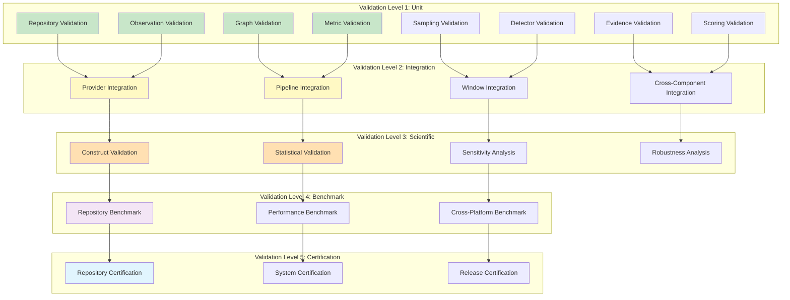
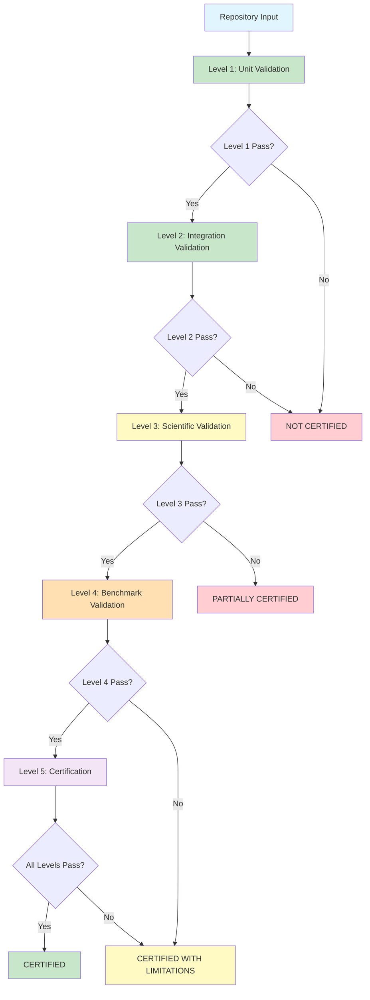
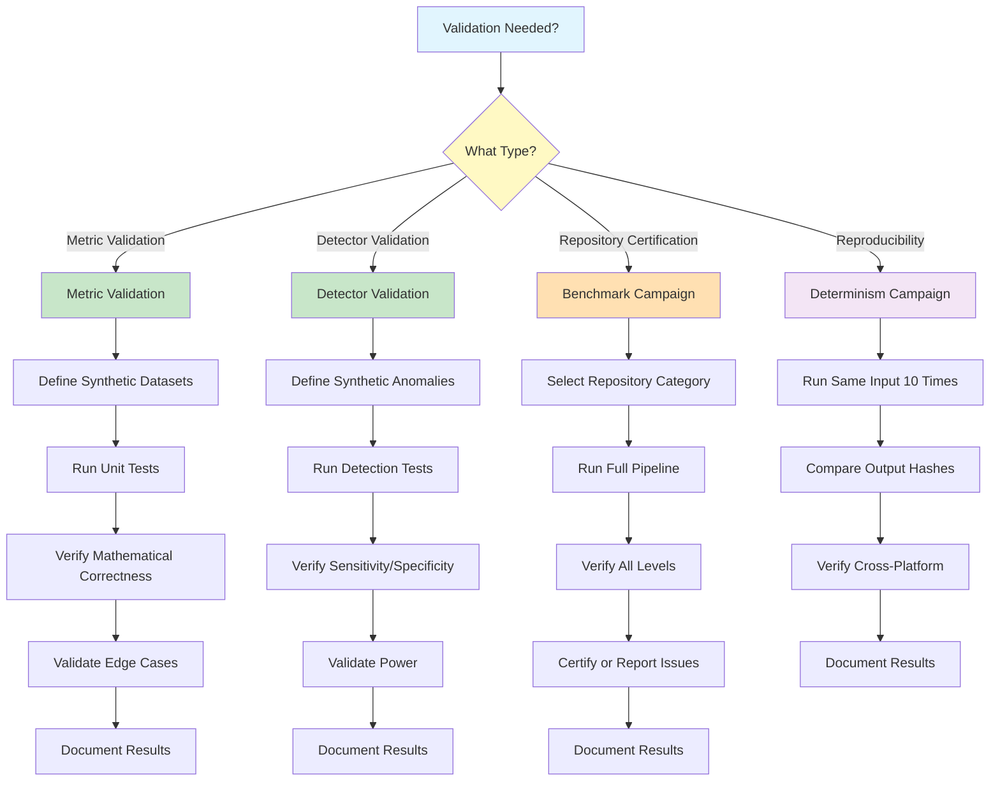
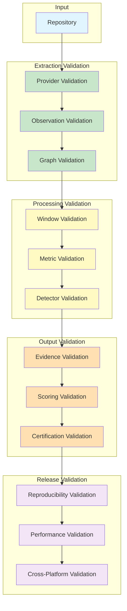

# MIIE v1.6

## 05_METRIC_VALIDATION_FRAMEWORK.md

### Scientific Validation Framework & Repository Certification Protocol

| Field | Value |
|-------|-------|
| Document Type | Scientific Validation Specification |
| Version | 1.6.0 |
| Status | Canonical |
| Scope | Validation Framework, Benchmark Campaigns, Repository Certification, Reproducibility |
| Audience | Validation Scientists, Empirical Software Engineering Researchers, Scientific Verification Engineers |
| Last Updated | 2026-07-05 |

---

## Table of Contents

1. [Purpose of Scientific Validation](#1-purpose-of-scientific-validation)
2. [Validation Philosophy](#2-validation-philosophy)
3. [Validation Hierarchy](#3-validation-hierarchy)
4. [Validation Levels](#4-validation-levels)
5. [Observation Validation](#5-observation-validation)
6. [Metric Validation](#6-metric-validation)
7. [Detector Validation](#7-detector-validation)
8. [Scoring Validation](#8-scoring-validation)
9. [Repository Benchmark Validation](#9-repository-benchmark-validation)
10. [Synthetic Validation](#10-synthetic-validation)
11. [Reproducibility Framework](#11-reproducibility-framework)
12. [Performance Validation](#12-performance-validation)
13. [Repository Certification Protocol](#13-repository-certification-protocol)
14. [Threats to Validity](#14-threats-to-validity)
15. [Validation Governance](#15-validation-governance)
16. [Validation Decision Tree](#16-validation-decision-tree)
17. [Validation Lifecycle](#17-validation-lifecycle)
18. [Appendices](#18-appendices)

---

## 1. Purpose of Scientific Validation

### 1.1 Why Software Metrics Require Validation

Software metrics are abstractions of complex development processes. A commit count abstracts away the meaning, quality, and context of individual commits. A coverage ratio abstracts away the testing strategy, test quality, and code complexity. These abstractions are useful — they enable comparison, monitoring, and decision-making that would be impossible through qualitative observation alone. But abstractions are also dangerous. They can mislead, distort, and misrepresent the phenomena they claim to measure.

Validation exists to establish the degree to which MIIE's metrics, detectors, and conclusions faithfully represent reality. Without validation, MIIE's outputs are unverified assertions — claims about metric integrity that have no demonstrated connection to actual metric behaviour. Validation transforms assertions into evidence.

### 1.2 Distinction Between Validation Concepts

**Software Testing**: Verifying that code executes correctly — that functions return expected values, that edge cases are handled, that error conditions are managed. Testing answers: does the code work?

**Scientific Validation**: Establishing that MIIE's outputs faithfully represent the phenomena they claim to measure. Validation answers: do the metrics mean what we claim they mean? Do the detectors detect what we claim they detect?

**Benchmarking**: Measuring MIIE's performance against defined criteria — execution time, memory usage, scalability, throughput. Benchmarking answers: how well does MIIE perform?

**Repository Certification**: Formally assessing whether a specific repository's metrics are reliable based on MIIE's analysis. Certification answers: can this repository's metrics be trusted?

**Measurement Verification**: Confirming that MIIE's metric computations produce mathematically correct results. Verification answers: are the computations correct?

**Scientific Reproducibility**: Demonstrating that MIIE's outputs can be reproduced by independent recomputation from the same inputs. Reproducibility answers: can the results be independently confirmed?

### 1.3 Why Validation Matters

MIIE's outputs influence decisions. Organisations use MIIE's assessments to evaluate development quality, identify integrity violations, and make resource allocation decisions. If MIIE's outputs are unreliable, these decisions are unfounded.

Validation provides the evidence that MIIE's outputs are trustworthy. It establishes:

**Accuracy**: MIIE's metrics correctly measure what they claim to measure.

**Reliability**: MIIE's outputs are consistent across repeated executions.

**Sensitivity**: MIIE's detectors can identify real integrity violations.

**Specificity**: MIIE's detectors do not flag normal behaviour as violations.

**Generalisability**: MIIE's methods work across different repositories, languages, and development practices.

---

## 2. Validation Philosophy

### 2.1 Evidence-Based Validation

Validation is itself a scientific activity. It requires evidence, methodology, and transparent reasoning. Validation is not a checkbox — it is a continuous process of establishing and maintaining trust in MIIE's outputs.

Evidence-based validation requires:

**Defined Criteria**: Clear, measurable criteria for what constitutes successful validation.

**Reproducible Methods**: Validation procedures that can be independently executed and produce consistent results.

**Transparent Reporting**: Complete documentation of validation results, including failures and limitations.

**Continuous Monitoring**: Ongoing validation to detect degradation over time.

### 2.2 Reproducibility

Reproducibility is the cornerstone of scientific validation. A result is reproducible if an independent party, given the same inputs and methodology, can produce the same output.

MIIE requires:

**Deterministic Execution**: Given identical inputs, MIIE must produce identical outputs. No randomness, no timing-dependent behaviour, no environmental dependencies.

**Stable Ordering**: Operations that could produce different results depending on execution order must use deterministic ordering.

**Hash Verification**: Critical intermediate results must be verifiable through hash comparison.

**Cross-Platform Consistency**: Results must be consistent across supported platforms (Linux, macOS, Windows).

Reproducibility is not merely a technical requirement — it is a scientific obligation. Without reproducibility, MIIE's outputs cannot be independently verified, and trust in the system depends entirely on faith rather than evidence.

### 2.3 Construct Validity

Construct validity asks: does MIIE measure what it claims to measure? This is the most fundamental validation question.

**M-01 (Commit Entropy Ratio)** claims to measure the diversity of commit message language. Construct validity requires demonstrating that the entropy calculation genuinely reflects linguistic diversity, not just string length or character distribution.

**D-01 (Distribution Drift)** claims to detect changes in metric distributions. Construct validity requires demonstrating that the KS test and PSI genuinely detect distribution changes, not just sampling variation.

Construct validation requires:

**Theoretical Justification**: A clear argument for why the metric or detector measures the claimed construct.

**Empirical Evidence**: Data demonstrating that the metric or detector responds to changes in the claimed construct.

**Discriminant Validity**: Evidence that the metric or detector does not measure unrelated constructs.

### 2.4 Internal Validity

Internal validity asks: can the observed results be attributed to the hypothesised cause, rather than confounding factors?

In MIIE's context, internal validity requires:

**No Confounding**: Detected anomalies are caused by integrity violations, not by repository changes, tool changes, or data quality issues.

**Causal Direction**: If MIIE detects a correlation breakdown, the breakdown reflects a genuine change in metric relationships, not a change in measurement procedure.

**Temporal Ordering**: If MIIE detects a threshold compression, the compression occurred during the analysed time period, not before or after.

### 2.5 External Validity

External validity asks: do MIIE's results generalise beyond the specific repositories and conditions used for validation?

MIIE must demonstrate that its methods work on:

**Different Languages**: Repositories written in Python, JavaScript, Java, Go, Rust, and other languages.

**Different Sizes**: Repositories ranging from small personal projects to large enterprise codebases.

**Different Domains**: Repositories from web development, data science, systems programming, and other domains.

**Different Practices**: Repositories using different development workflows, code review practices, and testing strategies.

### 2.6 Statistical Validity

Statistical validity asks: are MIIE's statistical inferences correct?

MIIE uses statistical tests (KS test, correlation tests, bootstrap) that have well-understood properties. Statistical validity requires:

**Assumption Satisfaction**: The data satisfies the assumptions of the statistical tests.

**Power Adequacy**: The sample sizes are large enough to detect meaningful effects.

**Multiple Testing Correction**: The inflation of false positive rates from multiple comparisons is controlled.

**Effect Size Reporting**: Statistical significance is reported alongside practical significance.

### 2.7 Engineering Correctness

Engineering correctness asks: does the code implement the intended algorithms correctly?

Engineering correctness is necessary but not sufficient for scientific validity. A metric implementation can be engineering-correct (producing mathematically correct results) but scientifically-invalid (measuring the wrong construct).

### 2.8 Scientific Correctness

Scientific correctness asks: do MIIE's outputs faithfully represent the phenomena they claim to measure? This encompasses construct validity, internal validity, external validity, and statistical validity.

Scientific correctness is the ultimate goal of validation. Engineering correctness is a prerequisite, but scientific correctness requires additional evidence about the relationship between MIIE's outputs and reality.

### 2.9 Graceful Failure

When validation cannot establish correctness, MIIE must fail gracefully:

**Report Uncertainty**: Clearly communicate when results are unreliable.

**Identify Causes**: Explain why validation failed — insufficient data, violated assumptions, or other issues.

**Suggest Remediation**: Recommend actions to improve reliability.

**Avoid False Confidence**: Never present uncertain results with false precision.

---

## 3. Validation Hierarchy

### 3.1 Complete Validation Pipeline

The validation hierarchy mirrors the processing pipeline, with validation gates at each stage:



### 3.2 Validation Flow

Each validation level builds upon the previous:

**Level 1 (Unit)**: Validates individual components in isolation. Each metric, detector, and engine is validated against its specification.

**Level 2 (Integration)**: Validates component interactions. Provider-graph, graph-window, window-metric, and metric-detector interfaces are validated.

**Level 3 (Scientific)**: Validates scientific methodology. Construct validity, statistical validity, sensitivity, and robustness are assessed.

**Level 4 (Benchmark)**: Validates on real and synthetic data. Repository benchmark campaigns demonstrate performance across diverse conditions.

**Level 5 (Certification)**: Validates the complete system. Repository certification, system certification, and release certification demonstrate end-to-end correctness.

### 3.3 Gate Requirements

Each validation level serves as a gate for the next:

- Level 2 validation cannot begin until Level 1 validation passes.
- Level 3 validation cannot begin until Level 2 validation passes.
- Level 4 validation cannot begin until Level 3 validation passes.
- Level 5 validation cannot begin until Level 4 validation passes.

Failure at any level halts progression until the failure is addressed and re-validated.

---

## 4. Validation Levels

### 4.1 Level 1: Unit Validation

**Objective**: Verify that each component correctly implements its specification.

**Scope**: Individual metrics, detectors, engines, and utilities.

**Expected Evidence**:
- Unit test results for each component.
- Mathematical verification of metric computations.
- Statistical verification of detector algorithms.
- Edge case handling verification.

**Acceptance Criteria**:
- All unit tests pass.
- Metric computations match mathematical specification.
- Detector algorithms produce expected results on synthetic data.
- Edge cases are handled gracefully.

### 4.2 Level 2: Integration Validation

**Objective**: Verify that components interact correctly.

**Scope**: Provider-graph, graph-window, window-metric, metric-detector, detector-evidence, evidence-scoring interfaces.

**Expected Evidence**:
- Integration test results for each interface.
- End-to-end pipeline test results.
- Data flow verification.
- Error propagation verification.

**Acceptance Criteria**:
- All integration tests pass.
- Data flows correctly through the pipeline.
- Errors propagate correctly.
- No data loss or corruption at interfaces.

### 4.3 Level 3: Scientific Validation

**Objective**: Verify that MIIE's scientific methodology is sound.

**Scope**: Construct validity, statistical validity, sensitivity, robustness.

**Expected Evidence**:
- Construct validity evidence (theoretical justification + empirical support).
- Statistical validity evidence (assumption checks, power analysis).
- Sensitivity analysis results.
- Robustness analysis results.

**Acceptance Criteria**:
- Construct validity is supported by evidence.
- Statistical assumptions are satisfied or violations are documented.
- Sensitivity to parameters is within acceptable bounds.
- Robustness to perturbations is demonstrated.

### 4.4 Level 4: Benchmark Validation

**Objective**: Demonstrate MIIE's performance on real and synthetic data.

**Scope**: Repository benchmarks, performance benchmarks, cross-platform benchmarks.

**Expected Evidence**:
- Benchmark results across diverse repository categories.
- Performance metrics (execution time, memory, scalability).
- Cross-platform consistency results.

**Acceptance Criteria**:
- Benchmarks pass on all repository categories.
- Performance meets defined thresholds.
- Results are consistent across platforms.

### 4.5 Level 5: Repository Certification

**Objective**: Formally certify that MIIE's outputs are reliable for specific repositories.

**Scope**: Repository certification, system certification, release certification.

**Expected Evidence**:
- Repository certification results.
- System certification results.
- Release certification results.

**Acceptance Criteria**:
- Repositories achieve certification status.
- System meets all certification requirements.
- Release is certified for distribution.

---

## 5. Observation Validation

### 5.1 Observation Completeness

**Definition**: The fraction of expected observations that were actually extracted.

**Measurement**:

```
completeness = |extracted observations| / |expected observations|
```

**Validation Method**: Compare extracted observations against expected observations derived from repository metadata.

**Acceptance Criteria**:
- Completeness ≥ 0.95 for Git provider.
- Completeness ≥ 0.90 for GitHub provider (API limitations may reduce completeness).
- Completeness ≥ 0.98 for metadata provider.

**Failure Handling**: Completeness below threshold triggers provider investigation and quality degradation.

### 5.2 Observation Quality

**Definition**: Multi-dimensional assessment of observation fitness for use.

**Dimensions**:

| Dimension | Weight | Validation Method |
|-----------|--------|-------------------|
| Completeness | 0.30 | Fraction of expected observations |
| Accuracy | 0.25 | Cross-validation between providers |
| Timeliness | 0.20 | Extraction recency relative to source |
| Consistency | 0.15 | Agreement between providers |
| Reliability | 0.10 | Source trustworthiness assessment |

**Acceptance Criteria**:
- Overall quality score ≥ 0.80.
- No individual dimension score < 0.50.

### 5.3 Observation Confidence

**Definition**: Probability estimate that an observation correctly represents its claimed fact.

**Computation**:

```
confidence = 0.3 × source_reliability + 0.25 × cross_validation + 0.2 × statistical_evidence + 0.15 × provenance_completeness + 0.1 × quality_score
```

**Acceptance Criteria**:
- Confidence ≥ 0.70 for Git observations.
- Confidence ≥ 0.60 for GitHub observations.
- Confidence ≥ 0.80 for metadata observations.

### 5.4 Provider Consistency

**Definition**: Agreement between providers extracting observations about the same fact.

**Validation Method**: Cross-validate observations from different providers for overlapping time periods.

**Acceptance Criteria**:
- Agreement rate ≥ 0.90 for numeric observations (within tolerance).
- Agreement rate ≥ 0.95 for categorical observations.

### 5.5 Duplicate Detection

**Definition**: Identification of observations that represent the same fact extracted multiple times.

**Validation Method**: Verify that duplicate detection correctly identifies and resolves duplicates.

**Acceptance Criteria**:
- Duplicate detection identifies ≥ 0.99 of true duplicates.
- False duplicate rate ≤ 0.01.

### 5.6 Provenance Validation

**Definition**: Verification that observation provenance is complete and accurate.

**Validation Method**: Audit provenance records against extraction logs.

**Acceptance Criteria**:
- 100% of observations have complete provenance.
- Provenance records match extraction logs.

### 5.7 Relationship Validation

**Definition**: Verification that observation relationships are correctly identified and typed.

**Validation Method**: Verify relationship graph against known relationship structures.

**Acceptance Criteria**:
- Relationship identification accuracy ≥ 0.90.
- Relationship typing accuracy ≥ 0.95.
- Graph acyclicity maintained.

### 5.8 Window Assignment

**Definition**: Verification that observations are correctly assigned to windows.

**Validation Method**: Verify window membership against temporal and commit-based criteria.

**Acceptance Criteria**:
- 100% of observations are assigned to appropriate windows.
- Window temporal constraints are satisfied.
- No observations are orphaned (unassigned).

### 5.9 Failure Handling

**Definition**: Verification that observation failures are handled gracefully.

**Validation Method**: Inject provider failures and verify graceful degradation.

**Acceptance Criteria**:
- Provider failures produce quality degradation, not crashes.
- Missing observations are reported and handled.
- Partial results are clearly flagged.

---

## 6. Metric Validation

### 6.1 M-01: Commit Entropy Ratio

**Scientific Objective**: Measure the diversity of commit message language within a time window.

**Expected Observations**: Commit messages (text).

**Synthetic Datasets**:

| Dataset | Description | Expected M-01 |
|---------|-------------|---------------|
| Uniform messages | All commits have different messages | High (near 1.0) |
| Repetitive messages | All commits have identical messages | Low (near 0.0) |
| Mixed messages | Some unique, some repeated | Intermediate |

**Ground Truth**: Shannon entropy of the message character distribution, normalised by maximum possible entropy.

**Acceptance Ranges**:
- M-01 ∈ [0, 1] for all inputs.
- M-01 = 0 when all messages are identical.
- M-01 approaches 1 when messages are uniformly diverse.

**Edge Cases**:
- Single commit: M-01 = 0 (no diversity possible).
- Empty window: M-01 undefined (no observations).
- Very short messages: Entropy may be artificially low.

**Failure Modes**:
- Non-UTF-8 messages: Graceful fallback to ASCII.
- Extremely long messages: Truncation to reasonable limit.

**Confidence Validation**: Confidence decreases with fewer observations and lower message quality.

**Cross-Metric Consistency**: M-01 should not strongly correlate with M-02 (commit count), as they measure different constructs.

### 6.2 M-02: Commit Count

**Scientific Objective**: Count the number of commits within a time window.

**Expected Observations**: Commit records.

**Synthetic Datasets**:

| Dataset | Description | Expected M-02 |
|---------|-------------|---------------|
| No commits | Empty repository | 0 |
| Single commit | One commit in window | 1 |
| Many commits | 100 commits in window | 100 |

**Ground Truth**: Exact count of commits in the window.

**Acceptance Ranges**:
- M-02 ∈ [0, ∞).
- M-02 is an integer.
- M-02 matches exact count.

**Edge Cases**:
- Empty window: M-02 = 0.
- Commit on window boundary: Deterministic assignment rule.

**Failure Modes**:
- Duplicate commits (cherry-picks): Counted as separate commits.

**Confidence Validation**: Confidence is high when commit data is complete and reliable.

**Cross-Metric Consistency**: M-02 should correlate positively with M-06 (file change count), as more commits typically involve more file changes.

### 6.3 M-03: Code Churn Ratio

**Scientific Objective**: Measure the ratio of code churn (insertions + deletions) to total codebase size.

**Expected Observations**: Diff statistics (insertions, deletions, total lines).

**Synthetic Datasets**:

| Dataset | Description | Expected M-03 |
|---------|-------------|---------------|
| No changes | No insertions or deletions | 0.0 |
| Small changes | 10 lines changed in 1000-line codebase | 0.01 |
| Large changes | 500 lines changed in 1000-line codebase | 0.50 |
| Complete rewrite | All lines changed | 1.0 (clamped) |

**Ground Truth**: min(1.0, (insertions + deletions) / total_lines).

**Acceptance Ranges**:
- M-03 ∈ [0, 1].
- M-03 = 0 when no changes occur.
- M-03 = 1 when churn exceeds codebase size.

**Edge Cases**:
- Total lines = 0: M-03 undefined (empty codebase).
- M-03 depends on M-07 (branch freshness) — dependency must be resolved.

**Failure Modes**:
- Binary files: Excluded from churn calculation.
- Very small codebases: Churn ratio may be artificially high.

**Confidence Validation**: Confidence decreases when M-07 (branch freshness) has low confidence.

**Cross-Metric Consistency**: M-03 should correlate positively with M-06 (file change count).

### 6.4 M-04: Test Coverage Ratio

**Scientific Objective**: Measure the ratio of tested code to total code.

**Expected Observations**: Coverage data (from CI systems or coverage tools).

**Synthetic Datasets**:

| Dataset | Description | Expected M-04 |
|---------|-------------|---------------|
| No tests | No test coverage data | Undefined |
| Low coverage | 30% of lines covered | 0.30 |
| High coverage | 90% of lines covered | 0.90 |
| Full coverage | 100% of lines covered | 1.00 |

**Ground Truth**: coverage_percentage / 100.

**Acceptance Ranges**:
- M-04 ∈ [0, 1].
- M-04 = 0 when no tests exist.
- M-04 = 1 when all lines are covered.

**Edge Cases**:
- No coverage data: M-04 undefined.
- Coverage tool inconsistency: Cross-tool validation required.

**Failure Modes**:
- Coverage tool changes: May produce different coverage values for the same code.
- Language-specific coverage: Different languages may have different coverage semantics.

**Confidence Validation**: Confidence depends on coverage tool reliability and data completeness.

**Cross-Metric Consistency**: M-04 may correlate with M-01 (entropy ratio) if test quality affects commit diversity.

### 6.5 M-05: Review Latency

**Scientific Objective**: Measure the time between pull request creation and first review.

**Expected Observations**: Pull request creation timestamps, review timestamps.

**Synthetic Datasets**:

| Dataset | Description | Expected M-05 |
|---------|-------------|---------------|
| No reviews | No pull requests reviewed | Undefined |
| Fast review | 1 hour between creation and review | 1.0 |
| Slow review | 48 hours between creation and review | 48.0 |

**Ground Truth**: (review_timestamp - creation_timestamp) / 3600 (in hours).

**Acceptance Ranges**:
- M-05 ∈ [0, ∞).
- M-05 is in hours.
- M-05 ≥ 0.

**Edge Cases**:
- No reviews: M-05 undefined.
- Self-review: Excluded from calculation.
- Multiple reviews: First review timestamp used.

**Failure Modes**:
- GitHub API limitations: Historical review data may be incomplete.
- Squash merges: Review timestamps may be lost.

**Confidence Validation**: Confidence decreases with fewer reviews and older data.

**Cross-Metric Consistency**: M-05 may correlate with M-03 (churn ratio), as larger changes may require longer reviews.

### 6.6 M-06: File Change Count

**Scientific Objective**: Count the number of distinct files changed within a time window.

**Expected Observations**: File change records.

**Synthetic Datasets**:

| Dataset | Description | Expected M-06 |
|---------|-------------|---------------|
| No changes | No files changed | 0 |
| Single file | One file changed | 1 |
| Many files | 50 files changed | 50 |

**Ground Truth**: |{distinct files changed in window}|.

**Acceptance Ranges**:
- M-06 ∈ [0, ∞).
- M-06 is an integer.
- M-06 counts distinct files, not total changes.

**Edge Cases**:
- Empty window: M-06 = 0.
- Rename + modify: Counted as one file.

**Failure Modes**:
- Symlinks: May cause double-counting.
- Submodules: Treated as single files.

**Confidence Validation**: Confidence is high when file change data is complete.

**Cross-Metric Consistency**: M-06 should correlate positively with M-02 (commit count).

### 6.7 M-07: Branch Freshness Ratio

**Scientific Objective**: Measure how recently the branch was updated relative to a reference point.

**Expected Observations**: Branch timestamps, commit timestamps.

**Synthetic Datasets**:

| Dataset | Description | Expected M-07 |
|---------|-------------|---------------|
| Fresh branch | Updated today | 1.0 |
| Stale branch | Updated 90 days ago | 0.5 |
| Very stale branch | Updated 180+ days ago | 0.0 |

**Ground Truth**: max(0.0, 1.0 - days_since_update / 180).

**Acceptance Ranges**:
- M-07 ∈ [0, 1].
- M-07 = 1 for branches updated today.
- M-07 = 0 for branches not updated in 180+ days.

**Edge Cases**:
- New branch: M-07 = 1.0.
- Branch deleted: M-07 = 0.0.

**Failure Modes**:
- Force pushes: Timestamp may not reflect last meaningful change.

**Confidence Validation**: Confidence is high when branch data is reliable.

**Cross-Metric Consistency**: M-07 is an input to M-03 (churn ratio).

---

## 7. Detector Validation

### 7.1 D-01: Distribution Drift Detector

**Healthy Repository Validation**:

| Repository Type | Expected Behaviour |
|----------------|-------------------|
| Active open source | No anomaly detected |
| Stable enterprise | No anomaly detected |
| Small project | No anomaly detected |

**Synthetic Anomaly Validation**:

| Anomaly Type | Expected Behaviour |
|-------------|-------------------|
| Location shift (d = 0.5) | Anomaly detected |
| Scale change (σ ratio = 2.0) | Anomaly detected |
| Shape change (skewness shift) | Anomaly detected |
| No change | No anomaly detected |

**Known Anomaly Validation**:

| Anomaly Type | Expected Behaviour |
|-------------|-------------------|
| Gaming simulation | Anomaly detected |
| Seasonal pattern | No anomaly (with appropriate windowing) |
| Tool change | Anomaly detected |

**Sensitivity**: D-01 should detect medium effect sizes (d ≥ 0.5) with power ≥ 0.80 at sample size 30.

**Specificity**: D-01 should produce false positive rate ≤ 0.05 on healthy repositories.

**False Positive Rate**: ≤ 0.05 at significance level 0.05.

**False Negative Rate**: ≤ 0.20 for medium effect sizes.

**Power Analysis**:

| Effect Size | Sample Size | Power |
|-------------|-------------|-------|
| Small (d = 0.2) | 30 | ~0.20 |
| Medium (d = 0.5) | 30 | ~0.80 |
| Large (d = 0.8) | 30 | ~0.95 |

**Acceptance Criteria**:
- Type I error rate ≤ 0.05.
- Type II error rate ≤ 0.20 for medium effects.
- Reproducibility: Identical inputs produce identical outputs.

### 7.2 D-02: Correlation Breakdown Detector

**Healthy Repository Validation**:

| Repository Type | Expected Behaviour |
|----------------|-------------------|
| Active open source | No anomaly detected |
| Stable enterprise | No anomaly detected |
| Small project | No anomaly detected |

**Synthetic Anomaly Validation**:

| Anomaly Type | Expected Behaviour |
|-------------|-------------------|
| Correlation weakening (Δr = 0.4) | Anomaly detected |
| Correlation reversal | Strong anomaly detected |
| Correlation emergence | Anomaly detected |
| No change | No anomaly detected |

**Known Anomaly Validation**:

| Anomaly Type | Expected Behaviour |
|-------------|-------------------|
| Decoupled metrics | Anomaly detected |
| Natural decoupling | No anomaly |

**Sensitivity**: D-02 should detect correlation changes (Δr ≥ 0.3) with power ≥ 0.80 at sample size 20.

**Specificity**: D-02 should produce false positive rate ≤ 0.05 on healthy repositories.

**False Positive Rate**: ≤ 0.05 at significance level 0.05.

**False Negative Rate**: ≤ 0.20 for medium correlation changes.

**Power Analysis**:

| Effect Size (Δr) | Sample Size | Power |
|-------------------|-------------|-------|
| Small (0.1) | 20 | ~0.15 |
| Medium (0.3) | 20 | ~0.80 |
| Large (0.5) | 20 | ~0.95 |

**Acceptance Criteria**:
- Type I error rate ≤ 0.05.
- Type II error rate ≤ 0.20 for medium correlation changes.
- Reproducibility: Identical inputs produce identical outputs.

### 7.3 D-03: Threshold Compression Detector

**Healthy Repository Validation**:

| Repository Type | Expected Behaviour |
|----------------|-------------------|
| Active open source | No anomaly detected |
| Stable enterprise | No anomaly detected |
| Small project | No anomaly detected |

**Synthetic Anomaly Validation**:

| Anomaly Type | Expected Behaviour |
|-------------|-------------------|
| Threshold compression | Anomaly detected |
| Unimodal distribution | No anomaly detected |
| Bimodal distribution | Anomaly detected |

**Known Anomaly Validation**:

| Anomaly Type | Expected Behaviour |
|-------------|-------------------|
| Coverage gaming | Anomaly detected |
| Natural threshold | No anomaly |

**Sensitivity**: D-03 should detect threshold compression with power ≥ 0.80 at sample size 30.

**Specificity**: D-03 should produce false positive rate ≤ 0.05 on healthy repositories.

**False Positive Rate**: ≤ 0.05 at significance level 0.05.

**False Negative Rate**: ≤ 0.20 for moderate compression.

**Power Analysis**:

| Compression Level | Sample Size | Power |
|-------------------|-------------|-------|
| Weak | 30 | ~0.40 |
| Moderate | 30 | ~0.80 |
| Strong | 30 | ~0.95 |

**Acceptance Criteria**:
- Type I error rate ≤ 0.05.
- Type II error rate ≤ 0.20 for moderate compression.
- Reproducibility: Identical inputs produce identical outputs.

---

## 8. Scoring Validation

### 8.1 Integrity Score

**Validation Method**: Verify that the integrity score correctly aggregates detector outputs.

**Computation**:

```
IntegrityScore = 1.0 - (0.40 × D1_score + 0.35 × D2_score + 0.25 × D3_score)
```

**Acceptance Criteria**:
- IntegrityScore ∈ [0, 1].
- IntegrityScore = 1.0 when no anomalies are detected.
- IntegrityScore decreases as detector scores increase.
- Weights sum to 1.0.

**Boundary Conditions**:
- All detectors report no anomaly: IntegrityScore = 1.0.
- All detectors report maximum anomaly: IntegrityScore = 0.0.
- Single detector reports anomaly: IntegrityScore = 1.0 - weighted contribution.

### 8.2 Confidence Score

**Validation Method**: Verify that the confidence score correctly propagates uncertainty.

**Computation**:

```
ConfidenceScore = f1 × f2 × f3 × f4 × f5 × f6
```

Where:
- f1 = sample size factor
- f2 = variance factor
- f3 = missing data factor
- f4 = balance factor
- f5 = detector success factor
- f6 = quality factor

**Acceptance Criteria**:
- ConfidenceScore ∈ [0, 1].
- ConfidenceScore decreases with smaller samples.
- ConfidenceScore decreases with higher variance.
- ConfidenceScore decreases with more missing data.
- ConfidenceScore = 1.0 only when all factors are 1.0.

### 8.3 Evidence Propagation

**Validation Method**: Verify that evidence correctly propagates from observations through detectors to scores.

**Acceptance Criteria**:
- Evidence provenance is complete.
- Confidence propagates without artificial inflation.
- Quality propagates without degradation.
- All evidence components are traceable to source observations.

### 8.4 Observation Quality Weighting

**Validation Method**: Verify that observation quality correctly influences metric and detector confidence.

**Acceptance Criteria**:
- Low-quality observations reduce metric confidence.
- High-quality observations maintain metric confidence.
- Quality weighting is monotonic (higher quality → higher confidence).

### 8.5 Detector Weighting

**Validation Method**: Verify that detector weights correctly influence the integrity score.

**Acceptance Criteria**:
- D-01 weight = 0.40.
- D-02 weight = 0.35.
- D-03 weight = 0.25.
- Weights sum to 1.0.
- Higher-weighted detectors have proportionally greater influence.

### 8.6 Deterministic Scoring

**Validation Method**: Verify that scoring is deterministic.

**Acceptance Criteria**:
- Identical inputs produce identical scores.
- No timing-dependent behaviour.
- No randomness in scoring computation.

### 8.7 Boundary Conditions

**Validation Method**: Verify scoring at extreme values.

**Acceptance Criteria**:
- Minimum observations: Score is computed with appropriate confidence discount.
- Maximum observations: Score reflects full evidence.
- All detectors failing: Score reflects uncertainty.
- All detectors passing: Score reflects confidence.

### 8.8 Scientific Interpretation

**Validation Method**: Verify that score interpretations are scientifically sound.

**Acceptance Criteria**:
- High integrity score (≥ 0.8) indicates reliable metrics.
- Medium integrity score (0.5–0.8) indicates moderate reliability.
- Low integrity score (< 0.5) indicates unreliable metrics.
- Confidence score indicates the reliability of the integrity assessment.

---

## 9. Repository Benchmark Validation

### 9.1 Repository Categories

| Category | Description | Expected Behaviour |
|----------|-------------|-------------------|
| Healthy | Well-maintained, active repositories | High integrity score, no anomalies |
| Archived | Inactive, archived repositories | Stable metrics, no recent changes |
| Enterprise | Large, established enterprise projects | Moderate integrity, expected patterns |
| Experimental | Small, experimental projects | Variable integrity, high variance |
| Forks | Forked repositories | May show inherited patterns |
| Fast-growing | Rapidly growing repositories | High churn, potentially lower integrity |
| High-risk | Repositories with known integrity issues | Expected anomalies detected |
| Multi-language | Repositories with multiple languages | Consistent metrics across languages |

### 9.2 Language Coverage

| Language | Minimum Repositories | Validation Priority |
|----------|---------------------|-------------------|
| Python | 5 | High |
| JavaScript/TypeScript | 5 | High |
| Java | 3 | Medium |
| Go | 3 | Medium |
| Rust | 2 | Medium |
| C/C++ | 2 | Medium |
| Other | 2 | Low |

### 9.3 Size Coverage

| Size Category | Lines of Code | Minimum Repositories |
|---------------|---------------|---------------------|
| Small | < 10,000 | 3 |
| Medium | 10,000–100,000 | 5 |
| Large | 100,000–1,000,000 | 3 |
| Very Large | > 1,000,000 | 2 |

### 9.4 Selection Criteria

**Inclusion Criteria**:
- Publicly accessible repository.
- Sufficient commit history (≥ 100 commits).
- Active within the last 2 years.
- Diverse contributor base (≥ 3 contributors).

**Exclusion Criteria**:
- Repository is private or requires authentication.
- Insufficient commit history (< 100 commits).
- Repository is a mirror or duplicate.
- Repository contains only generated code.

### 9.5 Benchmark Quality Requirements

- All benchmark repositories must be accessible at validation time.
- Benchmark results must be reproducible across runs.
- Benchmark results must be documented with repository metadata.
- Benchmark failures must be investigated and explained.

---

## 10. Synthetic Validation

### 10.1 Known Drift Generation

**Method**: Generate metric time series with controlled distribution shifts.

**Parameters**:
- Shift magnitude (Cohen's d): 0.0, 0.2, 0.5, 0.8.
- Shift timing: Gradual, sudden, intermittent.
- Shift direction: Increase, decrease, variance change.

**Expected Detector Behaviour**: D-01 detects shifts with d ≥ 0.5. D-02 and D-03 do not produce false positives.

**Acceptance Thresholds**: D-01 detection rate ≥ 80% for d ≥ 0.5.

### 10.2 Known Correlation Breakdown Generation

**Method**: Generate paired metric time series with controlled correlation changes.

**Parameters**:
- Correlation change (Δr): 0.0, 0.2, 0.4, 0.6.
- Change type: Weakening, reversal, emergence.
- Change timing: Gradual, sudden.

**Expected Detector Behaviour**: D-02 detects changes with Δr ≥ 0.3. D-01 and D-03 do not produce false positives.

**Acceptance Thresholds**: D-02 detection rate ≥ 80% for Δr ≥ 0.3.

### 10.3 Known Threshold Compression Generation

**Method**: Generate metric value distributions with controlled concentration near thresholds.

**Parameters**:
- Compression level: None, weak, moderate, strong.
- Threshold location: Mean, median, custom.
- Distribution shape: Normal, uniform, bimodal.

**Expected Detector Behaviour**: D-03 detects moderate-to-strong compression. D-01 and D-02 do not produce false positives.

**Acceptance Thresholds**: D-03 detection rate ≥ 80% for moderate compression.

### 10.4 Known Metric Failures

**Method**: Generate metric time series with known failures (data gaps, outliers, quality degradation).

**Parameters**:
- Failure type: Missing data, outliers, quality degradation, provider failure.
- Failure magnitude: Partial, complete.
- Failure duration: Transient, persistent.

**Expected Behaviour**: MIIE handles failures gracefully, reporting uncertainty rather than producing unreliable results.

**Acceptance Thresholds**: No crashes, no silent data loss, uncertainty appropriately reported.

### 10.5 Controlled Experiments

**Method**: Systematically vary one parameter while holding others constant.

**Parameters Varying**:
- Sample size: 10, 20, 30, 50, 100.
- Window size: Daily, weekly, monthly.
- Threshold stringency: Conservative, standard, liberal.

**Expected Behaviour**: Detection rates change predictably with parameter changes.

**Acceptance Thresholds**: Detection rates follow theoretical expectations.

---

## 11. Reproducibility Framework

### 11.1 Deterministic Execution

**Requirement**: Given identical inputs, MIIE must produce identical outputs.

**Verification**: Run MIIE twice on the same repository and compare outputs hash-by-hash.

**Acceptance Criteria**:
- Output hashes are identical across runs.
- No timing-dependent behaviour.
- No randomness in computation.

### 11.2 Stable Ordering

**Requirement**: Operations that could produce different results depending on order must use deterministic ordering.

**Verification**: Verify that observation processing, metric computation, and detector analysis use deterministic ordering.

**Acceptance Criteria**:
- Topological ordering for graph traversal.
- Sorted keys for dictionary iteration.
- Deterministic aggregation order.

### 11.3 Hash Verification

**Requirement**: Critical intermediate results must be verifiable through hash comparison.

**Verification**: Compare hashes of intermediate results across runs.

**Acceptance Criteria**:
- Observation hashes are identical across runs.
- Metric hashes are identical across runs.
- Detector result hashes are identical across runs.

### 11.4 Repeatability

**Requirement**: Results must be repeatable across multiple runs.

**Verification**: Run MIIE 10 times on the same repository and compare results.

**Acceptance Criteria**:
- All 10 runs produce identical results.
- No variation in execution time beyond acceptable bounds.

### 11.5 Cross-Platform Reproducibility

**Requirement**: Results must be consistent across supported platforms.

**Verification**: Run MIIE on Linux, macOS, and Windows and compare results.

**Acceptance Criteria**:
- Results are identical across platforms (within floating-point tolerance).
- No platform-specific behaviour.

### 11.6 Floating-Point Tolerance

**Requirement**: Floating-point comparisons must use appropriate tolerance.

**Verification**: Verify that floating-point comparisons use epsilon tolerance.

**Acceptance Criteria**:
- Tolerance ≤ 1e-10 for metric computations.
- Tolerance ≤ 1e-6 for statistical tests.
- No false failures due to floating-point precision.

### 11.7 Version Compatibility

**Requirement**: Results must be reproducible across MIIE versions (within major version).

**Verification**: Run MIIE 1.5 and MIIE 1.6 on the same repository and compare results.

**Acceptance Criteria**:
- Results are identical within major version.
- Version differences are documented.

### 11.8 Environment Documentation

**Requirement**: The execution environment must be fully documented.

**Verification**: Document Python version, dependency versions, and platform.

**Acceptance Criteria**:
- All dependencies are pinned.
- Environment is reproducible via requirements file.
- Platform requirements are documented.

---

## 12. Performance Validation

### 12.1 Execution Time

**Metric**: Total pipeline execution time.

**Acceptance Criteria**:

| Repository Size | Maximum Time |
|----------------|-------------|
| Small (< 10K LOC) | 60 seconds |
| Medium (10K–100K LOC) | 5 minutes |
| Large (100K–1M LOC) | 30 minutes |
| Very Large (> 1M LOC) | 2 hours |

### 12.2 Memory Usage

**Metric**: Peak memory consumption.

**Acceptance Criteria**:

| Repository Size | Maximum Memory |
|----------------|---------------|
| Small (< 10K LOC) | 512 MB |
| Medium (10K–100K LOC) | 2 GB |
| Large (100K–1M LOC) | 8 GB |
| Very Large (> 1M LOC) | 32 GB |

### 12.3 Scalability

**Requirement**: Execution time and memory must scale linearly with repository size.

**Verification**: Measure execution time and memory across repository sizes and verify linear scaling.

**Acceptance Criteria**:
- Time complexity ≤ O(n log n) for n observations.
- Memory complexity ≤ O(n) for n observations.

### 12.4 Provider Latency

**Metric**: Time to extract observations from each provider.

**Acceptance Criteria**:

| Provider | Maximum Latency |
|----------|----------------|
| Git | 30 seconds |
| GitHub | 60 seconds (per API call) |
| Metadata | 10 seconds |

### 12.5 Graph Construction

**Metric**: Time to construct the observation graph.

**Acceptance Criteria**:

| Observation Count | Maximum Time |
|-------------------|-------------|
| < 1,000 | 5 seconds |
| 1,000–10,000 | 30 seconds |
| 10,000–100,000 | 5 minutes |
| > 100,000 | 30 minutes |

### 12.6 Metric Computation

**Metric**: Time to compute all metrics.

**Acceptance Criteria**:

| Observation Count | Maximum Time |
|-------------------|-------------|
| < 1,000 | 2 seconds |
| 1,000–10,000 | 10 seconds |
| 10,000–100,000 | 2 minutes |
| > 100,000 | 10 minutes |

### 12.7 Detector Runtime

**Metric**: Time to run all detectors.

**Acceptance Criteria**:

| Metric Count | Maximum Time |
|-------------|-------------|
| < 100 | 5 seconds |
| 100–1,000 | 30 seconds |
| 1,000–10,000 | 5 minutes |
| > 10,000 | 30 minutes |

### 12.8 Pipeline Runtime

**Metric**: Total end-to-end pipeline runtime.

**Acceptance Criteria**:

| Repository Size | Maximum Pipeline Time |
|----------------|----------------------|
| Small (< 10K LOC) | 90 seconds |
| Medium (10K–100K LOC) | 10 minutes |
| Large (100K–1M LOC) | 60 minutes |
| Very Large (> 1M LOC) | 4 hours |

---

## 13. Repository Certification Protocol

### 13.1 Certification Levels

**CERTIFIED**: The repository's metrics are reliable. All validation levels pass. No significant anomalies detected.

**CERTIFIED WITH LIMITATIONS**: The repository's metrics are generally reliable, but specific limitations are documented. Most validation levels pass, with documented exceptions.

**PARTIALLY CERTIFIED**: Some aspects of the repository's metrics are reliable, but significant issues are detected. Some validation levels fail.

**NOT CERTIFIED**: The repository's metrics cannot be trusted. Critical validation failures or significant anomalies detected.

### 13.2 Required Evidence

| Certification Level | Required Evidence |
|--------------------|-------------------|
| CERTIFIED | All 5 validation levels pass. No anomalies. Performance within bounds. |
| CERTIFIED WITH LIMITATIONS | Levels 1–3 pass. Level 4 passes with documented exceptions. Anomalies are explained. |
| PARTIALLY CERTIFIED | Levels 1–2 pass. Level 3 has documented issues. Some anomalies detected. |
| NOT CERTIFIED | Level 1 or 2 fails, or critical anomalies detected. |

### 13.3 Certification Workflow



### 13.4 Certification Evidence Package

The certification evidence package includes:

**Validation Results**: Complete results from all 5 validation levels.

**Anomaly Report**: All detected anomalies with interpretation.

**Performance Report**: Execution time, memory, and scalability results.

**Reproducibility Report**: Results from reproducibility verification.

**Limitations Document**: Known limitations and their impact on certification.

---

## 14. Threats to Validity

### 14.1 Repository Bias

**Threat**: Validation repositories may not be representative of all repositories.

**Mitigation**: Include repositories from diverse languages, sizes, domains, and practices.

**Residual Risk**: Some repository types may be underrepresented.

### 14.2 Sampling Bias

**Threat**: The sample of repositories used for validation may not be random.

**Mitigation**: Use inclusion/exclusion criteria and document selection process.

**Residual Risk**: Selection criteria may inadvertently exclude relevant repositories.

### 14.3 Provider Limitations

**Threat**: Provider limitations (API rate limits, data availability) may affect validation.

**Mitigation**: Document provider limitations and their impact on validation.

**Residual Risk**: Provider limitations may reduce validation coverage.

### 14.4 Observation Sparsity

**Threat**: Some time periods may have few observations, reducing statistical power.

**Mitigation**: Use adaptive windowing and minimum sample size requirements.

**Residual Risk**: Sparse observations may produce unreliable results.

### 14.5 External API Dependence

**Threat**: GitHub API changes may affect validation results.

**Mitigation**: Document API versions and pin dependencies.

**Residual Risk**: API changes may invalidate historical validation results.

### 14.6 Platform Differences

**Threat**: Results may differ across platforms.

**Mitigation**: Cross-platform validation on Linux, macOS, and Windows.

**Residual Risk**: Platform-specific behaviour may produce different results.

### 14.7 Measurement Uncertainty

**Threat**: All measurements have inherent uncertainty.

**Mitigation**: Report confidence intervals and uncertainty estimates.

**Residual Risk**: Uncertainty may affect validation conclusions.

### 14.8 Future Work

**Threat**: Future changes may affect validation validity.

**Mitigation**: Continuous monitoring and re-validation.

**Residual Risk**: Validation may become outdated.

---

## 15. Validation Governance

### 15.1 Who May Modify Validation Criteria

Validation criteria may be modified by:

**Scientific Review Board**: Threshold changes, method changes, or new validation requirements.

**Technical Lead**: Bug fixes, performance improvements, or documentation updates.

**Community**: Proposals for new validation criteria through standard review process.

### 15.2 Benchmark Dataset Evolution

Benchmark datasets evolve through:

**Addition**: New repositories added to expand coverage.

**Removal**: Repositories removed if they no longer meet inclusion criteria.

**Update**: Repository metadata updated to reflect current state.

**Versioning**: Benchmark datasets are versioned for reproducibility.

### 15.3 Certification Changes

Certification criteria may change through:

**Threshold Adjustment**: Changes to acceptance thresholds based on evidence.

**New Requirements**: Addition of new validation requirements.

**Deprecation**: Removal of validation requirements that are no longer relevant.

### 15.4 Versioning Policy

Validation framework follows semantic versioning:

**Major**: Breaking changes to validation methodology.

**Minor**: New validation requirements or benchmark repositories.

**Patch**: Documentation updates, threshold adjustments.

### 15.5 Scientific Review Requirements

All validation changes require:

**Theoretical Justification**: Why the change is scientifically sound.

**Empirical Evidence**: Evidence that the change improves validation.

**Backward Compatibility**: Assessment of impact on existing certifications.

**Documentation**: Complete documentation of the change and its rationale.

---

## 16. Validation Decision Tree

### 16.1 Decision Flow



---

## 17. Validation Lifecycle

### 17.1 Complete Lifecycle



### 17.2 Stage Descriptions

**Provider Validation**: Verifies that each provider correctly extracts observations from its source.

**Observation Validation**: Verifies that observations are complete, quality-assessed, and properly provenanced.

**Graph Validation**: Verifies that the observation graph is acyclic, complete, and correctly structured.

**Window Validation**: Verifies that windows are correctly constructed and assigned.

**Metric Validation**: Verifies that metrics are correctly computed from observations.

**Detector Validation**: Verifies that detectors correctly identify anomalies.

**Evidence Validation**: Verifies that evidence packages are complete and correctly assembled.

**Scoring Validation**: Verifies that scores are correctly computed from evidence.

**Certification Validation**: Verifies that certification criteria are correctly applied.

**Reproducibility Validation**: Verifies that results are reproducible across runs.

**Performance Validation**: Verifies that execution time and memory are within bounds.

**Cross-Platform Validation**: Verifies that results are consistent across platforms.

---

## 18. Appendices

### Appendix A: Validation Matrix

| Component | Validation Method | Acceptance Criteria | Evidence Required |
|-----------|-------------------|---------------------|-------------------|
| Providers | Unit tests, cross-validation | Correct extraction | Test results, comparison |
| Observations | Completeness, quality checks | Quality ≥ 0.80 | Quality scores |
| Graph | Acyclicity, completeness | DAG valid | Graph analysis |
| Metrics | Mathematical verification | Correct computation | Test results, formulas |
| Detectors | Statistical validation | Power ≥ 0.80 | Power analysis |
| Evidence | Provenance verification | Complete provenance | Audit trail |
| Scoring | Boundary testing | Correct aggregation | Test results |
| Pipeline | Integration testing | End-to-end correctness | Integration results |

### Appendix B: Metric Validation Matrix

| Metric | Synthetic Datasets | Ground Truth | Acceptance Range | Edge Cases |
|--------|-------------------|--------------|-----------------|------------|
| M-01 | Uniform, repetitive, mixed | Shannon entropy | [0, 1] | Single commit, empty window |
| M-02 | None, single, many | Exact count | [0, ∞) | Empty window, boundary commits |
| M-03 | No changes, small, large, complete | Churn formula | [0, 1] | Empty codebase, binary files |
| M-04 | No tests, low, high, full | Coverage percentage | [0, 1] | No coverage data |
| M-05 | No reviews, fast, slow | Time difference | [0, ∞) | No reviews, self-review |
| M-06 | No changes, single, many | Distinct file count | [0, ∞) | Empty window, symlinks |
| M-07 | Fresh, stale, very stale | Freshness formula | [0, 1] | New branch, deleted branch |

### Appendix C: Detector Validation Matrix

| Detector | Healthy Validation | Synthetic Validation | Known Validation | Sensitivity | Specificity |
|----------|-------------------|---------------------|------------------|-------------|-------------|
| D-01 | No anomaly on healthy repos | Detects shifts (d ≥ 0.5) | Detects gaming | Power ≥ 0.80 | FPR ≤ 0.05 |
| D-02 | No anomaly on healthy repos | Detects changes (Δr ≥ 0.3) | Detects decoupling | Power ≥ 0.80 | FPR ≤ 0.05 |
| D-03 | No anomaly on healthy repos | Detects compression | Detects gaming | Power ≥ 0.80 | FPR ≤ 0.05 |

### Appendix D: Repository Certification Matrix

| Certification Level | Unit Validation | Integration Validation | Scientific Validation | Benchmark Validation | Anomalies |
|--------------------|-----------------|----------------------|----------------------|---------------------|-----------|
| CERTIFIED | Pass | Pass | Pass | Pass | None |
| CERTIFIED WITH LIMITATIONS | Pass | Pass | Pass | Pass with exceptions | Explained |
| PARTIALLY CERTIFIED | Pass | Pass | Issues documented | — | Some detected |
| NOT CERTIFIED | Fail or critical anomalies | | | | |

### Appendix E: Benchmark Campaign Checklist

| Check | Description | Status |
|-------|-------------|--------|
| Repository selection | Inclusion/exclusion criteria applied | ☐ |
| Language coverage | All required languages included | ☐ |
| Size coverage | All size categories included | ☐ |
| Execution | Full pipeline executed | ☐ |
| Results | All results documented | ☐ |
| Reproducibility | Results verified as reproducible | ☐ |
| Performance | Performance within bounds | ☐ |
| Certification | Certification levels assigned | ☐ |
| Documentation | Complete documentation produced | ☐ |

### Appendix F: Scientific Review Checklist

| Check | Description | Status |
|-------|-------------|--------|
| Theoretical justification | Change is scientifically sound | ☐ |
| Empirical evidence | Evidence supports the change | ☐ |
| Backward compatibility | Impact on existing certifications assessed | ☐ |
| Documentation | Change is fully documented | ☐ |
| Testing | All tests pass | ☐ |
| Validation | Validation criteria still satisfied | ☐ |

### Appendix G: Validation Glossary

| Term | Definition |
|------|-----------|
| Benchmark | A standard against which MIIE's performance is measured |
| Certification | Formal assessment that MIIE's outputs are reliable |
| Construct validity | The degree to which MIIE measures what it claims to measure |
| Determinism | Identical inputs producing identical outputs |
| External validity | The degree to which results generalise to other conditions |
| False negative | Failing to detect a real anomaly |
| False positive | Detecting an anomaly that does not exist |
| Internal validity | The degree to which results can be attributed to the hypothesised cause |
| Power | The probability of detecting a true effect |
| Reproducibility | The ability to reproduce results from the same inputs |
| Sensitivity | The probability of detecting a true anomaly |
| Specificity | The probability of correctly identifying non-anomalies |
| Statistical validity | The correctness of statistical inferences |

---

*This document is the validation constitution of the MIIE repository. Every validation activity must satisfy this specification.*
