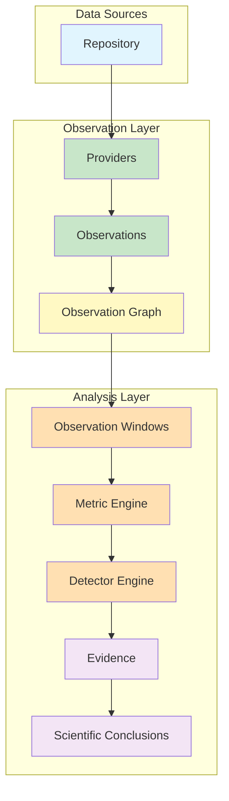
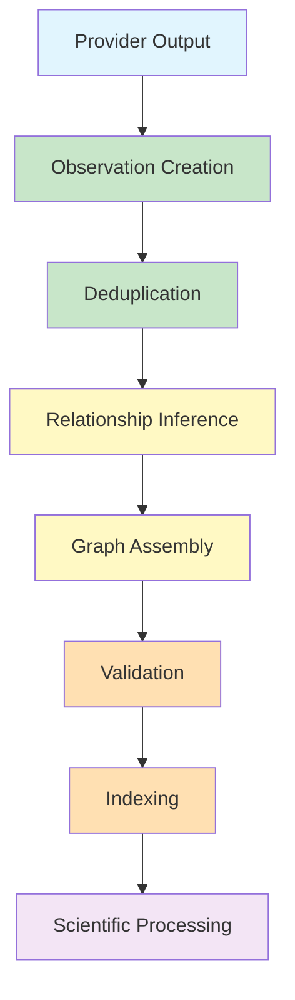
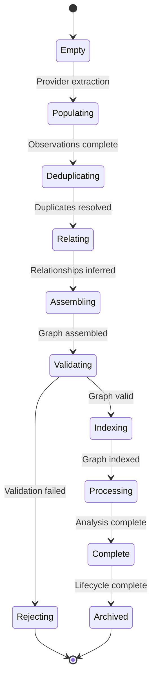

# MIIE v1.6

## 06_OBSERVATION_GRAPH_EVOLUTION.md

### Observation Knowledge Graph Evolution & Scientific Relationship Architecture

| Field | Value |
|-------|-------|
| Document Type | Architectural Specification |
| Version | 1.6.0 |
| Status | Canonical |
| Scope | Observation Graph V2, Knowledge Graph Evolution, Relationship Architecture |
| Audience | Knowledge Graph Architects, Scientific Software Architects, Graph Data Modeling Experts |
| Last Updated | 2026-07-05 |

---

## Table of Contents

1. [Purpose](#1-purpose)
2. [Observation Graph Philosophy](#2-observation-graph-philosophy)
3. [Observation Graph Overview](#3-observation-graph-overview)
4. [Graph Core Concepts](#4-graph-core-concepts)
5. [Node Model](#5-node-model)
6. [Edge Model](#6-edge-model)
7. [Graph Construction](#7-graph-construction)
8. [Relationship Inference](#8-relationship-inference)
9. [Observation Provenance](#9-observation-provenance)
10. [Observation Windows](#10-observation-windows)
11. [Graph Query Model](#11-graph-query-model)
12. [Graph Validation](#12-graph-validation)
13. [Graph Evolution](#13-graph-evolution)
14. [Future Knowledge Graph](#14-future-knowledge-graph)
15. [Graph Constraints](#15-graph-constraints)
16. [Graph Performance](#16-graph-performance)
17. [Graph Governance](#17-graph-governance)
18. [Architecture Decision Summary](#18-architecture-decision-summary)
19. [Appendices](#19-appendices)

---

## 1. Purpose

### 1.1 Why Software Repositories Should Be Modeled as Knowledge Graphs

A software repository is not a collection of independent files. It is a living network of relationships — between commits and the code they change, between developers and the features they build, between tests and the code they verify, between issues and the pull requests that resolve them. These relationships are as important as the entities themselves. A commit that modifies a security-critical module carries different significance than one that updates documentation. A pull request that touches 50 files carries different risk than one that modifies a single line.

Flat data models — tables, lists, key-value stores — capture entities but lose relationships. A table of commits records when each commit occurred, but not how commits relate to each other. A table of file changes records what changed, but not why. The relationships — the causal, temporal, structural, and semantic connections between entities — are the scientific substance of repository intelligence.

Graph-based modeling preserves these relationships. A knowledge graph represents entities as nodes and relationships as edges, creating a network that captures the full structure of repository activity. This structure enables:

**Traceability**: Following the lineage of any observation back to its source. A metric value can be traced to the observations from which it was computed, to the provider that extracted those observations, to the raw data from which they were derived.

**Provenance**: Recording the complete history of how any entity was created. An observation's provenance captures its extraction procedure, quality assessment, and relationship to other observations.

**Context**: Understanding entities in relation to their surroundings. A metric value is more meaningful when its relationships to other metrics, observations, and repository events are visible.

**Scientific Reasoning**: Supporting inference and analysis that depends on relationships. Detecting correlation breakdowns requires understanding how metrics relate to each other. Detecting threshold compression requires understanding how metric values relate to thresholds.

### 1.2 Flat Observations vs. Relational Data vs. Graph Representation vs. Scientific Knowledge Graph

**Flat Observations**: Independent observations with no explicit relationships. Each observation is a standalone fact — a commit count, a coverage ratio, a review latency. Flat observations are simple to produce but lose all relational context.

**Relational Data**: Observations organized in tables with foreign key relationships. Relational data captures some relationships but is limited to predefined schemas. Many-to-many relationships, transitive relationships, and temporal relationships are difficult to represent.

**Graph Representation**: Observations connected by typed edges in a directed graph. Graph representation captures arbitrary relationships, supports traversal, and enables pattern matching. It is more expressive than relational data but requires graph-aware algorithms.

**Scientific Knowledge Graph**: A graph representation enriched with provenance, confidence, quality, and semantic annotations. A scientific knowledge graph supports not just traversal but reasoning — inferring new relationships, assessing confidence, and identifying anomalies. It is the most expressive and most useful representation for scientific analysis.

MIIE's Observation Graph is a scientific knowledge graph. It goes beyond simple graph representation by incorporating the scientific metadata required for rigorous analysis.

---

## 2. Observation Graph Philosophy

### 2.1 Observation-Centric Architecture

The Observation Graph is observation-centric — every node in the graph represents an observation, and every edge represents a relationship between observations. Repository entities (commits, branches, pull requests) are represented as observations, not as independent entities. This observation-centricity ensures that:

**Uniform Interface**: All graph operations work on observations, regardless of their source or type.

**Provenance Traceability**: Every entity in the graph has observation-level provenance.

**Quality Propagation**: Quality assessments propagate through the graph uniformly.

**Scientific Consistency**: All analysis operates on the same data model.

### 2.2 Evidence Relationships

The graph captures evidence relationships — connections between observations that support or contradict scientific conclusions. Evidence relationships include:

**Support**: One observation provides evidence for another. A high coverage ratio supports the conclusion that testing is thorough.

**Contradiction**: One observation contradicts another. A low review latency contradicts the expectation that large changes require thorough review.

**Causation**: One observation causes another. A merge commit is caused by a pull request approval.

**Correlation**: One observation correlates with another. Commit count and file change count are typically correlated.

Evidence relationships enable scientific reasoning — drawing conclusions from the pattern of evidence rather than from individual observations.

### 2.3 Knowledge Representation

The graph represents knowledge — not just data but the relationships and meanings that give data scientific value. Knowledge representation requires:

**Typed Entities**: Each node has a defined type with specific attributes and relationships.

**Typed Relationships**: Each edge has a defined type with specific semantics.

**Constraints**: Rules that govern valid entities and relationships.

**Invariants**: Properties that must always hold.

### 2.4 Scientific Provenance

Every entity in the graph carries scientific provenance — the complete record of how it was created, validated, and related to other entities. Provenance enables:

**Audit**: Verifying that any entity was created correctly.

**Reproducibility**: Recreating any entity from its source data.

**Debugging**: Identifying the source of errors.

**Trust**: Establishing confidence in the graph's contents.

### 2.5 Graph Immutability

Once constructed, the Observation Graph is immutable. New observations create new nodes and edges, but existing nodes and edges are not modified. Immutability ensures:

**Reproducibility**: The graph can be reconstructed identically.

**Auditability**: Any version of the graph can be retrieved.

**Consistency**: No concurrent modification conflicts.

**Temporal Integrity**: The graph accurately represents the state of observations at the time of construction.

### 2.6 Deterministic Graph Construction

Given identical observations, the graph construction process must produce identical graphs. Determinism requires:

**Deterministic Ordering**: Node and edge creation order is deterministic.

**Deterministic Relationship Inference**: Relationship inference follows deterministic rules.

**Deterministic Deduplication**: Duplicate detection and resolution follow deterministic rules.

**Deterministic Validation**: Validation checks follow deterministic rules.

### 2.7 Graph Completeness

The graph must contain all nodes and edges that can be inferred from the observations. Completeness requires:

**Node Completeness**: Every observation is represented as a node.

**Edge Completeness**: Every relationship between observations is represented as an edge.

**Relationship Completeness**: All inferable relationships are explicitly represented.

**Provenance Completeness**: Every entity carries complete provenance.

---

## 3. Observation Graph Overview

### 3.1 High-Level Architecture

The Observation Graph sits between the observation layer and the analysis layer:



### 3.2 Data Flow

1. **Repository**: The repository exists in a specific state.

2. **Providers**: Providers extract raw data from the repository.

3. **Observations**: Raw data is normalized and validated into observations.

4. **Observation Graph**: Observations are assembled into a directed acyclic graph with typed relationships.

5. **Observation Windows**: The graph is partitioned into analysis windows.

6. **Metric Engine**: Metrics are computed from observations within each window.

7. **Detector Engine**: Detectors analyze metric time series for anomalies.

8. **Evidence**: Evidence packages are assembled from observations, metrics, and detector signals.

9. **Scientific Conclusions**: Conclusions are drawn from the evidence.

### 3.3 Graph Role

The Observation Graph is the central data structure that:

**Connects**: Links observations from different providers and time periods.

**Structures**: Organizes observations into a navigable network.

**Enables**: Supports traversal, querying, and analysis.

**Preserves**: Maintains provenance and relationships through the pipeline.

---

## 4. Graph Core Concepts

### 4.1 Graph

A directed acyclic graph (DAG) consisting of nodes and edges. The graph is the container for all observations and their relationships.

**Properties**:
- Acyclic: No directed cycles exist.
- Connected: All nodes are reachable from root nodes.
- Typed: Nodes and edges have defined types.
- Immutable: Once constructed, the graph is not modified.

### 4.2 Node

A vertex in the graph representing an entity. Each node has:
- **Identity**: A unique identifier.
- **Type**: The entity type (commit, metric, provider, etc.).
- **Attributes**: Type-specific properties.
- **Observation Reference**: Link to the underlying observation.

### 4.3 Edge

A directed connection between two nodes representing a relationship. Each edge has:
- **Identity**: A unique identifier.
- **Source Node**: The origin node.
- **Target Node**: The destination node.
- **Type**: The relationship type.
- **Attributes**: Type-specific properties.

### 4.4 Observation

A fact extracted from repository data. Observations are the content of graph nodes.

### 4.5 Provider

The source that extracted observations. Providers are represented as nodes that generate observation nodes.

### 4.6 Metric

A quantitative value computed from observations. Metrics are derived nodes that depend on observation nodes.

### 4.7 Window

A time-bounded partition of observations. Windows are groupings that reference observation nodes.

### 4.8 Evidence

A package of observations, metrics, and detector signals supporting a conclusion. Evidence is an assembly node that references other nodes.

### 4.9 Detector

An algorithm that analyzes metric time series. Detectors are processing nodes that consume metric nodes and produce signal nodes.

### 4.10 Repository

The source repository being analyzed. The repository node is the root of the graph.

### 4.11 Relationship

A semantic connection between two entities. Relationships are represented as edges.

### 4.12 Identity

The unique identifier for a graph entity. Identities are deterministic and reproducible.

### 4.13 Version

The version of a graph entity. Versions track changes to entity content.

### 4.14 Context

The context in which an entity exists — its temporal, structural, and relational setting.

---

## 5. Node Model

### 5.1 Repository Node

**Purpose**: Represents the source repository being analyzed.

**Attributes**:

| Attribute | Type | Description |
|-----------|------|-------------|
| repository_id | UUID | Unique identifier |
| name | String | Repository name |
| url | String | Repository URL |
| default_branch | String | Default branch name |
| language | String | Primary language |
| created_at | Timestamp | Creation time |
| analyzed_at | Timestamp | Analysis time |

**Relationships**:
- GENERATED_BY → Provider nodes
- CONTAINS → Commit nodes
- CONTAINS → Branch nodes
- CONTAINS → Pull Request nodes

### 5.2 Commit Node

**Purpose**: Represents a single commit in the repository.

**Attributes**:

| Attribute | Type | Description |
|-----------|------|-------------|
| commit_id | UUID | Unique identifier |
| hash | String | Git commit hash |
| message | String | Commit message |
| author | String | Author name |
| timestamp | Timestamp | Commit time |
| insertions | Integer | Lines inserted |
| deletions | Integer | Lines deleted |
| files_changed | Integer | Files modified |

**Relationships**:
- PART_OF → Repository node
- PARENT_OF → Commit nodes (parent commits)
- MODIFIES → File nodes
- GENERATED_BY → Provider node
- OBSERVED_IN → Window nodes

### 5.3 Branch Node

**Purpose**: Represents a branch in the repository.

**Attributes**:

| Attribute | Type | Description |
|-----------|------|-------------|
| branch_id | UUID | Unique identifier |
| name | String | Branch name |
| head_commit | Reference | Head commit node |
| created_at | Timestamp | Creation time |
| last_updated | Timestamp | Last update time |
| is_default | Boolean | Whether this is the default branch |

**Relationships**:
- PART_OF → Repository node
- HEAD_COMMIT → Commit node
- GENERATED_BY → Provider node
- OBSERVED_IN → Window nodes

### 5.4 Pull Request Node

**Purpose**: Represents a pull request in the repository.

**Attributes**:

| Attribute | Type | Description |
|-----------|------|-------------|
| pr_id | UUID | Unique identifier |
| number | Integer | PR number |
| title | String | PR title |
| state | String | Open, closed, merged |
| created_at | Timestamp | Creation time |
| merged_at | Timestamp | Merge time (if merged) |
| author | String | Author name |
| additions | Integer | Lines added |
| deletions | Integer | Lines removed |

**Relationships**:
- PART_OF → Repository node
- MERGES_INTO → Branch node
- CREATED_FROM → Commit node (base commit)
- INCLUDES → Commit nodes (commits in PR)
- GENERATED_BY → Provider node
- OBSERVED_IN → Window nodes

### 5.5 Issue Node

**Purpose**: Represents an issue in the repository.

**Attributes**:

| Attribute | Type | Description |
|-----------|------|-------------|
| issue_id | UUID | Unique identifier |
| number | Integer | Issue number |
| title | String | Issue title |
| state | String | Open or closed |
| created_at | Timestamp | Creation time |
| closed_at | Timestamp | Close time (if closed) |
| author | String | Author name |
| labels | List | Issue labels |

**Relationships**:
- PART_OF → Repository node
- REFERENCED_BY → Pull Request nodes
- GENERATED_BY → Provider node
- OBSERVED_IN → Window nodes

### 5.6 Release Node

**Purpose**: Represents a release in the repository.

**Attributes**:

| Attribute | Type | Description |
|-----------|------|-------------|
| release_id | UUID | Unique identifier |
| tag | String | Release tag |
| name | String | Release name |
| created_at | Timestamp | Release time |
| author | String | Author name |

**Relationships**:
- PART_OF → Repository node
- TAGGED_FROM → Commit node
- GENERATED_BY → Provider node
- OBSERVED_IN → Window nodes

### 5.7 Observation Node

**Purpose**: Represents a fact extracted from repository data.

**Attributes**:

| Attribute | Type | Description |
|-----------|------|-------------|
| observation_id | UUID | Unique identifier |
| content | Typed value | The observed fact |
| observation_time | Timestamp | When the fact was recorded |
| extraction_time | Timestamp | When MIIE extracted the fact |
| quality | Quality assessment | Quality score |
| confidence | Confidence assessment | Confidence score |

**Relationships**:
- EXTRACTED_BY → Provider node
- RELATES_TO → Other Observation nodes
- PART_OF → Window nodes
- USED_IN → Metric nodes

### 5.8 Metric Node

**Purpose**: Represents a computed metric value.

**Attributes**:

| Attribute | Type | Description |
|-----------|------|-------------|
| metric_id | UUID | Unique identifier |
| metric_type | String | M-01 through M-07 |
| value | Float | Computed value |
| unit | String | Measurement unit |
| window_id | Reference | Window node |
| computed_at | Timestamp | Computation time |

**Relationships**:
- DERIVED_FROM → Observation nodes
- USED_IN → Detector nodes
- PART_OF → Evidence nodes
- CORRELATED_WITH → Metric nodes

### 5.9 Provider Node

**Purpose**: Represents a data provider.

**Attributes**:

| Attribute | Type | Description |
|-----------|------|-------------|
| provider_id | UUID | Unique identifier |
| provider_type | String | Git, GitHub, Metadata |
| reliability | Float | Provider reliability score |
| version | String | Provider version |

**Relationships**:
- EXTRACTS → Observation nodes
- PART_OF → Repository node

### 5.10 Window Node

**Purpose**: Represents an observation window.

**Attributes**:

| Attribute | Type | Description |
|-----------|------|-------------|
| window_id | UUID | Unique identifier |
| window_type | String | Temporal, commit, hybrid, release |
| start_time | Timestamp | Window start |
| end_time | Timestamp | Window end |
| completeness | Float | Completeness score |
| confidence | Float | Confidence score |

**Relationships**:
- CONTAINS → Observation nodes
- PRECEDES → Window nodes (temporal ordering)
- FOLLOWS → Window nodes
- USED_IN → Metric nodes

### 5.11 Evidence Node

**Purpose**: Represents an evidence package.

**Attributes**:

| Attribute | Type | Description |
|-----------|------|-------------|
| evidence_id | UUID | Unique identifier |
| assembled_at | Timestamp | Assembly time |
| confidence | Float | Overall confidence |
| quality | Float | Overall quality |

**Relationships**:
- CONTAINS → Metric nodes
- CONTAINS → Detector Signal nodes
- DERIVED_FROM → Observation nodes
- SUPPORTS → Conclusion nodes

### 5.12 Detector Node

**Purpose**: Represents a detector algorithm.

**Attributes**:

| Attribute | Type | Description |
|-----------|------|-------------|
| detector_id | UUID | Unique identifier |
| detector_type | String | D-01, D-02, D-03 |
| version | String | Detector version |

**Relationships**:
- ANALYZES → Metric nodes
- PRODUCES → Detector Signal nodes

### 5.13 Score Node

**Purpose**: Represents an integrity or confidence score.

**Attributes**:

| Attribute | Type | Description |
|-----------|------|-------------|
| score_id | UUID | Unique identifier |
| score_type | String | Integrity or Confidence |
| value | Float | Score value |
| computed_at | Timestamp | Computation time |

**Relationships**:
- DERIVED_FROM → Evidence nodes
- SUPPORTS → Conclusion nodes

### 5.14 Report Node

**Purpose**: Represents a generated report.

**Attributes**:

| Attribute | Type | Description |
|-----------|------|-------------|
| report_id | UUID | Unique identifier |
| format | String | JSON, Markdown, Terminal |
| generated_at | Timestamp | Generation time |
| content | Binary | Report content |

**Relationships**:
- DERIVED_FROM → Score nodes
- DERIVED_FROM → Evidence nodes

### 5.15 Future Node Types

| Node Type | Purpose | Relationships |
|-----------|---------|---------------|
| Developer | A contributor to the repository | COMMITS → Commit nodes, REVIEWS → Pull Request nodes |
| Module | A logical code module | CONTAINS → File nodes, DEPENDS_ON → Module nodes |
| CI Job | A CI/CD pipeline execution | TRIGGERS_ON → Commit nodes, PRODUCES → Artifact nodes |
| Artifact | A build artifact | PRODUCED_BY → CI Job nodes, DEPLOYED_TO → Environment nodes |
| Security Alert | A security vulnerability alert | AFFECTS → File nodes, RESOLVED_BY → Pull Request nodes |
| Deployment | A production deployment | DEPLOYS → Artifact nodes, TARGETS → Environment nodes |

---

## 6. Edge Model

### 6.1 Core Relationship Types

| Relationship | Source → Target | Semantics | Example |
|-------------|----------------|-----------|---------|
| GENERATED_BY | Entity → Provider | Entity was created by provider | Commit → Git Provider |
| DERIVED_FROM | Metric → Observation | Metric was computed from observations | M-01 → Commit Messages |
| OBSERVED_IN | Observation → Window | Observation falls within window | Commit Count → Weekly Window |
| PRODUCED_BY | Evidence → Detector | Evidence was produced by detector | Signal → D-01 |
| VALIDATED_BY | Entity → Validator | Entity was validated by validator | Metric → Metric Validator |
| DEPENDS_ON | Entity → Entity | Entity depends on another | M-03 → M-07 |
| PRECEDES | Entity → Entity | Entity temporally precedes another | Window 1 → Window 2 |
| FOLLOWS | Entity → Entity | Entity temporally follows another | Window 2 → Window 1 |
| PART_OF | Entity → Container | Entity is part of a container | Commit → Repository |
| CORRELATED_WITH | Metric → Metric | Metrics are statistically correlated | M-02 ↔ M-06 |
| EVIDENCE_FOR | Observation → Conclusion | Observation provides evidence for conclusion | High Coverage → Thorough Testing |
| SUPPORTS | Evidence → Conclusion | Evidence supports a conclusion | Evidence Package → Integrity Assessment |
| CONTRADICTS | Observation → Conclusion | Observation contradicts a conclusion | Low Review Latency → Thorough Review |
| CAUSES | Entity → Entity | Entity causes another | PR Approval → Merge Commit |

### 6.2 Relationship Semantics

**GENERATED_BY**: Records the provenance of entity creation. Every observation, metric, and evidence package must have a GENERATED_BY relationship to its source provider or processor.

**DERIVED_FROM**: Records the computation lineage of derived entities. Every metric must have DERIVED_FROM relationships to the observations from which it was computed.

**OBSERVED_IN**: Records window membership. Every observation must have OBSERVED_IN relationships to the windows to which it has been assigned.

**PRODUCED_BY**: Records detection lineage. Every detector signal must have a PRODUCED_BY relationship to the detector that produced it.

**VALIDATED_BY**: Records validation lineage. Every validated entity must have a VALIDATED_BY relationship to the validator that verified it.

**DEPENDS_ON**: Records computational dependencies. If metric A depends on metric B, A has a DEPENDS_ON relationship to B.

**PRECEDES / FOLLOWS**: Records temporal ordering. Windows, commits, and other temporally ordered entities use these relationships.

**PART_OF**: Records containment. Entities that are part of containers use this relationship.

**CORRELATED_WITH**: Records statistical relationships between metrics. This relationship is inferred from metric values.

**EVIDENCE_FOR / SUPPORTS / CONTRADICTS**: Records evidence relationships. These relationships connect observations and evidence to scientific conclusions.

**CAUSES**: Records causal relationships. This relationship is inferred from temporal ordering and causal evidence.

### 6.3 Relationship Attributes

Every relationship has:

| Attribute | Type | Description |
|-----------|------|-------------|
| relationship_id | UUID | Unique identifier |
| source_node | Reference | Source node |
| target_node | Reference | Target node |
| relationship_type | Enum | Type of relationship |
| strength | Float [0,1] | Relationship strength |
| confidence | Float [0,1] | Confidence in the relationship |
| metadata | Map | Relationship metadata |

---

## 7. Graph Construction

### 7.1 Construction Pipeline

The graph is constructed through a deterministic pipeline:



### 7.2 Provider Output

Providers produce observation collections — sets of observations with provenance metadata. Each provider contributes its observations independently.

### 7.3 Observation Creation

Raw provider output is normalized into observation nodes. Each observation receives:
- A deterministic identity derived from its content and provenance.
- Quality and confidence assessments.
- Provenance metadata.

### 7.4 Deduplication

Duplicate observations — observations from different providers representing the same fact — are identified and resolved. Resolution strategies include:
- **Priority-based**: The highest-priority provider's observation wins.
- **Recency-based**: The most recent observation wins.
- **Quality-based**: The highest-quality observation wins.

### 7.5 Relationship Inference

Relationships between observations are inferred from:
- **Temporal ordering**: Observations are ordered by timestamp.
- **Structural relationships**: Observations from the same commit, PR, or branch are connected.
- **Provider relationships**: Observations from the same provider are connected.
- **Derived relationships**: Metrics are connected to their source observations.

### 7.6 Graph Assembly

Nodes and edges are assembled into the graph. Assembly follows deterministic ordering to ensure reproducibility.

### 7.7 Validation

The assembled graph is validated against structural invariants:
- Acyclicity: No directed cycles.
- Completeness: All nodes and edges are present.
- Type consistency: Node and edge types are valid.
- Relationship validity: Relationships connect appropriate node types.

### 7.8 Indexing

The validated graph is indexed for efficient traversal. Indexes are created for:
- Node identity lookup.
- Edge source and target lookup.
- Relationship type lookup.
- Temporal ordering.

### 7.9 Scientific Processing

The indexed graph is ready for scientific processing — window construction, metric computation, detection, and evidence assembly.

### 7.10 Deterministic Generation

Graph construction is deterministic:
- **Input Determinism**: Identical provider output produces identical observations.
- **Ordering Determinism**: Node and edge creation follows deterministic ordering.
- **Inference Determinism**: Relationship inference follows deterministic rules.
- **Assembly Determinism**: Graph assembly follows deterministic algorithms.

---

## 8. Relationship Inference

### 8.1 Temporal Relationships

Temporal relationships connect observations ordered in time:

**Commit Ordering**: Commits are ordered by timestamp. Each commit (except the first) has a PRECEDES relationship to the next commit.

**Window Ordering**: Windows are ordered by start time. Each window (except the first) has a PRECEDES relationship to the next window.

**Activity Cycles**: Temporal relationships reveal activity patterns — daily cycles, weekly cycles, release cycles.

### 8.2 Structural Relationships

Structural relationships connect observations that share structural context:

**Commit-File Relationships**: A commit MODIFIES files. These relationships connect commit observations to file observations.

**PR-Commit Relationships**: A pull request INCLUDES commits. These relationships connect PR observations to commit observations.

**Branch-Commit Relationships**: A branch HEAD_COMMIT is a commit. These relationships connect branch observations to commit observations.

### 8.3 Metric Relationships

Metric relationships connect metrics that are statistically related:

**Dependency Relationships**: M-03 DEPENDS_ON M-07. These relationships are defined by the metric specification.

**Correlation Relationships**: M-02 CORRELATED_WITH M-06. These relationships are inferred from metric values.

**Consistency Relationships**: Metrics that should agree are connected by consistency relationships.

### 8.4 Provider Relationships

Provider relationships connect observations from the same or different providers:

**Same-Provider Relationships**: Observations from the same provider are connected by provider lineage.

**Cross-Provider Relationships**: Observations from different providers representing the same fact are connected by cross-validation relationships.

### 8.5 Evidence Relationships

Evidence relationships connect observations to scientific conclusions:

**Support Relationships**: Observations that support a conclusion are connected by SUPPORTS relationships.

**Contradiction Relationships**: Observations that contradict a conclusion are connected by CONTRADICTS relationships.

**Causation Relationships**: Observations that cause other observations are connected by CAUSES relationships.

### 8.6 Future Semantic Relationships

Future semantic relationships would connect observations based on meaning:

**Code Similarity**: Commits that modify similar code are connected by similarity relationships.

**Developer Collaboration**: Developers who review each other's code are connected by collaboration relationships.

**Feature Relationships**: Commits that contribute to the same feature are connected by feature relationships.

### 8.7 Future Causal Relationships

Future causal relationships would connect observations based on causal mechanisms:

**Event Causation**: Events that cause other events are connected by causal relationships.

**Intervention Causation**: Deliberate interventions and their effects are connected by intervention relationships.

**Cascade Causation**: Chain reactions of changes are connected by cascade relationships.

### 8.8 Inference Philosophy

Relationship inference follows these principles:

**Conservatism**: Only infer relationships that are strongly supported by evidence.

**Transparency**: Record how each relationship was inferred.

**Confidence**: Assign confidence scores to inferred relationships.

**Reproducibility**: Inference must be deterministic given identical observations.

---

## 9. Observation Provenance

### 9.1 Origin Provenance

Origin provenance records where an observation came from:

**Source**: The raw data from which the observation was extracted.

**Provider**: The provider that extracted the observation.

**Procedure**: The extraction algorithm applied.

**Parameters**: The parameters used for extraction.

**Context**: The repository state at extraction time.

### 9.2 Transformation Provenance

Transformation provenance records how an observation was transformed:

**Normalization**: Any normalization applied to the raw data.

**Validation**: Any validation checks applied.

**Quality Assessment**: Quality scores assigned.

**Confidence Assessment**: Confidence scores assigned.

**Deduplication**: Any deduplication applied.

### 9.3 Validation Provenance

Validation provenance records how an observation was validated:

**Schema Validation**: Whether the observation satisfies its schema.

**Constraint Validation**: Whether the observation satisfies its constraints.

**Cross-Validation**: Whether the observation agrees with observations from other providers.

**Temporal Validation**: Whether the observation's timestamp is consistent.

### 9.4 Confidence Provenance

Confidence provenance records how confidence was computed:

**Source Factors**: The factors used to compute confidence.

**Weighting**: The weights applied to each factor.

**Computation**: The formula used.

**Result**: The resulting confidence score.

### 9.5 Quality Provenance

Quality provenance records how quality was assessed:

**Dimensions**: The quality dimensions assessed.

**Scores**: The score for each dimension.

**Weighting**: The weights applied to each dimension.

**Computation**: The formula used.

**Result**: The resulting quality score.

### 9.6 Provider Lineage

Provider lineage traces the complete path from raw data to observation:

**Raw Data** → **Provider Extraction** → **Normalization** → **Validation** → **Quality Assessment** → **Observation**

Every step in this path is recorded in the observation's provenance.

### 9.7 Relationship Lineage

Relationship lineage traces how a relationship was inferred:

**Source Observation** → **Inference Rule** → **Target Observation** → **Relationship**

Every inference is recorded with its rule and confidence.

### 9.8 Scientific Traceability

Scientific traceability ensures that any output of MIIE can be traced back to its source observations:

**Metric Traceability**: A metric value can be traced to the observations from which it was computed.

**Detector Traceability**: A detector signal can be traced to the metrics and observations that produced it.

**Evidence Traceability**: An evidence package can be traced to all its components.

**Conclusion Traceability**: A scientific conclusion can be traced to the evidence that supports it.

---

## 10. Observation Windows

### 10.1 Window Representation in the Graph

Windows are represented as nodes in the observation graph. Each window node:

**Contains**: References to all observation nodes within the window.

**Orders**: PRECEDES/FOLLOWS relationships to adjacent windows.

**Metadata**: Window type, time range, completeness, and confidence.

### 10.2 Temporal Windows

Temporal windows are represented as:

```
WindowNode {
    window_type: "temporal"
    start_time: <timestamp>
    end_time: <timestamp>
    contains: [ObservationNodes within time range]
    precedes: <next WindowNode>
    follows: <previous WindowNode>
}
```

Temporal windows partition the graph by time, creating a sequence of non-overlapping time periods.

### 10.3 Commit Windows

Commit windows are represented as:

```
WindowNode {
    window_type: "commit"
    commit_count: <integer>
    contains: [ObservationNodes for commits in window]
    precedes: <next WindowNode>
    follows: <previous WindowNode>
}
```

Commit windows partition the graph by activity, creating windows with fixed commit counts.

### 10.4 Hybrid Windows

Hybrid windows combine temporal and commit-based strategies:

```
WindowNode {
    window_type: "hybrid"
    max_duration: <duration>
    min_commits: <integer>
    max_commits: <integer>
    contains: [ObservationNodes meeting criteria]
    precedes: <next WindowNode>
    follows: <previous WindowNode>
}
```

Hybrid windows adapt to activity levels while maintaining temporal bounds.

### 10.5 Release Windows

Release windows partition by release events:

```
WindowNode {
    window_type: "release"
    release_tag: <string>
    contains: [ObservationNodes since previous release]
    precedes: <next WindowNode>
    follows: <previous WindowNode>
}
```

Release windows align analysis with software delivery cycles.

### 10.6 Streaming Windows

Streaming windows are a future capability for continuous processing:

```
WindowNode {
    window_type: "streaming"
    window_size: <duration>
    slide_interval: <duration>
    contains: [Recent ObservationNodes]
    precedes: <next WindowNode>
    follows: <previous WindowNode>
}
```

Streaming windows slide forward in time, dropping old observations.

### 10.7 Window-Observation Relationships

Windows connect to observations through CONTAINS relationships:

```
WindowNode --CONTAINS--> ObservationNode
WindowNode --CONTAINS--> ObservationNode
...
```

Every observation must have at least one CONTAINS relationship to a window. Orphan observations (not in any window) indicate a window construction error.

---

## 11. Graph Query Model

### 11.1 Scientific Queries

Scientific queries extract information for analysis:

**Metric Provenance**: Given a metric node, find all observation nodes from which it was derived.

**Observation Impact**: Given an observation node, find all metric and detector nodes that depend on it.

**Confidence Propagation**: Given a set of observation nodes, compute the confidence of metrics derived from them.

### 11.2 Repository Traversal

Repository traversal navigates the repository structure:

**Commit History**: Traverse from HEAD commit through parent commits.

**File History**: Traverse from a file through the commits that modified it.

**Branch Structure**: Traverse from branches through their commit histories.

### 11.3 Metric Traversal

Metric traversal navigates metric relationships:

**Dependency Traversal**: Traverse from a metric through its dependencies.

**Correlation Traversal**: Traverse from a metric to correlated metrics.

**Impact Traversal**: Traverse from a metric to detectors that use it.

### 11.4 Evidence Traversal

Evidence traversal navigates evidence relationships:

**Evidence Assembly**: Traverse from an evidence package to its components.

**Confidence Chain**: Traverse from a conclusion through its evidence to source observations.

**Contradiction Detection**: Traverse from a conclusion to contradicting observations.

### 11.5 Relationship Traversal

Relationship traversal navigates the relationship network:

**Forward Traversal**: From a node, follow outgoing edges to target nodes.

**Backward Traversal**: From a node, follow incoming edges to source nodes.

**Breadth-First**: Explore all nodes at the same distance before moving further.

**Depth-First**: Explore as far as possible along each branch before backtracking.

### 11.6 Future Semantic Queries

Future semantic queries would use meaning-based traversal:

**Code Similarity**: Find commits that modify similar code.

**Concept Relationships**: Find observations related to the same concept.

**Impact Analysis**: Find all entities affected by a change.

---

## 12. Graph Validation

### 12.1 Structural Validation

Structural validation verifies the graph's fundamental properties:

**Acyclicity**: The graph contains no directed cycles. Verified by topological sorting.

**Completeness**: Every node is reachable from a root node and can reach a leaf node. Verified by reachability analysis.

**Node Validity**: Every node has a valid type and required attributes. Verified by schema validation.

**Edge Validity**: Every edge connects valid node types. Verified by type compatibility checks.

### 12.2 Relationship Validation

Relationship validation verifies relationship correctness:

**Type Consistency**: Relationships connect appropriate node types. COMMIT can MODIFIES file, but METRIC cannot MODIFIES file.

**Direction Consistency**: Relationship directions are correct. GENERATED_BY points from entity to provider, not vice versa.

**Semantic Consistency**: Relationships make semantic sense. An observation cannot be DERIVED_FROM a metric (the direction is wrong).

### 12.3 Integrity Validation

Integrity validation verifies graph integrity:

**No Orphan Nodes**: Every node has at least one edge (except root nodes).

**No Orphan Edges**: Every edge connects two existing nodes.

**No Duplicate Nodes**: No two nodes represent the same entity.

**No Duplicate Edges**: No two edges represent the same relationship.

### 12.4 Cycle Detection

Cycle detection ensures the graph is acyclic:

**Algorithm**: Topological sorting detects cycles. If topological sorting fails, a cycle exists.

**Response**: If a cycle is detected, the cycle is reported and the graph is rejected.

**Prevention**: Cycle detection during construction prevents cycles from being introduced.

### 12.5 Duplicate Detection

Duplicate detection ensures no entity is represented twice:

**Node Duplicates**: Two nodes with the same identity and type.

**Edge Duplicates**: Two edges with the same source, target, and type.

**Resolution**: Duplicates are merged, with the more complete or higher-quality entity retained.

### 12.6 Missing Relationships

Missing relationship detection ensures all expected relationships exist:

**Structural Completeness**: All commits in a PR should have INCLUDES relationships to the PR.

**Temporal Completeness**: All windows should have PRECEDES/FOLLOWS relationships to adjacent windows.

**Provenance Completeness**: All observations should have GENERATED_BY relationships to providers.

### 12.7 Disconnected Components

Disconnected component detection ensures the graph is connected:

**Root Reachability**: All nodes are reachable from root (repository) nodes.

**Leaf Reachability**: All nodes can reach leaf (conclusion) nodes.

**Response**: Disconnected components are reported and investigated.

### 12.8 Acceptance Criteria

| Criterion | Threshold | Response |
|-----------|-----------|----------|
| Acyclicity | 0 cycles | Reject graph |
| Completeness | 100% reachability | Investigate orphans |
| Node validity | 100% valid | Reject invalid nodes |
| Edge validity | 100% valid | Reject invalid edges |
| Duplicates | 0 duplicates | Merge duplicates |
| Missing relationships | ≤ 5% missing | Investigate gaps |
| Disconnected components | 0 components | Investigate disconnections |

---

## 13. Graph Evolution

### 13.1 Versioning

The graph supports versioning:

**Schema Version**: The version of the graph schema (node types, edge types, attributes).

**Data Version**: The version of the graph data (specific nodes and edges).

**API Version**: The version of the graph query interface.

### 13.2 Backward Compatibility

Graph evolution maintains backward compatibility:

**Additive Changes**: New node types, edge types, and attributes are additive and backward-compatible.

**Deprecation**: Old features are deprecated before removal, with migration guides.

**Version Coexistence**: Multiple schema versions can coexist during transition periods.

### 13.3 Graph Migration

Graph migration transforms old graphs to new schemas:

**Automated Migration**: Scripts that transform old graphs to new schemas.

**Validation**: Migrated graphs are validated against the new schema.

**Rollback**: Migration can be reversed if problems are detected.

### 13.4 Schema Evolution

Schema evolution follows these principles:

**Additive**: New features are added without removing old features.

**Documented**: All changes are documented with rationale.

**Reviewed**: All changes undergo scientific review.

**Tested**: All changes are validated with comprehensive tests.

### 13.5 Future Extensibility

The graph is designed for extensibility:

**New Node Types**: New entity types can be added without modifying existing types.

**New Edge Types**: New relationship types can be added without modifying existing types.

**New Attributes**: New attributes can be added to existing types.

**New Queries**: New query patterns can be supported without modifying existing queries.

### 13.6 Scientific Stability

The graph maintains scientific stability:

**Core Semantics**: The meaning of core node types and edge types does not change.

**Provenance Integrity**: Provenance records are never invalidated.

**Relationship Semantics**: The semantics of core relationships do not change.

**Validation Consistency**: Validation rules do not change in ways that invalidate existing graphs.

---

## 14. Future Knowledge Graph

### 14.1 Semantic Graph

A semantic graph enriches observations with meaning:

**Concept Nodes**: Nodes representing concepts (security, performance, maintainability).

**Semantic Edges**: Edges representing semantic relationships (is-a, part-of, related-to).

**Ontology**: A formal ontology defining concepts and relationships.

**Inference**: Reasoning over semantic relationships to infer new knowledge.

### 14.2 Causal Graph

A causal graph models cause-and-effect relationships:

**Causal Nodes**: Nodes representing events and interventions.

**Causal Edges**: Edges representing causal mechanisms.

**Intervention Analysis**: Identifying the effects of deliberate interventions.

**Counterfactual Reasoning**: Reasoning about what would have happened without an intervention.

### 14.3 Repository Intelligence Graph

A repository intelligence graph captures high-level repository properties:

**Health Nodes**: Nodes representing repository health metrics.

**Risk Nodes**: Nodes representing risk assessments.

**Quality Nodes**: Nodes representing quality assessments.

**Trend Nodes**: Nodes representing trends over time.

### 14.4 Cross-Repository Graph

A cross-repository graph connects observations across repositories:

**Dependency Edges**: Edges connecting repositories through dependencies.

**Fork Edges**: Edges connecting forks to their origins.

**Similarity Edges**: Edges connecting repositories with similar characteristics.

**Ecosystem Analysis**: Analyzing patterns across entire ecosystems.

### 14.5 Developer Graph

A developer graph models contributor activity:

**Developer Nodes**: Nodes representing individual contributors.

**Contribution Edges**: Edges connecting developers to their contributions.

**Collaboration Edges**: Edges connecting developers who collaborate.

**Expertise Edges**: Edges connecting developers to their areas of expertise.

### 14.6 AI-Generated Activity Graph

An AI-generated activity graph identifies artificial contributions:

**AI Signature Nodes**: Nodes representing patterns typical of AI-generated code.

**Detection Edges**: Edges connecting suspected AI-generated content to detection signals.

**Confidence Edges**: Edges representing confidence in AI-generation assessments.

---

## 15. Graph Constraints

### 15.1 Allowed Relationships

| Source Type | Allowed Target Types | Relationship Types |
|------------|---------------------|-------------------|
| Commit | Commit | PARENT_OF, PRECEDES |
| Commit | File | MODIFIES |
| Commit | Repository | PART_OF |
| PR | Commit | INCLUDES, CREATED_FROM |
| PR | Branch | MERGES_INTO |
| PR | Repository | PART_OF |
| Observation | Provider | GENERATED_BY |
| Observation | Window | OBSERVED_IN |
| Metric | Observation | DERIVED_FROM |
| Metric | Metric | DEPENDS_ON, CORRELATED_WITH |
| Detector | Metric | ANALYZES |
| Detector Signal | Detector | PRODUCED_BY |
| Evidence | Metric | CONTAINS |
| Evidence | Detector Signal | CONTAINS |
| Score | Evidence | DERIVED_FROM |
| Window | Window | PRECEDES, FOLLOWS |
| Window | Observation | CONTAINS |

### 15.2 Forbidden Relationships

| Source Type | Forbidden Target Types | Reason |
|------------|----------------------|--------|
| Metric | Repository | Metrics do not directly relate to repositories |
| Detector | Repository | Detectors analyze metrics, not repositories |
| Score | Observation | Scores derive from evidence, not observations |
| Window | Metric | Windows contain observations, not metrics |
| Evidence | Repository | Evidence aggregates observations, not repositories |

### 15.3 Identity Rules

- Every node has a unique identity.
- Node identities are deterministic.
- Node identities are immutable.
- Edge identities are unique.

### 15.4 Deterministic Ordering

- Node creation follows deterministic ordering.
- Edge creation follows deterministic ordering.
- Relationship inference follows deterministic rules.

### 15.5 Immutability

- Nodes are immutable after creation.
- Edges are immutable after creation.
- The graph is immutable after construction.

### 15.6 Ownership

- Providers own observation nodes.
- The graph builder owns relationship edges.
- The window builder owns window nodes.

### 15.7 Serialization

- The graph supports JSON serialization.
- Serialization is complete (all data is preserved).
- Serialization is round-trippable (deserialize produces identical graph).

### 15.8 Version Compatibility

- Graphs from older versions can be loaded by newer versions.
- Graphs from newer versions cannot be loaded by older versions (forward compatibility not required).

---

## 16. Graph Performance

### 16.1 Scalability

The graph must scale to large repositories:

| Repository Size | Node Count | Edge Count | Construction Time |
|----------------|-----------|-----------|-------------------|
| Small (< 10K LOC) | < 10,000 | < 50,000 | < 30 seconds |
| Medium (10K–100K LOC) | 10,000–100,000 | 50,000–500,000 | < 5 minutes |
| Large (100K–1M LOC) | 100,000–1,000,000 | 500,000–5,000,000 | < 30 minutes |
| Very Large (> 1M LOC) | > 1,000,000 | > 5,000,000 | < 4 hours |

### 16.2 Incremental Updates

The graph supports incremental updates:

**New Observations**: New observations are added without reconstructing the entire graph.

**New Relationships**: New relationships are inferred without recomputing all relationships.

**Window Updates**: Windows are updated as new observations arrive.

### 16.3 Streaming

Future streaming support:

**Real-time Updates**: The graph is updated as observations arrive.

**Sliding Windows**: Windows slide forward as new observations are added.

**Incremental Metrics**: Metrics are recomputed incrementally.

### 16.4 Caching

Graph caching strategies:

**Node Cache**: Frequently accessed nodes are cached.

**Edge Cache**: Frequently traversed edges are cached.

**Query Cache**: Frequently executed queries are cached.

**Invalidation**: Cache is invalidated when the graph is updated.

### 16.5 Distributed Construction

Future distributed construction:

**Parallel Providers**: Providers execute in parallel.

**Sharded Graph**: The graph is partitioned across machines.

**Distributed Traversal**: Graph traversal is distributed across machines.

**Consistency**: Distributed construction maintains consistency.

### 16.6 Future Optimization

Future optimization strategies:

**Compression**: Graph compression to reduce memory usage.

**Indexing**: Advanced indexing for faster traversal.

**Query Optimization**: Query planning for efficient execution.

**Lazy Evaluation**: Deferred computation for unused graph portions.

---

## 17. Graph Governance

### 17.1 Modification Rules

Graph modifications require:

**Scientific Justification**: Why the modification is needed.

**Impact Assessment**: How the modification affects existing graphs.

**Validation**: How the modification will be validated.

**Documentation**: Complete documentation of the modification.

### 17.2 Review Requirements

Graph changes require:

**Technical Review**: Code review by graph architecture experts.

**Scientific Review**: Review by measurement scientists.

**Validation Review**: Review of validation results.

**Documentation Review**: Review of documentation completeness.

### 17.3 Validation Requirements

All graph modifications must satisfy:

**Structural Validation**: The modified graph satisfies structural invariants.

**Relationship Validation**: All relationships are valid.

**Integrity Validation**: No duplicates, orphans, or disconnected components.

**Performance Validation**: Performance is within acceptable bounds.

### 17.4 Scientific Approval

Scientific changes require:

**Theoretical Justification**: The change is scientifically sound.

**Empirical Evidence**: Evidence supports the change.

**Peer Review**: The change is reviewed by domain experts.

**Documentation**: The change is fully documented.

### 17.5 Versioning Policy

Graph versioning follows:

**Major Version**: Breaking changes to node types, edge types, or query interface.

**Minor Version**: Additive changes (new node types, edge types, attributes).

**Patch Version**: Bug fixes, performance improvements, documentation.

---

## 18. Architecture Decision Summary

### 18.1 ADR-001: Graph as Central Data Structure

**Decision**: The Observation Graph is the central data structure for repository intelligence.

**Rationale**: Graphs naturally represent the relationships between repository entities. They enable traceability, provenance, and scientific reasoning that flat data models cannot support.

**Trade-offs**:
- (+) Natural representation of relationships
- (+) Enables traversal and pattern matching
- (+) Supports provenance and traceability
- (-) More complex than flat data models
- (-) Requires graph-aware algorithms

### 18.2 ADR-002: Directed Acyclic Graph

**Decision**: The graph is a directed acyclic graph (DAG).

**Rationale**: DAGs enable topological ordering, cycle-free traversal, and deterministic processing. Cycles would create circular dependencies that prevent computation.

**Trade-offs**:
- (+) Deterministic traversal order
- (+) Cycle-free processing
- (+) Efficient dependency resolution
- (-) No circular relationships allowed
- (-) Limited expressiveness for some patterns

### 18.3 ADR-003: Typed Nodes and Edges

**Decision**: Nodes and edges have defined types with specific attributes and relationships.

**Rationale**: Type safety ensures that relationships connect appropriate entities and that attributes are valid.

**Trade-offs**:
- (+) Type safety
- (+) Schema validation
- (+) Clear semantics
- (-) Less flexible than untyped graphs
- (-) Requires schema evolution for new types

### 18.4 ADR-004: Observation-Centric Architecture

**Decision**: Every node represents an observation, and every edge represents a relationship between observations.

**Rationale**: Observation-centricity ensures uniform interface, provenance traceability, and scientific consistency.

**Trade-offs**:
- (+) Uniform interface
- (+) Complete provenance
- (+) Scientific consistency
- (-) May require wrapping non-observation entities

### 18.5 ADR-005: Graph Immutability

**Decision**: The graph is immutable after construction.

**Rationale**: Immutability ensures reproducibility, auditability, and temporal integrity.

**Trade-offs**:
- (+) Reproducibility
- (+) Auditability
- (+) No concurrent modification conflicts
- (-) Requires new graph for updates
- (-) Higher memory usage

### 18.6 ADR-006: Deterministic Construction

**Decision**: Graph construction is deterministic given identical observations.

**Rationale**: Determinism ensures reproducibility and enables verification.

**Trade-offs**:
- (+) Reproducibility
- (+) Verifiability
- (+) Debuggability
- (-) May require deterministic ordering overhead

---

## 19. Appendices

### Appendix A: Complete Node Matrix

| Node Type | Purpose | Key Attributes | Owner |
|-----------|---------|---------------|-------|
| Repository | Source repository | name, url, language | Repository Provider |
| Commit | Single commit | hash, message, timestamp | Git Provider |
| Branch | Repository branch | name, head_commit | Git Provider |
| Pull Request | Pull request | number, title, state | GitHub Provider |
| Issue | Issue tracker entry | number, title, state | GitHub Provider |
| Release | Release tag | tag, name, created_at | GitHub Provider |
| Observation | Extracted fact | content, quality, confidence | Creating Provider |
| Metric | Computed metric | metric_type, value, unit | Metric Engine |
| Provider | Data source | provider_type, reliability | System |
| Window | Analysis window | window_type, start_time | Window Builder |
| Evidence | Evidence package | confidence, quality | Evidence Engine |
| Detector | Detection algorithm | detector_type, version | System |
| Score | Integrity/confidence | score_type, value | Scoring Engine |
| Report | Generated report | format, generated_at | Reporter |

### Appendix B: Complete Edge Matrix

| Edge Type | Source → Target | Semantics | Required |
|-----------|----------------|-----------|----------|
| GENERATED_BY | Entity → Provider | Created by provider | Yes |
| DERIVED_FROM | Metric → Observation | Computed from | Yes |
| OBSERVED_IN | Observation → Window | Falls within | Yes |
| PRODUCED_BY | Signal → Detector | Produced by | Yes |
| VALIDATED_BY | Entity → Validator | Validated by | No |
| DEPENDS_ON | Metric → Metric | Depends on | Conditional |
| PRECEDES | Entity → Entity | Temporally precedes | No |
| FOLLOWS | Entity → Entity | Temporally follows | No |
| PART_OF | Entity → Container | Part of | Yes |
| MODIFIES | Commit → File | Modifies file | Yes |
| INCLUDES | PR → Commit | Includes commit | Yes |
| CREATED_FROM | PR → Commit | Created from | Yes |
| MERGES_INTO | PR → Branch | Merges into | Yes |
| HEAD_COMMIT | Branch → Commit | Head commit | Yes |
| PARENT_OF | Commit → Commit | Parent commit | Yes |
| CORRELATED_WITH | Metric → Metric | Statistically correlated | No |
| EVIDENCE_FOR | Observation → Conclusion | Evidence for | No |
| SUPPORTS | Evidence → Conclusion | Supports | No |
| CONTRADICTS | Observation → Conclusion | Contradicts | No |
| CAUSES | Entity → Entity | Causes | No |
| CONTAINS | Window → Observation | Contains | Yes |
| ANALYZES | Detector → Metric | Analyzes | Yes |

### Appendix C: Relationship Matrix

| Relationship | Temporal | Structural | Metric | Provider | Evidence | Future Semantic |
|-------------|----------|-----------|--------|----------|----------|----------------|
| GENERATED_BY | — | — | — | ✓ | — | — |
| DERIVED_FROM | — | — | ✓ | — | — | — |
| OBSERVED_IN | ✓ | — | — | — | — | — |
| PRODUCED_BY | — | — | — | ✓ | — | — |
| DEPENDS_ON | — | — | ✓ | — | — | — |
| PRECEDES | ✓ | — | — | — | — | — |
| FOLLOWS | ✓ | — | — | — | — | — |
| PART_OF | — | ✓ | — | — | — | — |
| MODIFIES | — | ✓ | — | — | — | — |
| CORRELATED_WITH | — | — | ✓ | — | — | — |
| EVIDENCE_FOR | — | — | — | — | ✓ | — |
| SUPPORTS | — | — | — | — | ✓ | — |
| CONTRADICTS | — | — | — | — | ✓ | — |
| CAUSES | ✓ | — | — | — | ✓ | — |

### Appendix D: Graph Lifecycle



### Appendix E: Graph Validation Checklist

| Check | Method | Threshold | Response |
|-------|--------|-----------|----------|
| Acyclicity | Topological sort | 0 cycles | Reject |
| Completeness | Reachability | 100% | Investigate |
| Node validity | Schema validation | 100% | Reject invalid |
| Edge validity | Type compatibility | 100% | Reject invalid |
| Duplicates | Identity comparison | 0 | Merge |
| Missing relationships | Completeness check | ≤ 5% | Investigate |
| Disconnected components | Component analysis | 0 | Investigate |
| Provenance completeness | Provenance check | 100% | Reject incomplete |

### Appendix F: Future Graph Roadmap

| Phase | Capability | Timeline | Priority |
|-------|-----------|----------|----------|
| V2.0 | Current graph architecture | Current | Complete |
| V2.1 | Incremental updates | Near-term | High |
| V2.2 | Streaming support | Medium-term | Medium |
| V2.3 | Semantic graph | Medium-term | Medium |
| V2.4 | Cross-repository graph | Long-term | Low |
| V2.5 | Causal graph | Long-term | Low |
| V2.6 | AI activity graph | Long-term | Low |

### Appendix G: Knowledge Graph Glossary

| Term | Definition |
|------|-----------|
| DAG | Directed Acyclic Graph |
| Edge | A directed connection between two nodes |
| Graph | A collection of nodes and edges |
| Node | A vertex in a graph representing an entity |
| Provenance | The complete history of how an entity was created |
| Relationship | A semantic connection between two entities |
| Schema | The definition of valid node types, edge types, and attributes |
| Topological Sort | A linear ordering of nodes respecting edge directions |
| Traversal | Navigating the graph by following edges |
| Knowledge Graph | A graph enriched with semantic annotations and provenance |

---

*This document is the architectural constitution of the MIIE Observation Graph. Every graph design decision must satisfy this specification.*
