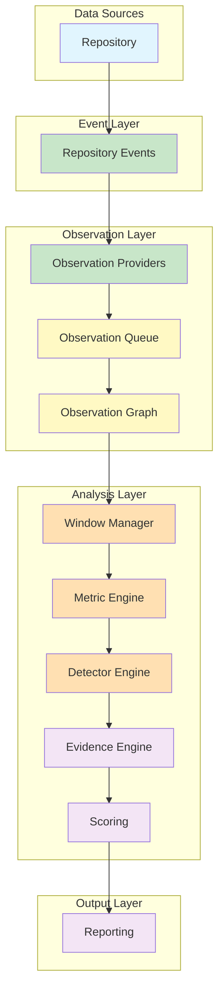
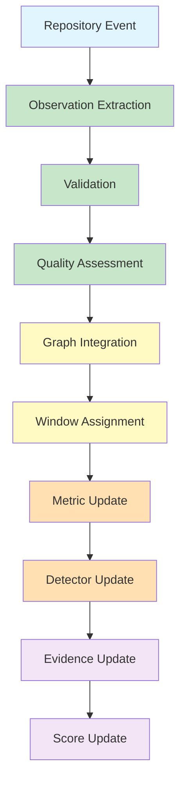
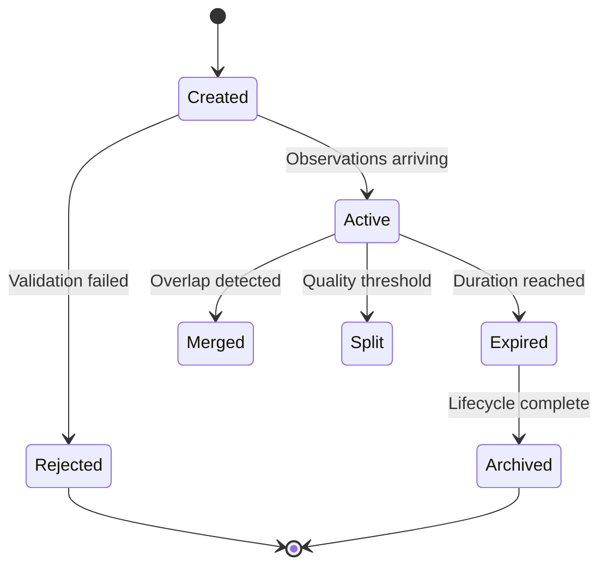
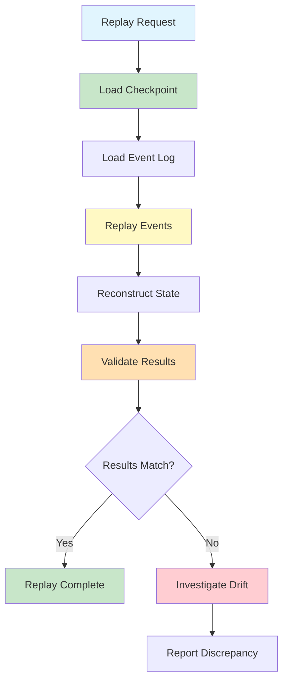

# MIIE v1.6

## 07_STREAMING_ANALYSIS_ARCHITECTURE.md

### Continuous Observation Processing & Streaming Measurement Intelligence Architecture

| Field | Value |
|-------|-------|
| Document Type | Architectural Specification |
| Version | 1.6.0 |
| Status | Canonical |
| Scope | Streaming Analysis, Event-Driven Processing, Incremental Computation, Fault Tolerance |
| Audience | Distributed Systems Architects, Event-Driven Systems Architects, Streaming Analytics Researchers |
| Last Updated | 2026-07-05 |

---

## Table of Contents

1. [Purpose](#1-purpose)
2. [Streaming Philosophy](#2-streaming-philosophy)
3. [Streaming Architecture](#3-streaming-architecture)
4. [Repository Event Model](#4-repository-event-model)
5. [Observation Streaming](#5-observation-streaming)
6. [Streaming Observation Graph](#6-streaming-observation-graph)
7. [Window Management](#7-window-management)
8. [Incremental Metric Computation](#8-incremental-metric-computation)
9. [Streaming Detector Execution](#9-streaming-detector-execution)
10. [Evidence Evolution](#10-evidence-evolution)
11. [Checkpointing](#11-checkpointing)
12. [Replay Architecture](#12-replay-architecture)
13. [Fault Tolerance](#13-fault-tolerance)
14. [Performance Architecture](#14-performance-architecture)
15. [Streaming Governance](#15-streaming-governance)
16. [Future Evolution](#16-future-evolution)
17. [Threats to Validity](#17-threats-to-validity)
18. [Architecture Decision Summary](#18-architecture-decision-summary)
19. [Appendices](#19-appendices)

---

## 1. Purpose

### 1.1 Why Continuous Repository Analysis Is Valuable

Software repositories are living systems. They change continuously — commits arrive, pull requests are opened and merged, issues are filed and resolved, releases are published. This continuous activity generates a stream of events that, when analysed in real time, can reveal patterns that batch analysis misses.

Continuous repository analysis provides:

**Timely Detection**: Integrity violations are detected as they occur, not after a batch analysis run. A sudden change in commit patterns can be flagged within minutes, not days.

**Trend Identification**: Gradual changes in metric behaviour can be tracked continuously, revealing trends that batch analysis — which compares discrete time periods — may miss.

**Proactive Monitoring**: Repository health can be monitored continuously, enabling early intervention before problems become severe.

**Responsive Adaptation**: The analysis system can adapt to changes in repository activity, adjusting windows, thresholds, and detection parameters as the repository evolves.

### 1.2 Batch Analysis vs. Streaming Analysis

| Dimension | Batch Analysis | Streaming Analysis |
|-----------|---------------|-------------------|
| Trigger | Scheduled or on-demand | Event-driven |
| Latency | Minutes to hours | Seconds to minutes |
| Data Scope | Complete time period | Incremental updates |
| Window Model | Fixed, pre-defined | Dynamic, adaptive |
| Metric Computation | Full recomputation | Incremental update |
| Detector Execution | Full re-analysis | Targeted re-analysis |
| Resource Usage | Burst, then idle | Continuous, steady |
| Complexity | Lower | Higher |
| Consistency | Strong (complete data) | Eventual (incremental data) |
| Scientific Rigour | Higher (complete evidence) | Lower (partial evidence) |

Batch analysis remains valuable for comprehensive audits and historical reconstruction. Streaming analysis complements batch analysis by providing timely, incremental insights.

### 1.3 Scientific Benefits

Streaming analysis provides scientific benefits that batch analysis cannot:

**Temporal Resolution**: Streaming analysis captures the exact timing of events, enabling more precise temporal analysis.

**Causal Ordering**: Streaming analysis preserves the causal ordering of events, enabling more accurate causal inference.

**Incremental Evidence**: Streaming analysis accumulates evidence incrementally, enabling confidence to evolve as evidence grows.

**Anomaly Detection**: Streaming analysis can detect anomalies in real time, before they propagate through the system.

### 1.4 Engineering Trade-offs

Streaming analysis introduces engineering trade-offs:

**Complexity**: Streaming systems are more complex than batch systems, requiring event ordering, checkpointing, and fault tolerance.

**Consistency**: Streaming analysis may produce results based on incomplete data, requiring careful handling of uncertainty.

**Resource Usage**: Streaming systems consume resources continuously, unlike batch systems that consume resources intermittently.

**Scientific Rigour**: Streaming results may be less definitive than batch results, requiring clear communication of uncertainty.

### 1.5 Future Applications

Future applications of streaming analysis include:

**Real-time Dashboards**: Live dashboards showing repository health, metric trends, and integrity status.

**Continuous Monitoring**: Automated monitoring that alerts when anomalies are detected.

**Cross-repository Intelligence**: Streaming analysis across multiple repositories to detect ecosystem-wide patterns.

**Event Sourcing**: Complete recording of all repository events for replay and audit.

---

## 2. Streaming Philosophy

### 2.1 Observation-First

Streaming analysis maintains the observation-first principle. Every computation — metric, detector, evidence — originates from observations. Observations arrive as events, but they are still the atomic scientific entity. No computation bypasses the observation layer.

### 2.2 Event-Driven Architecture

The streaming architecture is event-driven. Repository events trigger observation extraction, which triggers metric computation, which triggers detection, which triggers evidence assembly. Each stage reacts to events from the previous stage.

Event-driven architecture provides:

**Responsiveness**: The system reacts immediately to new events.

**Loose Coupling**: Stages are decoupled through event queues.

**Scalability**: Stages can be scaled independently.

**Fault Isolation**: Failures in one stage do not cascade to others.

### 2.3 Scientific Determinism

Given the same sequence of events, the streaming system must produce the same results as the batch system. Scientific determinism requires:

**Deterministic Event Processing**: Events are processed in deterministic order.

**Deterministic Metric Computation**: Metrics are computed deterministically from observations.

**Deterministic Detection**: Detectors produce deterministic results from metrics.

**Deterministic Evidence**: Evidence is assembled deterministically from detector outputs.

### 2.4 Incremental Computation

Streaming analysis computes results incrementally. Instead of recomputing all metrics when a new observation arrives, only the affected metrics are updated. Incremental computation requires:

**Metric Caching**: Previous metric values are cached for reuse.

**Dependency Tracking**: Metric dependencies are tracked to identify affected metrics.

**Partial Recomputation**: Only the affected portions of metrics are recomputed.

**Cache Invalidation**: Caches are invalidated when dependencies change.

### 2.5 Temporal Consistency

Streaming analysis must maintain temporal consistency. Observations from the same time period must be processed together, and results must reflect the correct temporal ordering of events.

Temporal consistency requires:

**Event Ordering**: Events are processed in causal order.

**Window Boundaries**: Window boundaries are consistently enforced.

**Temporal Alignment**: Metrics from different providers are temporally aligned.

### 2.6 Replayability

Every streaming analysis session must be replayable. Given the same sequence of events, the system must produce the same results. Replayability requires:

**Event Logging**: All events are logged for replay.

**Deterministic Processing**: Processing is deterministic.

**Checkpointing**: State is checkpointed for recovery.

### 2.7 Idempotency

Event processing must be idempotent — processing the same event twice must produce the same result as processing it once. Idempotency requires:

**Event Deduplication**: Duplicate events are detected and ignored.

**Deterministic State Updates**: State updates are idempotent.

**Version Tracking**: Event versions are tracked to detect duplicates.

### 2.8 Eventually Consistent Observations

Streaming analysis produces eventually consistent observations. Immediately after an event, the system may have incomplete data. As more events arrive, the observations converge to the complete picture.

Eventual consistency requires:

**Confidence Tracking**: Confidence reflects the completeness of available data.

**Progressive Refinement**: Results are refined as more data arrives.

**Clear Uncertainty**: Incomplete results are clearly marked as uncertain.

### 2.9 Scientific Reproducibility

Streaming analysis results must be scientifically reproducible. Given the same event sequence and processing parameters, the system must produce identical results. Reproducibility requires:

**Deterministic Algorithms**: All algorithms are deterministic.

**Stable Ordering**: Event processing uses stable ordering.

**Version Compatibility**: Processing is compatible across versions.

---

## 3. Streaming Architecture

### 3.1 High-Level Architecture

### 3.2 Event Flow

1. **Repository Events**: The repository generates events (commits, PRs, merges, etc.).

2. **Observation Providers**: Providers extract observations from events.

3. **Observation Queue**: Observations are queued for processing.

4. **Observation Graph**: The graph is updated with new observations and relationships.

5. **Window Manager**: Windows are created, updated, or expired based on new observations.

6. **Metric Engine**: Metrics are incrementally updated for affected windows.

7. **Detector Engine**: Detectors are triggered for affected metrics.

8. **Evidence Engine**: Evidence is updated to reflect new observations and detector signals.

9. **Scoring**: Scores are updated to reflect new evidence.

10. **Reporting**: Reports are updated to reflect new scores.

### 3.3 Component Responsibilities

| Component | Responsibility | Trigger |
|-----------|---------------|---------|
| Repository Events | Generate events from repository changes | Repository activity |
| Observation Providers | Extract observations from events | New events |
| Observation Queue | Buffer and order observations | New observations |
| Observation Graph | Maintain observation relationships | New observations |
| Window Manager | Create and manage analysis windows | New observations |
| Metric Engine | Compute and update metrics | Window updates |
| Detector Engine | Detect anomalies in metric time series | Metric updates |
| Evidence Engine | Assemble evidence packages | Detector signals |
| Scoring | Compute integrity and confidence scores | Evidence updates |
| Reporting | Generate and update reports | Score updates |

---

## 4. Repository Event Model

### 4.1 Event Types

| Event Type | Description | Source | Key Attributes |
|-----------|-------------|--------|----------------|
| Commit | A new commit is created | Git | hash, author, timestamp, files |
| Branch | A branch is created or deleted | Git | name, head_commit, action |
| Pull Request | A PR is opened, updated, or closed | GitHub | number, author, state, action |
| Merge | A PR is merged | GitHub | pr_number, commit_hash, timestamp |
| Review | A review is submitted | GitHub | pr_number, author, state |
| Issue | An issue is opened or closed | GitHub | number, author, state |
| Release | A release is published | GitHub | tag, name, timestamp |
| Tag | A tag is created | Git | name, commit_hash |
| Pipeline | A CI pipeline runs | CI | status, duration, result |
| Deployment | A deployment occurs | CD | environment, status, timestamp |

### 4.2 Event Properties

**Identity**: Every event has a unique identifier derived from its source data and timestamp.

**Ordering**: Events are ordered by their causal and temporal relationships. Causal ordering takes precedence over temporal ordering.

**Timestamps**: Every event carries:
- **Event Time**: When the event occurred in the repository.
- **Ingestion Time**: When MIIE ingested the event.
- **Processing Time**: When MIIE processed the event.

**Causality**: Events may have causal relationships. A merge event is caused by a PR approval. A commit event may be caused by a review feedback event.

**Immutability**: Events are immutable once created. Event properties cannot be modified after creation.

### 4.3 Event Ordering

Events are ordered by:

**Causal Order**: If event A causes event B, A precedes B.

**Temporal Order**: If A and C are not causally related, the one with the earlier event time precedes the other.

**Ingestion Order**: If A and C have the same event time, the one ingested first precedes the other.

This ordering ensures deterministic processing.

### 4.4 Future Event Types

| Event Type | Description | Source |
|-----------|-------------|--------|
| Code Review Comment | A comment on a PR review | GitHub |
| Security Alert | A security vulnerability alert | GitHub/Security |
| Dependency Update | A dependency is updated | Dependabot/Renovate |
| Code Ownership | CODEOWNERS file changes | Git |
| Workflow | A GitHub Actions workflow runs | GitHub |
| Discussion | A discussion is created | GitHub |

---

## 5. Observation Streaming

### 5.1 Event-to-Observation Pipeline

### 5.2 Extraction

Events are transformed into observations by providers. Each event may produce one or more observations:

- A commit event produces commit observations (hash, message, author, timestamp).
- A PR event produces PR observations (number, title, state, author).
- A review event produces review observations (author, state, timestamp).

Extraction is event-driven — providers react to events and produce observations.

### 5.3 Validation

Extracted observations are validated against schemas and constraints:

**Schema Validation**: Observations satisfy their type-specific schema.

**Constraint Validation**: Observations satisfy their constraints (e.g., timestamps are valid, values are in range).

**Cross-validation**: Observations are consistent with existing observations from the same source.

Invalid observations are rejected and logged.

### 5.4 Quality Assessment

Validated observations are assessed for quality:

**Completeness**: How complete is the observation relative to expectations?

**Accuracy**: How accurate is the observation based on cross-validation?

**Timeliness**: How recently was the observation extracted?

**Consistency**: Is the observation consistent with other observations?

Quality scores are assigned and propagated.

### 5.5 Graph Integration

Quality-assessed observations are integrated into the observation graph:

**Node Creation**: Observation nodes are created for new observations.

**Edge Creation**: Relationship edges are created between new and existing observations.

**Deduplication**: Duplicate observations are identified and resolved.

**Provenance Update**: Provenance records are updated with new information.

### 5.6 Window Assignment

Integrated observations are assigned to analysis windows:

**Temporal Assignment**: Observations are assigned to windows based on their timestamp.

**Window Creation**: New windows are created if no suitable window exists.

**Window Update**: Existing windows are updated with new observations.

**Window Expiration**: Old windows are expired when they are no longer needed.

### 5.7 Metric Update

Windowed observations trigger metric updates:

**Incremental Computation**: Metrics are incrementally updated with new observations.

**Dependency Resolution**: Dependent metrics are identified and updated.

**Cache Invalidation**: Metric caches are invalidated for affected windows.

**Confidence Update**: Metric confidence is updated to reflect new data quality.

### 5.8 Detector Update

Updated metrics trigger detector updates:

**Detector Triggering**: Detectors are triggered for updated metrics.

**Incremental Detection**: Detectors perform incremental analysis.

**Signal Update**: Detector signals are updated to reflect new evidence.

**Debouncing**: Rapid updates are debounced to avoid excessive computation.

### 5.9 Evidence Update

Updated detector signals trigger evidence updates:

**Incremental Evidence**: New evidence is added to existing evidence packages.

**Evidence Revision**: Existing evidence is revised in light of new information.

**Confidence Propagation**: Evidence confidence is updated.

**Provenance Update**: Evidence provenance is updated.

### 5.10 Score Update

Updated evidence triggers score updates:

**Incremental Scoring**: Scores are incrementally updated.

**Weight Application**: Detector weights are applied to new evidence.

**Confidence Update**: Score confidence is updated.

**Report Trigger**: Score changes trigger report updates.

---

## 6. Streaming Observation Graph

### 6.1 Incremental Graph Updates

The observation graph is updated incrementally as new observations arrive:

**Node Addition**: New observation nodes are added to the graph.

**Edge Addition**: New relationship edges are added to the graph.

**Node Metadata Update**: Node metadata (quality, confidence) is updated.

**Edge Metadata Update**: Edge metadata (strength, confidence) is updated.

Incremental updates avoid full graph reconstruction.

### 6.2 Relationship Evolution

Relationships evolve as new observations arrive:

**Strengthening**: Relationships become stronger as supporting evidence accumulates.

**Weakening**: Relationships become weaker as contradicting evidence accumulates.

**Emergence**: New relationships appear as new observations create new connections.

**Dissolution**: Relationships dissolve as observations become irrelevant.

### 6.3 Temporal Edges

Temporal edges connect observations ordered in time:

**PRECEDES**: Observation A precedes observation B in time.

**FOLLOWS**: Observation B follows observation A in time.

**SIMULTANEOUS**: Observations A and B occur at the same time.

Temporal edges enable temporal traversal and analysis.

### 6.4 Version History

The graph maintains version history:

**Node Versions**: Each node has a version history tracking changes to its metadata.

**Edge Versions**: Each edge has a version history tracking changes to its metadata.

**Graph Snapshots**: Periodic snapshots capture the graph state at specific points in time.

**Diff Computation**: Diffs between versions can be computed for audit and analysis.

### 6.5 Incremental Provenance

Provenance is updated incrementally:

**New Provenance**: New provenance records are added for new observations.

**Provenance Chain**: Provenance chains grow as observations are processed.

**Provenance Verification**: Provenance chains are verified for completeness.

### 6.6 Graph Consistency

The graph maintains consistency during incremental updates:

**Atomic Updates**: Graph updates are atomic — all changes are applied or none are applied.

**Consistency Checks**: Consistency checks are performed after each update.

**Conflict Resolution**: Conflicts between concurrent updates are resolved deterministically.

### 6.7 Rollback

The graph supports rollback to previous states:

**Version Rollback**: The graph can be rolled back to a previous version.

**Selective Rollback**: Specific nodes or edges can be rolled back.

**Recovery**: Rollback is used for recovery from errors or inconsistencies.

---

## 7. Window Management

### 7.1 Rolling Windows

Rolling windows have fixed duration and slide forward in time:

**Creation**: A new window is created when the current window expires.

**Expiration**: The current window expires when its duration is reached.

**Sliding**: The window slides forward, dropping old observations and adding new ones.

**Validation**: Window completeness and quality are validated.

### 7.2 Sliding Windows

Sliding windows overlap, providing multiple views of the same data:

**Overlap**: Adjacent windows overlap by a configurable amount.

**Multiple Views**: Each observation appears in multiple windows.

**Smooth Transitions**: Transitions between windows are smooth.

**Computational Cost**: More computation is required due to overlap.

### 7.3 Expanding Windows

Expanding windows grow as new observations arrive:

**Growth**: The window expands to include all observations since a start point.

**No Expiration**: The window never expires (or expires at a configured limit).

**Historical Context**: The window provides complete historical context.

**Computational Cost**: Computation increases as the window grows.

### 7.4 Session Windows

Session windows group observations by activity sessions:

**Session Definition**: A session is a period of activity followed by a period of inactivity.

**Inactivity Timeout**: A session ends after a configurable period of inactivity.

**Session Boundaries**: Window boundaries correspond to session boundaries.

**Natural Grouping**: Sessions provide natural groupings of related observations.

### 7.5 Release Windows

Release windows partition observations by release events:

**Release Trigger**: A new window is created when a release is published.

**Window Duration**: The window covers the period since the previous release.

**Release-Aligned**: Analysis corresponds to software delivery cycles.

**Natural Comparison**: Comparing releases is a natural analytical unit.

### 7.6 Hybrid Windows

Hybrid windows combine multiple strategies:

**Temporal Bounds**: Windows have maximum and minimum durations.

**Activity Adjustment**: Windows are adjusted based on activity levels.

**Quality Thresholds**: Windows are not closed until quality thresholds are met.

**Flexible Boundaries**: Window boundaries are flexible, adapting to conditions.

### 7.7 Adaptive Windows

Adaptive windows dynamically adjust their parameters:

**Activity-Based**: Window parameters are adjusted based on activity levels.

**Quality-Based**: Window parameters are adjusted based on quality assessments.

**Detector-Based**: Window parameters are adjusted based on detector needs.

**Self-Optimizing**: Window parameters are optimized for detection sensitivity.

### 7.8 Window Lifecycle

### 7.9 Window Operations

**Creation**: New windows are created based on windowing strategy.

**Update**: Windows are updated with new observations.

**Expiration**: Old windows are expired and archived.

**Merging**: Overlapping windows are merged.

**Splitting**: Low-quality windows are split into smaller windows.

**Validation**: Window quality and completeness are validated.

---

## 8. Incremental Metric Computation

### 8.1 Metric Cache

The metric cache stores previously computed metric values:

**Cache Key**: Window ID + Metric Type + Parameters.

**Cache Value**: Computed metric value + confidence + quality.

**Cache Invalidation**: Cache entries are invalidated when dependencies change.

**Cache Persistence**: Cache is persisted for recovery and replay.

### 8.2 Partial Computation

Metrics are computed partially when new observations arrive:

**Delta Computation**: Only the delta (new observations) is processed.

**Incremental Formula**: Metrics use incremental formulas that support partial computation.

**Result Merging**: Partial results are merged with cached results.

**Confidence Update**: Confidence is updated to reflect new data.

### 8.3 Dependency Updates

When a metric is updated, dependent metrics are identified and updated:

**Dependency Graph**: A dependency graph tracks metric dependencies.

**Topological Update**: Dependent metrics are updated in topological order.

**Batch Update**: Multiple dependent metrics are updated in a single batch.

**Selective Update**: Only metrics affected by the change are updated.

### 8.4 Cross-Metric Invalidation

When a metric changes, other metrics may need invalidation:

**Correlation Invalidation**: Correlated metrics may need recomputation.

**Aggregation Invalidation**: Aggregated metrics may need recomputation.

**Quality Invalidation**: Quality-dependent metrics may need recomputation.

### 8.5 Confidence Evolution

Metric confidence evolves as new observations arrive:

**Initial Confidence**: Confidence is initially low with few observations.

**Growing Confidence**: Confidence grows as more observations accumulate.

**Stable Confidence**: Confidence stabilises when the sample is sufficient.

**Declining Confidence**: Confidence declines if data quality deteriorates.

### 8.6 Quality Evolution

Metric quality evolves as new observations arrive:

**Quality Tracking**: Quality scores are tracked over time.

**Quality Trends**: Quality trends are monitored for degradation.

**Quality Alerts**: Quality degradation triggers alerts.

### 8.7 Incremental Recomputation

When cache invalidation occurs, metrics are incrementally recomputed:

**Selective Recomputation**: Only affected metrics are recomputed.

**Parallel Recomputation**: Independent metrics are recomputed in parallel.

**Prioritised Recomputation**: Critical metrics are recomputed first.

**Lazy Recomputation**: Non-critical metrics are recomputed lazily.

---

## 9. Streaming Detector Execution

### 9.1 Detector Triggering

Detectors are triggered by metric updates:

**Direct Triggering**: A metric update directly triggers its detectors.

**Dependency Triggering**: A metric update triggers detectors of dependent metrics.

**Window Triggering**: A window update triggers all detectors for that window.

**Scheduled Triggering**: Detectors run on a schedule, not just on updates.

### 9.2 Continuous Monitoring

Detectors continuously monitor metric time series:

**Sliding Window Analysis**: Detectors analyse metric values across sliding windows.

**Trend Detection**: Detectors identify trends in metric values.

**Anomaly Detection**: Detectors identify anomalies in metric values.

### 9.3 Window Updates

Detector analysis is updated when windows change:

**New Window**: A new window triggers full detector analysis.

**Window Update**: A window update triggers incremental detector analysis.

**Window Expiration**: A window expiration removes its contribution to detector analysis.

### 9.4 Incremental Evidence

Detector evidence is accumulated incrementally:

**Evidence Addition**: New evidence is added to existing evidence packages.

**Evidence Revision**: Existing evidence is revised in light of new information.

**Evidence Expiration**: Old evidence is expired when it is no longer relevant.

### 9.5 Scientific Stability

Detector results must be scientifically stable:

**Debouncing**: Rapid updates are debounced to avoid oscillation.

**Minimum Evidence**: Detectors require minimum evidence before producing signals.

**Delayed Execution**: Detectors may delay execution to accumulate sufficient evidence.

**Consistency Checks**: Detector results are checked for consistency.

### 9.6 Debouncing

Debouncing prevents excessive computation from rapid updates:

**Time Debounce**: Updates within a time window are batched.

**Count Debounce**: Updates are batched until a count threshold is reached.

**Change Debounce**: Updates are batched until a significant change occurs.

### 9.7 Minimum Evidence

Detectors require minimum evidence before producing signals:

**Minimum Samples**: A minimum number of observations is required.

**Minimum Windows**: A minimum number of windows is required.

**Minimum Quality**: A minimum quality threshold is required.

### 9.8 Delayed Execution

Detectors may delay execution to accumulate evidence:

**Delay Period**: A configurable delay period after the last update.

**Batch Window**: Updates are batched during the delay period.

**Trigger**: Execution is triggered after the delay period or batch window.

### 9.9 Detector Replay

Detectors support replay for verification and debugging:

**Event Replay**: Detector events can be replayed from logs.

**State Reconstruction**: Detector state can be reconstructed from replay.

**Result Verification**: Replay results can be verified against original results.

---

## 10. Evidence Evolution

### 10.1 Incremental Evidence

Evidence is accumulated incrementally:

**New Components**: New evidence components are added as observations arrive.

**Component Updates**: Existing evidence components are updated with new information.

**Component Expiration**: Old evidence components are expired when they are no longer relevant.

### 10.2 Evidence Revision

Evidence is revised when new information changes the picture:

**Signal Revision**: Detector signals may be revised as more data accumulates.

**Confidence Revision**: Confidence scores may be revised as evidence quality changes.

**Interpretation Revision**: The interpretation of evidence may change as context evolves.

### 10.3 Confidence Updates

Evidence confidence evolves over time:

**Initial Confidence**: Confidence is initially low with limited evidence.

**Growing Confidence**: Confidence grows as evidence accumulates.

**Stable Confidence**: Confidence stabilises when evidence is sufficient.

**Declining Confidence**: Confidence declines if evidence quality deteriorates.

### 10.4 Scientific Audit Trail

Evidence evolution maintains a complete audit trail:

**Version History**: Every version of the evidence package is recorded.

**Change Log**: Every change to the evidence is logged.

**Provenance**: The provenance of every change is recorded.

### 10.5 Historical Evidence

Historical evidence is preserved for comparison and audit:

**Snapshot Preservation**: Evidence snapshots are preserved at key points.

**Historical Comparison**: Current evidence can be compared with historical evidence.

**Trend Analysis**: Evidence trends can be analysed over time.

### 10.6 Evidence Versioning

Evidence is versioned for consistency and reproducibility:

**Version Identifier**: Each evidence version has a unique identifier.

**Version Comparison**: Evidence versions can be compared.

**Version Rollback**: Evidence can be rolled back to a previous version.

---

## 11. Checkpointing

### 11.1 Pipeline Checkpoints

The pipeline checkpoints its state at regular intervals:

**Checkpoint Contents**: The complete pipeline state — graph, windows, metrics, detectors, evidence, scores.

**Checkpoint Frequency**: Configurable frequency (e.g., every 100 events, every 5 minutes).

**Checkpoint Storage**: Checkpoints are stored persistently for recovery.

**Checkpoint Validation**: Checkpoints are validated for completeness and consistency.

### 11.2 Observation Checkpoints

Observation state is checkpointed:

**Observation Inventory**: A complete inventory of all observations.

**Observation Metadata**: Quality, confidence, and provenance metadata.

**Observation Relationships**: Relationship edges involving observations.

### 11.3 Window Checkpoints

Window state is checkpointed:

**Window Inventory**: A complete inventory of all active windows.

**Window Contents**: The observations within each window.

**Window Metadata**: Completeness, confidence, and quality metadata.

### 11.4 Metric Checkpoints

Metric state is checkpointed:

**Metric Values**: All computed metric values.

**Metric Confidence**: Confidence scores for all metrics.

**Metric Dependencies**: Dependency relationships between metrics.

### 11.5 Evidence Checkpoints

Evidence state is checkpointed:

**Evidence Packages**: All evidence packages.

**Evidence Components**: All evidence components.

**Evidence Confidence**: Confidence scores for all evidence.

### 11.6 Recovery

Recovery from checkpoints:

**Checkpoint Loading**: The most recent valid checkpoint is loaded.

**Event Replay**: Events since the checkpoint are replayed.

**State Reconstruction**: The pipeline state is reconstructed.

**Validation**: Reconstructed state is validated.

### 11.7 Restart

Restart from checkpoints:

**Graceful Restart**: The pipeline is gracefully stopped and restarted from a checkpoint.

**Crash Recovery**: After a crash, the pipeline recovers from the last valid checkpoint.

**Data Integrity**: Data integrity is verified after restart.

### 11.8 Replay

Replay from checkpoints and event logs:

**Full Replay**: The entire event history is replayed from the beginning.

**Partial Replay**: Events since a specific checkpoint are replayed.

**Selective Replay**: Specific events or event types are replayed.

**Result Verification**: Replay results are verified against original results.

---

## 12. Replay Architecture

### 12.1 Replay Objectives

Replay serves multiple objectives:

**Verification**: Verifying that streaming results match batch results.

**Debugging**: Reproducing issues by replaying events.

**Audit**: Auditing historical analysis by replaying past events.

**Migration**: Migrating to new versions by replaying events through the new version.

### 12.2 Replay Consistency

Replay must produce consistent results:

**Deterministic Processing**: All processing is deterministic.

**Event Ordering**: Events are replayed in the correct order.

**State Reconstruction**: State is fully reconstructed from events.

**Result Verification**: Replay results match original results.

### 12.3 Historical Reconstruction

Historical reconstruction rebuilds past states:

**Full Reconstruction**: The complete history is reconstructed from events.

**Partial Reconstruction**: A specific time period is reconstructed.

**Snapshot Reconstruction**: State at a specific point in time is reconstructed.

### 12.4 Deterministic Replay

Replay is deterministic:

**Same Events**: The same events are replayed.

**Same Order**: Events are replayed in the same order.

**Same Processing**: The same processing algorithms are applied.

**Same Results**: The same results are produced.

### 12.5 Scientific Reproducibility

Replay enables scientific reproducibility:

**Independent Verification**: Independent parties can verify results by replaying events.

**Methodology Validation**: Processing methodology can be validated by replay.

**Result Confirmation**: Results can be confirmed by replay.

### 12.6 Version Compatibility

Replay must be compatible across versions:

**Backward Compatibility**: Events from older versions can be replayed through newer versions.

**Forward Compatibility**: Events from newer versions can be replayed through older versions (where possible).

**Migration Support**: Replay supports migration between versions.

---

## 13. Fault Tolerance

### 13.1 Provider Failures

Provider failures are handled gracefully:

**Detection**: Provider failures are detected through health checks and timeouts.

**Degradation**: When a provider fails, its observations are marked as unavailable.

**Recovery**: When the provider recovers, missing observations are extracted.

**Fallback**: Alternative providers may be used for critical observations.

### 13.2 Partial Observations

Partial observations are handled:

**Incomplete Data**: Observations with incomplete data are flagged.

**Quality Discount**: Quality scores are reduced for incomplete observations.

**Confidence Discount**: Confidence scores are reduced for incomplete observations.

**Progressive Completion**: Partial observations are completed as more data arrives.

### 13.3 Late Observations

Late observations — observations that arrive after their expected time — are handled:

**Late Arrival Detection**: Late observations are detected by comparing arrival time to expected time.

**Window Reassignment**: Late observations are reassigned to the appropriate window.

**Metric Recomputation**: Metrics are recomputed if the late observation significantly changes results.

**Confidence Adjustment**: Confidence is adjusted to reflect the late arrival.

### 13.4 Out-of-Order Events

Out-of-order events are handled:

**Buffering**: Events are buffered to allow reordering.

**Causal Ordering**: Events are reordered based on causal relationships.

**Temporal Ordering**: Events are reordered based on timestamps.

**Ordering Violations**: Ordering violations are logged and handled.

### 13.5 Duplicate Events

Duplicate events are handled:

**Deduplication**: Duplicate events are detected and removed.

**Idempotent Processing**: Processing is idempotent, so duplicates produce the same result.

**Version Tracking**: Event versions are tracked to detect duplicates.

### 13.6 Recovery Strategy

Recovery from failures follows a structured strategy:

**Checkpoint Recovery**: Recovery from the last valid checkpoint.

**Event Replay**: Replay of events since the checkpoint.

**State Reconstruction**: Reconstruction of pipeline state.

**Validation**: Verification of recovered state.

### 13.7 Scientific Guarantees

Fault tolerance maintains scientific guarantees:

**Data Integrity**: No data is lost or corrupted.

**Result Consistency**: Results are consistent with available data.

**Confidence Accuracy**: Confidence scores accurately reflect data availability.

**Provenance Completeness**: Provenance records are complete despite failures.

---

## 14. Performance Architecture

### 14.1 Latency

Streaming analysis targets low latency:

**Event Ingestion**: Events are ingested within seconds of occurrence.

**Observation Extraction**: Observations are extracted within seconds of ingestion.

**Metric Computation**: Metrics are updated within seconds of observation arrival.

**Detection**: Anomalies are detected within seconds of metric update.

**Reporting**: Reports are updated within seconds of detection.

### 14.2 Throughput

Streaming analysis targets high throughput:

**Event Throughput**: The system handles hundreds of events per second.

**Observation Throughput**: The system handles thousands of observations per second.

**Metric Throughput**: The system handles thousands of metric updates per second.

**Detection Throughput**: The system handles hundreds of detection analyses per second.

### 14.3 Scalability

Streaming analysis scales horizontally:

**Provider Scaling**: Providers are scaled independently.

**Processing Scaling**: Processing stages are scaled independently.

**Storage Scaling**: Observation and metric storage is scaled independently.

**Distributed Execution**: Processing is distributed across multiple machines.

### 14.4 Memory

Memory usage is bounded:

**Working Set**: The working set (active observations, windows, metrics) fits in memory.

**Eviction**: Old data is evicted from memory when no longer needed.

**Spill**: Data that doesn't fit in memory is spilled to disk.

**Compression**: Data is compressed to reduce memory usage.

### 14.5 Backpressure

Backpressure is applied when the system is overloaded:

**Detection**: Overload is detected through queue depth and processing latency.

**Throttling**: Event ingestion is throttled when the system is overloaded.

**Prioritisation**: Critical events are prioritised over non-critical events.

** shedding**: Non-critical work is shed when the system is severely overloaded.

### 14.6 Scheduling

Processing is scheduled efficiently:

**Priority Scheduling**: Critical processing is prioritised.

**Batch Scheduling**: Similar work is batched for efficiency.

**Parallel Scheduling**: Independent work is scheduled in parallel.

**Idle Scheduling**: Non-critical work is scheduled during idle periods.

### 14.7 Caching

Caching improves performance:

**Observation Cache**: Frequently accessed observations are cached.

**Metric Cache**: Computed metrics are cached.

**Detector Cache**: Detector results are cached.

**Query Cache**: Frequently executed queries are cached.

### 14.8 Future Distributed Execution

Future distributed execution:

**Sharded Processing**: Processing is sharded across machines.

**Distributed Storage**: Storage is distributed across machines.

**Consensus**: Distributed consensus ensures consistency.

**Fault Tolerance**: Distributed fault tolerance ensures availability.

---

## 15. Streaming Governance

### 15.1 Architecture Rules

Streaming architecture rules:

**Event-Driven**: All processing is event-driven.

**Deterministic**: All processing is deterministic.

**Idempotent**: All processing is idempotent.

**Fault-Tolerant**: The system is fault-tolerant.

**Scalable**: The system is horizontally scalable.

### 15.2 Allowed Modifications

Allowed modifications:

**New Event Types**: New repository event types can be added.

**New Providers**: New observation providers can be added.

**New Windows**: New windowing strategies can be added.

**New Metrics**: New incremental metrics can be added.

**New Detectors**: New streaming detectors can be added.

### 15.3 Scientific Constraints

Scientific constraints:

**Observation-First**: All computations originate from observations.

**Deterministic Processing**: Processing is deterministic.

**Complete Provenance**: All processing has complete provenance.

**Confidence Propagation**: Confidence propagates correctly.

**Reproducibility**: Results are reproducible.

### 15.4 Validation Requirements

Validation requirements:

**Determinism Validation**: Processing is validated as deterministic.

**Replay Validation**: Replay produces identical results.

**Fault Tolerance Validation**: Faults are handled gracefully.

**Performance Validation**: Latency and throughput meet targets.

### 15.5 Version Compatibility

Version compatibility:

**Backward Compatibility**: New versions can process old events.

**Forward Compatibility**: Old versions can process new events (where possible).

**Migration Support**: Migration between versions is supported.

---

## 16. Future Evolution

### 16.1 Real-Time Dashboards

Real-time dashboards showing:

**Live Metrics**: Current metric values updating in real time.

**Trend Lines**: Metric trends over time.

**Anomaly Alerts**: Real-time alerts for detected anomalies.

**Health Indicators**: Repository health indicators.

### 16.2 Repository Monitoring

Continuous repository monitoring:

**Health Monitoring**: Continuous assessment of repository health.

**Integrity Monitoring**: Continuous detection of integrity violations.

**Performance Monitoring**: Continuous tracking of development performance.

**Risk Monitoring**: Continuous assessment of repository risk.

### 16.3 Cross-Repository Intelligence

Streaming analysis across multiple repositories:

**Ecosystem Analysis**: Analysing patterns across entire ecosystems.

**Dependency Monitoring**: Monitoring dependency health across repositories.

**Comparative Analysis**: Comparing metrics across repositories.

**Network Effects**: Understanding how changes in one repository affect others.

### 16.4 Distributed Streaming

Distributed streaming execution:

**Multi-Region**: Streaming across multiple geographic regions.

**Multi-Cluster**: Streaming across multiple compute clusters.

**Federated Analysis**: Federated analysis across organisations.

### 16.5 Cloud-Native Execution

Cloud-native streaming:

**Serverless Processing**: Processing on serverless infrastructure.

**Auto-Scaling**: Automatic scaling based on load.

**Managed Services**: Using managed streaming services.

### 16.6 Event Sourcing

Complete event sourcing:

**Complete History**: All repository events are recorded.

**Temporal Queries**: Queries across any time period.

**Time-Travel Analysis**: Analysis at any point in time.

### 16.7 Temporal Knowledge Graphs

Temporal knowledge graphs:

**Time-Stamped Relationships**: Relationships with temporal annotations.

**Temporal Reasoning**: Reasoning about changes over time.

**Historical Analysis**: Analysis of how relationships evolve.

---

## 17. Threats to Validity

### 17.1 Temporal Bias

**Threat**: Streaming analysis may be biased by the timing of events.

**Mitigation**: Use causal ordering, not just temporal ordering.

**Residual Risk**: Some temporal bias may remain.

### 17.2 Observation Ordering

**Threat**: The order in which observations are processed may affect results.

**Mitigation**: Use deterministic ordering and idempotent processing.

**Residual Risk**: Some sensitivity to ordering may remain.

### 17.3 Incomplete Streams

**Threat**: Streams may be incomplete due to provider failures or data gaps.

**Mitigation**: Track completeness and adjust confidence accordingly.

**Residual Risk**: Some incompleteness may affect results.

### 17.4 Delayed Providers

**Threat**: Some providers may be delayed, producing late observations.

**Mitigation**: Handle late observations gracefully and adjust results.

**Residual Risk**: Late observations may cause temporary inconsistencies.

### 17.5 Checkpoint Corruption

**Threat**: Checkpoints may become corrupted.

**Mitigation**: Validate checkpoints and maintain multiple copies.

**Residual Risk**: Some checkpoint corruption may occur.

### 17.6 Replay Drift

**Threat**: Replay may produce different results from the original run.

**Mitigation**: Ensure deterministic processing and version compatibility.

**Residual Risk**: Some replay drift may occur across versions.

### 17.7 Version Skew

**Threat**: Different components may run different versions.

**Mitigation**: Version compatibility and validation.

**Residual Risk**: Some version skew effects may remain.

### 17.8 Scientific Implications

**Threat**: Streaming results may be less definitive than batch results.

**Mitigation**: Clearly communicate uncertainty and confidence levels.

**Residual Risk**: Streaming results may require more careful interpretation.

---

## 18. Architecture Decision Summary

### 18.1 ADR-001: Event-Driven Architecture

**Decision**: The streaming architecture is event-driven.

**Rationale**: Event-driven architecture provides responsiveness, loose coupling, scalability, and fault isolation.

**Trade-offs**:
- (+) Responsiveness
- (+) Loose coupling
- (+) Scalability
- (-) Complexity
- (-) Eventual consistency

### 18.2 ADR-002: Incremental Computation

**Decision**: Metrics and detectors use incremental computation.

**Rationale**: Incremental computation avoids full recomputation and reduces latency.

**Trade-offs**:
- (+) Lower latency
- (+) Lower resource usage
- (-) More complex implementation
- (-) Cache management overhead

### 18.3 ADR-003: Deterministic Processing

**Decision**: All streaming processing is deterministic.

**Rationale**: Determinism ensures reproducibility and enables replay.

**Trade-offs**:
- (+) Reproducibility
- (+) Replayability
- (-) May require deterministic ordering overhead

### 18.4 ADR-004: Checkpointing

**Decision**: The system checkpoints state at regular intervals.

**Rationale**: Checkpointing enables recovery and reduces replay time.

**Trade-offs**:
- (+) Fast recovery
- (+) Reduced replay time
- (-) Storage overhead
- (-) Checkpoint management complexity

### 18.5 ADR-005: Fault Tolerance

**Decision**: The system is fault-tolerant.

**Rationale**: Fault tolerance ensures availability and data integrity.

**Trade-offs**:
- (+) Availability
- (+) Data integrity
- (-) Complexity
- (-) Potential for degraded results

### 18.6 ADR-006: Window-Based Analysis

**Decision**: Analysis is performed on windows, not individual events.

**Rationale**: Windows enable statistical analysis and temporal comparison.

**Trade-offs**:
- (+) Statistical analysis enabled
- (+) Temporal comparison enabled
- (-) Window management complexity
- (-) Delayed results

---

## 19. Appendices

### Appendix A: Streaming Component Matrix

| Component | Input | Output | Trigger | Latency Target |
|-----------|-------|--------|---------|----------------|
| Event Ingestion | Repository events | Event queue | Repository activity | < 1 second |
| Observation Extraction | Events | Observations | New events | < 5 seconds |
| Observation Validation | Observations | Validated observations | New observations | < 1 second |
| Quality Assessment | Validated observations | Quality-scored observations | Validated observations | < 1 second |
| Graph Integration | Quality observations | Updated graph | Quality observations | < 5 seconds |
| Window Assignment | Graph updates | Updated windows | Graph updates | < 2 seconds |
| Metric Computation | Window updates | Updated metrics | Window updates | < 10 seconds |
| Detector Execution | Metric updates | Detector signals | Metric updates | < 30 seconds |
| Evidence Assembly | Detector signals | Updated evidence | Detector signals | < 10 seconds |
| Score Computation | Evidence updates | Updated scores | Evidence updates | < 5 seconds |
| Report Generation | Score updates | Updated reports | Score updates | < 10 seconds |

### Appendix B: Repository Event Matrix

| Event Type | Source | Frequency | Observation Count | Processing Priority |
|-----------|--------|-----------|-------------------|-------------------|
| Commit | Git | High | 1-5 per event | Normal |
| Branch | Git | Low | 1 per event | Normal |
| Pull Request | GitHub | Medium | 1-3 per event | Normal |
| Merge | GitHub | Medium | 1-2 per event | High |
| Review | GitHub | Medium | 1 per event | Normal |
| Issue | GitHub | Low | 1 per event | Low |
| Release | GitHub | Very Low | 1-2 per event | High |
| Tag | Git | Very Low | 1 per event | Normal |
| Pipeline | CI | Medium | 1 per event | Normal |
| Deployment | CD | Low | 1 per event | High |

### Appendix C: Window Strategy Matrix

| Strategy | Creation Trigger | Expiration Trigger | Overlap | Use Cases |
|----------|-----------------|-------------------|---------|-----------|
| Rolling | Duration reached | Duration reached | None | Trend analysis |
| Sliding | Duration reached | Duration reached | Configurable | Smooth analysis |
| Expanding | Start point | No expiration | None | Historical context |
| Session | Activity starts | Inactivity timeout | None | Activity analysis |
| Release | Release published | Next release | None | Release comparison |
| Hybrid | Multiple triggers | Multiple triggers | Configurable | Balanced analysis |
| Adaptive | Data-driven | Data-driven | Configurable | Self-optimizing |

### Appendix D: Checkpoint Matrix

| Checkpoint Type | Contents | Frequency | Storage | Recovery Time |
|----------------|----------|-----------|---------|---------------|
| Pipeline | Complete state | Every 100 events | Persistent | Minutes |
| Observation | Observation inventory | Every 50 events | Persistent | Seconds |
| Window | Window contents | Every window update | Persistent | Seconds |
| Metric | Metric values | Every 10 metric updates | Persistent | Seconds |
| Evidence | Evidence packages | Every evidence update | Persistent | Seconds |
| Detector | Detector state | Every 100 detector runs | Persistent | Seconds |

### Appendix E: Replay Lifecycle

### Appendix F: Streaming Validation Checklist

| Check | Method | Threshold | Response |
|-------|--------|-----------|----------|
| Determinism | Multi-run comparison | 100% match | Investigate |
| Replay consistency | Replay vs. original | 100% match | Investigate |
| Fault tolerance | Inject failures | Graceful degradation | Report |
| Latency | Measure end-to-end | < target | Optimise |
| Throughput | Measure events/sec | > target | Scale |
| Memory | Measure peak usage | < target | Optimise |
| Checkpoint integrity | Validate checkpoints | 100% valid | Reconstruct |
| Event ordering | Verify ordering | 100% correct | Investigate |

### Appendix G: Streaming Glossary

| Term | Definition |
|------|-----------|
| Backpressure | Mechanism to slow down event production when processing is overloaded |
| Checkpoint | A saved state of the pipeline for recovery |
| Debouncing | Delaying processing until a burst of events subsides |
| Event-driven | Architecture where processing is triggered by events |
| Idempotent | Processing the same event twice produces the same result |
| Incremental computation | Computing results by updating previous results, not recomputing from scratch |
| Late observation | An observation that arrives after its expected time |
| Out-of-order | Events that arrive in a different order than they occurred |
| Replay | Re-processing events to reproduce results |
| Rolling window | A fixed-duration window that slides forward in time |
| Sliding window | Overlapping windows that provide multiple views of the same data |
| Streaming | Processing data as it arrives, not in batches |

---

*This document is the architectural constitution of the MIIE Streaming Analysis Architecture. Every streaming design decision must satisfy this specification.*
