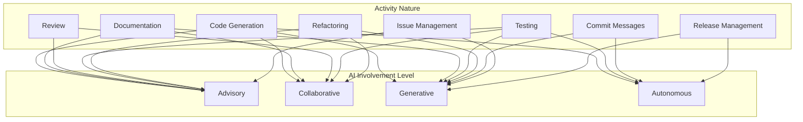
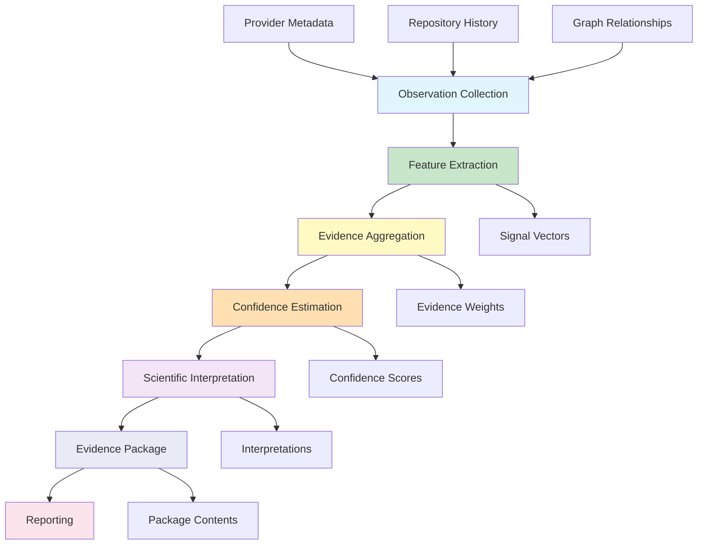
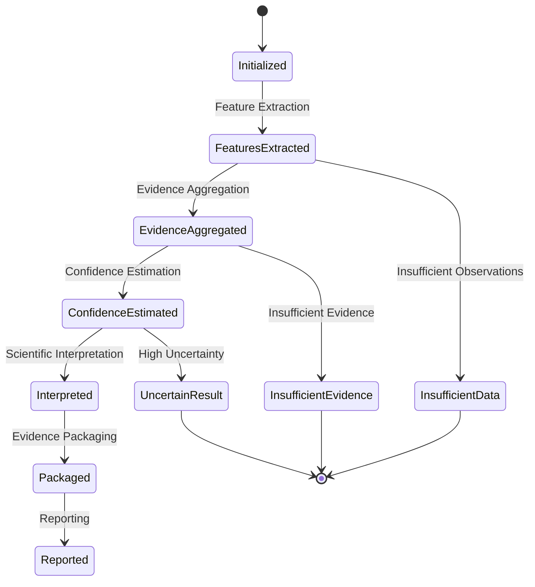
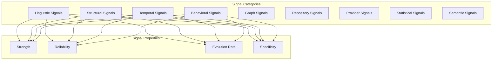
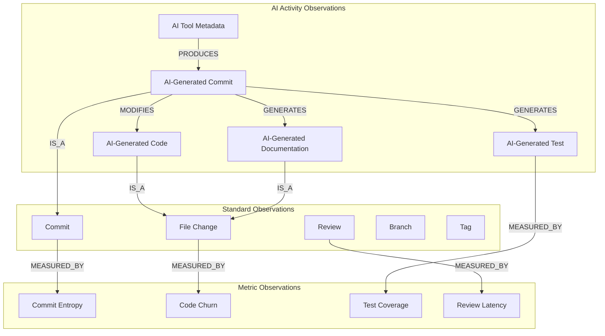
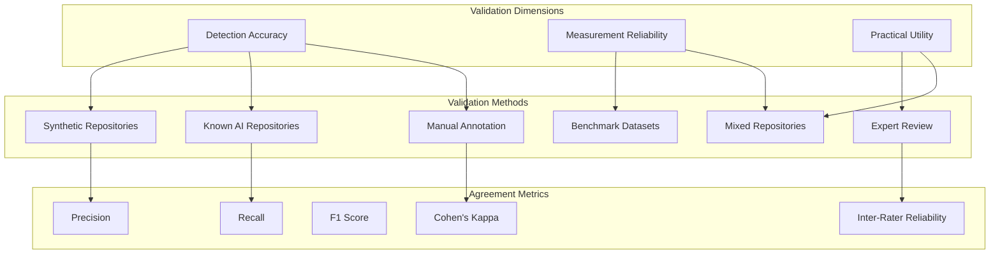

# MIIE v1.6

## 08_AI_GENERATED_ACTIVITY_DETECTION.md

### Scientific Framework for AI-Assisted Software Development Activity Detection

| Field | Value |
|-------|-------|
| Document Type | Scientific Specification |
| Version | 1.6.0 |
| Status | Canonical |
| Scope | AI Activity Taxonomy, Observable Evidence, Confidence Estimation, Detection Architecture, Provenance, Validation Methodology, Ethical Framework |
| Audience | Measurement Scientists, Empirical Software Engineering Researchers, Repository Intelligence Architects, AI Code Generation Researchers |
| Last Updated | 2026-07-05 |

---

## Table of Contents

1. [Purpose](#1-purpose)
2. [Scientific Principles](#2-scientific-principles)
3. [AI Activity Taxonomy](#3-ai-activity-taxonomy)
4. [Observable Evidence](#4-observable-evidence)
5. [Detection Framework](#5-detection-framework)
6. [Detection Signals](#6-detection-signals)
7. [Confidence Model](#7-confidence-model)
8. [Observation Graph Integration](#8-observation-graph-integration)
9. [Metric Integration](#9-metric-integration)
10. [Detector Integration](#10-detector-integration)
11. [Validation Strategy](#11-validation-strategy)
12. [Ethical Considerations](#12-ethical-considerations)
13. [Threats to Validity](#13-threats-to-validity)
14. [Future Evolution](#14-future-evolution)
15. [Governance](#15-governance)
16. [Architecture Decision Summary](#16-architecture-decision-summary)
17. [Appendices](#17-appendices)

---

## 1. Purpose

### 1.1 Why AI-Assisted Development Is Becoming Part of Software Engineering

Software development is undergoing a fundamental transformation. Large language models, code generation assistants, automated review tools, and AI-powered development environments are becoming integral to how software is written, reviewed, tested, and documented. This transformation is not peripheral — it is reshaping the core activities of software engineering at every level of the stack.

The emergence of AI-assisted development creates new measurement challenges. Traditional software engineering metrics were designed for human-centric development processes. Commit patterns, code churn, review latency, test coverage — these metrics assume that human developers are the primary agents of change. When AI systems become significant contributors to the development process, the interpretation of these metrics changes fundamentally.

A repository that receives 80% of its code from AI generation has different characteristics than a repository where 80% of code is hand-written. Both may achieve similar metric values — similar coverage ratios, similar commit counts, similar review latencies — but the underlying processes that produced those values are fundamentally different. Measurement integrity requires understanding not just what the metrics say, but how those metrics were produced.

### 1.2 Measurement Integrity

Measurement integrity in the context of AI-assisted development requires that metrics faithfully represent the phenomena they claim to measure. When AI systems contribute significantly to a repository, several integrity questions arise:

**Attribution Integrity**: Do metrics accurately attribute work to the correct agents? A commit that is entirely AI-generated but attributed to a human developer may produce misleading signals about developer productivity, code quality, or review thoroughness.

**Process Integrity**: Do metrics accurately reflect the development process? A review latency of 30 minutes may represent thorough human review of AI-generated code, or it may represent automated approval of code that was never reviewed by a human.

**Quality Integrity**: Do metrics accurately assess code quality? Test coverage achieved by AI-generated tests may have different properties than coverage achieved by human-written tests. The metric value may be identical, but the quality implications may differ.

**Temporal Integrity**: Do metrics accurately represent trends over time? A repository that transitions from human-only to AI-assisted development will show metric changes that reflect the transition in process, not a change in quality.

### 1.3 Repository Transparency

Repository transparency is the property that the history, composition, and provenance of a software repository are understandable and auditable. AI-assisted development challenges repository transparency in several ways:

**Composition Opacity**: When AI generates code, the resulting code may not carry markers indicating its origin. The repository's commit history may not distinguish between human-written and AI-generated contributions.

**Process Opacity**: When AI participates in reviews, testing, or documentation, the nature and extent of AI involvement may not be visible in standard repository metadata.

**Provenance Opacity**: When AI generates code based on specific prompts, training data, or context, the provenance of the generated code may not be captured in repository records.

Repository transparency is not a binary property — it exists on a spectrum. MIIE's goal is to provide measurements that increase repository transparency, enabling stakeholders to understand the composition and provenance of software artifacts.

### 1.4 Scientific Reproducibility

Scientific reproducibility requires that analyses of software development processes can be independently verified and reproduced. AI-assisted development introduces reproducibility challenges:

**Model Versioning**: AI models evolve rapidly. Code generated by GPT-4 may differ from code generated by GPT-4-turbo, which may differ from code generated by Claude. Reproducibility requires tracking which models contributed to which artifacts.

**Prompt Dependency**: The same AI model can produce different outputs given different prompts. Reproducibility requires capturing not just the model, but the prompting context.

**Stochastic Generation**: AI models are stochastic — the same prompt can produce different outputs across generations. Reproducibility requires capturing the specific generation, not just the model and prompt.

**Temporal Sensitivity**: AI models are retrained periodically. Code generated by a model at one point in time may not be reproducible using the same model identifier at a later point in time.

### 1.5 Developer Assistance

AI-assisted development encompasses a spectrum of developer assistance, from fully human to fully automated:

**Advisory**: The AI suggests, the human decides and implements. Code review suggestions, test case suggestions, documentation recommendations.

**Collaborative**: The AI and human work together in real-time. Pair programming assistants, interactive code generation, iterative refinement.

**Generative**: The AI produces, the human reviews and integrates. Code generation from specifications, automated test generation, documentation generation.

**Autonomous**: The AI operates independently within defined boundaries. Automated refactoring, dependency updates, security patches.

Each level of assistance has different implications for measurement integrity. Advisory assistance may be nearly invisible in repository metrics. Autonomous assistance may produce patterns that are clearly distinguishable from human activity.

### 1.6 Automation

Automation in software development is not new — CI/CD pipelines, automated testing, code formatters, and linters have been automating aspects of development for decades. AI-assisted development extends automation into cognitive tasks that were previously exclusively human: code generation, design decisions, architectural reasoning, and creative problem-solving.

This extension of automation into cognitive domains creates measurement challenges because traditional metrics were designed to measure human cognitive output. When cognitive output is partially or fully automated, the metrics must be reinterpreted.

### 1.7 Why MIIE Measures AI Activity Rather Than Judging It

MIIE's objective is scientific transparency, not moral judgment. AI-assisted development is neither inherently beneficial nor inherently harmful. It is a development methodology with characteristics that can be measured, analyzed, and understood.

MIIE measures AI activity for several reasons:

**Transparency**: Stakeholders deserve to understand how their software is being developed. Whether AI involvement is a positive or negative factor depends on context — the type of project, the criticality of the code, the regulatory environment, and the preferences of stakeholders.

**Measurement Integrity**: Existing metrics may produce misleading results when applied to AI-assisted development without accounting for AI involvement. Measuring AI activity enables proper interpretation of other metrics.

**Scientific Understanding**: AI-assisted development is a new phenomenon. Understanding its characteristics, patterns, and implications requires scientific measurement, not anecdotal observation.

**Process Improvement**: Understanding how AI is used in development enables teams to optimize their use of AI tools, identifying where AI adds value and where human judgment remains essential.

MIIE does not assess whether AI activity is good or bad. It measures what is present, estimates confidence in that measurement, and provides the evidence necessary for stakeholders to form their own judgments.

---

## 2. Scientific Principles

### 2.1 Evidence-Based Inference

All conclusions about AI-assisted activity must be based on observable evidence. Evidence-based inference requires that:

**Claims Are Supported**: Every claim about AI activity must be supported by specific, identifiable evidence. Claims without evidence are hypotheses, not conclusions.

**Evidence Is Traceable**: Every piece of evidence must have a clear provenance — where it came from, how it was extracted, what assumptions were made during extraction.

**Evidence Is Sufficient**: The evidence must be sufficient to support the claimed conclusion. Insufficient evidence produces low confidence, not definitive conclusions.

**Evidence Is Verifiable**: Evidence must be independently verifiable. Another analyst examining the same repository should be able to confirm the presence and interpretation of the evidence.

### 2.2 Probabilistic Reasoning

AI activity detection is inherently probabilistic. The signals that indicate AI involvement are correlated with AI activity but do not definitively prove it. Probabilistic reasoning requires:

**Likelihood, Not Certainty**: Conclusions are expressed as likelihoods, not certainties. "There is moderate evidence that this repository uses AI-assisted code generation" rather than "This repository uses AI-assisted code generation."

**Prior Informed by Evidence**: Initial beliefs about AI activity are updated as evidence accumulates. A repository with no AI indicators starts with a low prior probability; each piece of evidence adjusts this probability.

**Uncertainty Explicit**: Uncertainty is always explicit. Confidence intervals, probability ranges, and evidence quality assessments accompany every conclusion.

**Multiple Hypotheses**: Alternative explanations for observed patterns are always considered. Unusual commit patterns may indicate AI activity, or they may indicate a change in development practices, tooling, or team composition.

### 2.3 Confidence

Confidence is a quantified assessment of the certainty of a conclusion. In AI activity detection, confidence reflects:

**Evidence Strength**: How strong is the evidence supporting the conclusion? Multiple convergent signals produce higher confidence than any single signal.

**Evidence Quantity**: How much evidence is available? Repositories with more history provide more evidence.

**Evidence Quality**: How reliable is the evidence? Direct evidence (provider metadata) is higher quality than indirect evidence (linguistic patterns).

**Alternative Explanations**: How many alternative explanations exist for the observed evidence? Fewer alternatives increase confidence in the primary conclusion.

Confidence is not a measure of whether the conclusion is correct. It is a measure of how well the evidence supports the conclusion given the available information. A high-confidence conclusion may still be wrong if the evidence is systematically misleading.

### 2.4 Transparency

Transparency requires that the reasoning behind every conclusion is visible and understandable. Transparent AI activity detection means:

**Reasoning Is Visible**: The chain of evidence from raw observations to final conclusion is documented and auditable.

**Assumptions Are Explicit**: Every assumption made during detection is stated clearly. Assumptions about what constitutes AI-like patterns, what thresholds are meaningful, and what evidence is relevant are all explicit.

**Limitations Are Documented**: The limitations of the detection methodology are documented alongside the results. No methodology is perfect; honest acknowledgment of limitations is essential for scientific integrity.

**Methods Are Reproducible**: The detection methods can be independently applied to the same data to produce the same results.

### 2.5 Reproducibility

Reproducibility requires that AI activity detection results can be independently verified. Reproducibility in this context means:

**Deterministic Processing**: Given the same observations, the detection algorithms produce the same results. Stochastic elements, if any, use fixed random seeds.

**Versioned Methods**: Detection methods are versioned. A result produced by version 1.0 of the detection algorithm can be reproduced using version 1.0, even if version 2.0 produces different results.

**Documented Inputs**: The exact observations used as inputs are documented and available for re-analysis.

**Platform Independence**: Results are not dependent on specific hardware, operating systems, or software versions.

### 2.6 Minimal Assumptions

AI activity detection must make as few assumptions as possible about what AI-generated code looks like. This principle exists because:

**AI Evolution**: AI code generation capabilities evolve rapidly. Assumptions based on current AI behavior may not hold for future AI systems.

**Prompt Diversity**: The same AI model can produce vastly different outputs given different prompts. Assumptions about code style may be prompt-dependent, not model-dependent.

**Human Variation**: Human developers exhibit enormous variation in coding style, commit patterns, and documentation practices. Assumptions about what is "human-like" are inherently unreliable.

**Hybrid Workflows**: Most real-world development involves a mixture of human and AI activity. Assumptions about pure human or pure AI workflows may not apply.

Minimal assumptions means detecting AI activity based on evidence that is robust across different AI models, prompts, development workflows, and human coding styles.

### 2.7 Explainability

Every detection result must be explainable. Explainability requires:

**Signal Identification**: The specific signals that contributed to the conclusion are identified.

**Contribution Assessment**: The relative contribution of each signal to the final conclusion is assessed.

**Counterfactual Reasoning**: An explanation of what evidence would change the conclusion is provided. "This conclusion would be weakened if the commit message patterns were found to match a specific human developer's style."

**Accessible Language**: Explanations are written in language accessible to non-specialists. Statistical terminology is accompanied by plain-language interpretation.

### 2.8 Ethical Neutrality

AI activity detection must be ethically neutral. This means:

**No Value Judgment**: The detection system does not assess whether AI activity is good or bad, appropriate or inappropriate, beneficial or harmful.

**No Assumption of Fraud**: The presence of AI activity does not imply fraud, deception, or misconduct. AI-assisted development is a legitimate and increasingly common development methodology.

**No Discrimination**: Detection results are not used to discriminate against developers, teams, or organizations based on their use of AI tools.

**Contextual Interpretation**: Detection results are interpreted within the specific context of the project, organization, and regulatory environment. Universal interpretations are avoided.

### 2.9 Human Oversight

AI activity detection supports human decision-making; it does not replace it. Human oversight requires:

**Human Review**: Detection results are reviewed by humans before action is taken. Automated actions based on detection results are avoided.

**Contextual Judgment**: Humans provide contextual judgment that algorithms cannot. A human reviewer can assess whether AI activity is appropriate for the specific project context.

**Appeal Mechanism**: Developers and teams can contest detection results and provide additional context that may change the interpretation.

**Responsibility**: The responsibility for decisions based on detection results rests with humans, not with the detection system.

---

## 3. AI Activity Taxonomy

### 3.1 Activity Classification Framework

AI-assisted software development activities are classified along two dimensions: the nature of the activity and the degree of AI involvement.

### 3.2 Activity Definitions

#### 3.2.1 AI-Assisted Code Generation

AI-assisted code generation encompasses any activity where an AI system contributes to the creation of source code. This includes:

**Function Implementation**: AI generates function bodies from specifications, docstrings, or type signatures.

**Module Scaffolding**: AI generates module structures, class hierarchies, and boilerplate code.

**Algorithm Implementation**: AI implements algorithms from descriptions or pseudocode.

**API Integration**: AI generates code for integrating with external APIs, libraries, or frameworks.

**Data Processing**: AI generates code for data transformation, validation, and processing pipelines.

**Configuration**: AI generates configuration files, environment setups, and deployment configurations.

**Observable Characteristics**: Changes in code complexity distributions, function length patterns, naming conventions, and coding style consistency may indicate AI involvement. However, these characteristics are not definitive — human developers also exhibit variation in these dimensions.

#### 3.2.2 AI-Assisted Documentation

AI-assisted documentation encompasses any activity where an AI system contributes to the creation or maintenance of documentation. This includes:

**API Documentation**: AI generates docstrings, parameter descriptions, return value documentation, and usage examples.

**User Guides**: AI generates user-facing documentation, tutorials, and how-to guides.

**Architecture Documentation**: AI generates design documents, architecture descriptions, and system documentation.

**Changelog Generation**: AI generates changelogs from commit histories or release notes.

**README Generation**: AI generates project README files, contributing guides, and installation instructions.

**Observable Characteristics**: Documentation changes may show patterns in vocabulary, sentence structure, formatting consistency, and level of detail that differ from human-authored documentation.

#### 3.2.3 AI-Assisted Reviews

AI-assisted review encompasses any activity where an AI system contributes to the code review process. This includes:

**Automated Review Comments**: AI generates review comments on pull requests, identifying potential issues, suggesting improvements, or flagging style violations.

**Review Summarization**: AI summarizes review discussions, highlighting key issues and decisions.

**Approval Recommendations**: AI recommends whether a pull request should be approved, requesting changes, or requiring further review.

**Risk Assessment**: AI assesses the risk level of proposed changes, identifying areas of concern.

**Observable Characteristics**: Review patterns may show changes in review latency, review comment density, review thoroughness, and the relationship between review time and change complexity.

#### 3.2.4 AI-Assisted Testing

AI-assisted testing encompasses any activity where an AI system contributes to the creation or maintenance of tests. This includes:

**Unit Test Generation**: AI generates unit tests from function specifications or existing code.

**Integration Test Design**: AI designs integration test scenarios based on system architecture.

**Test Data Generation**: AI generates test data, including edge cases, boundary conditions, and property-based test cases.

**Mutation Testing**: AI generates mutation tests to assess test suite effectiveness.

**Test Maintenance**: AI updates tests when code changes, maintaining test relevance.

**Observable Characteristics**: Test patterns may show changes in test structure, assertion patterns, test naming conventions, coverage distribution, and the relationship between test count and code complexity.

#### 3.2.5 AI-Assisted Refactoring

AI-assisted refactoring encompasses any activity where an AI system contributes to code restructuring. This includes:

**Pattern Application**: AI applies design patterns to existing code.

**Code Simplification**: AI simplifies complex code structures.

**Dependency Management**: AI updates dependencies, resolves conflicts, and manages version compatibility.

**Performance Optimization**: AI optimizes code for performance, memory usage, or energy efficiency.

**Observable Characteristics**: Refactoring activities may show patterns in change scope, file modification patterns, and the relationship between changes and code quality metrics.

#### 3.2.6 AI-Assisted Commit Messages

AI-assisted commit message generation encompasses any activity where an AI system contributes to the creation of commit messages. This includes:

**Message Generation**: AI generates commit messages from code changes.

**Conventional Commits**: AI formats commit messages according to conventional commit specifications.

**Semantic Analysis**: AI analyzes code changes to produce semantically meaningful commit messages.

**Observable Characteristics**: Commit message patterns may show changes in vocabulary, structure, length, and the relationship between message content and actual code changes.

#### 3.2.7 AI-Assisted Issue Creation

AI-assisted issue creation encompasses any activity where an AI system contributes to the creation or management of issues. This includes:

**Bug Report Generation**: AI generates bug reports from error logs, stack traces, or user reports.

**Feature Request Analysis**: AI analyzes feature requests and generates implementation specifications.

**Issue Triage**: AI categorizes, prioritizes, and assigns issues.

**Observable Characteristics**: Issue patterns may show changes in description structure, vocabulary, categorization consistency, and the relationship between issue content and repository activity.

#### 3.2.8 AI-Assisted Release Notes

AI-assisted release note generation encompasses any activity where an AI system contributes to the creation of release documentation. This includes:

**Change Summarization**: AI summarizes changes between releases.

**Impact Analysis**: AI assesses the impact of changes on users and downstream systems.

**Migration Guides**: AI generates migration guides for breaking changes.

**Observable Characteristics**: Release note patterns may show changes in structure, detail level, and the relationship between release notes and actual repository changes.

### 3.3 Future Activity Categories

As AI capabilities evolve, new categories of AI-assisted activity will emerge:

**AI-Architectural Design**: AI contributes to system architecture decisions, component design, and interface definitions.

**AI-Code Review Automation**: AI conducts code reviews autonomously, approving changes that meet defined criteria.

**AI-Continuous Improvement**: AI identifies and implements optimization opportunities without explicit human direction.

**AI-Cross-Repository Intelligence**: AI analyzes patterns across multiple repositories to inform development decisions.

**AI-Dependency Intelligence**: AI manages dependencies proactively, updating, testing, and documenting changes.

The taxonomy must evolve with AI capabilities. New categories are added through the governance process defined in Section 15.

---

## 4. Observable Evidence

### 4.1 Evidence Source Framework

Observable evidence for AI-assisted activity comes from multiple sources, each with different reliability, granularity, and interpretation requirements.

```mermaid
graph TB
    subgraph "Direct Evidence"
        E1[Provider Metadata]
        E2[AI Tool Signatures]
        E3[Explicit Attribution]
    end
    
    subgraph "Structural Evidence"
        E4[Code Structure Patterns]
        E5[File Organization]
        E6[Dependency Patterns]
    end
    
    subgraph "Behavioral Evidence"
        E7[Commit Patterns]
        E8[Review Patterns]
        E9[Timing Patterns]
    end
    
    subgraph "Linguistic Evidence"
        E10[Commit Messages]
        E11[Documentation Style]
        E12[Code Comments]
    end
    
    subgraph "Graph Evidence"
        E13[Observation Relationships]
        E14[Provenance Chains]
        E15[Cross-Reference Patterns]
    end
    
    E1 --> D[Detection Algorithm]
    E2 --> D
    E3 --> D
    E4 --> D
    E5 --> D
    E6 --> D
    E7 --> D
    E8 --> D
    E9 --> D
    E10 --> D
    E11 --> D
    E12 --> D
    E13 --> D
    E14 --> D
    E15 --> D
    
    D --> C[Confidence Assessment]
```

### 4.2 Direct Evidence

Direct evidence explicitly indicates AI involvement. Direct evidence sources include:

**Provider Metadata**: Some AI tools and platforms provide metadata indicating that AI contributed to specific artifacts. GitHub Copilot, for example, may record that code was generated with AI assistance. This is the highest quality evidence because it is explicitly recorded by the tool that performed the generation.

**AI Tool Signatures**: Some AI tools leave identifiable signatures in their output. These may include specific patterns in generated code, comments indicating AI generation, or metadata embedded in files.

**Explicit Attribution**: Developers may explicitly attribute work to AI tools in commit messages, code comments, or documentation. "Generated with Copilot" or "AI-assisted implementation" are forms of explicit attribution.

Direct evidence is rare and incomplete. Most AI tools do not provide metadata, most developers do not explicitly attribute AI work, and AI tool signatures may be absent or ambiguous. Direct evidence is sufficient when present but cannot be relied upon as the sole evidence source.

### 4.3 Structural Evidence

Structural evidence consists of patterns in code organization, complexity, and structure that are correlated with AI involvement. Structural evidence sources include:

**Code Complexity Distribution**: AI-generated code may exhibit different complexity distributions than human-written code. Functions may be more uniform in complexity, or complexity may cluster differently across modules.

**Naming Convention Patterns**: AI-generated code may use different naming conventions than human developers. Variable names, function names, and class names may follow different patterns.

**Code Style Consistency**: AI-generated code may be more consistently formatted than human code, or it may follow different style conventions.

**File Organization**: AI-generated code may follow different organizational patterns, with different relationships between file structure and code functionality.

**Dependency Patterns**: AI-generated code may use different dependency patterns, importing different libraries or using different API patterns.

Structural evidence is indirect and probabilistic. The same structural patterns may arise from human coding practices, coding standards, or development tools. Structural evidence is useful as supporting evidence but is not sufficient alone for confident detection.

### 4.4 Behavioral Evidence

Behavioral evidence consists of patterns in development activity that are correlated with AI involvement. Behavioral evidence sources include:

**Commit Patterns**: AI-assisted development may produce different commit patterns than human-only development. Commit frequency, commit size, commit timing, and the relationship between commits and code changes may differ.

**Review Patterns**: AI-assisted development may produce different review patterns. Review latency, review thoroughness, and the relationship between review time and change complexity may differ when AI contributes to code generation.

**Timing Patterns**: AI-assisted development may exhibit different temporal patterns. Development speed, the relationship between task complexity and completion time, and the distribution of work across time may differ.

**Collaboration Patterns**: AI-assisted development may produce different collaboration patterns. The relationship between developers, the distribution of work across team members, and the patterns of code ownership may differ.

Behavioral evidence is indirect and highly variable. Human development behavior varies enormously across individuals, teams, cultures, and contexts. Behavioral evidence must be interpreted relative to a baseline, and establishing an appropriate baseline is challenging.

### 4.5 Linguistic Evidence

Linguistic evidence consists of patterns in natural language artifacts that are correlated with AI involvement. Linguistic evidence sources include:

**Commit Message Patterns**: AI-generated commit messages may exhibit different vocabulary, sentence structure, level of detail, and relationship to code changes than human-written commit messages.

**Documentation Patterns**: AI-generated documentation may exhibit different writing style, technical depth, formatting patterns, and organizational structure than human-written documentation.

**Code Comment Patterns**: AI-generated code comments may exhibit different patterns in placement, content, and relationship to the code they describe.

**Issue and PR Description Patterns**: AI-generated descriptions may exhibit different patterns in structure, vocabulary, and level of detail.

Linguistic evidence is probabilistic and evolving. AI language models are becoming increasingly human-like in their linguistic output, reducing the distinctiveness of linguistic signals. Linguistic evidence is most useful when combined with other evidence sources.

### 4.6 Graph Evidence

Graph evidence consists of patterns in the relationships between observations that are correlated with AI involvement. Graph evidence sources include:

**Provenance Chains**: The pattern of provenance relationships — which observations reference which other observations — may differ in AI-assisted development.

**Cross-Reference Patterns**: The pattern of cross-references between commits, reviews, issues, and documentation may differ when AI is involved.

**Relationship Density**: The density and structure of relationships in the observation graph may differ in AI-assisted development.

**Temporal Relationships**: The pattern of temporal relationships — which observations precede or follow which others — may differ in AI-assisted development.

Graph evidence is the most abstract evidence source but is potentially the most robust, as it captures structural patterns that are less susceptible to surface-level mimicry.

### 4.7 Observable Evidence vs. Hidden Intent

A fundamental limitation of observable evidence is that it reveals patterns, not intent. Observable evidence can indicate that a repository exhibits patterns consistent with AI involvement, but it cannot determine:

**Why AI Was Used**: Whether AI was used to augment human capability, replace human effort, accelerate development, or improve quality.

**How AI Was Used**: Whether AI was used for code generation, testing, documentation, review, or any other activity.

**Who Decided**: Whether the use of AI was a conscious decision by developers, a mandate from management, or an organic adoption of available tools.

**What Was the Impact**: Whether AI involvement improved, degraded, or had no effect on code quality, development speed, or team productivity.

Observable evidence reveals what happened in the repository. It does not reveal the human decisions, intentions, and circumstances that produced those patterns. This distinction is essential for ethical interpretation of detection results.

---

## 5. Detection Framework

### 5.1 Detection Pipeline

The AI activity detection pipeline processes observations through a series of stages, each transforming data into increasingly abstract representations.

### 5.2 Stage 1: Feature Extraction

Feature extraction transforms raw observations into feature vectors suitable for analysis. Each observation is analyzed to extract features that may be indicative of AI involvement.

Feature extraction operates on:

**Individual Observations**: Features extracted from single observations — the vocabulary of a commit message, the structure of a code change, the timing of a commit.

**Observation Pairs**: Features extracted from relationships between observations — the temporal distance between a commit and its review, the correlation between commit size and review time.

**Observation Collections**: Features extracted from collections of observations — the distribution of commit sizes over time, the pattern of file modifications across a branch.

Feature extraction is feature-engineered, not feature-learned. The features are defined by domain knowledge about what patterns may indicate AI involvement. This approach is chosen over learned features because:

**Interpretability**: Defined features are interpretable. Each feature has a clear meaning and relationship to AI activity.

**Stability**: Defined features are stable across AI model versions. Learned features may be specific to current AI capabilities.

**Minimal Assumptions**: Defined features can be designed to minimize assumptions about AI behavior. Learned features may encode assumptions about current AI capabilities.

### 5.3 Stage 2: Evidence Aggregation

Evidence aggregation combines multiple features into evidence weights. Evidence aggregation addresses the challenge that no single feature is sufficient for confident detection.

Aggregation considers:

**Feature Independence**: Features that are independent provide more evidence than features that are redundant.

**Feature Reliability**: Features with higher reliability are weighted more heavily than features with lower reliability.

**Feature Convergence**: Features that converge on the same conclusion provide stronger evidence than features that diverge.

**Evidence Sufficiency**: The total evidence must be sufficient to support a conclusion. Insufficient evidence produces "insufficient data" rather than a weak conclusion.

### 5.4 Stage 3: Confidence Estimation

Confidence estimation transforms evidence weights into confidence scores. Confidence scores reflect the certainty that AI activity is present, given the available evidence.

Confidence estimation considers:

**Evidence Strength**: How strong is the total evidence?

**Evidence Quality**: How reliable are the evidence sources?

**Alternative Explanations**: How many alternative explanations exist?

**Baseline Comparison**: How does the evidence compare to the baseline for similar repositories?

Confidence scores are bounded between 0 and 1, where 0 represents complete uncertainty and 1 represents complete certainty. In practice, confidence scores rarely approach either extreme.

### 5.5 Stage 4: Scientific Interpretation

Scientific interpretation translates confidence scores into human-understandable conclusions. Interpretation follows the principle that results should be expressed as likelihoods, not certainties.

Interpretation produces:

**Activity Classification**: Which categories of AI activity are indicated by the evidence?

**Confidence Level**: How confident is the system in each classification?

**Evidence Summary**: What evidence supports each classification?

**Limitations**: What limitations affect the interpretation?

**Recommendations**: What additional evidence would increase confidence?

### 5.6 Stage 5: Evidence Package

The evidence package aggregates all intermediate results into a complete, auditable record. The evidence package includes:

**Raw Observations**: The observations that were analyzed.

**Extracted Features**: The features that were extracted from observations.

**Evidence Weights**: The evidence weights assigned to each feature.

**Confidence Scores**: The confidence scores produced by the analysis.

**Interpretations**: The scientific interpretations of the confidence scores.

**Provenance**: The complete provenance chain from raw observations to final results.

### 5.7 Stage 6: Reporting

Reporting transforms the evidence package into outputs suitable for different audiences. Reporting produces:

**Scientific Report**: Detailed technical report with full methodology, evidence, and interpretation.

**Executive Summary**: High-level summary for non-technical stakeholders.

**Developer Report**: Individual-focused report for developers.

**Audit Report**: Compliance-focused report for governance and audit purposes.

### 5.8 Detection State Model

The detection process follows a state model that ensures consistent processing.

### 5.9 Detection Invariants

The detection pipeline maintains several invariants:

**Monotonicity**: Adding more observations never decreases confidence. Confidence either increases or remains the same as more evidence becomes available.

**Determinism**: Given the same observations, the detection pipeline produces the same results. The pipeline is deterministic and reproducible.

**Transparency**: Every intermediate result is available for inspection. No intermediate result is discarded or hidden.

**Non-Destructiveness**: The detection pipeline does not modify its input observations. Observations are read-only throughout the pipeline.

**Completeness**: The detection pipeline processes all available observations. No observations are excluded without explicit justification.

---

## 6. Detection Signals

### 6.1 Signal Category Framework

Detection signals are categorized by the nature of the evidence they provide. Each category has strengths, limitations, and scientific assumptions.

### 6.2 Linguistic Signals

Linguistic signals are derived from natural language content in the repository — commit messages, documentation, code comments, and issue descriptions.

**Strengths**:
- Rich information content: natural language carries semantic meaning
- Broad availability: most repositories contain natural language artifacts
- Relatively stable: linguistic patterns are less volatile than temporal patterns

**Limitations**:
- AI language models are becoming increasingly human-like
- Linguistic style varies enormously across human developers
- Commit message quality varies across teams regardless of AI use
- Multilingual repositories complicate linguistic analysis

**Scientific Assumptions**:
- AI-generated text exhibits statistical patterns distinguishable from human text
- These patterns are consistent across different AI models and prompts
- Human linguistic patterns are sufficiently consistent to serve as a baseline
- Linguistic patterns are not intentionally modified to evade detection

### 6.3 Structural Signals

Structural signals are derived from code organization, complexity, and architecture.

**Strengths**:
- Less susceptible to intentional modification than linguistic signals
- Captures deep properties of code that are difficult to mimic
- Relatively stable over time

**Limitations**:
- Coding standards and tools significantly influence structure
- Different languages and frameworks have different structural norms
- Structural patterns may be inherited from templates or scaffolding tools
- AI-generated code may adopt the structural patterns of existing code

**Scientific Assumptions**:
- AI-generated code exhibits structural patterns distinguishable from human code
- Structural patterns are influenced by the generation process, not just the coding standards
- Structural patterns are stable across different codebases using the same standards

### 6.4 Temporal Signals

Temporal signals are derived from the timing and sequencing of development activities.

**Strengths**:
- Captures process-level patterns that are difficult to fake
- Less susceptible to surface-level modification
- Can reveal coordination patterns between AI and human activity

**Limitations**:
- Highly variable across individuals and teams
- Time zone effects, work schedules, and personal habits introduce noise
- CI/CD pipelines and automation tools create temporal patterns unrelated to AI
- Commit batching and squashing distort temporal patterns

**Scientific Assumptions**:
- AI-assisted development produces different temporal patterns than human-only development
- Temporal patterns are consistent across different projects using similar AI tools
- Temporal patterns are not intentionally modified to evade detection

### 6.5 Behavioral Signals

Behavioral signals are derived from development activity patterns — how work is distributed, how reviews are conducted, how changes flow through the development process.

**Strengths**:
- Captures process-level behavior that is difficult to modify
- Reveals coordination patterns between human and AI activity
- Less susceptible to surface-level mimicry

**Limitations**:
- Highly variable across teams and organizational cultures
- Process changes unrelated to AI may produce similar patterns
- Establishing appropriate behavioral baselines is challenging
- Privacy concerns may limit the availability of behavioral data

**Scientific Assumptions**:
- AI-assisted development produces different behavioral patterns than human-only development
- Behavioral patterns are consistent across different projects using similar AI tools
- Behavioral patterns are not intentionally modified to evade detection

### 6.6 Graph Signals

Graph signals are derived from the relationships between observations in the observation graph.

**Strengths**:
- Captures structural patterns at the repository level
- Less susceptible to surface-level modification
- Can reveal patterns that are invisible at the individual observation level
- Robust against individual observation manipulation

**Limitations**:
- Requires a complete observation graph, which may not be available
- Graph structure is influenced by repository organization and development workflow
- Interpretation of graph patterns requires domain expertise
- Graph patterns may be specific to particular repository structures

**Scientific Assumptions**:
- AI-assisted development produces different graph patterns than human-only development
- Graph patterns are consistent across different repository organizations
- Graph patterns are not intentionally modified to evade detection

### 6.7 Repository Signals

Repository signals are derived from repository-level properties — size, growth rate, contributor count, branch structure, and release patterns.

**Strengths**:
- Available for every repository with version control
- Relatively stable over time
- Provides context for interpreting other signals

**Limitations**:
- Repository-level properties are influenced by many factors beyond AI use
- Repository organization varies enormously across projects
- Repository properties may change for reasons unrelated to AI

**Scientific Assumptions**:
- AI-assisted development produces different repository-level patterns than human-only development
- Repository patterns are consistent across different types of projects

### 6.8 Provider Signals

Provider signals are derived from AI tool and platform metadata.

**Strengths**:
- Highest quality evidence when available
- Explicitly recorded by the tool that performed the AI activity
- Directly attributable to specific AI contributions

**Limitations**:
- Rare: most AI tools do not provide activity metadata
- Incomplete: metadata may cover only some types of AI activity
- Vendor-specific: different AI tools provide different metadata
- May not be available for historical data

**Scientific Assumptions**:
- Provider metadata accurately reflects AI activity
- Provider metadata is complete and not selectively reported
- Provider metadata is consistent across different versions of the tool

### 6.9 Statistical Signals

Statistical signals are derived from statistical analysis of metric distributions and correlations.

**Strengths**:
- Based on established statistical theory
- Can detect subtle patterns that are not visible through other means
- Provides quantitative evidence with known statistical properties

**Limitations**:
- Requires sufficient data for statistical analysis
- Statistical tests have known error rates
- Multiple testing problems arise when many tests are conducted
- Statistical significance does not imply practical significance

**Scientific Assumptions**:
- AI-assisted development produces statistically distinguishable patterns
- Statistical tests are appropriate for the data being analyzed
- Sample sizes are sufficient for reliable statistical inference

### 6.10 Semantic Signals

Semantic signals are derived from the meaning and intent of code and documentation.

**Strengths**:
- Captures the deepest level of understanding
- Can distinguish between code that looks similar but has different purposes
- Provides the most meaningful interpretation of patterns

**Limitations**:
- Requires sophisticated semantic analysis capabilities
- Semantic analysis is computationally expensive
- Semantic interpretation requires domain expertise
- Semantic analysis may be unreliable for unfamiliar domains

**Scientific Assumptions**:
- AI-generated code has different semantic properties than human-written code
- Semantic analysis can reliably distinguish between AI and human contributions
- Semantic properties are consistent across different domains and languages

### 6.11 Signal Interaction Matrix

Signals interact in complex ways. Some signals reinforce each other, some are independent, and some may conflict.

| Signal Pair | Interaction | Interpretation |
|------------|-------------|----------------|
| Linguistic + Structural | Reinforcing | If both indicate AI, confidence increases more than either alone |
| Temporal + Behavioral | Correlated | Temporal patterns often reflect behavioral patterns |
| Provider + Any Other | Dominant | Provider metadata overrides conflicting signals |
| Statistical + Linguistic | Independent | Statistical patterns and linguistic patterns provide separate evidence |
| Graph + Structural | Complementary | Graph patterns reveal repository-level structure that complements code-level structure |
| Semantic + All Others | Interpreting | Semantic signals provide context for interpreting all other signals |

---

## 7. Confidence Model

### 7.1 Confidence Definition

Confidence is a quantified assessment of the certainty that AI activity is present in a repository, given the available evidence. Confidence is not a probability in the frequentist sense — it is a Bayesian posterior probability that reflects the degree of belief in AI activity given the observed evidence.

Confidence has the following properties:

**Bounded**: Confidence is bounded between 0 and 1. A confidence of 0 represents complete absence of evidence for AI activity. A confidence of 1 represents complete certainty in AI activity.

**Non-Decreasing**: Adding more evidence never decreases confidence. Confidence either increases or remains the same as more observations become available.

**Evidence-Dependent**: Confidence is a function of the available evidence. The same repository may have different confidence levels depending on how much data is available.

**Context-Dependent**: Confidence is interpreted relative to a context. A confidence of 0.7 means something different for a small personal repository than for a large enterprise repository.

### 7.2 Uncertainty

Uncertainty is the complement of confidence — it represents what is not known. Uncertainty arises from:

**Evidence Insufficiency**: Not enough evidence is available to reach a confident conclusion.

**Evidence Ambiguity**: The available evidence supports multiple interpretations.

**Evidence Conflict**: Different evidence sources point to different conclusions.

**Evidence Unreliability**: The available evidence may not be accurate or complete.

Uncertainty is always reported alongside confidence. A confidence of 0.7 with high uncertainty is very different from a confidence of 0.7 with low uncertainty.

### 7.3 Evidence Sufficiency

Evidence sufficiency is a measure of whether the available evidence is sufficient to support a conclusion. Evidence sufficiency considers:

**Quantity**: Is there enough evidence to support a conclusion? Repositories with very few commits may not provide enough evidence for confident detection.

**Quality**: Is the evidence of sufficient quality? Evidence from unreliable sources reduces sufficiency.

**Diversity**: Is the evidence sufficiently diverse? Evidence from multiple independent sources is more sufficient than evidence from a single source.

**Recency**: Is the evidence sufficiently recent? Historical evidence may not reflect current AI usage patterns.

When evidence is insufficient, the confidence model produces a "insufficient evidence" result rather than a weak conclusion.

### 7.4 False Positives

A false positive occurs when the system concludes that AI activity is present when it is not. False positives arise from:

**Pattern Mimicry**: Human development patterns that happen to resemble AI patterns.

**Tool Effects**: Development tools that create AI-like patterns without AI involvement.

**Coding Standards**: Strict coding standards that create uniform patterns similar to AI output.

**Templates**: Project templates or scaffolding that create patterns similar to AI generation.

The false positive rate is controlled through:

**Multi-Signal Evidence**: Requiring multiple independent signals to converge before concluding AI activity.

**Threshold Calibration**: Setting detection thresholds based on empirical analysis of false positive rates.

**Baseline Comparison**: Comparing observed patterns to baselines established from known human-only repositories.

### 7.5 False Negatives

A false negative occurs when the system concludes that AI activity is absent when it is present. False negatives arise from:

**Mimicry**: AI-generated code that closely matches human coding patterns.

**Low AI Involvement**: Repositories where AI contributes only a small fraction of the total work.

**Limited Evidence**: Repositories with insufficient history to detect AI patterns.

**Evasion**: Deliberate modification of AI output to avoid detection.

The false negative rate is controlled through:

**Sensitive Detection**: Using detection thresholds that favor sensitivity over specificity.

**Multi-Modal Detection**: Using multiple detection approaches that capture different aspects of AI activity.

**Continuous Monitoring**: Monitoring repositories over time to detect gradual increases in AI activity.

### 7.6 Unknown State

The unknown state represents situations where the system cannot determine whether AI activity is present or absent. The unknown state arises when:

**Evidence Is Insufficient**: Too few observations are available for analysis.

**Evidence Is Conflicting**: Different evidence sources point to different conclusions with similar strength.

**Evidence Is Ambiguous**: The available evidence supports multiple interpretations with similar likelihood.

**Baseline Is Unavailable**: No appropriate baseline is available for comparison.

The unknown state is a valid and honest result. It is preferable to a false positive or false negative. When the unknown state is returned, the system documents what additional evidence would be needed to reach a determination.

### 7.7 Why Confidence Is Preferred Over Binary Classification

Binary classification (AI present/absent) is inappropriate for AI activity detection for several reasons:

**Continuous Spectrum**: AI involvement exists on a continuous spectrum, from 0% to 100%. Binary classification forces an artificial boundary on a continuous phenomenon.

**Uncertainty Is Real**: There is genuine uncertainty about AI activity in most repositories. Binary classification hides this uncertainty.

**Context Matters**: The appropriate interpretation of AI activity depends on context. Binary classification does not support contextual interpretation.

**Evidence Is Probabilistic**: The evidence for AI activity is probabilistic, not definitive. Binary classification does not reflect the probabilistic nature of the evidence.

**Decision Support**: Confidence scores support human decision-making better than binary classifications. A human reviewer can make more informed decisions with a confidence score than with a binary label.

### 7.8 Confidence Interpretation Scale

The following interpretation scale is provided as a guide. Interpretation must always consider the specific context and evidence quality.

| Confidence Range | Interpretation | Recommended Action |
|-----------------|----------------|-------------------|
| 0.00 – 0.10 | Very Low | No evidence of AI activity. Repository appears to follow human-only development patterns. |
| 0.10 – 0.25 | Low | Weak evidence of AI activity. Some signals are present but not sufficient for confident detection. |
| 0.25 – 0.40 | Moderate-Low | Moderate evidence of AI activity. Multiple signals are present but may have alternative explanations. |
| 0.40 – 0.60 | Moderate | Substantial evidence of AI activity. Multiple independent signals converge. Alternative explanations exist but are less likely. |
| 0.60 – 0.75 | Moderate-High | Strong evidence of AI activity. Multiple independent signals converge strongly. Alternative explanations are unlikely. |
| 0.75 – 0.90 | High | Very strong evidence of AI activity. Strong convergence across multiple evidence sources. Alternative explanations are very unlikely. |
| 0.90 – 1.00 | Very High | Overwhelming evidence of AI activity. Near-complete convergence across all evidence sources. |

---

## 8. Observation Graph Integration

### 8.1 AI Activity in the Observation Graph

AI-related observations fit naturally into the MIIE observation graph. The observation graph represents all repository facts as nodes and relationships as edges. AI-related observations are nodes in this graph, connected to other observations through standard relationships.

### 8.2 AI Observation Types

AI-related observations introduce new node types into the observation graph:

**AI Tool Metadata Observation**: Records which AI tool was used, when, and for what purpose. This is a direct evidence observation that may be provided by the AI tool itself.

**AI-Generated Activity Observation**: Records that a specific repository activity was produced with AI assistance. This observation links the AI tool metadata to the specific activity.

**AI Attribution Observation**: Records explicit attribution of work to AI tools. This observation captures developer-provided information about AI involvement.

**AI Absence Observation**: Records the absence of AI-related evidence for a specific activity. This observation is important for documenting that a thorough search was conducted.

### 8.3 AI Observation Properties

AI-related observations carry standard observation properties plus AI-specific properties:

**AI Involvement Level**: The degree of AI involvement — advisory, collaborative, generative, or autonomous.

**AI Tool Identity**: The specific AI tool or model that contributed to the activity.

**AI Confidence**: The confidence that the AI tool metadata accurately reflects actual AI involvement.

**AI Scope**: The scope of AI contribution — the specific functions, files, or modules that were AI-generated.

### 8.4 Graph Relationships for AI Observations

AI observations participate in standard graph relationships:

**PRODUCES**: An AI tool metadata observation produces an AI-generated activity observation.

**MODIFIES**: An AI-generated activity observation modifies a code observation.

**DEPENDS_ON**: An AI-generated observation depends on other observations (the context used by the AI tool).

**ATTRIBUTED_TO**: An AI-generated observation is attributed to a specific AI tool or developer.

**TEMPORAL**: AI observations have temporal relationships with other observations (when they occurred relative to other activities).

### 8.5 AI Observations in the Metric Engine

The metric engine processes AI observations alongside standard observations. AI observations do not introduce new metrics at the graph level — they provide additional context for interpreting existing metrics.

For example, commit entropy (M-01) is computed from commit observations. When AI-generated commits are present, the AI observation metadata provides context for interpreting the entropy value. The entropy computation itself is unchanged, but its interpretation is affected by the knowledge that some commits are AI-generated.

### 8.6 AI Observations in Detectors

Detectors analyze metric time series. AI observations provide context for detector analysis:

**Baseline Adjustment**: When AI activity is known to be present, detector baselines may need adjustment to account for the different statistical properties of AI-assisted development.

**Signal Interpretation**: Detector signals may have different interpretations when AI activity is present. A distribution shift may reflect increased AI involvement rather than a change in development quality.

**Threshold Calibration**: Detection thresholds may need calibration to account for the different statistical properties of AI-assisted development.

### 8.7 AI Observations in Evidence

AI observations are included in evidence packages. The evidence package for a repository analysis includes:

**AI Activity Summary**: A summary of detected AI activity, including confidence levels and evidence sources.

**AI Provenance**: The complete provenance chain for AI-related conclusions, from raw observations to final interpretation.

**AI Limitations**: The limitations of the AI activity detection methodology, specific to the repository being analyzed.

### 8.8 Future Graph Relationships

As AI activity detection matures, new graph relationships may emerge:

**AI_INFLUENCES**: Captures cases where AI activity influenced subsequent human activity.

**AI_REVIEWED_BY**: Captures cases where AI-generated code was reviewed by humans.

**AI_TESTED_BY**: Captures cases where AI-generated tests were validated against human-written code.

**AI_IMPROVED_BY**: Captures cases where human developers modified AI-generated code.

These relationships will be added through the governance process as the scientific understanding of AI activity patterns matures.

---

## 9. Metric Integration

### 9.1 Future AI-Specific Metrics

The following metrics are conceptualized for future implementation. They would provide direct measurement of AI activity dimensions.

#### 9.1.1 AI Assistance Ratio (M-08)

**Definition**: The proportion of repository activity that involves AI assistance.

**Unit**: Ratio [0, 1]

**Aggregation**: Mean across observation windows

**Minimum Observations**: 5

**Dependencies**: M-02 (Commit Count), AI activity observations

**Interpretation**:
- 0.0 – 0.1: Minimal AI involvement. Repository is primarily human-developed.
- 0.1 – 0.3: Low AI involvement. AI assists with specific tasks.
- 0.3 – 0.6: Moderate AI involvement. AI is a significant contributor.
- 0.6 – 0.8: High AI involvement. AI is a primary contributor.
- 0.8 – 1.0: Dominant AI involvement. Repository is primarily AI-generated.

**Limitations**:
- Requires reliable AI activity detection
- May not capture advisory AI involvement
- Subject to detection confidence limitations

#### 9.1.2 AI Review Ratio (M-09)

**Definition**: The proportion of code reviews that involve AI assistance.

**Unit**: Ratio [0, 1]

**Aggregation**: Mean across observation windows

**Minimum Observations**: 3

**Dependencies**: M-05 (Review Latency), AI review observations

**Interpretation**:
- 0.0 – 0.1: Minimal AI review assistance. Reviews are primarily human-conducted.
- 0.1 – 0.3: Low AI review assistance. AI provides suggestions during review.
- 0.3 – 0.6: Moderate AI review assistance. AI participates significantly in reviews.
- 0.6 – 0.8: High AI review assistance. AI is a primary reviewer.
- 0.8 – 1.0: Dominant AI review assistance. Reviews are primarily AI-conducted.

**Limitations**:
- Requires AI review detection capability
- May not capture all forms of AI review assistance
- Review quality is not captured by this metric

#### 9.1.3 AI Documentation Ratio (M-10)

**Definition**: The proportion of documentation that is AI-generated.

**Unit**: Ratio [0, 1]

**Aggregation**: Mean across observation windows

**Minimum Observations**: 3

**Dependencies**: Documentation observations, AI activity observations

**Interpretation**:
- 0.0 – 0.1: Minimal AI documentation. Documentation is primarily human-written.
- 0.1 – 0.3: Low AI documentation. AI assists with specific documentation tasks.
- 0.3 – 0.6: Moderate AI documentation. AI is a significant documentation contributor.
- 0.6 – 0.8: High AI documentation. AI is a primary documentation author.
- 0.8 – 1.0: Dominant AI documentation. Documentation is primarily AI-generated.

**Limitations**:
- Requires AI documentation detection capability
- Documentation quality is not captured by this metric
- May not capture documentation generated by AI-powered tools

#### 9.1.4 AI Testing Ratio (M-11)

**Definition**: The proportion of tests that are AI-generated.

**Unit**: Ratio [0, 1]

**Aggregation**: Mean across observation windows

**Minimum Observations**: 5

**Dependencies**: M-04 (Test Coverage Ratio), AI test observations

**Interpretation**:
- 0.0 – 0.1: Minimal AI testing. Tests are primarily human-written.
- 0.1 – 0.3: Low AI testing. AI assists with specific test cases.
- 0.3 – 0.6: Moderate AI testing. AI is a significant test contributor.
- 0.6 – 0.8: High AI testing. AI is a primary test author.
- 0.8 – 1.0: Dominant AI testing. Tests are primarily AI-generated.

**Limitations**:
- Requires AI test detection capability
- Test quality is not captured by this metric
- May not capture tests generated by AI-powered testing tools

#### 9.1.5 AI Commit Ratio (M-12)

**Definition**: The proportion of commits that are AI-generated or AI-attributed.

**Unit**: Ratio [0, 1]

**Aggregation**: Mean across observation windows

**Minimum Observations**: 10

**Dependencies**: M-01 (Commit Entropy Ratio), M-02 (Commit Count), AI commit observations

**Interpretation**:
- 0.0 – 0.1: Minimal AI commits. Commits are primarily human-authored.
- 0.1 – 0.3: Low AI commits. AI assists with some commit creation.
- 0.3 – 0.6: Moderate AI commits. AI is a significant commit contributor.
- 0.6 – 0.8: High AI commits. AI is a primary commit author.
- 0.8 – 1.0: Dominant AI commits. Commits are primarily AI-generated.

**Limitations**:
- Requires AI commit detection capability
- Commit message generation may be confused with code generation
- May not capture commits that combine human and AI work

### 9.2 AI Metric Interactions

AI-specific metrics interact with existing metrics in important ways:

**M-08 (AI Assistance Ratio) + M-01 (Commit Entropy)**: High AI assistance may reduce commit entropy because AI-generated commits may follow more uniform patterns.

**M-09 (AI Review Ratio) + M-05 (Review Latency)**: High AI review assistance may reduce review latency, but the interpretation changes — reduced latency may reflect AI efficiency rather than review thoroughness.

**M-10 (AI Documentation Ratio) + M-04 (Test Coverage)**: High AI documentation may be associated with different documentation patterns, but test coverage interpretation should account for AI-generated documentation.

**M-11 (AI Testing Ratio) + M-04 (Test Coverage)**: High AI testing may increase test coverage, but the interpretation of coverage changes when tests are AI-generated.

**M-12 (AI Commit Ratio) + M-02 (Commit Count)**: High AI commit ratio means that commit count interpretation must account for AI contributions.

### 9.3 AI Metric Baselines

AI metrics require appropriate baselines for interpretation. Baselines differ from human-only development baselines:

**AI-Native Baselines**: Baselines established from repositories that are primarily AI-generated. These baselines reflect the statistical properties of AI-assisted development.

**Hybrid Baselines**: Baselines established from repositories with known mixed human-AI development. These baselines reflect the statistical properties of hybrid development.

**Context-Specific Baselines**: Baselines established for specific project types, languages, or development methodologies. These baselines account for the variation in AI adoption across different contexts.

---

## 10. Detector Integration

### 10.1 Future AI Detectors

The following detectors are conceptualized for future implementation. They would provide specialized analysis of AI activity patterns.

#### 10.1.1 AI Activity Detector (D-04)

**Purpose**: Detect the presence and extent of AI-assisted activity in a repository.

**Input**: AI activity observations, metric time series, graph relationships.

**Output**: AI activity classification with confidence score.

**Statistical Methods**:
- Bayesian inference for AI activity probability estimation
- Multi-signal evidence aggregation
- Confidence interval estimation

**Thresholds**:
- Activity probability > 0.7: High confidence AI activity
- Activity probability 0.4 – 0.7: Moderate confidence AI activity
- Activity probability < 0.4: Low confidence AI activity

**Limitations**:
- Dependent on AI activity observation quality
- May not detect subtle AI involvement
- Baseline calibration is challenging

#### 10.1.2 AI Consistency Detector (D-05)

**Purpose**: Detect whether AI activity is consistent across the repository.

**Input**: AI activity observations, temporal distributions, spatial distributions.

**Output**: AI consistency classification with confidence score.

**Statistical Methods**:
- Temporal consistency analysis
- Spatial consistency analysis
- Cross-correlation analysis

**Thresholds**:
- Consistency score > 0.8: Highly consistent AI activity
- Consistency score 0.5 – 0.8: Moderately consistent AI activity
- Consistency score < 0.5: Inconsistent AI activity

**Limitations**:
- Consistency does not imply quality
- Inconsistent AI activity may be normal in hybrid workflows

#### 10.1.3 AI Behaviour Drift Detector (D-06)

**Purpose**: Detect changes in AI activity patterns over time.

**Input**: Temporal AI activity observations, metric time series.

**Output**: AI drift classification with confidence score.

**Statistical Methods**:
- Distribution shift detection (KS test, PSI)
- Change point detection
- Trend analysis

**Thresholds**:
- Drift significance < 0.05: Significant AI drift
- Drift significance 0.05 – 0.10: Borderline AI drift
- Drift significance > 0.10: No significant AI drift

**Limitations**:
- Drift may reflect legitimate changes in AI usage, not problems
- Requires sufficient temporal data for drift detection

#### 10.1.4 AI Review Integrity Detector (D-07)

**Purpose**: Detect whether AI-generated code is receiving appropriate human review.

**Input**: AI activity observations, review observations, temporal relationships.

**Output**: Review integrity classification with confidence score.

**Statistical Methods**:
- Review coverage analysis
- Review latency analysis
- Review thoroughness analysis

**Thresholds**:
- Integrity score > 0.8: Appropriate review of AI code
- Integrity score 0.5 – 0.8: Partial review of AI code
- Integrity score < 0.5: Insufficient review of AI code

**Limitations**:
- Review quality is not fully captured by quantitative metrics
- May not capture informal review processes

#### 10.1.5 Human-AI Collaboration Detector (D-08)

**Purpose**: Detect patterns of human-AI collaboration in the development process.

**Input**: AI activity observations, human activity observations, graph relationships.

**Output**: Collaboration pattern classification with confidence score.

**Statistical Methods**:
- Collaboration pattern analysis
- Interaction frequency analysis
- Contribution balance analysis

**Thresholds**:
- Collaboration score > 0.7: Strong human-AI collaboration
- Collaboration score 0.4 – 0.7: Moderate human-AI collaboration
- Collaboration score < 0.4: Weak human-AI collaboration

**Limitations**:
- Collaboration is difficult to quantify
- May not capture implicit collaboration patterns

### 10.2 Detector Interactions

AI detectors interact with existing detectors:

**D-04 (AI Activity) + D-01 (Distribution Drift)**: AI activity may cause distribution drift that is normal, not indicative of integrity violation. AI activity context may change the interpretation of D-01 signals.

**D-04 (AI Activity) + D-02 (Correlation Breakdown)**: AI activity may produce different correlation patterns. AI activity context may change the interpretation of D-02 signals.

**D-04 (AI Activity) + D-03 (Threshold Compression)**: AI-generated code may exhibit different threshold patterns. AI activity context may change the interpretation of D-03 signals.

### 10.3 Detector Baseline Implications

AI detectors require new baselines that account for AI activity:

**AI-Positive Baselines**: Baselines established from repositories with known AI activity. These baselines reflect the expected statistical properties of AI-assisted development.

**AI-Negative Baselines**: Baselines established from repositories with no AI activity. These baselines reflect the expected statistical properties of human-only development.

**Hybrid Baselines**: Baselines established from repositories with mixed human-AI development. These baselines reflect the expected statistical properties of hybrid development.

---

## 11. Validation Strategy

### 11.1 Validation Framework

AI activity detection validation follows a structured framework designed to establish scientific credibility. Validation addresses three dimensions: detection accuracy, measurement reliability, and practical utility.

### 11.2 Synthetic Repositories

Synthetic repositories are repositories created specifically for validation. They contain known quantities of AI-generated and human-written code, enabling controlled evaluation of detection accuracy.

**Construction Principles**:
- Synthetic repositories contain real code, not artificial examples
- AI-generated code is produced by actual AI tools using realistic prompts
- Human-written code is produced by actual developers working on similar tasks
- The proportion of AI activity is precisely known

**Validation Use Cases**:
- Evaluating detection accuracy at different AI activity levels
- Evaluating the effect of AI model version on detection accuracy
- Evaluating the effect of prompt diversity on detection accuracy
- Evaluating the effect of code language on detection accuracy

**Limitations**:
- Synthetic repositories may not capture the complexity of real-world development
- AI tools may behave differently in synthetic and real contexts
- Synthetic repositories require ongoing maintenance as AI tools evolve

### 11.3 Known AI Repositories

Known AI repositories are real repositories where AI involvement is documented or verifiable. These repositories provide ecological validation in real-world contexts.

**Identification Methods**:
- Repositories that explicitly document AI tool usage
- Repositories that use AI-specific development workflows
- Repositories with AI tool metadata in their CI/CD pipelines
- Repositories that have been studied in academic research on AI-assisted development

**Validation Use Cases**:
- Evaluating detection accuracy in real-world contexts
- Evaluating the effect of repository characteristics on detection accuracy
- Evaluating the effect of development workflow on detection accuracy
- Calibrating detection thresholds for different repository types

**Limitations**:
- Known AI repositories may not represent typical AI usage
- AI involvement documentation may be incomplete
- Known AI repositories may have unique characteristics that affect detection

### 11.4 Mixed Repositories

Mixed repositories are repositories with documented but varied AI involvement. These repositories provide the most realistic validation context.

**Characteristics**:
- AI activity varies across different parts of the repository
- AI activity varies over time
- Different types of AI activity are present
- Human activity varies in response to AI activity

**Validation Use Cases**:
- Evaluating detection accuracy across different AI activity levels within a single repository
- Evaluating the effect of AI activity variation on detection stability
- Evaluating the effect of hybrid workflows on detection accuracy
- Testing confidence estimation under realistic uncertainty conditions

**Limitations**:
- Ground truth is more difficult to establish for mixed repositories
- AI activity boundaries may be unclear
- Mixed repositories may have unique characteristics

### 11.5 Manual Annotation

Manual annotation involves human experts reviewing repository activity and classifying it as AI-generated, human-written, or mixed.

**Annotation Process**:
- Expert reviewers examine code changes, commit messages, and other repository artifacts
- Reviewers classify each artifact based on available evidence
- Reviewers document their reasoning and confidence
- Multiple reviewers provide inter-rater reliability assessment

**Annotation Guidelines**:
- Reviewers consider multiple evidence sources
- Reviewers document uncertainty explicitly
- Reviewers avoid assumptions about AI capability
- Reviewers focus on observable evidence, not intent

**Quality Assurance**:
- Inter-rater reliability is measured using Cohen's kappa
- Discrepancies are resolved through discussion
- Annotation guidelines are updated based on experience
- Annotation consistency is monitored over time

**Limitations**:
- Manual annotation is expensive and time-consuming
- Expert reviewers may have limited experience with AI tools
- Annotation guidelines may not cover all edge cases
- Human annotation has inherent subjectivity

### 11.6 Expert Review

Expert review involves AI and software engineering experts evaluating detection results.

**Review Process**:
- Experts examine detection results and supporting evidence
- Experts assess whether results are consistent with their understanding of AI activity
- Experts identify potential false positives and false negatives
- Experts provide recommendations for improving detection methods

**Expert Selection**:
- Experts have experience with AI code generation tools
- Experts have experience with empirical software engineering
- Experts have experience with measurement and statistics
- Experts represent diverse perspectives on AI-assisted development

**Review Criteria**:
- Results are consistent with known AI activity patterns
- Confidence levels are appropriate given the evidence
- Limitations are accurately documented
- Results are useful for practical decision-making

**Limitations**:
- Expert review is subjective
- Experts may have limited knowledge of specific AI tools
- Expert opinions may conflict
- Expert review is expensive and time-consuming

### 11.7 Benchmark Datasets

Benchmark datasets are curated collections of repositories with documented AI activity levels. They provide standardized evaluation environments.

**Dataset Characteristics**:
- Repositories represent diverse project types, languages, and sizes
- AI activity levels span the full range from 0% to near-100%
- Documentation includes detailed AI activity descriptions
- Datasets are versioned and publicly available

**Benchmark Metrics**:
- Detection accuracy (precision, recall, F1)
- Confidence calibration (reliability diagrams)
- Detection stability (variance across runs)
- Detection speed (time to analyze)

**Maintenance**:
- Datasets are updated as AI tools evolve
- New repositories are added to maintain representativeness
- Documentation is maintained and expanded
- Version history is preserved

### 11.8 Agreement Metrics

Agreement metrics quantify the consistency of detection results.

**Cohen's Kappa**: Measures inter-rater reliability for categorical classifications. Values above 0.8 indicate strong agreement.

**Intraclass Correlation Coefficient (ICC)**: Measures inter-rater reliability for continuous confidence scores. Values above 0.75 indicate strong agreement.

**F1 Score**: Measures the harmonic mean of precision and recall. Values above 0.8 indicate strong detection performance.

**Area Under ROC Curve (AUC)**: Measures discrimination ability. Values above 0.85 indicate strong discrimination.

### 11.9 Scientific Acceptance Criteria

Detection methods are accepted for scientific use when they meet the following criteria:

**Accuracy**: Detection accuracy (F1) exceeds 0.80 on benchmark datasets.

**Calibration**: Confidence scores are calibrated — predicted probabilities match observed frequencies.

**Stability**: Detection results are stable across multiple runs with the same input.

**Transparency**: Detection methodology is fully documented and reproducible.

**Limitations**: Limitations are explicitly documented and understood.

**Peer Review**: Detection methods have been reviewed by domain experts.

---

## 12. Ethical Considerations

### 12.1 Developer Privacy

AI activity detection must respect developer privacy.

**Data Minimization**: Only the minimum data necessary for detection is collected and processed.

**Anonymization**: Developer identities are anonymized in detection results when possible.

**Consent**: Developers are informed about AI activity detection and its purposes.

**Access Control**: Detection results are accessible only to authorized stakeholders.

**Retention**: Detection results are retained only as long as necessary for their intended purpose.

### 12.2 Fairness

AI activity detection must be fair across different developers, teams, and organizations.

**Bias Assessment**: Detection methods are assessed for bias across different demographic groups.

**Equal Treatment**: Detection methods do not treat developers differently based on their use of AI tools.

**Context Sensitivity**: Detection results are interpreted within the appropriate context, not applied universally.

**Transparency**: Detection methods are transparent and open to scrutiny.

### 12.3 False Accusations

AI activity detection must minimize the risk of false accusations.

**Evidence-Based**: Conclusions are based on evidence, not assumptions.

**Confidence-Based**: Conclusions include confidence levels that reflect the strength of evidence.

**Review Mechanism**: Detection results are reviewed by humans before action is taken.

**Appeal Process**: Developers can contest detection results and provide additional context.

**Proportionality**: The response to detection results is proportional to the confidence level.

### 12.4 Responsible Interpretation

Detection results must be interpreted responsibly.

**Context Matters**: Detection results are interpreted within the specific project, organizational, and regulatory context.

**No Universal Judgment**: Detection results are not used to make universal judgments about AI activity.

**Human Decision-Making**: Detection results support human decision-making; they do not replace it.

**Continuous Learning**: Interpretation methods evolve as understanding of AI activity matures.

### 12.5 Human Oversight

Human oversight is maintained throughout the detection process.

**Human Review**: Detection results are reviewed by humans before action is taken.

**Contextual Judgment**: Humans provide contextual judgment that algorithms cannot.

**Responsibility**: The responsibility for decisions based on detection results rests with humans.

**Accountability**: There is clear accountability for decisions made using detection results.

### 12.6 Limitations of Inference

The limitations of inference from observable evidence are acknowledged.

**Pattern, Not Proof**: Detection identifies patterns, not proof of AI activity.

**Correlation, Not Causation**: Detection identifies correlations between patterns and AI activity, not causal relationships.

**Probabilistic, Not Definitive**: Detection produces probabilistic conclusions, not definitive determinations.

**Context-Dependent**: Detection results are meaningful only within their context.

### 12.7 Appropriate Use

AI activity detection is appropriate for:

**Transparency**: Providing stakeholders with information about how software is developed.

**Measurement Integrity**: Ensuring that metrics are properly interpreted in the context of AI-assisted development.

**Process Improvement**: Understanding how AI is used in development to optimize its contribution.

**Compliance**: Supporting compliance with regulatory requirements that mandate disclosure of AI involvement.

### 12.8 Inappropriate Use

AI activity detection is inappropriate for:

**Surveillance**: Monitoring developers without their knowledge or consent.

**Punishment**: Using detection results to punish developers for using AI tools.

**Discrimination**: Using detection results to discriminate against developers or teams.

**Manipulation**: Using detection results to manipulate development practices without transparent justification.

---

## 13. Threats to Validity

### 13.1 Dataset Bias

The repositories used for validation may not represent the full range of AI-assisted development practices.

**Language Bias**: Repositories may be biased toward popular programming languages. AI activity patterns may differ across languages.

**Project Type Bias**: Repositories may be biased toward open-source projects. Enterprise repositories may have different AI usage patterns.

**Size Bias**: Repositories may be biased toward medium-sized projects. Very small or very large repositories may have different characteristics.

**Temporal Bias**: Repositories may be biased toward recent activity. Historical AI usage patterns may differ from current patterns.

**Mitigation**: Diversify validation repositories across languages, project types, sizes, and time periods. Document dataset characteristics and limitations.

### 13.2 Tool Evolution

AI tools evolve rapidly, changing the characteristics of AI-generated output.

**Model Updates**: AI models are updated frequently, changing their output characteristics.

**New Capabilities**: AI tools gain new capabilities that change how they are used.

**User Adaptation**: Developers adapt their use of AI tools over time, changing the interaction patterns.

**Tool Proliferation**: New AI tools enter the market, each with different characteristics.

**Mitigation**: Update validation datasets regularly. Monitor detection performance across tool versions. Design detection methods that are robust to tool evolution.

### 13.3 Prompt Diversity

The same AI model can produce different outputs given different prompts.

**Prompt Engineering**: Developers use different prompt engineering techniques that affect output characteristics.

**Context Variation**: Different development contexts produce different prompts that affect AI output.

**Style Transfer**: Developers may instruct AI to match their coding style, reducing the distinctiveness of AI output.

**Iterative Refinement**: Developers may iteratively refine AI output, blending human and AI characteristics.

**Mitigation**: Evaluate detection methods across diverse prompt strategies. Document the effect of prompt diversity on detection accuracy.

### 13.4 Hybrid Workflows

Most real-world development involves a mixture of human and AI activity.

**Contribution Blending**: Human and AI contributions may be blended within a single artifact, making attribution difficult.

**Sequential Collaboration**: Human and AI may work sequentially on the same artifact, creating hybrid characteristics.

**Parallel Work**: Human and AI may work in parallel on different aspects of the same task, creating complex activity patterns.

**Tool Integration**: AI tools may be integrated into development workflows in ways that make their contribution invisible.

**Mitigation**: Develop detection methods that handle hybrid workflows. Validate detection methods on repositories with documented hybrid workflows.

### 13.5 Provider Limitations

AI tool providers may limit the availability of activity metadata.

**Metadata Availability**: Not all AI tools provide activity metadata.

**Metadata Completeness**: Available metadata may be incomplete or inaccurate.

**Metadata Access**: Metadata may be restricted to specific user tiers or subscription levels.

**Metadata Format**: Metadata formats may vary across providers and change over time.

**Mitigation**: Design detection methods that do not rely exclusively on provider metadata. Develop alternative evidence sources when metadata is unavailable.

### 13.6 Semantic Ambiguity

The meaning and intent of code and documentation may be ambiguous.

**Intent Uncertainty**: The same code can serve multiple purposes, making AI attribution difficult.

**Context Dependency**: The interpretation of code depends on context that may not be available to detection methods.

**Abstraction Levels**: AI and human contributions may operate at different levels of abstraction within the same artifact.

**Domain Specificity**: AI activity patterns may differ across domains, making universal detection challenging.

**Mitigation**: Combine multiple evidence sources to resolve semantic ambiguity. Document the effect of semantic ambiguity on detection accuracy.

### 13.7 Future Foundation Models

Future AI foundation models may produce output that is indistinguishable from human output.

**Human Parity**: Future models may achieve parity with human output quality, eliminating quality-based detection signals.

**Style Mimicry**: Future models may be able to mimic specific human coding styles, eliminating style-based detection signals.

**Context Awareness**: Future models may be more context-aware, producing output that fits seamlessly into existing codebases.

**Multi-Modal Integration**: Future models may integrate code generation with other development activities, creating new patterns that current detection methods cannot handle.

**Mitigation**: Develop detection methods that are robust to model evolution. Focus on structural and behavioral signals that are less susceptible to surface-level mimicry.

---

## 14. Future Evolution

### 14.1 Multi-Agent Development

AI systems are evolving from single-assistant tools to multi-agent development environments. In multi-agent development:

**Agent Collaboration**: Multiple AI agents collaborate on development tasks, each specializing in different aspects.

**Agent Orchestration**: AI agents are orchestrated by meta-systems that coordinate their activities.

**Agent-Human Teams**: AI agents work alongside human developers as team members, not just tools.

**Agent Autonomy**: AI agents operate with increasing autonomy, making development decisions without explicit human direction.

Multi-agent development creates new measurement challenges because the patterns of activity are more complex than single-agent or human-only development.

### 14.2 AI-Native Repositories

Repositories are being created with AI as a primary development tool from inception.

**AI-First Development**: Development processes designed around AI capabilities from the start.

**AI Documentation**: Documentation generated and maintained by AI systems.

**AI Testing**: Testing designed and executed primarily by AI systems.

**AI Operations**: Deployment, monitoring, and maintenance performed by AI systems.

AI-native repositories require new measurement frameworks because traditional metrics assume human-centric development processes.

### 14.3 AI Pair Programming

AI pair programming is becoming a standard development practice.

**Real-Time Collaboration**: Human and AI work together in real-time, producing code collaboratively.

**Knowledge Transfer**: AI provides knowledge and suggestions that enhance human capability.

**Skill Augmentation**: AI augments human skills, enabling developers to work beyond their individual expertise.

**Creativity Enhancement**: AI contributes creative solutions that complement human problem-solving.

AI pair programming creates measurement challenges because the contributions of human and AI are deeply intertwined.

### 14.4 Repository Intelligence

Repositories are becoming intelligent entities that understand and manage themselves.

**Self-Documentation**: Repositories that automatically generate and maintain documentation.

**Self-Testing**: Repositories that automatically generate and maintain tests.

**Self-Optimization**: Repositories that automatically identify and implement optimization opportunities.

**Self-Healing**: Repositories that automatically detect and fix issues.

Repository intelligence blurs the line between development tool and development participant, creating new measurement challenges.

### 14.5 Semantic Provenance

Provenance is evolving from file-level tracking to semantic-level tracking.

**Meaning Provenance**: Tracking not just what was changed, but why and what it means.

**Intent Provenance**: Tracking the intent behind changes, not just the changes themselves.

**Knowledge Provenance**: Tracking the knowledge that informed changes, not just the changes themselves.

**Impact Provenance**: Tracking the impact of changes beyond the immediate code, including downstream effects.

Semantic provenance provides richer context for AI activity detection but requires new tracking and analysis capabilities.

### 14.6 Cross-Provider AI Evidence

As organizations use multiple AI tools, cross-provider evidence becomes important.

**Tool Comparison**: Comparing the contributions of different AI tools across the same repository.

**Tool Integration**: Understanding how multiple AI tools interact within a development workflow.

**Tool Selection**: Evaluating which AI tools are most effective for different types of tasks.

**Tool Evolution**: Tracking how the use of AI tools changes over time.

Cross-provider analysis requires standardized evidence formats and cross-tool comparison methodologies.

### 14.7 Research Directions

Several research directions will advance AI activity detection:

**Causal Inference**: Moving beyond correlation to understand the causal effects of AI activity on development outcomes.

**Longitudinal Studies**: Tracking AI activity patterns over long periods to understand their evolution.

**Cross-Cultural Analysis**: Understanding how AI activity patterns differ across cultures and organizations.

**Impact Assessment**: Measuring the impact of AI activity on code quality, development speed, and team productivity.

**Ethics Research**: Developing ethical frameworks for AI activity detection and interpretation.

---

## 15. Governance

### 15.1 Acceptable Modifications

Modifications to AI activity detection methods must follow the governance process.

**Scientific Review**: All modifications undergo scientific review to ensure methodological soundness.

**Validation**: All modifications are validated against benchmark datasets before deployment.

**Documentation**: All modifications are documented with rationale, methodology, and validation results.

**Versioning**: All modifications are version-controlled with clear version numbering.

**Backward Compatibility**: Modifications maintain backward compatibility where possible.

### 15.2 Scientific Review

Scientific review ensures that detection methods remain scientifically sound.

**Peer Review**: Major modifications undergo peer review by domain experts.

**Methodology Audit**: Detection methodology is periodically audited for scientific soundness.

**Assumption Validation**: Detection assumptions are periodically validated against empirical evidence.

**Limitation Assessment**: Detection limitations are periodically reassessed as AI technology evolves.

### 15.3 Benchmark Evolution

Benchmark datasets evolve to reflect changes in AI technology.

**Dataset Updates**: Benchmark datasets are updated to include repositories with current AI activity patterns.

**Metric Updates**: Benchmark metrics are updated to reflect current scientific understanding.

**Baseline Updates**: Benchmark baselines are updated to reflect current development practices.

**Documentation Updates**: Benchmark documentation is updated to reflect current methodology.

### 15.4 Validation Requirements

All modifications to detection methods must be validated.

**Accuracy Validation**: Modifications must maintain or improve detection accuracy.

**Calibration Validation**: Confidence scores must remain calibrated after modifications.

**Stability Validation**: Detection results must remain stable after modifications.

**Regression Validation**: Modifications must not degrade existing detection capabilities.

### 15.5 Versioning Policy

Detection methods follow semantic versioning.

**Major Version**: Incompatible changes to detection methodology or output format.

**Minor Version**: New detection capabilities or significant improvements.

**Patch Version**: Bug fixes, documentation updates, or minor improvements.

**Version History**: Complete version history is maintained with change descriptions.

---

## 16. Architecture Decision Summary

### 16.1 Major Decisions

| Decision | Choice | Rationale | Implications |
|----------|--------|-----------|-------------|
| Detection Framework | Multi-stage pipeline | Enables transparent, auditable processing | Higher computational cost, but essential for scientific credibility |
| Evidence Model | Multi-source evidence aggregation | No single signal is sufficient for confident detection | Higher complexity, but essential for accuracy |
| Confidence Model | Bayesian probability with uncertainty | Reflects the probabilistic nature of detection | Requires explicit uncertainty quantification, but essential for honest reporting |
| Signal Categories | Nine categories (linguistic, structural, temporal, behavioral, graph, repository, provider, statistical, semantic) | Comprehensive coverage of evidence sources | Higher complexity, but essential for robustness |
| Validation Strategy | Multi-method validation (synthetic, known, mixed, annotated) | No single validation method is sufficient | Higher cost, but essential for scientific credibility |
| Ethical Framework | Transparency and human oversight | AI activity detection supports, not replaces, human judgment | Requires human review processes, but essential for responsible use |
| Metric Integration | Conceptual future metrics, not immediate implementation | Existing metrics require interpretation adjustment before new metrics are added | Delayed implementation, but essential for scientific rigor |
| Detector Integration | Conceptual future detectors, not immediate implementation | Existing detectors require baseline adjustment before new detectors are added | Delayed implementation, but essential for scientific rigor |

### 16.2 Trade-Offs

| Trade-Off | Decision | Rationale |
|-----------|----------|-----------|
| Sensitivity vs. Specificity | Favor sensitivity initially | False negatives are more harmful than false positives for transparency |
| Simplicity vs. Comprehensiveness | Favor comprehensiveness | AI activity detection is inherently complex; simplification loses important signals |
| Automation vs. Human Review | Favor human oversight | Ethical requirements demand human review of detection results |
| Speed vs. Accuracy | Favor accuracy | Scientific credibility requires accurate results, not fast results |
| Completeness vs. Timeliness | Favor completeness | Comprehensive detection requires sufficient data, even if results are delayed |

### 16.3 Scientific Rationale

The scientific rationale for these decisions is grounded in:

**Epistemological Honesty**: Detection results reflect what is knowable from available evidence, not what is assumed or believed.

**Methodological Rigor**: Detection methods follow established statistical and scientific principles.

**Transparency**: Detection methodology is fully documented and reproducible.

**Calibrated Uncertainty**: Confidence assessments reflect actual uncertainty, not false precision.

**Ethical Responsibility**: Detection results are used responsibly with appropriate human oversight.

### 16.4 Future Implications

The decisions made in this specification have implications for future evolution:

**Extensibility**: The multi-stage pipeline architecture supports adding new evidence sources and detection methods.

**Adaptability**: The evidence aggregation model supports adapting to new AI tools and capabilities.

**Scalability**: The modular architecture supports scaling to larger repositories and more complex detection requirements.

**Sustainability**: The governance framework ensures that detection methods evolve with AI technology while maintaining scientific integrity.

---

## 17. Appendices

### Appendix A: AI Activity Taxonomy Matrix

| Activity Category | AI Involvement Level | Observable Characteristics | Detection Difficulty | Confidence Range |
|------------------|---------------------|---------------------------|---------------------|-----------------|
| Code Generation | Advisory | Subtle style variations | High | 0.3 – 0.6 |
| Code Generation | Collaborative | Mixed human-AI patterns | High | 0.4 – 0.7 |
| Code Generation | Generative | Uniform code patterns | Medium | 0.5 – 0.8 |
| Code Generation | Autonomous | Distinctive generation patterns | Low-Medium | 0.6 – 0.9 |
| Documentation | Advisory | Slight style changes | High | 0.3 – 0.5 |
| Documentation | Collaborative | Mixed documentation patterns | High | 0.4 – 0.6 |
| Documentation | Generative | Uniform documentation style | Medium | 0.5 – 0.8 |
| Review | Advisory | Review pattern changes | High | 0.3 – 0.5 |
| Review | Collaborative | Review timing changes | Medium-High | 0.4 – 0.7 |
| Testing | Advisory | Test pattern changes | High | 0.3 – 0.5 |
| Testing | Collaborative | Test style variations | Medium-High | 0.4 – 0.6 |
| Testing | Generative | Uniform test patterns | Medium | 0.5 – 0.8 |
| Testing | Autonomous | Distinctive test patterns | Low-Medium | 0.6 – 0.9 |
| Refactoring | Advisory | Subtle structure changes | High | 0.3 – 0.5 |
| Refactoring | Collaborative | Mixed refactoring patterns | High | 0.4 – 0.6 |
| Refactoring | Generative | Uniform refactoring patterns | Medium | 0.5 – 0.7 |
| Commit Messages | Generative | Uniform message patterns | Medium | 0.5 – 0.8 |
| Commit Messages | Autonomous | Distinctive message patterns | Low-Medium | 0.6 – 0.9 |
| Issue Management | Advisory | Issue pattern changes | High | 0.3 – 0.5 |
| Issue Management | Generative | Uniform issue patterns | Medium | 0.5 – 0.7 |
| Release Notes | Generative | Uniform release patterns | Medium | 0.5 – 0.8 |
| Release Notes | Autonomous | Distinctive release patterns | Low-Medium | 0.6 – 0.9 |

### Appendix B: Evidence Source Matrix

| Evidence Source | Reliability | Availability | Granularity | Latency | Specificity |
|----------------|-------------|-------------|-------------|---------|-------------|
| Provider Metadata | High | Low | High | Low | High |
| AI Tool Signatures | Medium-High | Low-Medium | High | Low | Medium-High |
| Explicit Attribution | High | Low | High | Low | High |
| Code Structure Patterns | Medium | High | Medium | Low | Medium |
| File Organization | Low-Medium | High | Low | Low | Low-Medium |
| Dependency Patterns | Low-Medium | High | Medium | Low | Low-Medium |
| Commit Patterns | Medium | High | Medium | Low | Medium |
| Review Patterns | Medium | Medium-High | Medium | Medium | Medium |
| Timing Patterns | Low-Medium | High | Low | Low | Low-Medium |
| Collaboration Patterns | Medium | Medium | Medium | Medium | Medium |
| Commit Message Patterns | Medium | High | Medium | Low | Medium |
| Documentation Style | Medium | High | Medium | Low | Medium |
| Code Comments | Low-Medium | High | Low | Low | Low-Medium |
| Issue/PR Patterns | Medium | Medium-High | Medium | Medium | Medium |
| Graph Relationships | Medium-High | Medium | High | Low | Medium-High |
| Provenance Chains | High | Medium | High | Low | High |
| Cross-Reference Patterns | Medium | Medium | High | Low | Medium |
| Statistical Analysis | Medium-High | High | Medium | Low | Medium-High |
| Semantic Analysis | Medium | Medium | High | Medium-High | Medium-High |

### Appendix C: Detection Signal Matrix

| Signal Category | Strength | Reliability | Evolution Rate | Specificity | Cost |
|----------------|----------|-------------|---------------|-------------|------|
| Linguistic | Medium-High | Medium | High (AI models improve rapidly) | Medium | Low |
| Structural | Medium | Medium-High | Medium | Medium | Low |
| Temporal | Medium | Medium | Low | Low-Medium | Low |
| Behavioral | Medium | Medium | Medium | Low-Medium | Medium |
| Graph | Medium-High | Medium-High | Low | Medium | Medium-High |
| Repository | Low-Medium | High | Low | Low | Low |
| Provider | High | High | Medium | High | Low (when available) |
| Statistical | Medium-High | Medium-High | Low | Medium | Medium |
| Semantic | Medium-High | Medium | High | High | High |

### Appendix D: Confidence Interpretation Matrix

| Confidence | Evidence Strength | Evidence Quality | Alternative Explanations | Recommended Interpretation |
|-----------|-------------------|-----------------|------------------------|---------------------------|
| 0.00 – 0.10 | Very Weak | Low | Many | No evidence of AI activity |
| 0.10 – 0.25 | Weak | Low-Medium | Many | Weak evidence, insufficient for conclusions |
| 0.25 – 0.40 | Moderate | Medium | Several | Some evidence, but alternatives remain likely |
| 0.40 – 0.60 | Moderate-Strong | Medium-High | Few | Substantial evidence, alternatives less likely |
| 0.60 – 0.75 | Strong | High | Few | Strong evidence, alternatives unlikely |
| 0.75 – 0.90 | Very Strong | High | Very Few | Very strong evidence, alternatives very unlikely |
| 0.90 – 1.00 | Overwhelming | Very High | Negligible | Overwhelming evidence, near certainty |

### Appendix E: Validation Checklist

| Validation Item | Criteria | Evidence Required | Reviewer |
|----------------|----------|-------------------|----------|
| Detection Accuracy | F1 > 0.80 on benchmark | Benchmark evaluation results | Scientific Reviewer |
| Confidence Calibration | Predicted probabilities match observed frequencies | Reliability diagrams | Statistical Reviewer |
| Detection Stability | Variance < 0.05 across runs | Multiple run results | Quality Assurance |
| Methodology Documentation | Complete documentation of all methods | Documentation review | Scientific Reviewer |
| Limitation Documentation | All limitations documented | Documentation review | Scientific Reviewer |
| Reproducibility | Results reproducible by independent implementation | Independent implementation | Independent Reviewer |
| Ethical Compliance | Ethical guidelines followed | Ethical review | Ethics Reviewer |
| Peer Review | Reviewed by domain experts | Peer review reports | Editorial Board |

### Appendix F: Ethical Review Checklist

| Ethical Item | Criteria | Evidence Required | Reviewer |
|-------------|----------|-------------------|----------|
| Developer Privacy | Data minimization, anonymization | Privacy impact assessment | Privacy Reviewer |
| Fairness | No bias across demographic groups | Bias assessment results | Ethics Reviewer |
| False Accusations | Evidence-based, confidence-based | False positive analysis | Quality Assurance |
| Responsible Interpretation | Context-appropriate interpretation | Interpretation guidelines | Ethics Reviewer |
| Human Oversight | Human review of all results | Oversight process documentation | Ethics Reviewer |
| Appropriate Use | Used for transparency, not surveillance | Use case documentation | Ethics Reviewer |
| Inappropriate Use | Not used for punishment or discrimination | Use case documentation | Ethics Reviewer |
| Limitations Acknowledged | Limitations explicitly documented | Limitation documentation | Scientific Reviewer |

### Appendix G: Terminology Glossary

| Term | Definition |
|------|-----------|
| AI Activity | Any software development activity where an AI system contributes to the output |
| AI Assistance Ratio | The proportion of repository activity that involves AI assistance |
| AI Consistency | The degree to which AI activity patterns are uniform across a repository |
| AI Drift | Changes in AI activity patterns over time |
| AI Involvement Level | The degree of AI contribution — advisory, collaborative, generative, or autonomous |
| AI-Native Repository | A repository created with AI as a primary development tool from inception |
| Annotation | Human expert classification of repository artifacts as AI-generated, human-written, or mixed |
| Baseline | A reference distribution or pattern against which observations are compared |
| Behavioral Signal | Evidence derived from development activity patterns |
| Binary Classification | Classification into two categories — AI present or AI absent |
| Benchmark Dataset | A curated collection of repositories with documented AI activity levels |
| Calibration | The property that predicted probabilities match observed frequencies |
| Confidence | A quantified assessment of the certainty that AI activity is present |
| Confidence Interval | A range of values within which the true confidence is expected to fall |
| Construct Drift | Changes in the relationship between a metric and the construct it measures |
| Cross-Provider Analysis | Analysis of AI activity across multiple AI tools |
| Detection Difficulty | The challenge of detecting AI activity for a specific activity category |
| Detection Pipeline | The sequence of stages that transform observations into detection results |
| Evidence Aggregation | The process of combining multiple evidence sources into a unified assessment |
| Evidence Package | The complete record of observations, analysis, and results for a detection |
| Evidence Source | The origin of evidence used for AI activity detection |
| Evidence Sufficiency | Whether the available evidence is sufficient to support a conclusion |
| Explicit Attribution | Developer-provided information attributing work to AI tools |
| False Negative | Concluding AI activity is absent when it is present |
| False Positive | Concluding AI activity is present when it is not |
| Feature Extraction | The process of transforming raw observations into analytical features |
| Graph Signal | Evidence derived from relationships between observations |
| Human Oversight | Human review and judgment applied to detection results |
| Hybrid Repository | A repository with documented mixed human-AI development |
| Hybrid Workflow | A development process that combines human and AI activity |
| Inter-Rater Reliability | The consistency of classifications across different human annotators |
| Known AI Repository | A repository where AI involvement is documented or verifiable |
| Linguistic Signal | Evidence derived from natural language content |
| Measurement Integrity | The property that metrics faithfully represent the phenomena they measure |
| Mixed Repository | A repository with varied AI activity across different parts or time periods |
| Multi-Agent Development | Development involving multiple AI agents working together |
| Multi-Signal Evidence | Evidence derived from multiple independent signal sources |
| Observability | The degree to which AI activity is visible in repository data |
| Observation Graph | The graph representation of all repository facts and their relationships |
| Pattern Mimicry | Human patterns that happen to resemble AI patterns |
| Provider Metadata | Activity metadata provided by AI tools |
| Provider Signal | Evidence derived from AI tool and platform metadata |
| Repository Intelligence | Repositories that understand and manage themselves |
| Repository Signal | Evidence derived from repository-level properties |
| Scientific Interpretation | Human-understandable conclusions derived from detection results |
| Semantic Provenance | Tracking of meaning and intent, not just file changes |
| Semantic Signal | Evidence derived from the meaning and intent of code |
| Sensitivity | The ability to correctly identify AI activity when it is present |
| Specificity | The ability to correctly identify human activity when AI is absent |
| Statistical Signal | Evidence derived from statistical analysis of patterns |
| Structural Signal | Evidence derived from code organization and structure |
| Synthetic Repository | A repository created specifically for validation purposes |
| Temporal Signal | Evidence derived from timing and sequencing patterns |
| Uncertainty | The complement of confidence — what is not known |
| Unknown State | The situation where the system cannot determine AI activity presence |

---

*This document is the permanent scientific specification for AI-assisted activity analysis within the Measurement Integrity Intelligence Engine. It defines the scientific framework, detection methodology, confidence model, validation strategy, and ethical considerations for AI activity detection. This document supersedes all previous specifications on this topic.*
