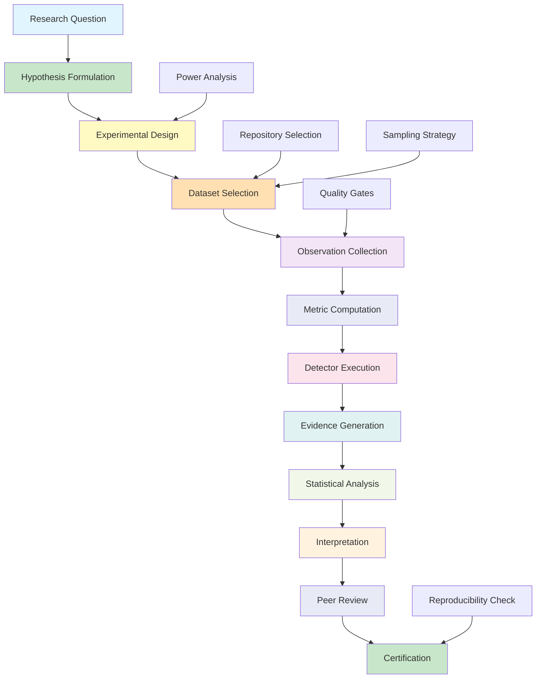
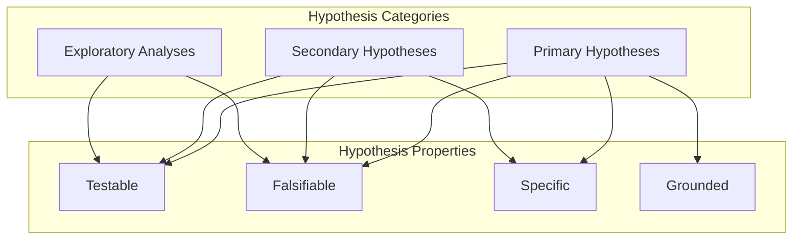
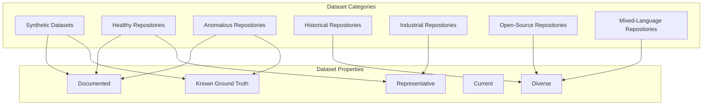
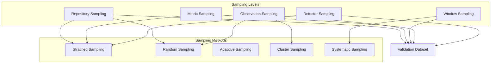
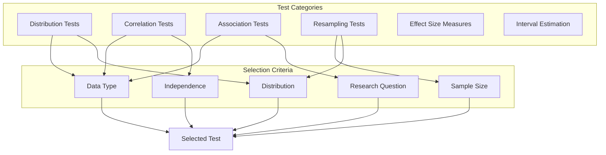
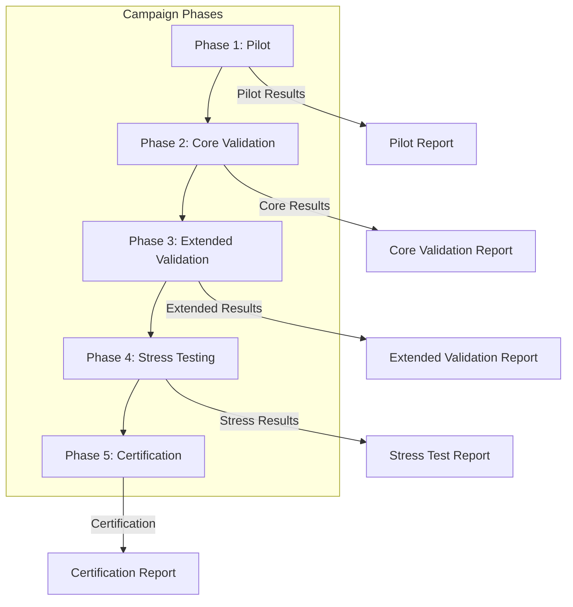
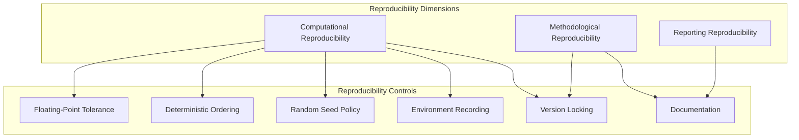
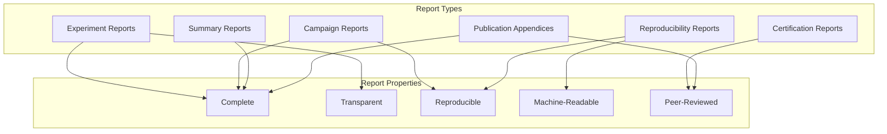
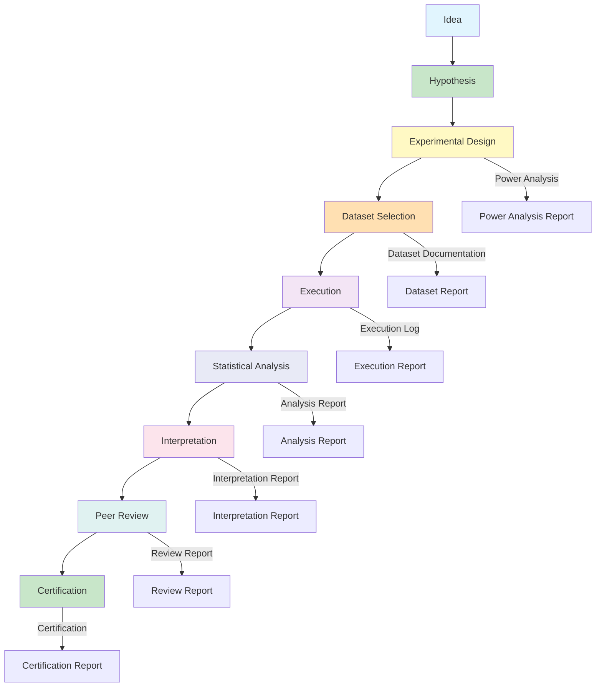

# MIIE v1.6

## 09_STATISTICAL_VALIDATION_PLAN.md

### Statistical Validation Campaign & Scientific Experimentation Protocol

| Field | Value |
|-------|-------|
| Document Type | Scientific Validation Protocol |
| Version | 1.6.0 |
| Status | Canonical |
| Scope | Statistical Experimentation, Hypothesis Design, Benchmark Campaigns, Validation Methodology, Reproducibility Protocol, Scientific Reporting |
| Audience | Principal Statisticians, Empirical Software Engineering Researchers, Scientific Validation Engineers, Research Methodologists |
| Last Updated | 2026-07-05 |

---

## Table of Contents

1. [Purpose](#1-purpose)
2. [Scientific Validation Philosophy](#2-scientific-validation-philosophy)
3. [Experimental Framework](#3-experimental-framework)
4. [Hypothesis Design](#4-hypothesis-design)
5. [Dataset Strategy](#5-dataset-strategy)
6. [Sampling Strategy](#6-sampling-strategy)
7. [Statistical Tests](#7-statistical-tests)
8. [Power Analysis](#8-power-analysis)
9. [Benchmark Campaign Design](#9-benchmark-campaign-design)
10. [Reproducibility Protocol](#10-reproducibility-protocol)
11. [Statistical Interpretation](#11-statistical-interpretation)
12. [Threats to Validity](#12-threats-to-validity)
13. [Scientific Reporting](#13-scientific-reporting)
14. [Future Validation Evolution](#14-future-validation-evolution)
15. [Governance](#15-governance)
16. [Experiment Lifecycle](#16-experiment-lifecycle)
17. [Architecture Decision Summary](#17-architecture-decision-summary)
18. [Appendices](#18-appendices)

---

## 1. Purpose

### 1.1 Why Statistical Validation Is Different from Software Testing

Software testing verifies that code behaves as specified. Statistical validation verifies that scientific conclusions are justified by evidence. These are fundamentally different objectives requiring fundamentally different methodologies.

Software testing asks: does this function return the correct output for this input? The answer is deterministic — the function either returns the correct output or it does not. Testing establishes correctness through exhaustive or representative case coverage.

Statistical validation asks: does this metric reliably detect integrity violations across diverse repositories? The answer is probabilistic — the metric may detect some violations and miss others, and its performance varies across contexts. Validation establishes reliability through controlled experimentation and statistical inference.

The distinction matters because:

**Determinism vs. Probability**: Software tests produce binary results (pass/fail). Statistical experiments produce probability statements (the probability that the observed effect is real rather than due to chance).

**Completeness vs. Sampling**: Software tests can achieve complete coverage of defined inputs. Statistical experiments must sample from infinite populations and generalize from samples to populations.

**Specification vs. Theory**: Software tests verify conformance to specifications. Statistical experiments evaluate conformance to scientific theories and hypotheses.

**Local vs. Global**: Software tests verify behavior for specific inputs. Statistical experiments draw conclusions about general properties that must hold across diverse contexts.

### 1.2 Scientific Experimentation

Scientific experimentation is the systematic investigation of hypotheses through controlled observation and measurement. In the context of MIIE, scientific experimentation addresses:

**Metric Validation**: Does this metric reliably measure what it claims to measure? Does commit entropy ratio truly reflect the randomness of commit patterns, or can it be produced by fundamentally different processes?

**Detector Validation**: Does this detector reliably identify the patterns it is designed to detect? Does the distribution drift detector correctly identify genuine distribution shifts while avoiding false alarms?

**System Validation**: Does the integrated system produce reliable, reproducible, and scientifically sound results across diverse repositories and conditions?

Scientific experimentation requires:

**Controlled Conditions**: Experiments are conducted under conditions that isolate the variables of interest from confounding factors.

**Repeatable Procedures**: Experiments can be repeated by independent investigators to verify results.

**Statistical Analysis**: Results are analyzed using established statistical methods with known properties.

**Transparent Reporting**: Experimental procedures, results, and conclusions are fully documented and open to scrutiny.

### 1.3 Statistical Evidence

Statistical evidence is evidence that has been analyzed using statistical methods to determine its strength, reliability, and significance. Statistical evidence for MIIE includes:

**Effect Sizes**: Quantified measures of the magnitude of observed effects. A correlation coefficient of 0.7 between two metrics is statistical evidence of a strong relationship.

**Confidence Intervals**: Ranges within which true values are expected to lie with specified probability. A 95% confidence interval of [0.6, 0.8] for a correlation coefficient indicates that the true correlation is likely between 0.6 and 0.8.

**P-values**: Probabilities of observing results at least as extreme as those observed, assuming the null hypothesis is true. A p-value of 0.001 indicates that the observed result would occur by chance in only 0.1% of experiments if the null hypothesis were true.

**Statistical Power**: The probability of detecting a true effect when it exists. A power of 0.80 means that the experiment has an 80% chance of detecting a true effect of the specified size.

### 1.4 Empirical Validation

Empirical validation is validation based on observation and experiment rather than theory alone. MIIE's empirical validation strategy involves:

**Observation**: Collecting data from real and synthetic repositories under controlled conditions.

**Measurement**: Quantifying MIIE's performance on well-defined tasks with clear success criteria.

**Analysis**: Applying statistical methods to determine whether observed performance meets acceptance criteria.

**Inference**: Drawing general conclusions about MIIE's capabilities from specific experimental results.

### 1.5 Research Reproducibility

Research reproducibility is the ability to reproduce experimental results using the same data, methods, and conditions. Reproducibility in MIIE requires:

**Data Availability**: All datasets used in validation are available for independent analysis.

**Method Documentation**: All experimental procedures are fully documented.

**Deterministic Processing**: Experiments produce identical results when repeated with identical inputs.

**Environment Specification**: The computational environment is fully specified and reproducible.

**Code Availability**: Analysis code is available for independent verification.

### 1.6 Measurement Integrity

Measurement integrity is the property that measurements faithfully represent the phenomena they claim to measure. Statistical validation establishes measurement integrity by:

**Construct Validity**: Demonstrating that metrics measure the constructs they claim to measure.

**Criterion Validity**: Demonstrating that metric values correlate with external criteria.

**Reliability**: Demonstrating that measurements are consistent across repeated measurements.

**Sensitivity**: Demonstrating that measurements detect meaningful changes in the underlying constructs.

**Specificity**: Demonstrating that measurements do not detect changes that are not present.

---

## 2. Scientific Validation Philosophy

### 2.1 Null Hypothesis

The null hypothesis (H₀) is the default assumption that there is no effect, no difference, or no relationship. In MIIE validation:

**Metric Validation H₀**: The metric does not distinguish between repositories with and without the property it claims to measure. For example, H₀ for test coverage ratio: "Test coverage ratio does not distinguish between repositories with thorough testing and repositories with superficial testing."

**Detector Validation H₀**: The detector does not detect the pattern it is designed to detect. For example, H₀ for distribution drift detector: "The distribution drift detector does not detect genuine distribution shifts at a rate higher than chance."

**System Validation H₀**: The system does not produce results that are better than chance. For example, H₀ for the integrated system: "MIIE's integrity scores do not correlate with expert assessments of repository integrity."

The null hypothesis is assumed to be true unless sufficient evidence warrants rejection. This conservative approach minimizes the risk of false conclusions.

### 2.2 Alternative Hypothesis

The alternative hypothesis (H₁) is the hypothesis that there is an effect, difference, or relationship. The alternative hypothesis is what the experiment seeks to support.

**One-Sided Alternative**: Specifies the direction of the effect. "Metric A is greater for repositories with thorough testing than for repositories without thorough testing."

**Two-Sided Alternative**: Does not specify the direction of the effect. "Metric A differs between repositories with thorough testing and repositories without thorough testing."

The choice between one-sided and two-sided alternatives depends on the research question. One-sided alternatives are appropriate when only one direction of effect is scientifically meaningful. Two-sided alternatives are appropriate when effects in either direction are meaningful.

### 2.3 Scientific Falsifiability

Scientific falsifiability requires that hypotheses can be refuted by evidence. MIIE's validation hypotheses are falsifiable because:

**Clear Predictions**: Each hypothesis makes clear, testable predictions about what should be observed if the hypothesis is true.

**Defined Acceptance Criteria**: Each experiment has defined criteria for accepting or rejecting the hypothesis.

**Independent Verification**: Experiments can be independently conducted to verify or refute results.

**Open to Criticism**: Results are open to scientific criticism and alternative interpretations.

Falsifiability ensures that MIIE's scientific claims are grounded in evidence rather than assertion.

### 2.4 Evidence Accumulation

Scientific knowledge accumulates through the gradual accumulation of evidence from multiple experiments. MIIE's evidence accumulation strategy involves:

**Multiple Experiments**: No single experiment is definitive. Conclusions are supported by multiple experiments across different conditions.

**Convergent Evidence**: Different experiments testing different aspects of the same hypothesis converge on the same conclusion.

**Replication**: Key experiments are replicated to verify results.

**Meta-Analysis**: Results from multiple experiments are combined to produce more precise estimates.

### 2.5 Confidence

Confidence in scientific conclusions reflects the strength of the evidence supporting those conclusions. Confidence is quantified through:

**Statistical Significance**: The probability that the observed result is due to chance. Lower p-values provide stronger evidence against the null hypothesis.

**Effect Size**: The magnitude of the observed effect. Larger effect sizes provide stronger evidence for practical significance.

**Confidence Intervals**: The range of plausible values for the true effect. Narrower intervals indicate more precise estimates.

**Replication**: The consistency of results across repeated experiments. More consistent results provide stronger evidence.

### 2.6 Uncertainty

Uncertainty is an inherent property of statistical inference. MIIE acknowledges uncertainty through:

**Sampling Uncertainty**: Uncertainty arising from the use of samples to estimate population parameters.

**Model Uncertainty**: Uncertainty arising from assumptions made in statistical models.

**Measurement Uncertainty**: Uncertainty arising from imprecision in measurements.

**Extrapolation Uncertainty**: Uncertainty arising from generalizing results beyond the experimental conditions.

Uncertainty is always reported alongside results to provide honest assessments of the precision of conclusions.

### 2.7 Replication

Replication is the repetition of experiments to verify results. MIIE's replication strategy involves:

**Direct Replication**: Repeating the same experiment with the same data to verify computational reproducibility.

**Conceptual Replication**: Conducting a different experiment testing the same hypothesis to verify robustness.

**Independent Replication**: Having independent investigators conduct experiments to verify objectivity.

**Systematic Replication**: Repeating experiments across different conditions to verify generalizability.

### 2.8 Transparency

Transparency requires that all aspects of experimental methodology are visible and understandable. MIIE's transparency requirements include:

**Method Documentation**: All experimental procedures are fully documented.

**Data Availability**: All datasets are available for independent analysis.

**Code Availability**: All analysis code is available for independent verification.

**Result Reporting**: All results are reported, including non-significant results and failures.

**Assumption Disclosure**: All assumptions made during analysis are explicitly stated.

### 2.9 Repeatability

Repeatability requires that experiments produce consistent results when repeated under the same conditions. MIIE's repeatability requirements include:

**Deterministic Processing**: Given identical inputs, experiments produce identical outputs.

**Fixed Random Seeds**: Any stochastic elements use fixed random seeds for reproducibility.

**Environment Specification**: The computational environment is fully specified.

**Version Locking**: Software versions are locked for reproducibility.

**Tolerance Specification**: Acceptable tolerance for floating-point discrepancies is defined.

---

## 3. Experimental Framework

### 3.1 Validation Pipeline

The experimental framework follows a structured pipeline that transforms research questions into validated conclusions.

### 3.2 Stage Descriptions

**Stage 1 — Research Question**: A clear, specific research question is formulated. The question must be answerable through controlled experimentation and must address a meaningful aspect of MIIE's scientific validity.

**Stage 2 — Hypothesis Formulation**: The research question is translated into testable hypotheses with null and alternative hypotheses, expected outcomes, and decision criteria.

**Stage 3 — Experimental Design**: The experiment is designed with appropriate controls, sample sizes, statistical tests, and power analysis.

**Stage 4 — Dataset Selection**: Repositories and data are selected according to the dataset strategy, ensuring appropriate diversity and representation.

**Stage 5 — Observation Collection**: Observations are collected from selected repositories using the observation framework.

**Stage 6 — Metric Computation**: Metrics are computed from observations using the defined algorithms.

**Stage 7 — Detector Execution**: Detectors are executed on metric time series to produce signals.

**Stage 8 — Evidence Generation**: Evidence packages are assembled from observations, metrics, detector signals, and confidence assessments.

**Stage 9 — Statistical Analysis**: Statistical tests are applied to evidence to evaluate hypotheses.

**Stage 10 — Interpretation**: Statistical results are interpreted in the context of the research question.

**Stage 11 — Peer Review**: Results are reviewed by domain experts for scientific validity.

**Stage 12 — Certification**: Validated results are certified and documented.

### 3.3 Pipeline Invariants

The experimental pipeline maintains several invariants:

**Independence**: Each experiment is independent of other experiments. Results from one experiment do not influence the design or execution of another experiment.

**Objectivity**: Experimental design and analysis are conducted without knowledge of expected results. Blinding is used where feasible.

**Completeness**: All planned experiments are conducted and reported, including non-significant results.

**Reproducibility**: All experiments can be independently reproduced using the documented methodology.

---

## 4. Hypothesis Design

### 4.1 Hypothesis Categories

Hypotheses are categorized by their role in the validation framework.

### 4.2 Primary Hypotheses

Primary hypotheses are the main hypotheses that the validation campaign seeks to test. They address the core scientific questions about MIIE's validity.

**H₁: Metric Construct Validity**
- H₁₀: Metric values do not correlate with expert assessments of the constructs they claim to measure.
- H₁₁: Metric values correlate positively with expert assessments of the constructs they claim to measure.
- Decision Criterion: Pearson r > 0.5 with p < 0.05.

**H₂: Detector Sensitivity**
- H₂₀: Detectors do not detect known anomalies at a rate higher than chance.
- H₂₁: Detectors detect known anomalies at a rate significantly higher than chance.
- Decision Criterion: Sensitivity > 0.70 with lower bound of 95% CI > 0.50.

**H₃: Detector Specificity**
- H₃₀: Detectors flag non-anomalous repositories as anomalous at a rate higher than 10%.
- H₃₁: Detectors flag non-anomalous repositories as anomalous at a rate no higher than 10%.
- Decision Criterion: Specificity > 0.90 with lower bound of 95% CI > 0.80.

**H₄: Scoring Calibration**
- H₄₀: Integrity scores do not correlate with expert assessments of repository integrity.
- H₄₁: Integrity scores correlate positively with expert assessments of repository integrity.
- Decision Criterion: Spearman ρ > 0.6 with p < 0.01.

**H₅: Reproducibility**
- H₅₀: Repeated executions produce results that differ by more than 5%.
- H₅₁: Repeated executions produce results that differ by no more than 5%.
- Decision Criterion: Maximum coefficient of variation < 0.05 across 10 repetitions.

### 4.3 Secondary Hypotheses

Secondary hypotheses address supporting scientific questions.

**H₆: Metric Sensitivity to Change**
- H₆₀: Metric values do not change significantly when the underlying construct changes.
- H₆₁: Metric values change significantly when the underlying construct changes.
- Decision Criterion: Effect size Cohen's d > 0.5 for known changes.

**H₇: Detector Robustness to Noise**
- H₇₀: Detector performance degrades significantly when observations contain 10% noise.
- H₇₁: Detector performance does not degrade significantly when observations contain 10% noise.
- Decision Criterion: Performance degradation < 15% relative to noise-free conditions.

**H₈: Confidence Calibration**
- H₈₀: Confidence scores do not accurately predict the probability of correct detection.
- H₈₁: Confidence scores accurately predict the probability of correct detection.
- Decision Criterion: Calibration error < 0.10 on reliability diagrams.

**H₉: Cross-Platform Consistency**
- H₉₀: Results differ significantly across different operating systems and hardware.
- H₉₁: Results are consistent across different operating systems and hardware.
- Decision Criterion: Cross-platform variance < 5% of total variance.

### 4.4 Exploratory Analyses

Exploratory analyses investigate patterns and relationships without predefined hypotheses.

**Metric Correlations**: Investigating the correlations between different metrics to understand redundancy and complementarity.

**Detector Dependencies**: Investigating the dependencies between different detectors to understand interaction effects.

**Repository Clusters**: Investigating whether repositories cluster into natural groups based on metric profiles.

**Temporal Patterns**: Investigating how metric values and detector signals change over time.

**AI Activity Effects**: Investigating how AI-assisted development affects metric values and detector performance.

Exploratory analyses generate hypotheses for future testing rather than testing predefined hypotheses.

### 4.5 Decision Criteria

Decision criteria define the conditions under which hypotheses are accepted or rejected.

| Decision | Condition | Interpretation |
|----------|-----------|----------------|
| Accept H₁ | p < α AND effect size > minimum AND CI excludes null value | Strong evidence for the alternative hypothesis |
| Reject H₁ | p ≥ α OR effect size ≤ minimum OR CI includes null value | Insufficient evidence for the alternative hypothesis |
| Inconclusive | p ≈ α AND effect size ≈ minimum AND CI barely includes null value | More data needed for definitive conclusion |
| Exploratory | No predefined criteria | Pattern identification, hypothesis generation |

The significance level α is set at 0.05 for primary hypotheses and 0.01 for secondary hypotheses, following standard scientific practice.

---

## 5. Dataset Strategy

### 5.1 Dataset Categories

MIIE's validation requires diverse datasets that represent the full range of repositories MIIE is designed to analyze.

### 5.2 Synthetic Datasets

Synthetic datasets are constructed repositories with known properties. They provide ground truth for validation.

**Construction Principles**:
- Synthetic repositories contain real code, not artificial examples.
- Properties are precisely controlled and documented.
- Construction methods are reproducible.
- Synthetic repositories span the range of expected conditions.

**Use Cases**:
- Controlled evaluation of metric sensitivity.
- Controlled evaluation of detector accuracy.
- Evaluation of scoring calibration.
- Testing of edge cases and boundary conditions.

**Limitations**:
- Synthetic repositories may not capture real-world complexity.
- Construction assumptions may not hold for all real repositories.
- Requires ongoing maintenance as real-world patterns evolve.

### 5.3 Healthy Repositories

Healthy repositories are real repositories with documented good practices. They serve as positive baselines.

**Selection Criteria**:
- Active development with regular commits.
- Documented code review practices.
- Comprehensive test suites.
- Active issue management.
- Clean commit history.

**Diversity Requirements**:
- Multiple programming languages.
- Multiple project sizes.
- Multiple organizational contexts.
- Multiple development methodologies.

### 5.4 Repositories with Known Anomalies

Repositories with known anomalies provide ground truth for detector validation.

**Anomaly Types**:
- Commit pattern anomalies (splitting, batching, unusual timing).
- Metric gaming (coverage inflation, churn manipulation).
- Process violations (unreviewed changes, bypassed checks).
- Data quality issues (missing data, inconsistent records).

**Documentation Requirements**:
- Anomaly type and severity.
- Time period of anomaly.
- Evidence supporting anomaly classification.
- Resolution or current status.

### 5.5 Historical Repositories

Historical repositories provide longitudinal data for evaluating temporal properties.

**Characteristics**:
- Long development history (minimum 2 years).
- Multiple releases or versions.
- Documented changes in development practices.
- Available for re-analysis at multiple time points.

### 5.6 Industrial Repositories

Industrial repositories represent enterprise development contexts.

**Characteristics**:
- Proprietary code with appropriate access agreements.
- Enterprise development practices and tools.
- Compliance and regulatory requirements.
- Team-based development with documented processes.

### 5.7 Open-Source Repositories

Open-source repositories represent community development contexts.

**Characteristics**:
- Publicly available code.
- Community contribution patterns.
- Diverse contributor base.
- Public development history.

### 5.8 Mixed-Language Repositories

Mixed-language repositories test MIIE's language independence.

**Characteristics**:
- Multiple programming languages within a single repository.
- Different language paradigms (imperative, functional, object-oriented).
- Different type systems (static, dynamic, gradual).
- Different ecosystems (JavaScript, Python, Java, Go, Rust).

### 5.9 Repository Diversity Requirements

The validation dataset must satisfy diversity requirements to support generalization.

| Dimension | Minimum Diversity | Target Diversity |
|-----------|------------------|-----------------|
| Languages | 5 languages | 10+ languages |
| Sizes | 3 size categories | 5 size categories |
| Ages | 2 age categories | 4 age categories |
| Organizations | 3 organizations | 10+ organizations |
| Methodologies | 2 methodologies | 4+ methodologies |
| AI Activity Levels | 3 levels | 5 levels |

### 5.10 Dataset Inclusion Criteria

Repositories are included in the validation dataset if they meet all of the following criteria:

**Minimum History**: At least 100 commits or 6 months of development history.

**Data Availability**: Sufficient data is available for metric computation.

**Documentation**: Basic documentation is available (README, license, contribution guidelines).

**Access**: Repository is accessible for analysis (public or with appropriate agreements).

**Quality**: Repository meets minimum quality standards (no obvious data corruption, reasonable structure).

### 5.11 Dataset Exclusion Criteria

Repositories are excluded from the validation dataset if any of the following conditions apply:

**Insufficient Data**: Fewer than 100 commits or less than 6 months of history.

**Data Corruption**: Evidence of data corruption, missing data, or inconsistent records.

**Non-Representative**: Repository has unique characteristics that make it non-representative of typical development.

**Access Restrictions**: Repository cannot be accessed for analysis.

**Ethical Concerns**: Repository contains sensitive information that cannot be ethically analyzed.

---

## 6. Sampling Strategy

### 6.1 Sampling Framework

Sampling strategy determines which repositories, observations, windows, and metrics are included in experiments.

### 6.2 Repository Sampling

Repository sampling selects which repositories to include in experiments.

**Stratified Random Sampling**: Repositories are stratified by language, size, age, and organization, then randomly sampled within strata. This ensures representation across all dimensions.

**Oversampling**: Rare but important repository types (e.g., very large repositories, repositories with known anomalies) are oversampled to ensure sufficient representation.

**Exclusion Probability**: Each repository has a known, non-zero probability of inclusion, enabling valid statistical inference.

### 6.3 Observation Sampling

Observation sampling determines which observations from each repository are included.

**Complete Observation**: All observations from a repository are included when the repository is small enough for complete analysis.

**Systematic Sampling**: Observations are sampled at regular intervals when complete analysis is infeasible.

**Stratified Sampling**: Observations are sampled within strata defined by observation type, time period, or other properties.

**Adaptive Sampling**: Sampling intensity is increased for time periods or areas of particular interest.

### 6.4 Window Sampling

Window sampling determines which observation windows are included in analysis.

**Complete Window Analysis**: All windows are included when the number of windows is manageable.

**Representative Window Analysis**: A representative subset of windows is selected to reduce computational cost while maintaining representativeness.

**Sliding Window Analysis**: Windows overlap by a specified amount to capture temporal dependencies.

**Adaptive Window Analysis**: Window boundaries are adjusted based on data characteristics.

### 6.5 Metric Sampling

Metric sampling determines which metrics are computed for each experiment.

**Complete Metric Suite**: All metrics are computed when comprehensive analysis is needed.

**Focused Metric Subset**: A subset of metrics relevant to the specific hypothesis is computed.

**Hierarchical Metric Analysis**: Metrics are computed in dependency order, with dependent metrics skipped if dependencies fail.

### 6.6 Detector Sampling

Detector sampling determines which detectors are executed.

**Complete Detector Suite**: All detectors are executed when comprehensive analysis is needed.

**Focused Detector Subset**: A subset of detectors relevant to the specific hypothesis is executed.

**Sequential Detector Execution**: Detectors are executed in sequence, with subsequent detectors skipped based on earlier results.

### 6.7 Sampling Limitations

Sampling introduces uncertainty that must be accounted for in analysis:

**Sampling Error**: Results are based on samples, not populations. Sampling error is estimated and reported.

**Design Effect**: Complex sampling designs may reduce effective sample size. Design effects are computed and reported.

**Non-Response**: Some repositories or observations may fail to yield usable data. Non-response rates are documented.

**Coverage**: The sampling frame may not cover the entire population of interest. Coverage gaps are documented.

---

## 7. Statistical Tests

### 7.1 Test Selection Framework

Statistical tests are selected based on the research question, data characteristics, and assumptions.

### 7.2 Kolmogorov-Smirnov Two-Sample Test

**Purpose**: Tests whether two samples are drawn from the same distribution.

**Assumptions**:
- Samples are independent.
- Observations are continuous.
- Distributions are continuous (not discrete).

**Application in MIIE**:
- Comparing metric distributions before and after suspected integrity violations.
- Comparing distributions across different repository types.
- Validating that synthetic repositories have expected distributions.

**Test Statistic**: D = sup_x |F₁(x) - F₂(x)|, where F₁ and F₂ are the empirical distribution functions.

**Interpretation**: Large D values with small p-values indicate that the two samples are drawn from different distributions.

**Failure Conditions**:
- Very small sample sizes (n < 10) reduce power.
- Discrete distributions may produce inflated Type I error.
- Ties in the data may affect p-value accuracy.

**Scientific Justification**: The KS test is distribution-free, making it applicable to any continuous distribution. It is sensitive to differences in both location and shape of distributions.

### 7.3 Population Stability Index (PSI)

**Purpose**: Measures the shift in distribution of a variable between two samples.

**Assumptions**:
- Both samples are divided into bins.
- Bins are non-empty in both samples.
- The binning strategy is appropriate for the data.

**Application in MIIE**:
- Measuring the magnitude of distribution shifts in metrics over time.
- Comparing metric distributions across different conditions.
- Monitoring metric stability across observation windows.

**Formula**: PSI = Σᵢ (Pᵢ - Qᵢ) × ln(Pᵢ/Qᵢ), where Pᵢ and Qᵢ are the proportions in bin i for the two samples.

**Interpretation**:
- PSI < 0.10: No significant shift.
- PSI 0.10 – 0.25: Moderate shift.
- PSI > 0.25: Significant shift.

**Failure Conditions**:
- Empty bins produce undefined values.
- Very small samples produce unstable bin estimates.
- Bin boundaries may affect results.

**Scientific Justification**: PSI provides a normalized measure of distribution shift that is interpretable on a standard scale. It captures both location and shape changes.

### 7.4 Pearson Product-Moment Correlation

**Purpose**: Measures the linear relationship between two continuous variables.

**Assumptions**:
- Both variables are continuous.
- The relationship is linear.
- Both variables are approximately normally distributed.
- Observations are independent.
- No significant outliers.

**Application in MIIE**:
- Measuring the correlation between different metrics.
- Measuring the correlation between metric values and expert assessments.
- Validating metric construct validity.

**Test Statistic**: r = Σᵢ(xᵢ - x̄)(yᵢ - ȳ) / √[Σᵢ(xᵢ - x̄)² × Σᵢ(yᵢ - ȳ)²]

**Interpretation**:
- |r| < 0.3: Weak correlation.
- |r| 0.3 – 0.7: Moderate correlation.
- |r| > 0.7: Strong correlation.

**Failure Conditions**:
- Non-linear relationships produce misleading r values.
- Outliers can dramatically affect r.
- Non-normal distributions may produce inaccurate p-values.

**Scientific Justification**: Pearson correlation is the standard measure of linear association. It provides both a point estimate and a test of significance.

### 7.5 Spearman Rank Correlation

**Purpose**: Measures the monotonic relationship between two variables.

**Assumptions**:
- Both variables are at least ordinal.
- Observations are independent.
- The relationship is monotonic (not necessarily linear).

**Application in MIIE**:
- Measuring the correlation between ranked variables (e.g., expert rankings vs. metric rankings).
- Measuring associations that may not be linear.
- Providing robustness to outliers.

**Test Statistic**: ρ = 1 - 6Σdᵢ² / n(n² - 1), where dᵢ is the difference in ranks.

**Interpretation**: Same scale as Pearson correlation, but measures monotonic rather than linear association.

**Failure Conditions**:
- Tied ranks may affect accuracy.
- Very small samples reduce power.
- Non-monotonic relationships may not be detected.

**Scientific Justification**: Spearman correlation is non-parametric and does not require normality assumptions. It is appropriate for ranked data and ordinal scales.

### 7.6 Fisher Z-Transformation

**Purpose**: Transforms correlation coefficients to a approximately normal distribution for inference.

**Assumptions**:
- The sample correlation is from a bivariate normal distribution.
- The sample size is sufficiently large (n > 10 recommended).

**Application in MIIE**:
- Constructing confidence intervals for correlation coefficients.
- Comparing correlation coefficients across different conditions.
- Testing whether two correlation coefficients differ significantly.

**Formula**: z = 0.5 × ln[(1 + r)/(1 - r)]

**Interpretation**: The transformed z statistic follows an approximately normal distribution, enabling standard normal inference.

**Failure Conditions**:
- Small samples may not satisfy normality.
- Correlations near ±1 produce extreme z values.

**Scientific Justification**: Fisher z-transformation is the standard method for inference about correlation coefficients. It provides valid confidence intervals and hypothesis tests.

### 7.7 Hartigan's Dip Test

**Purpose**: Tests whether a distribution is unimodal.

**Assumptions**:
- The distribution is continuous.
- The sample size is sufficient (n > 20 recommended).

**Application in MIIE**:
- Detecting multimodality in metric distributions that may indicate subpopulations.
- Validating that metric distributions are unimodal as expected.
- Identifying threshold compression in detectors.

**Interpretation**: A significant dip test (p < 0.05) indicates that the distribution is significantly different from unimodal.

**Failure Conditions**:
- Small samples reduce power.
- Very smooth distributions may not detect subtle multimodality.
- Computational complexity increases with sample size.

**Scientific Justification**: The dip test is a rigorous, non-parametric test for unimodality. It is appropriate for detecting threshold compression and distribution anomalies.

### 7.8 Bootstrap Methods

**Purpose**: Provides distribution-free estimation of sampling distributions and confidence intervals.

**Assumptions**:
- Observations are independent.
- The bootstrap sample size is sufficiently large (typically 1000+ resamples).
- The statistic is pivotal or approximately pivotal.

**Application in MIIE**:
- Constructing confidence intervals for any statistic.
- Estimating the sampling distribution of complex statistics.
- Validating parametric assumptions.
- Providing robustness to distributional assumptions.

**Procedure**:
1. Draw B bootstrap samples of size n with replacement.
2. Compute the statistic of interest for each bootstrap sample.
3. Use the distribution of bootstrap statistics to construct confidence intervals.

**Interpretation**: Bootstrap confidence intervals provide distribution-free coverage guarantees.

**Failure Conditions**:
- Dependent observations violate bootstrap assumptions.
- Very small samples produce unreliable bootstrap estimates.
- Statistics with infinite variance may not converge.

**Scientific Justification**: Bootstrap methods provide valid inference without distributional assumptions. They are the gold standard for non-parametric confidence interval estimation.

### 7.9 Effect Size Measures

**Purpose**: Quantifies the magnitude of observed effects independent of sample size.

**Application in MIIE**:

**Cohen's d**: Measures the standardized difference between two means.
- d = (x̄₁ - x̄₂) / s_pooled
- Small: d = 0.2, Medium: d = 0.5, Large: d = 0.8

**Eta-squared (η²)**: Measures the proportion of variance explained by a factor.
- η² = SS_between / SS_total
- Small: η² = 0.01, Medium: η² = 0.06, Large: η² = 0.14

**Omega-squared (ω²)**: Unbiased estimate of variance explained.
- ω² = (SS_between - df_between × MS_within) / (SS_total + MS_within)

**Scientific Justification**: Effect sizes provide information about practical significance that p-values alone cannot convey. A statistically significant result with a tiny effect size may have no practical importance.

### 7.10 Confidence Intervals

**Purpose**: Provides a range of plausible values for population parameters.

**Application in MIIE**:
- Reporting the precision of metric estimates.
- Reporting the precision of detector performance estimates.
- Comparing conditions through interval overlap.

**Standard Levels**:
- 95% CI: Standard scientific reporting.
- 99% CI: Conservative reporting for high-stakes conclusions.
- 80% CI: Pilot studies and preliminary analyses.

**Interpretation**: A 95% CI means that if the experiment were repeated many times, 95% of the computed intervals would contain the true parameter.

**Scientific Justification**: Confidence intervals provide more information than point estimates alone, including precision and plausibility ranges.

### 7.11 Multiple Comparison Correction

**Purpose**: Controls the family-wise error rate or false discovery rate when multiple statistical tests are conducted.

**Application in MIIE**:
- When multiple metrics are tested simultaneously.
- When multiple detectors are evaluated.
- When multiple hypotheses are tested.

**Methods**:

**Bonferroni Correction**: α_adjusted = α / m, where m is the number of tests.
- Controls family-wise error rate.
- Very conservative; reduces power.

**Benjamini-Hochberg Procedure**: Controls false discovery rate.
- Less conservative than Bonferroni.
- More appropriate for exploratory analyses.

**Holm-Bonferroni**: Step-down procedure that is less conservative than Bonferroni.
- Controls family-wise error rate.
- More powerful than standard Bonferroni.

**Scientific Justification**: Multiple comparison correction prevents inflated Type I error rates that arise from conducting many tests. The choice of method depends on the balance between Type I and Type II error.

### 7.12 Statistical Test Decision Framework

The following decision framework guides test selection:

| Data Type | Distribution | Sample Size | Recommended Test |
|-----------|-------------|-------------|-----------------|
| Continuous, Independent | Normal | n > 30 | Pearson correlation |
| Continuous, Independent | Normal | n ≤ 30 | Pearson with bootstrap CI |
| Continuous, Independent | Non-normal | Any | Spearman correlation |
| Two distributions | Continuous | n > 20 | KS two-sample test |
| Two distributions | Continuous | n ≤ 20 | KS with permutation test |
| Distribution shift | Continuous | Any | PSI |
| Unimodality | Continuous | n > 20 | Hartigan dip test |
| Effect size | Continuous | Any | Cohen's d with CI |
| Multiple tests | Any | Any | Bonferroni or BH correction |

---

## 8. Power Analysis

### 8.1 Statistical Power Definition

Statistical power is the probability of correctly rejecting a false null hypothesis. Power = 1 - β, where β is the probability of a Type II error (failing to detect a real effect).

**In MIIE Context**: If MIIE's detector truly detects anomalies, what is the probability that the validation experiment will produce a statistically significant result?

### 8.2 Power Components

Power depends on four factors:

**Effect Size**: Larger effects are easier to detect. MIIE must detect practically meaningful effects, not just statistically significant ones.

**Sample Size**: Larger samples provide more information and greater power. Sample size is the primary lever for controlling power.

**Significance Level (α)**: Lower α values reduce Type I error but also reduce power. α = 0.05 is standard.

**Variability**: Lower variability in the data increases power. Controlling extraneous sources of variability increases power.

### 8.3 Minimum Detectable Effect

The minimum detectable effect (MDE) is the smallest effect size that the experiment can detect with adequate power.

**MDE for Metric Validation**:
- Pearson r > 0.5: Practically meaningful correlation.
- Cohen's d > 0.5: Practically meaningful difference.
- η² > 0.06: Practically meaningful variance explained.

**MDE for Detector Validation**:
- Sensitivity > 0.70: Minimum acceptable detection rate.
- Specificity > 0.90: Minimum acceptable false positive rate.
- AUC > 0.75: Minimum acceptable discrimination.

### 8.4 Sample Size Estimation

Sample size is estimated to achieve target power for the minimum detectable effect.

**Sample Size for Correlation Testing**:
- n = [(z_α/2 + z_β) / (0.5 × ln[(1 + r)/(1 - r)])²] + 3
- For r = 0.5, α = 0.05, power = 0.80: n ≈ 29

**Sample Size for Two-Sample Tests**:
- n per group = 2 × [(z_α/2 + z_β) / d]²
- For d = 0.5, α = 0.05, power = 0.80: n ≈ 64 per group

**Sample Size for Proportion Tests**:
- n = [(z_α/2 + z_β)² × p(1-p)] / δ²
- For p = 0.70, δ = 0.10, α = 0.05, power = 0.80: n ≈ 81

### 8.5 False Positive Rate

The false positive rate (Type I error rate) is the probability of rejecting a true null hypothesis. MIIE controls this through:

**Significance Level**: α = 0.05 for primary hypotheses, α = 0.01 for secondary hypotheses.

**Multiple Comparison Correction**: Applied when multiple tests are conducted simultaneously.

**One-Sided vs. Two-Sided**: Two-sided tests are used unless there is strong scientific justification for one-sided testing.

### 8.6 False Negative Rate

The false negative rate (Type II error rate) is the probability of failing to reject a false null hypothesis. MIIE controls this through:

**Power Analysis**: Experiments are designed with adequate power (≥ 0.80).

**Sample Size**: Sufficient sample sizes are used to achieve target power.

**Effect Size**: MIIE targets practically meaningful effect sizes.

### 8.7 Sensitivity Analysis

Sensitivity analysis examines how results change under different assumptions.

**Sample Size Sensitivity**: How do results change with different sample sizes?

**Effect Size Sensitivity**: How do results change with different assumed effect sizes?

**Distribution Sensitivity**: How do results change with different distributional assumptions?

**Outlier Sensitivity**: How do results change when outliers are included or excluded?

### 8.8 Power Analysis Checklist

| Component | Target | Rationale |
|-----------|--------|-----------|
| Statistical Power | ≥ 0.80 | Standard scientific practice |
| Significance Level | 0.05 (primary), 0.01 (secondary) | Balances Type I and Type II error |
| Minimum Detectable Effect | Cohen's d > 0.5, r > 0.5 | Practically meaningful effects |
| Sample Size | Computed from power analysis | Ensures adequate power |
| Multiple Comparison | Bonferroni or BH correction | Controls inflated error rates |
| Sensitivity Analysis | Conducted for key assumptions | Documents robustness |

---

## 9. Benchmark Campaign Design

### 9.1 Campaign Objectives

Benchmark campaigns systematically evaluate MIIE's performance across defined conditions.

**Primary Objectives**:
- Validate metric construct validity across repository types.
- Validate detector sensitivity and specificity.
- Validate scoring calibration and reliability.
- Establish performance baselines for future comparison.

**Secondary Objectives**:
- Identify strengths and weaknesses across different contexts.
- Quantify the effect of repository characteristics on performance.
- Generate hypotheses for future research.

### 9.2 Repository Categories for Campaigns

| Category | Description | Minimum Count | Purpose |
|----------|-------------|--------------|---------|
| Healthy Baseline | Well-maintained, documented repositories | 30 | Positive baseline |
| Known Anomalies | Repositories with documented integrity violations | 20 | Detector validation |
| Mixed Quality | Repositories with varying quality levels | 30 | Discrimination testing |
| Large Scale | Repositories with > 10,000 commits | 10 | Scalability testing |
| Multi-Language | Repositories with > 3 programming languages | 15 | Language independence |
| Historical | Repositories with > 5 years of history | 10 | Temporal stability |
| AI-Assisted | Repositories with documented AI activity | 15 | AI activity impact |

### 9.3 Campaign Phases

**Phase 1: Pilot**:
- Small-scale experiment to validate methodology.
- Identify practical issues and refine procedures.
- Estimate effect sizes for power analysis.
- Duration: 1–2 weeks.

**Phase 2: Core Validation**:
- Full-scale experiment with primary hypotheses.
- All repository categories represented.
- All statistical tests conducted.
- Duration: 2–4 weeks.

**Phase 3: Extended Validation**:
- Additional experiments for secondary hypotheses.
- Extended repository diversity.
- Sensitivity analyses.
- Duration: 2–4 weeks.

**Phase 4: Stress Testing**:
- Experiments under challenging conditions.
- Edge cases and boundary conditions.
- Robustness testing.
- Duration: 1–2 weeks.

**Phase 5: Certification**:
- Comprehensive review of all results.
- Peer review and expert assessment.
- Certification report generation.
- Duration: 1–2 weeks.

### 9.4 Execution Protocol

**Pre-Execution**:
- Verify dataset availability and integrity.
- Verify computational environment.
- Lock software versions.
- Document experimental parameters.

**During Execution**:
- Log all computation steps.
- Monitor for errors and anomalies.
- Record intermediate results.
- Maintain execution audit trail.

**Post-Execution**:
- Verify result integrity.
- Conduct reproducibility checks.
- Generate analysis reports.
- Archive all artifacts.

### 9.5 Quality Gates

| Gate | Criteria | Action on Failure |
|------|----------|------------------|
| Dataset Quality | All repositories pass inclusion criteria | Remove non-conforming repositories |
| Execution Quality | All computations complete without error | Investigate and resolve errors |
| Result Quality | All results within expected ranges | Investigate outliers |
| Reproducibility | Repeated runs produce consistent results | Investigate sources of variation |
| Completeness | All planned analyses are conducted | Conduct missing analyses |

### 9.6 Scientific Checkpoints

**Checkpoint 1 — Pilot Review**: Review pilot results to validate methodology before proceeding to core validation.

**Checkpoint 2 — Interim Analysis**: Review interim results during core validation to identify any issues requiring course correction.

**Checkpoint 3 — Final Analysis**: Review complete results before certification.

**Checkpoint 4 — Peer Review**: External expert review of methodology and results.

### 9.7 Campaign Completion Criteria

A benchmark campaign is complete when:

**All Phases Executed**: All planned phases have been executed.

**Quality Gates Passed**: All quality gates have been passed.

**Hypotheses Evaluated**: All primary and secondary hypotheses have been evaluated.

**Results Documented**: All results have been documented in campaign reports.

**Peer Review Complete**: Expert review has been conducted and feedback addressed.

**Certification Issued**: Campaign results have been certified.

---

## 10. Reproducibility Protocol

### 10.1 Reproducibility Framework

Reproducibility is the ability to produce consistent results across repeated executions. MIIE's reproducibility framework addresses computational, methodological, and reporting reproducibility.

### 10.2 Repeated Executions

Repeated executions verify computational reproducibility.

**Protocol**:
- Execute the same experiment 10 times with identical inputs.
- Record all outputs for each execution.
- Compare outputs across executions.
- Compute coefficient of variation for each output.

**Acceptance Criteria**:
- Maximum coefficient of variation < 0.05 for continuous outputs.
- Exact match for categorical outputs.
- No execution errors in any repetition.

**Documentation**:
- Number of repetitions.
- Comparison methodology.
- Results of comparison.
- Any discrepancies and their resolution.

### 10.3 Cross-Platform Validation

Cross-platform validation verifies that results are consistent across different computational environments.

**Platforms**:
- Operating systems: Linux (Ubuntu 22.04), macOS (13+), Windows (11).
- Python versions: 3.10, 3.11, 3.12.
- Hardware: x86_64, ARM64.

**Protocol**:
- Execute the same experiment on each platform.
- Record all outputs for each platform.
- Compare outputs across platforms.
- Document any platform-specific differences.

**Acceptance Criteria**:
- Maximum cross-platform variance < 5% of total variance.
- No platform-specific failures.
- All platforms produce scientifically equivalent results.

### 10.4 Version Locking

Version locking ensures that the same software versions are used across all executions.

**Locked Components**:
- Python version.
- All package versions (specified in requirements.txt or equivalent).
- Operating system version.
- Key tool versions (numpy, scipy, pandas).

**Documentation**:
- Complete version manifest for each execution.
- Hash verification of locked components.
- Version comparison across executions.

### 10.5 Environment Recording

Environment recording captures the complete computational environment.

**Recorded Information**:
- Operating system and version.
- Python version and implementation.
- All installed packages and versions.
- Hardware configuration.
- Environment variables that may affect results.
- Random seeds used.

**Format**: Machine-readable environment specification (e.g., conda environment, Docker image, Nix derivation).

### 10.6 Random Seed Policy

Random seeds ensure that stochastic processes produce identical results across executions.

**Policy**:
- All stochastic processes must accept a random seed parameter.
- Default seeds are used for production runs.
- Specific seeds are used for reproducibility validation.
- Seeds are documented in all reports.

**Implementation**:
- Each stochastic process uses an independent seed derived from a master seed.
- The master seed is documented and available for verification.

### 10.7 Deterministic Ordering

Deterministic ordering ensures that operations that could produce different results depending on execution order produce consistent results.

**Areas Requiring Deterministic Ordering**:
- Dictionary/set iteration order.
- Parallel computation task assignment.
- File system traversal order.
- Hash table collision resolution.

**Policy**:
- All operations must produce deterministic results given the same inputs.
- Any non-deterministic behavior must be documented and controlled through seeding.

### 10.8 Floating-Point Tolerances

Floating-point arithmetic may produce small differences across platforms and implementations.

**Tolerance Levels**:
- Exact match: For integer and categorical outputs.
- Absolute tolerance: 1e-10 for high-precision comparisons.
- Relative tolerance: 1e-6 for standard comparisons.
- Loose tolerance: 1e-3 for approximate comparisons.

**Policy**:
- Results are compared using appropriate tolerance levels.
- Any differences within tolerance are considered equivalent.
- Any differences outside tolerance are investigated.

### 10.9 Acceptance Criteria

| Criterion | Target | Measurement |
|-----------|--------|-------------|
| Execution Reproducibility | 10/10 identical runs | Coefficient of variation < 0.05 |
| Cross-Platform Consistency | < 5% variance | Platform comparison analysis |
| Version Compliance | 100% locked versions | Version manifest verification |
| Environment Documentation | Complete specification | Environment record completeness |
| Random Seed Compliance | All stochastic processes seeded | Seed documentation audit |
| Deterministic Ordering | All operations deterministic | Ordering consistency test |
| Floating-Point Accuracy | Within tolerance | Tolerance comparison |

---

## 11. Statistical Interpretation

### 11.1 Statistical Significance

Statistical significance indicates that an observed effect is unlikely to have occurred by chance under the null hypothesis.

**Interpretation**:
- p < 0.01: Strong evidence against the null hypothesis.
- p 0.01 – 0.05: Moderate evidence against the null hypothesis.
- p 0.05 – 0.10: Weak evidence against the null hypothesis.
- p > 0.10: Insufficient evidence against the null hypothesis.

**Limitations**:
- Statistical significance does not imply practical significance.
- p-values depend on sample size — large samples can produce significant p-values for tiny effects.
- p-values do not measure the probability that the null hypothesis is true.
- p-values do not measure the size or importance of an effect.

### 11.2 Practical Significance

Practical significance indicates that an observed effect is large enough to be meaningful in practice.

**Assessment**:
- Effect size exceeds the minimum meaningful effect.
- The effect has real-world implications for MIIE users.
- The effect is consistent across different conditions.

**Relationship to Statistical Significance**:
- Statistically significant AND practically significant: Strong evidence for the hypothesis.
- Statistically significant but NOT practically significant: Effect is real but too small to matter.
- NOT statistically significant but practically significant: Effect may be real but data is insufficient.
- NOT statistically significant AND NOT practically significant: No evidence for the hypothesis.

### 11.3 Effect Size Interpretation

Effect sizes provide information about the magnitude of effects independent of sample size.

| Effect Size | Cohen's d | Pearson r | η² | Interpretation |
|-------------|-----------|-----------|-----|----------------|
| Negligible | < 0.2 | < 0.1 | < 0.01 | Effect too small to matter |
| Small | 0.2 | 0.1 | 0.01 | Effect exists but is small |
| Medium | 0.5 | 0.3 | 0.06 | Effect is moderate |
| Large | 0.8 | 0.5 | 0.14 | Effect is large |
| Very Large | > 1.2 | > 0.7 | > 0.25 | Effect is very large |

### 11.4 Confidence Interpretation

Confidence intervals provide range estimates for parameters.

**Interpretation**:
- Narrow CI: Precise estimate.
- Wide CI: Imprecise estimate.
- CI excludes null value: Evidence for the effect.
- CI includes null value: Insufficient evidence for the effect.

**Reporting**: Always report point estimate, CI, and interpretation together.

### 11.5 Uncertainty Communication

Uncertainty must be communicated clearly and honestly.

**Best Practices**:
- Report confidence intervals alongside point estimates.
- Acknowledge limitations explicitly.
- Distinguish between statistical and practical uncertainty.
- Use plain language alongside statistical terminology.

### 11.6 Negative Findings

Negative findings (failure to reject the null hypothesis) are scientifically valuable.

**Interpretation of Negative Findings**:
- May indicate that the effect does not exist.
- May indicate that the effect is smaller than the minimum detectable effect.
- May indicate insufficient data.
- May indicate methodological problems.

**Reporting Requirements**:
- Report the null hypothesis and alternative hypothesis.
- Report the statistical test and its assumptions.
- Report the power analysis and minimum detectable effect.
- Interpret the negative finding in context.

### 11.7 Non-Significant Findings

Non-significant findings (p > α) are not the same as evidence for the null hypothesis.

**Correct Interpretation**: "We did not find sufficient evidence to reject the null hypothesis."

**Incorrect Interpretation**: "The null hypothesis is true."

**Implications**:
- More data may be needed.
- Effect size may be smaller than expected.
- Methodology may need refinement.

---

## 12. Threats to Validity

### 12.1 Internal Validity

Internal validity is the degree to which experimental results can be attributed to the treatments rather than confounding factors.

**Threats**:
- **Selection Bias**: Non-random assignment of repositories to conditions.
- **Maturation**: Changes in repositories over time that are not due to the treatment.
- **History**: External events that affect repository characteristics.
- **Testing Effects**: The act of measuring may affect subsequent measurements.
- **Instrumentation**: Changes in measurement instruments during the experiment.

**Mitigations**:
- Random assignment of repositories to conditions.
- Control groups for comparison.
- Blinding where feasible.
- Standardized measurement procedures.

### 12.2 External Validity

External validity is the degree to which experimental results generalize to other contexts.

**Threats**:
- **Sample Representativeness**: The experimental sample may not represent the population of interest.
- **Setting Specificity**: Results may be specific to the experimental setting.
- **Temporal Specificity**: Results may be specific to the time period studied.
- **Language/Platform Specificity**: Results may be specific to certain languages or platforms.

**Mitigations**:
- Diverse repository sampling.
- Cross-platform validation.
- Longitudinal studies.
- Documentation of generalization boundaries.

### 12.3 Construct Validity

Construct validity is the degree to which operationalizations measure what they claim to measure.

**Threats**:
- **Mono-Method Bias**: Using a single method to measure a construct.
- **Instrumentation Validity**: Measurement instruments may not accurately capture the construct.
- **Hypothesis Guessing**: Participants may alter behavior based on perceived hypotheses.

**Mitigations**:
- Multiple measurement methods.
- Validated measurement instruments.
- Blinding where feasible.
- Pilot testing of measurement procedures.

### 12.4 Conclusion Validity

Conclusion validity is the degree to which conclusions are warranted by the results.

**Threats**:
- **Low Statistical Power**: Insufficient sample size to detect effects.
- **Violated Assumptions**: Statistical tests may not be appropriate for the data.
- **Multiple Comparisons**: Inflated Type I error from testing many hypotheses.
- **Reviewer Bias**: Selective reporting of significant results.

**Mitigations**:
- A priori power analysis.
- Assumption checking before statistical tests.
- Multiple comparison correction.
- Pre-registration of hypotheses and analysis plans.

### 12.5 Sampling Bias

Sampling bias occurs when the sample is not representative of the population.

**Types**:
- **Selection Bias**: Certain types of repositories are over- or under-represented.
- **Survivorship Bias**: Only successful repositories are included.
- **Convenience Bias**: Easily accessible repositories are over-represented.

**Mitigations**:
- Stratified sampling.
- Oversampling of under-represented types.
- Documentation of sampling limitations.

### 12.6 Repository Bias

Repository bias occurs when repository characteristics systematically affect results.

**Types**:
- **Language Bias**: Results may be biased toward certain programming languages.
- **Size Bias**: Results may be biased toward certain repository sizes.
- **Age Bias**: Results may be biased toward repositories of certain ages.

**Mitigations**:
- Diverse repository selection.
- Language-stratified analysis.
- Size-stratified analysis.

### 12.7 Provider Bias

Provider bias occurs when data extraction from specific providers systematically affects results.

**Types**:
- **API Limitations**: Provider APIs may not provide complete data.
- **Rate Limiting**: API rate limits may truncate data collection.
- **Format Changes**: Provider data formats may change over time.

**Mitigations**:
- Multiple provider sources.
- Graceful handling of missing data.
- Provider-agnostic data models.

### 12.8 Measurement Bias

Measurement bias occurs when measurements systematically deviate from true values.

**Types**:
- **Instrument Bias**: Measurement tools may systematically over- or under-estimate.
- **Observer Bias**: Human observers may systematically interpret results in biased ways.
- **Recall Bias**: Historical data may be subject to recall errors.

**Mitigations**:
- Calibrated measurement instruments.
- Automated measurement where possible.
- Multiple independent measurements.

### 12.9 Experimenter Bias

Experimenter bias occurs when the experimenter's expectations affect results.

**Types**:
- **Confirmation Bias**: Selective attention to results that confirm expectations.
- **Reporting Bias**: Selective reporting of significant results.
- **Analysis Bias**: Selective analysis choices that produce desired results.

**Mitigations**:
- Pre-registration of hypotheses and analysis plans.
- Blinding where feasible.
- Independent replication.
- Transparent reporting of all results.

---

## 13. Scientific Reporting

### 13.1 Report Types

### 13.2 Experiment Reports

Experiment reports document individual experiments.

**Required Sections**:
- **Objective**: Clear statement of the research question.
- **Hypotheses**: Predefined hypotheses with decision criteria.
- **Methods**: Complete description of experimental procedures.
- **Data**: Description of datasets used.
- **Results**: Complete results including non-significant findings.
- **Analysis**: Statistical analysis with assumptions documented.
- **Interpretation**: Scientific interpretation of results.
- **Limitations**: Honest assessment of limitations.
- **Reproducibility**: Instructions for reproducing the experiment.

### 13.3 Campaign Reports

Campaign reports document complete benchmark campaigns.

**Required Sections**:
- **Campaign Objectives**: Overall goals and specific objectives.
- **Design**: Experimental design with rationale.
- **Repository Selection**: Selection criteria and procedures.
- **Execution**: Execution timeline and quality gates.
- **Results**: Results organized by hypothesis.
- **Cross-Experiment Analysis**: Analysis across experiments within the campaign.
- **Conclusions**: Overall conclusions and recommendations.
- **Appendices**: Supporting materials.

### 13.4 Certification Reports

Certification reports document formal validation certification.

**Required Sections**:
- **Certification Scope**: What is being certified.
- **Validation Evidence**: Summary of all validation evidence.
- **Acceptance Criteria**: Criteria for certification.
- **Compliance Assessment**: Assessment against each criterion.
- **Limitations**: Known limitations of the certification.
- **Conditions**: Conditions under which the certification is valid.
- **Certification Decision**: The certification decision and its rationale.

### 13.5 Machine-Readable Outputs

Machine-readable outputs enable automated analysis and comparison.

**Required Formats**:
- **Results JSON**: Structured results for automated processing.
- **Metrics CSV**: Metric values for statistical analysis.
- **Confidence Intervals**: Machine-readable confidence interval estimates.
- **Raw Data**: Original data for independent analysis.

### 13.6 Reproducibility Reports

Reproducibility reports document the ability to reproduce experimental results.

**Required Sections**:
- **Environment**: Complete computational environment specification.
- **Data**: Data availability and access information.
- **Code**: Code availability and version information.
- **Execution Steps**: Step-by-step reproduction instructions.
- **Expected Results**: Expected outputs for verification.
- **Actual Results**: Actual outputs from reproduction attempt.
- **Comparison**: Comparison of expected and actual results.

### 13.7 Summary Reports

Summary reports provide high-level overviews for non-specialist audiences.

**Required Sections**:
- **Plain Language Summary**: Non-technical description of results.
- **Key Findings**: Most important findings in accessible language.
- **Confidence Assessment**: Overall confidence in results.
- **Implications**: Practical implications of findings.
- **Limitations**: Key limitations in accessible language.

### 13.8 Publication Appendices

Publication appendices provide supplementary materials for academic publications.

**Required Materials**:
- Complete statistical tables.
- Additional figures and charts.
- Sensitivity analyses.
- Robustness checks.
- Data availability statements.
- Code availability statements.

---

## 14. Future Validation Evolution

### 14.1 Larger Benchmark Datasets

Benchmark datasets will grow in size and diversity.

**Evolution**:
- From hundreds to thousands of repositories.
- From tens to hundreds of languages.
- From individual to organizational scale.
- From snapshots to continuous streams.

**Requirements**:
- Scalable data collection and storage.
- Automated quality assurance.
- Efficient analysis methods.
- Interactive exploration tools.

### 14.2 Industrial Validation

Industrial validation will extend MIIE's validation to enterprise contexts.

**Focus Areas**:
- Enterprise development practices.
- Proprietary tooling and workflows.
- Compliance and regulatory requirements.
- Large-scale team coordination.

**Challenges**:
- Data confidentiality.
- Access restrictions.
- Proprietary formats.
- Organizational politics.

### 14.3 Cross-Organizational Studies

Cross-organizational studies will examine MIIE's performance across different organizations.

**Focus Areas**:
- Organizational culture effects.
- Tool standardization effects.
- Process maturity effects.
- Scale effects.

### 14.4 Longitudinal Studies

Longitudinal studies will track MIIE's performance over extended periods.

**Focus Areas**:
- Temporal stability of metric values.
- Detector performance over time.
- Scoring calibration stability.
- AI activity evolution.

### 14.5 Continuous Validation

Continuous validation will provide ongoing monitoring of MIIE's performance.

**Components**:
- Automated regression testing.
- Performance monitoring.
- Drift detection.
- Alert systems.

### 14.6 Streaming Validation

Streaming validation will validate MIIE's performance on continuous data streams.

**Focus Areas**:
- Real-time metric computation.
- Streaming detector execution.
- Online confidence estimation.
- Incremental learning.

### 14.7 AI-Assisted Validation

AI-assisted validation will use AI tools to enhance the validation process.

**Applications**:
- Automated test generation.
- Anomaly detection in validation results.
- Natural language processing of validation reports.
- Predictive modeling of validation outcomes.

---

## 15. Governance

### 15.1 Approval Process

All validation methodology changes undergo formal approval.

**Approval Levels**:
- **Methodology Changes**: Scientific review board approval required.
- **Dataset Changes**: Data governance board approval required.
- **Tool Changes**: Technical review approval required.
- **Report Changes**: Editorial review approval required.

### 15.2 Versioning

Validation methodology follows semantic versioning.

**Version Numbers**:
- **Major**: Incompatible methodology changes.
- **Minor**: New validation capabilities or significant improvements.
- **Patch**: Bug fixes, documentation updates, minor improvements.

**Version History**: Complete version history is maintained with change descriptions.

### 15.3 Campaign Updates

Benchmark campaigns are updated periodically.

**Update Frequency**:
- **Dataset Update**: Annually or when significant new repositories become available.
- **Methodology Update**: When new statistical methods are validated.
- **Tool Update**: When MIIE versions change significantly.

### 15.4 Dataset Evolution

Benchmark datasets evolve to reflect changes in software development.

**Evolution Areas**:
- New programming languages and frameworks.
- New development methodologies (e.g., AI-assisted development).
- New repository types and sizes.
- New anomaly patterns.

### 15.5 Scientific Review

Validation methodology undergoes periodic scientific review.

**Review Scope**:
- Methodological soundness.
- Statistical appropriateness.
- Result validity.
- Limitation assessment.

**Review Process**:
- Internal review by MIIE team.
- External review by domain experts.
- Revision based on feedback.
- Re-approval after revisions.

### 15.6 Acceptance Policy

Validation results are accepted according to defined criteria.

**Acceptance Criteria**:
- All primary hypotheses evaluated.
- Statistical power adequate for all tests.
- Reproducibility verified.
- Peer review completed.
- Limitations documented.

**Rejection Criteria**:
- Inadequate statistical power.
- Failure to reproduce results.
- Critical methodological flaws.
- Failure to address peer review concerns.

---

## 16. Experiment Lifecycle

### 16.1 Lifecycle Stages

The experiment lifecycle defines the complete journey from research question to certified results.

### 16.2 Stage Details

**Stage 1 — Idea**: A research question emerges from validation needs, user feedback, or scientific curiosity. Ideas are logged and prioritized.

**Stage 2 — Hypothesis**: The research question is formalized into testable hypotheses with clear null and alternative hypotheses, expected outcomes, and decision criteria.

**Stage 3 — Experimental Design**: The experiment is designed with appropriate controls, sample sizes, statistical tests, and power analysis. The design is reviewed before execution.

**Stage 4 — Dataset Selection**: Repositories and data are selected according to the dataset strategy. Dataset documentation is produced.

**Stage 5 — Execution**: The experiment is executed according to the protocol. Execution is logged and monitored.

**Stage 6 — Statistical Analysis**: Statistical tests are applied to the results. Analysis assumptions are checked and documented.

**Stage 7 — Interpretation**: Results are interpreted in the context of the research question. Effect sizes, confidence intervals, and practical significance are assessed.

**Stage 8 — Peer Review**: Results are reviewed by domain experts for scientific validity. Feedback is addressed.

**Stage 9 — Certification**: Results are certified and documented. Certification report is produced.

---

## 17. Architecture Decision Summary

### 17.1 Major Decisions

| Decision | Choice | Rationale | Implications |
|----------|--------|-----------|-------------|
| Validation Approach | Hypothesis-driven experimentation | Provides clear, testable scientific claims | Requires formal hypothesis formulation |
| Power Analysis | A priori power analysis | Ensures experiments are adequately powered | Requires estimated effect sizes |
| Statistical Tests | Established parametric and non-parametric tests | Known statistical properties, peer-reviewed | May miss novel patterns |
| Multiple Comparison | Bonferroni and Benjamini-Hochberg | Controls inflated error rates | Reduces statistical power |
| Reproducibility | Deterministic execution with version locking | Ensures computational reproducibility | Requires strict environment control |
| Reporting | Multi-format reporting (human and machine) | Serves diverse audiences | Higher documentation burden |
| Governance | Formal approval process | Ensures scientific rigor | Slower iteration speed |

### 17.2 Trade-Offs

| Trade-Off | Decision | Rationale |
|-----------|----------|-----------|
| Rigor vs. Speed | Favor rigor | Scientific credibility requires thorough validation |
| Generality vs. Depth | Favor depth initially | Deep validation of core capabilities before broad coverage |
| Automation vs. Human Review | Favor human oversight | Scientific interpretation requires human judgment |
| Completeness vs. Timeliness | Favor completeness | All planned analyses must be conducted |
| Transparency vs. Complexity | Favor transparency | All methodology must be documented and reproducible |

### 17.3 Scientific Rationale

The scientific rationale for these decisions is grounded in:

**Empirical Software Engineering**: Following established practices in the empirical software engineering community.

**Statistical Science**: Using established statistical methods with known properties.

**Reproducibility Crisis Response**: Addressing the reproducibility crisis through strict reproducibility requirements.

**Open Science**: Embracing open science principles of transparency, availability, and peer review.

### 17.4 Future Implications

**Scalability**: The framework must scale to larger datasets and more complex analyses.

**Automation**: Increasing automation of validation processes while maintaining human oversight.

**Integration**: Integration with MIIE's development and release processes.

**Community**: Building a community of practice around MIIE's validation methodology.

---

## 18. Appendices

### Appendix A: Validation Campaign Matrix

| Campaign | Objective | Repository Count | Statistical Tests | Duration | Success Criteria |
|----------|-----------|-----------------|-------------------|----------|-----------------|
| Pilot-001 | Methodology validation | 10 | KS, Pearson, Bootstrap | 1 week | Methodology issues identified |
| Core-001 | Metric construct validity | 50 | Pearson, Spearman, CI | 3 weeks | r > 0.5 for all metrics |
| Core-002 | Detector sensitivity | 30 | Sensitivity, AUC, CI | 3 weeks | Sensitivity > 0.70 |
| Core-003 | Detector specificity | 50 | Specificity, CI | 3 weeks | Specificity > 0.90 |
| Core-004 | Scoring calibration | 40 | Spearman, Calibration | 3 weeks | ρ > 0.6 |
| Extended-001 | Cross-language validation | 60 | ANOVA, Post-hoc | 4 weeks | No language effect |
| Extended-002 | Scalability | 20 | Timing, Memory | 2 weeks | < 2x degradation |
| Stress-001 | Edge cases | 15 | All applicable | 2 weeks | No failures |
| Stress-002 | Robustness to noise | 30 | Sensitivity comparison | 2 weeks | < 15% degradation |

### Appendix B: Hypothesis Matrix

| ID | Hypothesis | Type | Test | Effect Size | Power | Sample Size |
|----|-----------|------|------|-------------|-------|-------------|
| H₁ | Metric construct validity | Primary | Pearson r | r > 0.5 | 0.80 | 29 |
| H₂ | Detector sensitivity | Primary | Sensitivity | > 0.70 | 0.80 | 30 |
| H₃ | Detector specificity | Primary | Specificity | > 0.90 | 0.80 | 50 |
| H₄ | Scoring calibration | Primary | Spearman ρ | ρ > 0.6 | 0.80 | 23 |
| H₅ | Reproducibility | Primary | CV | < 0.05 | 0.90 | 10 |
| H₆ | Metric sensitivity | Secondary | Cohen's d | d > 0.5 | 0.80 | 64 |
| H₇ | Detector robustness | Secondary | Performance delta | < 15% | 0.80 | 30 |
| H₈ | Confidence calibration | Secondary | Calibration error | < 0.10 | 0.80 | 50 |
| H₉ | Cross-platform consistency | Secondary | Variance ratio | < 5% | 0.80 | 30 |

### Appendix C: Dataset Classification Matrix

| Category | Min Count | Target Count | Inclusion Criteria | Exclusion Criteria |
|----------|-----------|-------------|-------------------|-------------------|
| Synthetic | 50 | 200 | Known properties, reproducible | Non-reproducible construction |
| Healthy Baseline | 30 | 100 | Documented practices, active | Insufficient history |
| Known Anomalies | 20 | 50 | Documented anomaly, evidence | Unclear anomaly classification |
| Historical | 10 | 30 | > 5 years, multiple releases | Insufficient historical data |
| Industrial | 10 | 30 | Access agreement, documented | Confidentiality restrictions |
| Open-Source | 30 | 100 | Public, documented | Insufficient documentation |
| Mixed-Language | 15 | 40 | > 3 languages | Single-language repository |

### Appendix D: Statistical Test Matrix

| Test | Purpose | Assumptions | Application | Failure Mode |
|------|---------|-------------|-------------|--------------|
| KS Two-Sample | Distribution comparison | Independent, continuous | Metric distribution comparison | Small samples, discrete data |
| PSI | Distribution shift | Non-empty bins | Temporal stability monitoring | Empty bins, small samples |
| Pearson r | Linear correlation | Normal, linear, independent | Metric relationships | Non-linear, outliers |
| Spearman ρ | Monotonic correlation | Ordinal, independent | Ranked relationships | Tied ranks, small samples |
| Fisher z | Correlation inference | Bivariate normal | CI for correlations | Small samples |
| Hartigan Dip | Unimodality test | Continuous, n > 20 | Distribution shape testing | Small samples |
| Bootstrap | Distribution-free CI | Independent, large B | Any statistic CI | Dependent data |
| Cohen's d | Effect size | Continuous, normal | Mean differences | Non-normal data |
| Bonferroni | Multiple comparison correction | Independent tests | Primary hypothesis testing | Conservative |
| Benjamini-Hochberg | FDR control | Independent or positively dependent | Exploratory analyses | Non-independent tests |

### Appendix E: Power Analysis Checklist

| Component | Required | Target | Rationale |
|-----------|----------|--------|-----------|
| Effect Size Estimate | Yes | From literature or pilot | Determines minimum sample |
| Significance Level | Yes | 0.05 (primary), 0.01 (secondary) | Controls Type I error |
| Power Target | Yes | ≥ 0.80 | Standard scientific practice |
| Sample Size | Yes | Computed from above | Ensures adequate power |
| Sensitivity Analysis | Yes | Key assumptions varied | Documents robustness |
| Power Curve | Recommended | Power vs. effect size | Visualizes power properties |
| Post-Hoc Power | Optional | From observed effect | Interprets non-significant results |

### Appendix F: Scientific Reporting Checklist

| Item | Required | Format | Audience |
|------|----------|--------|----------|
| Research Question | Yes | Plain language | All |
| Hypotheses | Yes | Formal notation | Statistical |
| Methods | Yes | Detailed protocol | Scientific |
| Data | Yes | Description + availability | Scientific |
| Results | Yes | Tables + figures | All |
| Effect Sizes | Yes | Point estimate + CI | Statistical |
| P-values | Yes | Exact values | Statistical |
| Interpretation | Yes | Plain language + technical | All |
| Limitations | Yes | Structured list | Scientific |
| Reproducibility | Yes | Step-by-step protocol | Scientific |
| Appendices | Yes | Supporting materials | Scientific |

### Appendix G: Experiment Glossary

| Term | Definition |
|------|-----------|
| Alternative Hypothesis | The hypothesis that there is an effect, difference, or relationship |
| Benchmark Campaign | A systematic evaluation of MIIE's performance across defined conditions |
| Confidence Interval | A range of values within which the true parameter is expected to lie |
| Construct Validity | The degree to which operationalizations measure what they claim to measure |
| Effect Size | A quantitative measure of the magnitude of an observed effect |
| Empirical Validation | Validation based on observation and experiment |
| External Validity | The degree to which results generalize to other contexts |
| False Discovery Rate | The expected proportion of rejected null hypotheses that are true |
| False Negative | Failing to reject a false null hypothesis |
| False Positive | Rejecting a true null hypothesis |
| Family-Wise Error Rate | The probability of making at least one Type I error |
| Internal Validity | The degree to which results can be attributed to treatments |
| Minimum Detectable Effect | The smallest effect size that can be detected with adequate power |
| Null Hypothesis | The default assumption of no effect, difference, or relationship |
| P-Value | The probability of observing results at least as extreme, assuming H₀ is true |
| Power | The probability of correctly rejecting a false null hypothesis |
| Practical Significance | The degree to which an effect is large enough to be meaningful |
| Reproducibility | The ability to produce consistent results across repeated executions |
| Sample Size | The number of observations in a sample |
| Sensitivity | The probability of correctly detecting a true effect |
| Significance Level | The threshold for rejecting the null hypothesis |
| Specificity | The probability of correctly failing to reject a true null hypothesis |
| Statistical Significance | The degree to which an effect is unlikely to have occurred by chance |
| Type I Error | Rejecting a true null hypothesis (false positive) |
| Type II Error | Failing to reject a false null hypothesis (false negative) |

---

*This document is the permanent statistical validation protocol for the Measurement Integrity Intelligence Engine. It defines the methodology for scientific experimentation, hypothesis evaluation, benchmark campaigns, and reproducibility verification. This document supersedes all previous validation protocols.*
