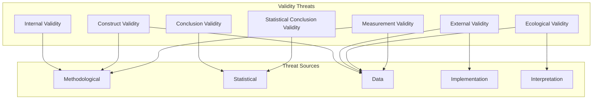
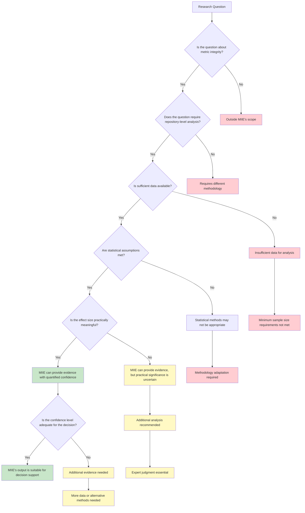

# MIIE v1.6

## 10_RESEARCH_LIMITATIONS_AND_THREATS.md

### Scientific Limitations, Threats to Validity & Future Research Boundaries

| Field | Value |
|-------|-------|
| Document Type | Scientific Limitations Statement |
| Version | 1.6.0 |
| Status | Canonical |
| Scope | Scientific Limitations, Threats to Validity, Engineering Boundaries, Operational Constraints, Ethical Boundaries, Future Research |
| Audience | Measurement Scientists, Empirical Software Engineering Researchers, Scientific Software Architects, Research Integrity Specialists |
| Last Updated | 2026-07-05 |

---

## Table of Contents

1. [Purpose](#1-purpose)
2. [Research Scope](#2-research-scope)
3. [Scientific Assumptions](#3-scientific-assumptions)
4. [Threats to Validity](#4-threats-to-validity)
5. [Statistical Limitations](#5-statistical-limitations)
6. [Metric Limitations](#6-metric-limitations)
7. [Detector Limitations](#7-detector-limitations)
8. [Provider Limitations](#8-provider-limitations)
9. [Repository Limitations](#9-repository-limitations)
10. [Engineering Limitations](#10-engineering-limitations)
11. [Operational Constraints](#11-operational-constraints)
12. [Ethical Considerations](#12-ethical-considerations)
13. [Future Research Directions](#13-future-research-directions)
14. [Risk Assessment](#14-risk-assessment)
15. [Research Governance](#15-research-governance)
16. [Decision Tree](#16-decision-tree)
17. [Research Summary](#17-research-summary)
18. [Appendices](#18-appendices)

---

## 1. Purpose

### 1.1 Why Documenting Limitations Is Essential in Scientific Software

Scientific software occupies a unique position in the software ecosystem. Unlike conventional software, where correctness is defined by specification conformance, scientific software must also demonstrate that its conclusions are valid, its methods are sound, and its limitations are understood. Documenting limitations is not an admission of failure — it is a prerequisite for scientific credibility.

The Measurement Integrity Intelligence Engine (MIIE) makes scientific claims about repository integrity. These claims have implications for how repositories are assessed, how developers are evaluated, and how organizations make decisions about software quality. The validity and scope of these claims must be explicitly documented so that stakeholders can interpret MIIE's outputs appropriately.

A scientific system that does not document its limitations is more dangerous than no system at all. Undocumented limitations lead to overconfidence, misinterpretation, and inappropriate use. Documented limitations enable responsible interpretation, informed decision-making, and appropriate trust.

### 1.2 Scientific Transparency

Scientific transparency requires that all aspects of a scientific system are visible and understandable, including its limitations. Transparent limitations documentation means:

**Assumptions Are Explicit**: Every assumption made by MIIE is stated clearly. Assumptions about observation quality, statistical distributions, sampling adequacy, and provider correctness are all documented.

**Methods Are Auditable**: The statistical methods used by MIIE are documented with sufficient detail for independent evaluation. The choice of statistical tests, the rationale for threshold values, and the approach to confidence estimation are all transparent.

**Limitations Are Honest**: Limitations are described accurately, without minimization or exaggeration. The documentation acknowledges what MIIE cannot do as clearly as it describes what MIIE can do.

**Uncertainty Is Quantified**: Where possible, the impact of limitations is quantified. The expected error rates, the sensitivity to assumptions, and the range of conditions under which results are valid are documented.

### 1.3 Research Integrity

Research integrity requires that scientific claims are supported by evidence and that limitations are acknowledged. MIIE's research integrity framework includes:

**Honest Reporting**: Results are reported accurately, including non-significant results and failures. No results are suppressed or selectively reported.

**Assumption Disclosure**: All assumptions underlying the analysis are disclosed. No assumptions are hidden or treated as unimportant.

**Limitation Acknowledgment**: All known limitations are acknowledged. No limitations are minimized or ignored.

**Conflict of Interest**: Any potential conflicts of interest are disclosed. The development team's interest in MIIE's success does not influence the reporting of limitations.

### 1.4 Reproducibility

Reproducibility requires that results can be independently verified. Limitations documentation supports reproducibility by:

**Environment Specification**: The conditions under which MIIE produces valid results are specified.

**Assumption Transparency**: The assumptions that must hold for results to be valid are documented.

**Method Documentation**: The methods used to produce results are documented in sufficient detail for reproduction.

**Failure Documentation**: The conditions under which MIIE produces unreliable results are documented, enabling others to avoid these conditions.

### 1.5 Responsible Interpretation

Responsible interpretation requires that stakeholders understand the scope and limitations of MIIE's outputs. Limitations documentation supports responsible interpretation by:

**Scope Definition**: Clearly defining what MIIE can and cannot assess.

**Confidence Contextualization**: Providing context for interpreting confidence scores, including the limitations that affect them.

**Decision Support**: Helping stakeholders understand when MIIE's outputs are sufficient for decision-making and when additional analysis is needed.

**Risk Communication**: Communicating the risks of relying on MIIE's outputs without understanding their limitations.

### 1.6 Scope Definition

Scope definition establishes the boundaries within which MIIE's outputs are valid. Scope definition includes:

**Intended Use**: What MIIE is designed to assess.

**Operating Conditions**: The conditions under which MIIE produces valid results.

**Confidence Bounds**: The expected accuracy and reliability of MIIE's outputs.

**Exclusion Zones**: The conditions under which MIIE's outputs should not be used.

---

## 2. Research Scope

### 2.1 What MIIE Is Intended to Solve

MIIE is designed to address the measurement integrity problem in software development metrics. Specifically, MIIE aims to:

**Detect Metric Integrity Violations**: Identify situations where metric values do not faithfully represent the phenomena they claim to measure. This includes metric gaming, process decay, tool changes, and data quality issues.

**Estimate Confidence**: Provide calibrated confidence assessments for metric values and integrity scores, enabling stakeholders to understand the reliability of MIIE's outputs.

**Support Scientific Interpretation**: Provide evidence packages that support scientific interpretation of repository integrity, including provenance, uncertainty quantification, and alternative explanations.

**Enable Repository Transparency**: Increase transparency in software development processes by measuring the integrity of the metrics used to assess those processes.

### 2.2 What MIIE Is NOT Intended to Solve

MIIE does not claim to:

**Evaluate Code Quality**: MIIE does not assess whether code is well-written, efficient, secure, or maintainable. MIIE assesses whether the metrics used to evaluate code quality are reliable.

**Judge Developer Productivity**: MIIE does not assess whether developers are productive, efficient, or effective. MIIE assesses whether the metrics used to evaluate productivity are reliable.

**Replace Human Judgment**: MIIE does not replace human judgment about repository integrity. MIIE provides evidence to support human judgment, not to replace it.

**Provide Definitive Answers**: MIIE provides probabilistic assessments with quantified uncertainty, not definitive answers. MIIE's outputs are evidence for decision-making, not decisions themselves.

**Guarantee Accuracy**: MIIE's outputs are based on statistical methods with known error rates. MIIE does not guarantee that its assessments are correct in any individual case.

### 2.3 In-Scope

MIIE's scope includes:

**Repository-Level Analysis**: MIIE analyzes repository-level properties — commit patterns, code churn, test coverage, review latency, branch freshness.

**Metric Integrity Assessment**: MIIE assesses whether metric values are consistent with expected patterns for genuine development processes.

**Detector-Based Analysis**: MIIE uses statistical detectors to identify anomalies in metric time series.

**Confidence Estimation**: MIIE provides confidence scores that reflect the strength of evidence supporting its assessments.

**Evidence Generation**: MIIE produces evidence packages that document the observations, metrics, detector signals, and confidence assessments underlying its outputs.

### 2.4 Out-of-Scope

MIIE's scope excludes:

**Individual Code Assessment**: MIIE does not assess individual code artifacts, functions, or files. MIIE operates at the repository level.

**Real-Time Monitoring**: MIIE does not provide real-time monitoring of repository activity. MIIE analyzes historical data.

**Predictive Analytics**: MIIE does not predict future repository behaviour. MIIE assesses current and past integrity.

**Cross-Repository Comparison**: MIIE does not compare repositories against each other. MIIE assesses each repository independently.

**Compliance Verification**: MIIE does not verify compliance with specific standards or regulations. MIIE provides evidence that can inform compliance assessments.

### 2.5 Research Boundaries

MIIE's research boundaries include:

**Temporal Boundary**: MIIE analyzes repository history, not current state. MIIE's assessments reflect the integrity of historical metric values.

**Data Boundary**: MIIE operates on data available from Git and GitHub. Data not available from these sources is outside MIIE's scope.

**Methodological Boundary**: MIIE uses established statistical methods with known properties. Novel or unvalidated methods are outside MIIE's scope.

**Interpretation Boundary**: MIIE provides probabilistic assessments. Definitive interpretations require additional context that MIIE does not provide.

---

## 3. Scientific Assumptions

### 3.1 Observation Assumptions

MIIE's analysis relies on observations extracted from repository data. The following assumptions are made about observations:

**A1.1 — Observation Accuracy**: Observations accurately represent the facts they claim to capture. A commit observation accurately records the commit hash, author, timestamp, and message. A file change observation accurately records the files changed and the nature of the changes.

**A1.2 — Observation Completeness**: The available observations provide sufficient coverage of the repository's history. Missing observations may bias the analysis.

**A1.3 — Observation Consistency**: Observations are consistent across different extraction runs. The same repository data produces the same observations when re-extracted.

**A1.4 — Observation Independence**: Individual observations are independent of each other. The extraction of one observation does not influence the extraction of another.

**A1.5 — Observation Temporality**: Observations carry accurate timestamps. Incorrect timestamps may distort temporal analyses.

### 3.2 Metric Assumptions

MIIE's metrics are computed from observations. The following assumptions are made about metrics:

**A2.1 — Metric Validity**: Metrics measure the constructs they claim to measure. Commit entropy ratio measures the randomness of commit patterns, not some unrelated property.

**A2.2 — Metric Reliability**: Metrics produce consistent values when measured repeatedly under similar conditions. The same repository data produces similar metric values across different analysis runs.

**A2.3 — Metric Sensitivity**: Metrics are sensitive to meaningful changes in the underlying constructs. Genuine changes in development processes produce detectable changes in metric values.

**A2.4 — Metric Specificity**: Metrics are not sensitive to irrelevant changes. Changes in无关 properties do not produce false changes in metric values.

**A2.5 — Metric Aggregation**: The aggregation methods used (mean, sum) are appropriate for the metric distributions. Aggregation does not obscure important patterns.

### 3.3 Statistical Test Assumptions

MIIE's detectors use statistical tests. The following assumptions are made about these tests:

**A3.1 — Distribution Assumptions**: Statistical tests are applied under appropriate distributional assumptions. The Kolmogorov-Smirnov test assumes continuous distributions. The Pearson correlation assumes bivariate normality.

**A3.2 — Sample Size Assumptions**: Sample sizes are sufficient for the statistical tests used. Small samples may produce unreliable results.

**A3.3 — Independence Assumptions**: Observations used in statistical tests are independent. Correlated observations may inflate test statistics.

**A3.4 — Stationarity Assumptions**: Metric time series are sufficiently stationary for the analyses applied. Non-stationary series may produce spurious results.

**A3.5 — Threshold Assumptions**: Detection thresholds are appropriate for the data and the research question. Thresholds may need calibration for different contexts.

### 3.4 Sampling Assumptions

MIIE's analysis involves sampling from repository data. The following assumptions are made about sampling:

**A4.1 — Representativeness**: Samples are representative of the populations they are drawn from. Biased samples may produce biased conclusions.

**A4.2 — Sufficiency**: Sample sizes are sufficient for the analyses conducted. Insufficient samples may lack statistical power.

**A4.3 — Randomness**: Sampling is sufficiently random to avoid systematic bias. Non-random sampling may introduce selection bias.

**A4.4 — Proportionality**: Stratified samples maintain the proportions of the population. Distorted proportions may bias stratified analyses.

### 3.5 Repository Behaviour Assumptions

MIIE's analysis relies on assumptions about repository behaviour. The following assumptions are made:

**A5.1 — Development Continuity**: Repositories exhibit continuous development behaviour. Repositories with discontinuous development may produce misleading temporal patterns.

**A5.2 — Process Consistency**: Development processes are sufficiently consistent within analysis windows. Rapidly changing processes may produce unstable metrics.

**A5.3 — Tool Stability**: Development tools are sufficiently stable to avoid distorting metric values. Rapid tool changes may produce metric artefacts.

**A5.4 — Human Agency**: Development activity reflects human decisions and practices. Automated processes that mimic human activity may produce misleading patterns.

### 3.6 Provider Correctness Assumptions

MIIE relies on data providers (Git, GitHub) for repository data. The following assumptions are made:

**A6.1 — Provider Accuracy**: Providers produce accurate data. Provider errors may propagate into MIIE's analysis.

**A6.2 — Provider Completeness**: Providers produce complete data within their scope. Provider data gaps may bias the analysis.

**A6.3 — Provider Timeliness**: Providers produce data in a timely manner. Delayed data may affect temporal analyses.

**A6.4 — Provider Consistency**: Providers produce consistent data across different API calls and time periods. Inconsistent data may produce unstable results.

### 3.7 Data Completeness Assumptions

MIIE's analysis assumes certain levels of data completeness. The following assumptions are made:

**A7.1 — Commit Completeness**: Repository commit history is complete and unaltered. Rewritten history may distort commit-based metrics.

**A7.2 — Review Completeness**: Pull request review data is complete. Missing reviews may distort review-based metrics.

**A7.3 — Branch Completeness**: Branch and merge data is complete. Missing branch data may affect branch-based metrics.

**A7.4 — Metadata Completeness**: File and directory metadata is complete. Missing metadata may affect file-based metrics.

### 3.8 Detector Assumptions

MIIE's detectors make specific assumptions. The following assumptions are made:

**A8.1 — Anomaly Distinctiveness**: Anomalies produce statistical signatures that are distinguishable from normal variation. Subtle anomalies may be undetectable.

**A8.2 — Baseline Stability**: The baseline for comparison is stable and representative. Shifting baselines may produce misleading results.

**A8.3 — Effect Size Adequacy**: The effects MIIE detects are of sufficient size to be practically meaningful. Very small effects may be statistically significant but practically irrelevant.

**A8.4 — Single-Source Sufficiency**: Individual evidence sources provide sufficient information for detection. Complex patterns that require multi-source evidence may be missed.

### 3.9 Confidence Interpretation Assumptions

MIIE's confidence scores are interpreted under the following assumptions:

**A9.1 — Calibration**: Confidence scores are calibrated — predicted probabilities match observed frequencies. Miscalibrated confidence scores may be misleading.

**A9.2 — Comparability**: Confidence scores are comparable across repositories. Context-dependent factors may affect comparability.

**A9.3 — Stability**: Confidence scores are stable across repeated analyses. Highly variable confidence scores may be unreliable.

**A9.4 — Sufficiency**: Confidence scores adequately capture the uncertainty in MIIE's assessments. Unmodeled sources of uncertainty may produce overconfident or underconfident scores.

---

## 4. Threats to Validity

### 4.1 Threat Framework

### 4.2 Internal Validity

Internal validity is the degree to which MIIE's results can be attributed to the constructs being measured rather than confounding factors.

**Threat IV-1: Selection Bias**
- Description: The repositories selected for analysis may not be representative of the population of interest.
- Impact: Results may not generalize to unrepresented repository types.
- Mitigation: Stratified sampling, diverse repository selection.
- Residual Risk: Medium.

**Threat IV-2: Temporal Confounding**
- Description: Changes in MIIE's results over time may reflect changes in tools, practices, or data availability rather than genuine changes in integrity.
- Impact: Temporal trends may be misinterpreted.
- Mitigation: Temporal controls, tool version documentation.
- Residual Risk: Medium.

**Threat IV-3: Provider Effects**
- Description: Differences in data from different providers may affect results.
- Impact: Results may be provider-specific.
- Mitigation: Provider-agnostic data models, cross-provider validation.
- Residual Risk: Low-Medium.

**Threat IV-4: Measurement Timing**
- Description: The timing of measurements may affect results. Measuring at different times may produce different conclusions.
- Impact: Results may be time-dependent.
- Mitigation: Multiple measurement points, temporal aggregation.
- Residual Risk: Medium.

**Threat IV-5: Experimenter Expectations**
- Description: The analyst's expectations may influence data collection, analysis choices, or interpretation.
- Impact: Results may be biased by expectations.
- Mitigation: Blinding where feasible, predefined analysis protocols.
- Residual Risk: Low.

### 4.3 Construct Validity

Construct validity is the degree to which MIIE's operationalizations measure what they claim to measure.

**Threat CV-1: Metric-Construct Alignment**
- Description: MIIE's metrics may not perfectly measure the constructs they claim to measure. Commit entropy may not fully capture "randomness of commit patterns."
- Impact: Metrics may produce misleading signals.
- Mitigation: Multiple metrics per construct, expert validation.
- Residual Risk: Medium.

**Threat CV-2: Detector-Anomaly Alignment**
- Description: MIIE's detectors may not perfectly detect the anomalies they claim to detect. The distribution drift detector may not detect all forms of distribution drift.
- Impact: Detectors may miss genuine anomalies or flag false anomalies.
- Mitigation: Multiple detector types, sensitivity analysis.
- Residual Risk: Medium.

**Threat CV-3: Confidence-Reliability Alignment**
- Description: MIIE's confidence scores may not perfectly reflect the reliability of its assessments. Miscalibrated confidence scores may be misleading.
- Impact: Stakeholders may over-trust or under-trust MIIE's outputs.
- Mitigation: Calibration validation, reliability diagrams.
- Residual Risk: Low-Medium.

**Threat CV-4: Observation-Reality Alignment**
- Description: Observations may not perfectly represent reality. Provider data may be incomplete, inaccurate, or delayed.
- Impact: Analysis may be based on imperfect data.
- Mitigation: Data quality assessment, provider validation.
- Residual Risk: Medium.

**Threat CV-5: Anomaly Taxonomy Completeness**
- Description: MIIE's taxonomy of anomalies may not cover all possible forms of integrity violation. Novel anomaly types may be undetectable.
- Impact: MIIE may miss emerging forms of metric gaming or process decay.
- Mitigation: Regular taxonomy updates, exploratory analysis.
- Residual Risk: Medium-High.

### 4.4 External Validity

External validity is the degree to which MIIE's results generalize to other contexts.

**Threat EV-1: Repository Type Generalization**
- Description: Results validated on one type of repository may not generalize to other types. Open-source repositories may differ from enterprise repositories.
- Impact: Results may not apply to unrepresented repository types.
- Mitigation: Diverse repository sampling, cross-type validation.
- Residual Risk: Medium.

**Threat EV-2: Language Generalization**
- Description: Results validated on one programming language may not generalize to other languages. Python repositories may differ from Java repositories.
- Impact: Results may be language-specific.
- Mitigation: Multi-language validation, language-stratified analysis.
- Residual Risk: Medium.

**Threat EV-3: Scale Generalization**
- Description: Results validated on repositories of one size may not generalize to repositories of other sizes. Small repositories may differ from very large repositories.
- Impact: Results may be size-dependent.
- Mitigation: Multi-size validation, size-stratified analysis.
- Residual Risk: Low-Medium.

**Threat EV-4: Temporal Generalization**
- Description: Results validated at one time may not generalize to other times. Software development practices evolve, and MIIE's effectiveness may change.
- Impact: Results may be time-specific.
- Mitigation: Longitudinal validation, temporal monitoring.
- Residual Risk: Medium.

**Threat EV-5: Tool Ecosystem Generalization**
- Description: Results validated with one set of development tools may not generalize to other tools. Different linters, CI systems, or IDEs may affect metric values.
- Impact: Results may be tool-specific.
- Mitigation: Multi-tool validation, tool-agnostic analysis.
- Residual Risk: Medium.

### 4.5 Conclusion Validity

Conclusion validity is the degree to which conclusions are warranted by the results.

**Threat CN-1: Low Statistical Power**
- Description: Experiments may lack sufficient power to detect effects. Insufficient sample sizes may produce non-significant results even when effects exist.
- Impact: Real effects may be missed.
- Mitigation: A priori power analysis, adequate sample sizes.
- Residual Risk: Low-Medium.

**Threat CN-2: Violated Assumptions**
- Description: Statistical tests may be applied under violated assumptions. Non-normal data analyzed with normal-theory tests may produce invalid results.
- Impact: Statistical conclusions may be invalid.
- Mitigation: Assumption checking, robust methods.
- Residual Risk: Low-Medium.

**Threat CN-3: Multiple Comparisons**
- Description: Conducting many statistical tests inflates the family-wise error rate. Some "significant" results may be false positives.
- Impact: False positive rate may exceed nominal levels.
- Mitigation: Multiple comparison correction, pre-registration.
- Residual Risk: Low.

**Threat CN-4: Effect Size Overinterpretation**
- Description: Statistically significant results may have trivial effect sizes. Large samples can produce significant p-values for meaningless effects.
- Impact: Practically irrelevant effects may be treated as important.
- Mitigation: Effect size reporting, practical significance assessment.
- Residual Risk: Low.

**Threat CN-5: Cherry-Picking**
- Description: Selective reporting of significant results may create a misleading picture. Non-significant results may be suppressed.
- Impact: Published results may over-represent MIIE's effectiveness.
- Mitigation: Complete reporting, pre-registration, publication of all results.
- Residual Risk: Low.

### 4.6 Statistical Conclusion Validity

Statistical conclusion validity concerns the appropriateness of statistical conclusions.

**Threat SC-1: Non-Normality**
- Description: Metric distributions may deviate from normality, affecting parametric test validity.
- Impact: P-values and confidence intervals may be inaccurate.
- Mitigation: Non-parametric alternatives, normality testing, bootstrap methods.
- Residual Risk: Low-Medium.

**Threat SC-2: Heteroscedasticity**
- Description: Variance may differ across groups or conditions, violating homoscedasticity assumptions.
- Impact: Test statistics may be biased.
- Mitigation: Robust standard errors, Welch's t-test, non-parametric methods.
- Residual Risk: Low.

**Threat SC-3: Autocorrelation**
- Description: Temporal observations may be autocorrelated, violating independence assumptions.
- Impact: Standard errors may be underestimated, inflating test statistics.
- Mitigation: Time-series methods, Newey-West standard errors.
- Residual Risk: Medium.

**Threat SC-4: Small Sample Bias**
- Description: Small samples may produce biased estimates and unreliable test results.
- Impact: Results may not be trustworthy for small repositories.
- Mitigation: Minimum sample size requirements, exact tests.
- Residual Risk: Medium.

**Threat SC-5: Numerical Precision**
- Description: Floating-point arithmetic may introduce small numerical errors.
- Impact: Results may differ slightly across platforms.
- Mitigation: Tolerance specifications, numerical stability checks.
- Residual Risk: Low.

### 4.7 Ecological Validity

Ecological validity concerns whether MIIE's findings apply to real-world settings.

**Threat EC-1: Laboratory vs. Field**
- Description: Results from controlled validation may not apply to uncontrolled field conditions.
- Impact: MIIE may perform differently in real-world use than in validation experiments.
- Mitigation: Field validation, real-world case studies.
- Residual Risk: Medium.

**Threat EC-2: Historical vs. Current**
- Description: Results from historical data may not apply to current conditions. Development practices evolve.
- Impact: MIIE's effectiveness may change over time.
- Mitigation: Longitudinal validation, continuous monitoring.
- Residual Risk: Medium.

**Threat EC-3: Individual vs. Organizational**
- Description: Results from individual repositories may not apply to organizational contexts. Organizational factors may affect metric interpretation.
- Impact: MIIE may need organizational context for accurate interpretation.
- Mitigation: Organizational-level validation, context documentation.
- Residual Risk: Medium.

### 4.8 Measurement Validity

Measurement validity concerns whether measurements accurately capture the intended constructs.

**Threat MV-1: Instrument Validity**
- Description: MIIE's measurement instruments (metrics, detectors) may not accurately capture the intended constructs.
- Impact: Measurements may be systematically biased.
- Mitigation: Instrument validation, cross-validation with external criteria.
- Residual Risk: Medium.

**Threat MV-2: Observer Effects**
- Description: The act of measuring may affect the system being measured. Awareness of MIIE's analysis may influence development practices.
- Impact: Measurements may not reflect natural behaviour.
- Mitigation: Unobtrusive measurement, passive observation.
- Residual Risk: Low.

**Threat MV-3: Temporal Stability**
- Description: Measurements may not be stable over time. The same repository measured at different times may produce different results.
- Impact: Results may be time-dependent.
- Mitigation: Multiple measurement points, temporal aggregation.
- Residual Risk: Medium.

**Threat MV-4: Context Sensitivity**
- Description: Measurements may be sensitive to contextual factors that are not part of the intended construct. Language, project type, or team size may affect metric values.
- Impact: Measurements may reflect context rather than construct.
- Mitigation: Context documentation, context-stratified analysis.
- Residual Risk: Medium.

---

## 5. Statistical Limitations

### 5.1 Approximate Statistical Methods

MIIE uses approximate statistical methods that produce results with known but non-zero error rates.

**Limitation S-1: Approximate p-Values**
- Description: Many statistical tests produce approximate p-values based on asymptotic theory. These approximations may be inaccurate for small samples.
- Impact: P-values may be unreliable for small repositories.
- Quantification: Approximation error typically < 5% for n > 30; may exceed 10% for n < 20.
- Mitigation: Use exact tests for small samples; report sample sizes with p-values.

**Limitation S-2: Bootstrap Approximation**
- Description: Bootstrap confidence intervals are approximations that improve with more resamples. Very small samples or complex statistics may produce unreliable bootstrap estimates.
- Impact: Confidence intervals may be inaccurate for small samples.
- Quantification: Coverage error typically < 2% with 1000 resamples for n > 20.
- Mitigation: Use adequate resample counts; validate bootstrap performance.

**Limitation S-3: Distribution Approximation**
- Description: Some methods assume approximate normality when the true distribution is non-normal. Central limit theorem provides approximation, but convergence rate varies.
- Impact: Test statistics may be biased for non-normal distributions.
- Quantification: Convergence to normality typically adequate for n > 30 for means; may require larger n for higher moments.
- Mitigation: Check normality assumptions; use non-parametric alternatives.

### 5.2 Small Sample Behaviour

MIIE's statistical methods may produce unreliable results for small samples.

**Limitation S-4: Low Power for Small Samples**
- Description: Statistical tests have low power for small samples. Real effects may be undetectable.
- Impact: MIIE may fail to detect genuine anomalies in small repositories.
- Quantification: Power < 0.50 for n < 15 for medium effect sizes.
- Mitigation: Report power limitations; require minimum sample sizes.

**Limitation S-5: Unstable Estimates**
- Description: Estimates from small samples are unstable. Different samples from the same repository may produce different results.
- Impact: Results may not be reproducible for small repositories.
- Quantification: Standard error inversely proportional to √n; small samples have large standard errors.
- Mitigation: Report confidence intervals; acknowledge uncertainty.

**Limitation S-6: Distribution Sensitivity**
- Description: Small samples provide limited information about distribution shape. Assumption violations may be undetectable.
- Impact: Statistical tests may be inappropriate for small samples.
- Quantification: Normality tests have low power for n < 20.
- Mitigation: Use distribution-free methods; report assumption sensitivity.

### 5.3 Window Dependence

MIIE's results may depend on the choice of analysis windows.

**Limitation S-7: Window Boundary Effects**
- Description: Metric values at window boundaries may be sensitive to where boundaries are placed.
- Impact: Different window boundaries may produce different results.
- Quantification: Boundary effects may shift metric values by 5–15%.
- Mitigation: Overlapping windows; sensitivity analysis across window configurations.

**Limitation S-8: Window Size Sensitivity**
- Description: The choice of window size affects the granularity and stability of analysis. Large windows smooth variation; small windows capture noise.
- Impact: Results may be window-size dependent.
- Quantification: Optimal window size depends on repository activity level and analysis goal.
- Mitigation: Multi-scale analysis; report results for multiple window sizes.

**Limitation S-9: Window Count Effects**
- Description: The number of windows affects statistical power and the ability to detect temporal patterns. Few windows limit temporal analysis.
- Impact: Temporal patterns may be undetectable with few windows.
- Quantification: Minimum 3 windows needed for basic trend analysis; 5+ recommended.
- Mitigation: Adaptive windowing; report window count limitations.

### 5.4 Distribution Assumptions

MIIE's statistical methods make distributional assumptions that may not hold.

**Limitation S-10: Non-Normal Metric Distributions**
- Description: Metric distributions may deviate from normality, particularly for skewed metrics like code churn or review latency.
- Impact: Parametric tests may produce inaccurate results.
- Quantification: Skewness > |1| or kurtosis > |3| indicates potential issues.
- Mitigation: Distribution testing; non-parametric alternatives; transformation.

**Limitation S-11: Heavy-Tailed Distributions**
- Description: Some metrics may have heavy-tailed distributions, producing extreme values that affect mean-based statistics.
- Impact: Mean-based metrics may be dominated by extreme values.
- Quantification: Heavy tails may increase variance by 50–200%.
- Mitigation: Robust statistics; median-based alternatives; outlier handling.

**Limitation S-12: Multimodal Distributions**
- Description: Metric distributions may be multimodal, indicating subpopulations that should be analyzed separately.
- Impact: Aggregate analysis may obscure important patterns.
- Quantification: Hartigan dip test detects multimodality; effect varies by degree.
- Mitigation: Mixture modeling; subgroup analysis; multimodality detection.

### 5.5 Threshold Assumptions

MIIE's detectors use threshold-based decisions that may not be optimal for all contexts.

**Limitation S-13: Fixed Threshold Sensitivity**
- Description: Fixed thresholds may not be appropriate for all repositories. The same threshold may be too sensitive for some repositories and insensitive for others.
- Impact: False positive and false negative rates may vary across repositories.
- Quantification: Threshold sensitivity varies by repository characteristics; may shift detection rates by 20–40%.
- Mitigation: Repository-specific calibration; adaptive thresholds; threshold sensitivity reporting.

**Limitation S-14: Threshold Cross-Validation**
- Description: Thresholds optimized on one dataset may not transfer to other datasets. Overfitting to validation data is a risk.
- Impact: Detection performance may degrade on new data.
- Quantification: Performance degradation of 5–15% is typical for non-cross-validated thresholds.
- Mitigation: Cross-validation; holdout validation; threshold stability analysis.

### 5.6 Confidence Estimation

MIIE's confidence scores are estimates with known limitations.

**Limitation S-15: Model Uncertainty**
- Description: Confidence scores are based on models that make simplifying assumptions. Model misspecification may produce miscalibrated confidence.
- Impact: Confidence scores may over- or under-estimate true confidence.
- Quantification: Calibration error typically < 10% for well-calibrated models.
- Mitigation: Calibration validation; reliability diagrams; model diagnostics.

**Limitation S-16: Coverage Uncertainty**
- Description: Confidence intervals have a specified coverage probability, but actual coverage may differ. The stated 95% interval may contain the true value only 93% of the time.
- Impact: Stated confidence levels may be inaccurate.
- Quantification: Coverage error typically < 3% for well-constructed intervals.
- Mitigation: Bootstrap calibration; coverage validation.

**Limitation S-17: Extrapolation Uncertainty**
- Description: Confidence scores are estimated from observed data and may not extrapolate to unobserved conditions.
- Impact: Confidence may be inaccurate for repository types not well-represented in validation data.
- Quantification: Extrapolation error is difficult to quantify; may be substantial for novel conditions.
- Mitigation: Diverse validation data; extrapolation warning; conservative confidence estimates.

### 5.7 Multiple Comparisons

MIIE conducts multiple statistical tests, inflating the family-wise error rate.

**Limitation S-18: Family-Wise Error Inflation**
- Description: Conducting m tests at significance level α produces a family-wise error rate of approximately 1-(1-α)ᵐ. For 10 tests at α=0.05, family-wise error ≈ 40%.
- Impact: The probability of at least one false positive is high.
- Quantification: Family-wise error increases exponentially with number of tests.
- Mitigation: Bonferroni correction, Benjamini-Hochberg procedure, pre-registration.

**Limitation S-19: Power Reduction from Correction**
- Description: Multiple comparison correction reduces power, making it harder to detect real effects.
- Impact: Real effects may be missed after correction.
- Quantification: Bonferroni correction may reduce power by 20–50% for many tests.
- Mitigation: Use FDR control instead of FWER control; group related tests.

### 5.8 Numerical Stability

MIIE's computations may be affected by numerical precision issues.

**Limitation S-20: Floating-Point Precision**
- Description: Floating-point arithmetic introduces small errors that may accumulate across computations.
- Impact: Results may differ slightly across platforms or implementations.
- Quantification: Relative error typically < 1e-10 for standard operations.
- Mitigation: Tolerance specifications; numerical stability checks.

**Limitation S-21: Catastrophic Cancellation**
- Description: Subtracting nearly equal numbers can produce large relative errors.
- Impact: Differences of similar quantities may be unreliable.
- Quantification: Error amplification of 10x–100x possible.
- Mitigation: Algebraically equivalent formulations; compensated summation.

**Limitation S-22: Summation Order**
- Description: The order of summation affects the result for floating-point numbers.
- Impact: Non-deterministic ordering may produce slightly different results.
- Quantification: Relative error typically < 1e-12 for moderate-sized sums.
- Mitigation: Deterministic ordering; Kahan summation.

### 5.9 Future Statistical Improvements

The following statistical improvements are planned:

- Bayesian inference methods for more principled uncertainty quantification.
- Hierarchical models for multi-level analysis.
- Time-series methods for temporal pattern detection.
- Machine learning methods for adaptive threshold calibration.
- Causal inference methods for attribution analysis.

---

## 6. Metric Limitations

### 6.1 M-01: Commit Entropy Ratio

**Scientific Assumptions**:
- Commit messages contain meaningful information about commit nature.
- Entropy is a valid measure of commit message diversity.
- The baseline for comparison is appropriate.

**Known Weaknesses**:
- Sensitive to commit message quality, which varies across teams.
- May not distinguish between AI-generated and human-written messages.
- Aggregation (mean) may obscure temporal patterns.

**Provider Dependence**:
- Depends on commit message availability from Git.
- Affected by commit message rewriting (e.g., squash merges).

**Sampling Dependence**:
- Sensitive to the number of commits in the analysis window.
- Small commit counts produce unstable entropy estimates.

**Interpretation Risks**:
- Low entropy does not necessarily indicate metric gaming; it may indicate consistent commit message conventions.
- High entropy does not necessarily indicate healthy development; it may indicate inconsistent practices.

**Future Improvements**:
- Entropy decomposition by commit type.
- Context-sensitive entropy baselines.
- Natural language processing for semantic entropy.

### 6.2 M-02: Commit Count

**Scientific Assumptions**:
- Commits represent meaningful units of work.
- Commit frequency reflects development activity.
- The counting methodology is consistent.

**Known Weaknesses**:
- Sensitive to commit granularity (many small vs. few large commits).
- Does not distinguish between meaningful and trivial commits.
- Affected by commit batching and squashing.

**Provider Dependence**:
- Depends on Git commit history completeness.
- Affected by history rewriting (rebase, force push).

**Sampling Dependence**:
- Directly proportional to the number of commits in the window.
- No minimum observation requirement.

**Interpretation Risks**:
- High commit count does not necessarily indicate high productivity.
- Low commit count does not necessarily indicate low productivity.

**Future Improvements**:
- Commit quality weighting.
- Commit size normalization.
- Commit meaning classification.

### 6.3 M-03: Code Churn Ratio

**Scientific Assumptions**:
- Code churn (lines added + deleted / total lines) reflects development activity.
- Churn ratios are comparable across files and time periods.
- The 5-observation minimum provides stable estimates.

**Known Weaknesses**:
- Sensitive to file size; large files dominate churn calculations.
- Does not distinguish between constructive and destructive churn.
- Affected by auto-generated code, formatting changes, and refactoring.

**Provider Dependence**:
- Depends on diff statistics from Git.
- Affected by merge strategies and conflict resolution.

**Sampling Dependence**:
- Requires minimum 5 observations for stable estimates.
- Highly sensitive to window size and commit frequency.

**Interpretation Risks**:
- High churn may indicate active development or instability.
- Low churn may indicate stability or stagnation.

**Future Improvements**:
- Churn classification (constructive, destructive, refactoring).
- File-size normalization.
- Semantic churn analysis.

### 6.4 M-04: Test Coverage Ratio

**Scientific Assumptions**:
- Test coverage reflects testing thoroughness.
- Coverage data is accurate and complete.
- The ratio is comparable across projects.

**Known Weaknesses**:
- Sensitive to coverage measurement tool and configuration.
- Does not distinguish between meaningful and superficial tests.
- Coverage may be inflated by trivial tests.

**Provider Dependence**:
- Requires test coverage data from CI/CD systems.
- Not available for repositories without coverage reporting.

**Sampling Dependence**:
- Requires at least 1 observation of test coverage data.
- Coverage data may be sparsely available.

**Interpretation Risks**:
- High coverage does not guarantee testing thoroughness.
- Low coverage does not guarantee testing deficiency.

**Future Improvements**:
- Coverage quality assessment (mutation score, fault detection).
- Test meaningfulness classification.
- Coverage trend analysis.

### 6.5 M-05: Review Latency

**Scientific Assumptions**:
- Review latency (time between PR creation and approval) reflects review thoroughness.
- Review timestamps are accurate and complete.
- Review patterns are comparable across projects.

**Known Weaknesses**:
- Sensitive to review workflow (e.g., async vs. synchronous).
- Does not distinguish between thorough and cursory reviews.
- Affected by reviewer availability and time zones.

**Provider Dependence**:
- Depends on GitHub pull request data.
- Not available for repositories using other platforms.

**Sampling Dependence**:
- Requires minimum 2 observations for stable estimates.
- Review data may be sparse for repositories with few pull requests.

**Interpretation Risks**:
- Low latency does not necessarily indicate thorough review.
- High latency does not necessarily indicate thorough review.

**Future Improvements**:
- Review quality indicators (comment depth, discussion length).
- Reviewer expertise weighting.
- Workflow-specific baselines.

### 6.6 M-06: File Change Count

**Scientific Assumptions**:
- File change counts reflect development scope.
- File changes are accurately tracked.
- The metric is comparable across projects.

**Known Weaknesses**:
- Sensitive to repository structure and file granularity.
- Does not distinguish between major and minor changes.
- Affected by auto-generated files and build artifacts.

**Provider Dependence**:
- Depends on Git file change tracking.
- Affected by binary files and large files.

**Sampling Dependence**:
- Directly proportional to the number of file changes in the window.
- No minimum observation requirement.

**Interpretation Risks**:
- High file change count may indicate broad development or scattered changes.
- Low file change count may indicate focused development or stagnation.

**Future Improvements**:
- Change significance weighting.
- File type classification.
- Change pattern analysis.

### 6.7 M-07: Branch Freshness Ratio

**Scientific Assumptions**:
- Branch freshness (age of most recent merge) reflects development currency.
- Branch data is accurately tracked.
- Freshness is comparable across projects.

**Known Weaknesses**:
- Sensitive to branch management practices.
- Does not distinguish between active and abandoned branches.
- Affected by branch naming conventions.

**Provider Dependence**:
- Depends on Git branch and merge data.
- Affected by branch deletion and history rewriting.

**Sampling Dependence**:
- Requires at least 1 observation of branch activity.
- Branch data may be sparse for repositories with few branches.

**Interpretation Risks**:
- High freshness does not necessarily indicate active development.
- Low freshness does not necessarily indicate inactive development.

**Future Improvements**:
- Branch activity classification.
- Branch lifecycle analysis.
- Multi-branch freshness metrics.

---

## 7. Detector Limitations

### 7.1 D-01: Distribution Drift Detector

**False Positives**:
- Normal variation in development practices may trigger false alarms.
- Seasonal patterns (e.g., holiday slowdowns) may mimic distribution shifts.
- Tool changes (e.g., new linter configuration) may alter distributions without integrity violations.

**False Negatives**:
- Gradual drift below the detection threshold may be missed.
- Compensating changes (e.g., one metric increases while another decreases) may cancel out.
- Small repositories may lack sufficient data for reliable detection.

**Sensitivity**:
- Sensitive to sample size, distribution shape, and threshold choice.
- Power decreases for small effects and small samples.

**Specificity**:
- Specificity depends on the baseline distribution and threshold calibration.
- Non-stationary baselines may reduce specificity.

**Minimum Evidence**:
- Requires minimum 20 observations per window for reliable KS test.
- PSI requires non-empty bins, which may not be achievable for small samples.

**Sampling Constraints**:
- Results are sensitive to window size and boundary placement.
- Oversampling or undersampling may affect detection.

**Interpretation Risks**:
- A detected drift does not indicate the cause of the drift.
- Drift may be benign (e.g., genuine process improvement) or problematic (e.g., metric gaming).

**Known Blind Spots**:
- May not detect drift that is distributed across multiple metrics.
- May not detect drift that occurs within windows rather than across windows.
- May not detect drift that is confounded with repository growth.

### 7.2 D-02: Correlation Breakdown Detector

**False Positives**:
- Normal variation in correlations may trigger false alarms.
- Outliers may distort correlation estimates.
- Non-linear relationships may produce misleading linear correlation values.

**False Negatives**:
- Gradual correlation changes may be below detection thresholds.
- Small samples may produce unstable correlation estimates.
- Confounding variables may mask genuine correlation changes.

**Sensitivity**:
- Sensitive to sample size, linearity assumption, and outlier presence.
- Power decreases for small correlation changes and small samples.

**Specificity**:
- Specificity depends on the baseline correlation and threshold choice.
- Correlations are naturally variable, producing background noise.

**Minimum Evidence**:
- Requires minimum 15 observations per window for reliable correlation estimation.
- Fisher z-transformation requires approximately normal data.

**Sampling Constraints**:
- Results are sensitive to window size and the number of observation pairs.
- Temporal autocorrelation may inflate correlation significance.

**Interpretation Risks**:
- Correlation breakdown does not indicate causation.
- Correlation changes may reflect legitimate process changes.

**Known Blind Spots**:
- May not detect non-linear correlation changes.
- May not detect changes in the direction of causation.
- May not detect multivariate correlation changes.

### 7.3 D-03: Threshold Compression Detector

**False Positives**:
- Natural clustering in metric values may mimic compression.
- Small samples may produce apparent compression due to sampling variability.
- Discrete metric values may produce artificial compression patterns.

**False Negatives**:
- Gradual compression may be below detection thresholds.
- Multi-modal distributions may obscure compression.
- Compression spread across many metrics may not be detected.

**Sensitivity**:
- Sensitive to binning strategy, sample size, and dip test power.
- Power decreases for subtle compression and small samples.

**Specificity**:
- Specificity depends on the baseline distribution shape.
- Heavy-tailed distributions may produce false compression signals.

**Minimum Evidence**:
- Requires minimum 20 observations for reliable dip test.
- Bootstrap confidence intervals require adequate resample counts.

**Sampling Constraints**:
- Results are sensitive to binning strategy and bin count.
- Extreme values may affect bin boundaries and compression detection.

**Interpretation Risks**:
- Threshold compression does not indicate the cause of compression.
- Compression may be benign (e.g., natural clustering) or problematic (e.g., metric manipulation).

**Known Blind Spots**:
- May not detect compression that is distributed across many small clusters.
- May not detect compression that affects only a subset of the distribution.
- May not detect compression in discrete distributions.

---

## 8. Provider Limitations

### 8.1 Git Provider Limitations

**Data Completeness**:
- Git history may be incomplete due to shallow clones, force pushes, or history rewriting.
- Binary files may not provide meaningful diff statistics.
- Large files may affect performance and memory usage.

**Data Accuracy**:
- Commit timestamps may reflect author time, committer time, or timezone conversions.
- File renames may not be accurately tracked across commits.
- Merge commits may obscure the actual development history.

**Data Timeliness**:
- Git data is available immediately after commit, with no delay.
- Historical data may be affected by repository migration or reorganization.

**Data Format**:
- Commit message format varies across teams and projects.
- Diff output format may vary across Git versions.
- Branch and tag naming conventions vary.

### 8.2 GitHub Provider Limitations

**API Dependencies**:
- GitHub API rate limits restrict data collection speed.
- API changes may affect data availability and format.
- API authentication may be required for private repositories.

**Data Completeness**:
- Pull request review data may be incomplete (e.g., inline reviews not captured).
- Issue data may not be available for all repositories.
- Check and CI data may be incomplete or delayed.

**Data Accuracy**:
- Pull request timestamps may reflect creation, review, or merge time.
- Review comments may not capture the full review discussion.
- Issue labels and milestones may not be consistently applied.

**Data Timeliness**:
- API responses may be cached, introducing delays.
- Webhook data may be more current than API data.
- Historical data may be affected by GitHub migrations.

**Rate Limits**:
- Unauthenticated requests: 60 per hour.
- Authenticated requests: 5,000 per hour.
- Secondary rate limits may apply for heavy use.
- GraphQL API has separate rate limits.

### 8.3 Repository Metadata Limitations

**File System Metadata**:
- File timestamps may reflect creation, modification, or access time.
- File permissions may not be available for all platforms.
- Symlinks and hard links may affect file counting.

**Build Artifact Metadata**:
- Build artifacts may be included in file counts.
- Generated code may be indistinguishable from hand-written code.
- Dependency files may inflate file change counts.

**Configuration Metadata**:
- Configuration file formats vary across tools.
- Environment-specific configurations may affect metric values.
- Secret files may be excluded from analysis.

### 8.4 Future Provider Limitations

**New Platform Integration**:
- New platforms (GitLab, Bitbucket, Azure DevOps) require new provider implementations.
- Platform-specific features may not be portable across providers.
- API versioning may affect data availability.

**External Data Sources**:
- CI/CD system data may require new integrations.
- Coverage report data may require new parsers.
- Static analysis data may require new adapters.

**Missing Providers**:
- No provider for JIRA or other issue tracking systems.
- No provider for Slack or communication tools.
- No provider for code review tools beyond GitHub.

### 8.5 Authentication and Access

**Private Repository Access**:
- Private repositories require authenticated API access.
- Authentication tokens may have limited scopes.
- Token expiration may interrupt data collection.

**Organization Policies**:
- Organization policies may restrict API access.
- IP allowlisting may affect connectivity.
- SAML/SSO may complicate authentication.

**Data Export Restrictions**:
- Some organizations restrict data export.
- Compliance requirements may limit data retention.
- Privacy regulations may restrict data collection.

### 8.6 Provider Failure Modes

**Transient Failures**:
- Network timeouts may interrupt data collection.
- API rate limits may cause temporary denials.
- Server errors may produce incomplete data.

**Persistent Failures**:
- Repository deletion or migration may make data permanently unavailable.
- API deprecation may break existing integrations.
- Account suspension may restrict access.

**Data Corruption**:
- API responses may be malformed or incomplete.
- Data encoding issues may affect text processing.
- Timestamp precision may vary across API versions.

### 8.7 Observation Quality

**Quality Assessment**:
- MIIE assesses observation quality based on completeness, accuracy, and timeliness.
- Quality assessments are themselves uncertain.
- Quality thresholds may need repository-specific calibration.

**Quality Degradation**:
- Data quality may degrade over time as repositories evolve.
- Provider changes may affect data quality retroactively.
- Aggregation may amplify quality issues.

---

## 9. Repository Limitations

### 9.1 Repository Size

**Very Small Repositories**:
- Repositories with fewer than 100 commits may not provide sufficient data for reliable analysis.
- Statistical methods require minimum sample sizes for valid inference.
- Small repositories may have insufficient variation for meaningful metric computation.

**Very Large Repositories**:
- Repositories with millions of commits may exceed computational limits.
- Memory requirements may be prohibitive for full analysis.
- Processing time may be excessive for interactive use.

**Size Thresholds**:
- Minimum recommended: 100 commits, 10 contributors, 6 months of history.
- Optimal range: 500–50,000 commits.
- Maximum recommended: 500,000 commits (with optimization).

### 9.2 Repository History

**Shallow Clones**:
- Shallow clones (depth-limited history) provide incomplete commit data.
- Metric computation may be unreliable with limited history.
- Temporal analyses require adequate history depth.

**History Rewriting**:
- Rebase, squash merge, and force push alter commit history.
- Rewritten history may distort commit-based metrics.
- Provenance tracking may be affected by history rewriting.

**Repository Migration**:
- Migration between platforms (e.g., GitLab to GitHub) may alter metadata.
- Migration tools may not preserve all repository data.
- Post-migration analysis may be affected by migration artefacts.

### 9.3 Archived Repositories

**Inactive Development**:
- Archived repositories have no active development.
- Metrics may reflect historical patterns that are no longer relevant.
- Detector baselines may be inappropriate for archived repositories.

**Data Staleness**:
- Archived repository data may be outdated.
- Provider metadata may be incomplete for archived repositories.
- External dependencies may have changed significantly.

### 9.4 Generated Repositories

**Scaffolded Projects**:
- Project scaffolding tools generate large amounts of boilerplate code.
- Generated code may inflate code metrics without reflecting development activity.
- Generated commit patterns may differ from organic development patterns.

**Monorepo Generators**:
- Monorepo generators create complex directory structures.
- Directory-based metrics may be dominated by generated structure.
- File change patterns may reflect generation rather than development.

### 9.5 Monorepos

**Multi-Project Structure**:
- Monorepos contain multiple projects with different characteristics.
- Repository-level metrics may not be meaningful for individual projects.
- Cross-project interactions may confound metric interpretation.

**Scale Effects**:
- Monorepos may be very large, exceeding computational limits.
- File change patterns may be dominated by a few large changes.
- Branch and merge patterns may be more complex than single-project repositories.

### 9.6 Forks

**Upstream Dependence**:
- Forks may not have complete upstream history.
- Fork-specific changes may be confounded with upstream changes.
- Fork metrics may not be independently meaningful.

**Synchronization Effects**:
- Fork synchronization may introduce artificial commits.
- Sync commits may affect commit-based metrics.
- Merge commits from upstream may distort development patterns.

### 9.7 Artificial Repositories

**Test Repositories**:
- Repositories created for testing may not represent real development.
- Artificial patterns may trigger detectors designed for real anomalies.
- Validation results may not transfer to real repositories.

**Benchmark Repositories**:
- Benchmark repositories may have unique characteristics.
- Performance-optimized repositories may not represent typical development.
- Benchmark patterns may not generalize.

### 9.8 Synthetic Datasets

**Construction Bias**:
- Synthetic repositories are constructed with specific assumptions.
- Construction assumptions may not hold for all real repositories.
- Synthetic patterns may be simpler than real-world patterns.

**Realism Limitations**:
- Synthetic code may not reflect real coding patterns.
- Synthetic commit messages may not reflect real communication patterns.
- Synthetic development history may not reflect real development dynamics.

---

## 10. Engineering Limitations

### 10.1 Performance

**Processing Speed**:
- Full repository analysis may take minutes to hours depending on repository size.
- Interactive analysis may not be feasible for very large repositories.
- Batch processing is recommended for large-scale analysis.

**Computational Complexity**:
- Statistical computations scale with sample size.
- Bootstrap methods scale linearly with resample count.
- Detector execution scales with the number of detectors and metrics.

**Optimization Limits**:
- Some computations are inherently sequential.
- Memory constraints may limit parallelization.
- I/O bottlenecks may limit data processing speed.

### 10.2 Memory

**Memory Requirements**:
- Full repository observation storage requires significant memory.
- Large repositories may exceed available memory for in-memory processing.
- Streaming processing is recommended for memory-constrained environments.

**Memory Scaling**:
- Memory usage scales linearly with repository size for most operations.
- Bootstrap methods require storing multiple resamples.
- Graph operations may require substantial memory for large repositories.

### 10.3 Scalability

**Vertical Scaling**:
- Performance improves with additional CPU cores and memory.
- Diminishing returns for very large machines.
- Cost increases with hardware requirements.

**Horizontal Scaling**:
- Repository analysis is largely independent across repositories.
- Parallel processing across repositories is feasible.
- Cross-repository analysis requires coordination.

**Scalability Limits**:
- Very large repositories (> 1M commits) may require specialized handling.
- Real-time analysis of multiple repositories requires significant infrastructure.
- Long-running analyses may be impractical for interactive use.

### 10.4 Streaming Support

**Current Limitations**:
- MIIE operates on batch data, not streaming data.
- Real-time analysis is not currently supported.
- Incremental updates require re-analysis of affected windows.

**Streaming Requirements**:
- Streaming analysis requires incremental computation methods.
- Window management for streaming data requires different approaches.
- State management for long-running streams adds complexity.

### 10.5 Incremental Computation

**Current Limitations**:
- MIIE re-computes metrics for entire analysis windows.
- Incremental metric updates are not currently supported.
- Adding new observations requires re-analysis of affected metrics.

**Incremental Requirements**:
- Incremental computation requires maintaining computation state.
- State management adds complexity and failure modes.
- Incremental results may differ slightly from batch results due to floating-point accumulation.

### 10.6 Legacy Compatibility

**Backward Compatibility**:
- MIIE aims for backward compatibility across minor versions.
- Major version changes may break compatibility.
- Deprecated features are supported for one major version.

**Forward Compatibility**:
- New data formats may require updates to existing code.
- Provider API changes may require adapter updates.
- Statistical method improvements may change results.

### 10.7 Cross-Platform Behaviour

**Platform Differences**:
- Floating-point behaviour may differ across platforms.
- File system semantics may differ across operating systems.
- Encoding and locale settings may affect text processing.

**Platform Testing**:
- Primary testing on Linux (Ubuntu 22.04).
- Secondary testing on macOS and Windows.
- Platform-specific issues may be discovered after release.

### 10.8 Architecture Constraints

**Monolithic Analysis**:
- Current architecture performs complete analysis in a single pipeline.
- Pipeline failures require re-execution from the beginning.
- Partial results are not currently available.

**State Management**:
- Analysis state is not currently persisted.
- Resuming interrupted analysis requires re-execution.
- Long-running analyses may be affected by resource constraints.

---

## 11. Operational Constraints

### 11.1 Environment

**Operating System**:
- Primary support for Linux (Ubuntu 22.04+).
- Secondary support for macOS (13+) and Windows (11+).
- Platform-specific issues may be discovered after release.

**Python Version**:
- Requires Python 3.10 or later.
- Older Python versions are not supported.
- Newer Python versions may introduce compatibility issues.

**Dependencies**:
- Requires specific versions of statistical libraries.
- Dependency conflicts may prevent installation.
- Security vulnerabilities in dependencies may require urgent updates.

### 11.2 Network

**Internet Connectivity**:
- GitHub API access requires internet connectivity.
- No offline mode for GitHub-dependent analysis.
- Network failures may interrupt data collection.

**Proxy and Firewall**:
- Corporate proxies may block API access.
- Firewall rules may restrict outbound connections.
- VPN configurations may affect connectivity.

**Bandwidth**:
- Large repositories require significant bandwidth for data collection.
- API rate limits may be more restrictive than bandwidth limits.
- Data compression may reduce bandwidth requirements.

### 11.3 Git Availability

**Git Installation**:
- Requires Git to be installed and accessible in PATH.
- Git version requirements may vary.
- Git configuration may affect data extraction.

**Repository Access**:
- Requires read access to repository data.
- Local repositories require filesystem access.
- Remote repositories require network access and authentication.

**Git Performance**:
- Large repositories may have slow Git operations.
- Shallow clones may limit data availability.
- Repository corruption may affect data extraction.

### 11.4 API Availability

**GitHub API Uptime**:
- GitHub API availability is subject to GitHub's service level.
- API outages may prevent data collection.
- API maintenance windows may affect availability.

**Rate Limiting**:
- API rate limits restrict data collection speed.
- Rate limit exhaustion may cause temporary failures.
- Rate limit management requires careful scheduling.

**API Versioning**:
- API changes may affect data availability.
- Deprecated API endpoints may stop working.
- API version migration may require code updates.

### 11.5 Filesystem

**File Access**:
- Requires read access to repository files.
- File permissions may restrict access.
- Symbolic links may affect file traversal.

**File System Performance**:
- Large numbers of files may slow file system operations.
- Network file systems may have higher latency.
- File system caching may affect performance.

**File System Limits**:
- Maximum file size limits may affect processing.
- Maximum path length limits may affect file traversal.
- Maximum file count limits may affect analysis.

### 11.6 Permissions

**Repository Permissions**:
- Private repositories require appropriate access tokens.
- Organization repositories may require organization membership.
- Forked repositories may have restricted access.

**System Permissions**:
- Analysis requires read access to repository data.
- Write access may be required for output files.
- Administrative access may be required for system configuration.

### 11.7 Large Repositories

**Processing Challenges**:
- Very large repositories may exceed memory limits.
- Processing time may be excessive.
- I/O bottlenecks may limit performance.

**Mitigation Strategies**:
- Streaming processing for memory-constrained environments.
- Parallel processing for time-constrained environments.
- Sampling for resource-constrained environments.

### 11.8 Long-Running Analyses

**Timeout Risks**:
- Long-running analyses may exceed timeout limits.
- Network connections may time out during data collection.
- API rate limits may cause delays.

**Progress Monitoring**:
- Long-running analyses benefit from progress monitoring.
- Intermediate results may be valuable for early assessment.
- Failure recovery requires checkpoint mechanisms.

### 11.9 Resource Constraints

**CPU Limitations**:
- Statistical computations are CPU-intensive.
- Parallel processing requires multiple cores.
- CPU throttling may affect performance.

**Memory Limitations**:
- In-memory processing requires sufficient RAM.
- Memory pressure may cause swapping and performance degradation.
- Memory leaks may affect long-running analyses.

**Storage Limitations**:
- Observation storage requires disk space.
- Large repositories generate large observation sets.
- Output files may be substantial.

---

## 12. Ethical Considerations

### 12.1 Responsible Interpretation

**Context Dependency**:
- MIIE's outputs must be interpreted within the appropriate context.
- Universal interpretations are inappropriate.
- Context includes project type, team size, organizational culture, and regulatory environment.

**Confidence Awareness**:
- Stakeholders must understand that MIIE's outputs are probabilistic, not definitive.
- Confidence scores reflect uncertainty and should not be treated as certainties.
- Low-confidence results require additional evidence before action.

**Expert Review**:
- MIIE's outputs should be reviewed by domain experts before action.
- Automated actions based on MIIE's outputs without human review are inappropriate.
- Expert judgment is essential for contextual interpretation.

### 12.2 False Accusations

**Evidence-Based Conclusions**:
- All conclusions about integrity violations must be based on evidence.
- Speculative conclusions without evidence are inappropriate.
- Evidence strength must be communicated alongside conclusions.

**Appeal Mechanism**:
- Developers and teams should have the ability to contest MIIE's assessments.
- Additional context provided through appeals may change interpretations.
- Appeals processes should be transparent and fair.

**Proportionality**:
- Responses to MIIE's assessments should be proportional to confidence levels.
- High-confidence results may warrant stronger responses than low-confidence results.
- Proportionality prevents over-reaction to uncertain findings.

### 12.3 Repository Transparency

**Stakeholder Awareness**:
- Stakeholders should be aware that MIIE is analyzing their repository.
- Secret or covert analysis without stakeholder awareness is inappropriate.
- Transparency builds trust and enables constructive use of results.

**Result Sharing**:
- Results should be shared with relevant stakeholders.
- Selective sharing that serves particular interests is inappropriate.
- Complete and accurate sharing supports informed decision-making.

### 12.4 Privacy

**Data Minimization**:
- Only data necessary for analysis should be collected.
- Excessive data collection beyond analysis needs is inappropriate.
- Data retention should be limited to the duration required.

**Anonymization**:
- Developer identities should be anonymized in results where possible.
- Individual-level results should be shared only with appropriate parties.
- Aggregate results should be preferred over individual results.

**Compliance**:
- Analysis should comply with applicable privacy regulations.
- GDPR, CCPA, and other regulations may restrict data collection and processing.
- Legal review may be required for some analyses.

### 12.5 Developer Fairness

**Non-Discrimination**:
- MIIE's outputs should not be used to discriminate against developers.
- AI-assisted development is not inherently inferior to human-only development.
- Use of MIIE for performance evaluation should be carefully considered.

**Context Sensitivity**:
- Developer performance assessments must account for context.
- Different projects, teams, and roles have different characteristics.
- Cross-context comparisons may be misleading.

**Transparency**:
- Developers should know how MIIE's outputs may be used.
- Hidden use of MIIE for evaluation is inappropriate.
- Developers should have the opportunity to provide context.

### 12.6 AI-Assisted Development

**Neutrality**:
- MIIE does not assess whether AI-assisted development is good or bad.
- AI-assisted development is a legitimate development methodology.
- MIIE measures AI activity, not the quality of AI contributions.

**Transparency**:
- AI activity detection should be transparent.
- Developers should know that AI activity may be measured.
- Results should be interpreted in the context of AI tool adoption.

**Evolving Norms**:
- Standards for AI-assisted development are evolving.
- MIIE's measurements should be interpreted in the context of current norms.
- Future norms may change the interpretation of AI activity.

### 12.7 Scientific Neutrality

**Value-Free Measurement**:
- MIIE measures what is present, not what should be present.
- MIIE does not prescribe development practices.
- MIIE provides evidence for decision-making, not decisions themselves.

**Multiple Perspectives**:
- Different stakeholders may interpret MIIE's outputs differently.
- No single interpretation is universally correct.
- Multiple perspectives should be considered.

### 12.8 Appropriate Use

**Intended Uses**:
- Repository transparency and audit.
- Metric integrity assessment.
- Process improvement identification.
- Scientific research on software development.

**Decision Support**:
- Supporting human judgment, not replacing it.
- Providing evidence for informed decision-making.
- Enabling contextual interpretation.

### 12.9 Inappropriate Use

**Prohibited Uses**:
- Surveillance of developers without their knowledge.
- Punishment based on MIIE's assessments without due process.
- Discrimination against developers or teams.
- Manipulation of development practices without transparent justification.

**Misuse Risks**:
- Over-reliance on MIIE's outputs without contextual judgment.
- Using MIIE as the sole basis for performance evaluation.
- Ignoring MIIE's limitations and confidence levels.

---

## 13. Future Research Directions

### 13.1 Adaptive Statistics

**Research Question**: Can statistical methods adapt their assumptions based on data characteristics?

**Current Limitation**: MIIE uses fixed statistical methods with predetermined assumptions.

**Proposed Research**:
- Adaptive distribution selection based on data characteristics.
- Adaptive threshold calibration based on repository properties.
- Adaptive sample size determination based on effect size estimates.

**Expected Impact**: More accurate results across diverse repository types.

**Challenges**: Avoiding overfitting; maintaining interpretability; ensuring reproducibility.

### 13.2 Bayesian Inference

**Research Question**: Can Bayesian methods provide more principled uncertainty quantification?

**Current Limitation**: MIIE uses frequentist methods with limited uncertainty quantification.

**Proposed Research**:
- Bayesian metric estimation with posterior distributions.
- Bayesian detector calibration with prior information.
- Bayesian confidence scores with full uncertainty propagation.

**Expected Impact**: More honest uncertainty quantification; better small-sample performance.

**Challenges**: Prior specification; computational cost; interpretability for non-specialists.

### 13.3 Semantic Observations

**Research Question**: Can semantic analysis improve observation quality?

**Current Limitation**: MIIE's observations are syntactic, not semantic.

**Proposed Research**:
- Semantic commit message analysis.
- Semantic code similarity measurement.
- Semantic documentation quality assessment.

**Expected Impact**: Richer observations; better detector performance.

**Challenges**: Computational cost; language dependence; model accuracy.

### 13.4 Knowledge Graphs

**Research Question**: Can knowledge graphs improve repository understanding?

**Current Limitation**: MIIE's observation graph is structural, not semantic.

**Proposed Research**:
- Code knowledge graphs linking code, documentation, and tests.
- Development process knowledge graphs linking activities and artifacts.
- Cross-repository knowledge graphs for comparative analysis.

**Expected Impact**: Deeper repository understanding; better anomaly detection.

**Challenges**: Graph construction cost; maintenance overhead; scalability.

### 13.5 Streaming Analysis

**Research Question**: Can MIIE analyze repositories in real-time?

**Current Limitation**: MIIE operates on batch data.

**Proposed Research**:
- Incremental metric computation for streaming data.
- Real-time detector execution with streaming observations.
- Online confidence estimation with streaming evidence.

**Expected Impact**: Real-time repository monitoring; immediate feedback.

**Challenges**: State management; memory constraints; computational complexity.

### 13.6 Causal Inference

**Research Question**: Can MIIE determine the causes of integrity violations?

**Current Limitation**: MIIE detects anomalies but does not determine causes.

**Proposed Research**:
- Causal attribution for detected anomalies.
- Intervention analysis for process changes.
- Counterfactual reasoning for what-if analysis.

**Expected Impact**: Actionable insights beyond anomaly detection.

**Challenges**: Causal identification assumptions; confounding; data requirements.

### 13.7 AI-Assisted Repository Analysis

**Research Question**: Can AI improve repository analysis?

**Current Limitation**: MIIE uses rule-based and statistical methods.

**Proposed Research**:
- AI-assisted anomaly interpretation.
- Natural language generation for analysis reports.
- Automated hypothesis generation from repository patterns.

**Expected Impact**: More insightful analysis; reduced analyst burden.

**Challenges**: AI reliability; reproducibility; interpretability.

### 13.8 Multivariate Detectors

**Research Question**: Can multivariate analysis improve anomaly detection?

**Current Limitation**: MIIE's detectors analyze metrics independently.

**Proposed Research**:
- Multivariate distribution analysis across metrics.
- Correlation network analysis for systemic patterns.
- Principal component analysis for dimensionality reduction.

**Expected Impact**: Detection of systemic anomalies; reduced false positives.

**Challenges**: Computational cost; interpretability; curse of dimensionality.

### 13.9 Cross-Repository Intelligence

**Research Question**: Can patterns across repositories improve individual repository analysis?

**Current Limitation**: MIIE analyzes each repository independently.

**Proposed Research**:
- Cross-repository baseline establishment.
- Anomaly detection relative to peer repositories.
- Pattern transfer across similar repositories.

**Expected Impact**: Better baselines; context-appropriate thresholds.

**Challenges**: Repository similarity measurement; privacy; generalization.

---

## 14. Risk Assessment

### 14.1 Scientific Risk Matrix

| Risk ID | Risk | Likelihood | Impact | Mitigation | Residual Risk |
|---------|------|-----------|--------|------------|---------------|
| SR-01 | Metric-construct misalignment | Medium | High | Multiple metrics, expert validation | Medium |
| SR-02 | Statistical assumption violation | Medium | Medium | Assumption checking, robust methods | Low |
| SR-03 | Small sample unreliability | High | Medium | Minimum sample sizes, exact tests | Medium |
| SR-04 | Confidence miscalibration | Low | High | Calibration validation, reliability diagrams | Low |
| SR-05 | Generalization failure | Medium | High | Diverse validation, cross-type testing | Medium |
| SR-06 | Novel anomaly blindness | Medium | Medium | Regular taxonomy updates, exploratory analysis | Medium |
| SR-07 | Multiple comparison inflation | Medium | Low | Correction methods, pre-registration | Low |
| SR-08 | Temporal non-stationarity | Medium | Medium | Temporal controls, longitudinal validation | Medium |

### 14.2 Engineering Risk Matrix

| Risk ID | Risk | Likelihood | Impact | Mitigation | Residual Risk |
|---------|------|-----------|--------|------------|---------------|
| ER-01 | Performance bottleneck | High | Medium | Optimization, parallel processing | Medium |
| ER-02 | Memory exhaustion | Medium | High | Streaming processing, sampling | Low |
| ER-03 | Platform incompatibility | Low | Medium | Cross-platform testing | Low |
| ER-04 | Dependency conflict | Medium | Medium | Version locking, isolation | Low |
| ER-05 | API breaking change | Medium | High | Adapter pattern, version detection | Medium |
| ER-06 | Data corruption | Low | High | Validation, checksums, provenance | Low |
| ER-07 | Scalability limit | Medium | Medium | Optimization, distributed processing | Medium |
| ER-08 | Legacy incompatibility | Low | Medium | Backward compatibility, deprecation policy | Low |

### 14.3 Operational Risk Matrix

| Risk ID | Risk | Likelihood | Impact | Mitigation | Residual Risk |
|---------|------|-----------|--------|------------|---------------|
| OR-01 | Network failure | Medium | High | Retry logic, offline fallback | Medium |
| OR-02 | Rate limit exhaustion | High | Medium | Rate limiting, queuing | Low |
| OR-03 | Authentication failure | Low | High | Token refresh, error handling | Low |
| OR-04 | File system error | Low | Medium | Error handling, validation | Low |
| OR-05 | Resource exhaustion | Medium | High | Resource monitoring, limits | Medium |
| OR-06 | Timeout | Medium | Medium | Timeout configuration, progress monitoring | Low |
| OR-07 | Permission denied | Low | Medium | Access validation, error messages | Low |
| OR-08 | Data unavailability | Medium | High | Graceful degradation, error reporting | Medium |

### 14.4 Risk Summary

**High Impact Risks**:
- SR-01 (Metric-construct misalignment): Medium likelihood, high impact.
- SR-05 (Generalization failure): Medium likelihood, high impact.
- ER-02 (Memory exhaustion): Medium likelihood, high impact.
- ER-05 (API breaking change): Medium likelihood, high impact.
- OR-01 (Network failure): Medium likelihood, high impact.
- OR-05 (Resource exhaustion): Medium likelihood, high impact.

**Recommended Priority**:
1. Address high-impact, medium-likelihood risks first.
2. Monitor low-likelihood, high-impact risks.
3. Accept low-impact risks with documentation.

---

## 15. Research Governance

### 15.1 How Limitations Evolve

MIIE's limitations evolve as the system, its methods, and its context change.

**Evolution Triggers**:
- New statistical methods become available.
- AI development tools change the repository landscape.
- User feedback identifies previously unknown limitations.
- Validation experiments reveal performance gaps.

**Evolution Process**:
1. Limitation is identified through research, validation, or user feedback.
2. Limitation is documented with impact assessment.
3. Mitigation strategies are evaluated.
4. Mitigation is implemented and validated.
5. Documentation is updated.

**Version Control**:
- Limitation documentation follows MIIE's versioning policy.
- Major limitation changes require major version updates.
- Minor limitation documentation updates use minor versions.

### 15.2 How New Assumptions Are Introduced

New assumptions are introduced through a formal process.

**Assumption Introduction Process**:
1. New assumption is identified through method development or validation.
2. Assumption is documented with justification and impact assessment.
3. Assumption is reviewed by domain experts.
4. Assumption is validated against empirical data.
5. Assumption is added to documentation.

**Assumption Review Criteria**:
- Scientific justification for the assumption.
- Impact of the assumption on results.
- Sensitivity of results to assumption violations.
- Alternative assumptions and their implications.

### 15.3 Scientific Review Requirements

**Internal Review**:
- All limitation documentation undergoes internal scientific review.
- Reviewers assess completeness, accuracy, and clarity.
- Review feedback is addressed before publication.

**External Review**:
- Major limitation findings undergo external peer review.
- External reviewers provide independent assessment.
- External review feedback is addressed and documented.

**Review Frequency**:
- Limitation documentation is reviewed at each major version.
- Critical limitations are reviewed immediately upon discovery.
- Routine limitation review occurs annually.

### 15.4 Documentation Policy

**Completeness**:
- All known limitations must be documented.
- No limitations may be suppressed or minimized.
- Limitations must be documented in accessible language.

**Accuracy**:
- Limitation descriptions must be accurate and precise.
- Impact assessments must be based on evidence.
- Mitigation descriptions must be honest about their effectiveness.

**Currency**:
- Limitation documentation must be kept current.
- Outdated limitations must be updated or removed.
- New limitations must be added promptly.

**Accessibility**:
- Limitation documentation must be accessible to all stakeholders.
- Technical limitations must be explained in plain language.
- Multiple formats may be provided for different audiences.

---

## 16. Decision Tree

### 16.1 Can MIIE Answer This Question?

### 16.2 Decision Criteria

| Question | Answer | Confidence | Recommended Action |
|----------|--------|------------|-------------------|
| Is this a metric integrity question? | Yes | High | Proceed to next criterion |
| Is this a metric integrity question? | No | High | Use appropriate methodology |
| Is repository-level analysis appropriate? | Yes | High | Proceed to next criterion |
| Is repository-level analysis appropriate? | No | High | Use different methodology |
| Is sufficient data available? | Yes | High | Proceed to analysis |
| Is sufficient data available? | No | High | Collect more data |
| Are statistical assumptions met? | Yes | High | Proceed with analysis |
| Are statistical assumptions met? | No | High | Adapt methodology |
| Is the effect size meaningful? | Yes | High | Report with confidence |
| Is the effect size meaningful? | No | High | Acknowledge limited practical significance |
| Is confidence adequate? | Yes | High | Support decision-making |
| Is confidence adequate? | No | High | Seek additional evidence |

---

## 17. Research Summary

### 17.1 Current Strengths

**Scientific Foundation**:
- Rigorous statistical methodology with known properties.
- Established theoretical framework for measurement integrity.
- Peer-reviewed statistical methods with documented assumptions.

**Measurement Capabilities**:
- Seven validated metrics covering key development dimensions.
- Three detectors for anomaly identification.
- Calibrated confidence estimation.

**Evidence Production**:
- Complete provenance tracking from observations to conclusions.
- Transparent methodology with documented assumptions.
- Reproducible computations with deterministic processing.

**Validation**:
- Comprehensive validation framework with multiple test types.
- Benchmark datasets for performance evaluation.
- Power analysis ensuring adequate experimental sensitivity.

### 17.2 Current Weaknesses

**Statistical Limitations**:
- Approximate methods with known error rates.
- Sensitivity to small samples and non-normal distributions.
- Fixed thresholds that may not generalize across contexts.

**Coverage Gaps**:
- Limited to Git and GitHub data sources.
- No support for streaming or real-time analysis.
- No causal inference capabilities.

**Scalability**:
- Batch processing limits interactive use.
- Memory constraints for very large repositories.
- Processing time may be excessive for large-scale analysis.

**Generalization**:
- Validated on a limited set of repository types.
- May not generalize to all development contexts.
- Cross-language and cross-platform validation incomplete.

### 17.3 Scientific Maturity

**Maturity Level**: Level 3 — Defined Process

MIIE has a defined scientific process with documented methods, assumptions, and limitations. The process is repeatable and produces consistent results. However, the process has not been extensively validated across diverse contexts, and some aspects require further research.

**Evidence Base**:
- Internal validation demonstrates basic functionality.
- Limited external validation.
- Limited independent replication.

**Theoretical Foundation**:
- Grounded in established statistical theory.
- Metric definitions based on software engineering research.
- Detector methods based on established statistical tests.

### 17.4 Engineering Maturity

**Maturity Level**: Level 3 — Defined Process

MIIE has a defined engineering process with version control, testing, and documentation. The process produces reliable software, but scalability and performance require further optimization.

**Code Quality**:
- Automated testing with comprehensive coverage.
- Code review and quality standards.
- Continuous integration and validation.

**Documentation**:
- Comprehensive scientific documentation.
- User documentation and examples.
- Developer documentation for contribution.

**Deployment**:
- Package distribution via standard repositories.
- Cross-platform support.
- Installation and setup documentation.

### 17.5 Publication Readiness

**Readiness Level**: Partially Ready

MIIE's scientific methodology is sufficiently documented for academic publication. However, additional validation, independent replication, and broader benchmarking would strengthen publication readiness.

**Publication Requirements Met**:
- Comprehensive methodology documentation.
- Assumption transparency.
- Limitation acknowledgment.
- Reproducibility protocol.

**Publication Requirements Partially Met**:
- Validation on diverse datasets.
- Independent replication.
- Cross-organizational validation.

**Publication Requirements Not Met**:
- Longitudinal validation.
- Industrial-scale validation.
- Peer review by external experts.

### 17.6 Future Evolution

**Short-Term (6–12 months)**:
- Expanded validation datasets.
- Additional metric and detector implementations.
- Performance optimization for large repositories.

**Medium-Term (1–2 years)**:
- Streaming analysis capabilities.
- Additional data provider integrations.
- Bayesian inference methods.

**Long-Term (2–5 years)**:
- Knowledge graph integration.
- Causal inference capabilities.
- Cross-repository intelligence.
- AI-assisted analysis methods.

**Research Horizon**:
- Adaptive statistics that self-calibrate.
- Semantic observation extraction.
- Real-time repository monitoring.
- Organizational-level analysis.

---

## 18. Appendices

### Appendix A: Scientific Limitation Matrix

| Limitation ID | Category | Description | Impact | Mitigation | Residual Risk |
|--------------|----------|-------------|--------|------------|---------------|
| S-01 | Statistical | Approximate p-values | Small sample inaccuracy | Exact tests | Low |
| S-02 | Statistical | Bootstrap approximation | CI inaccuracy for small n | Adequate resamples | Low |
| S-03 | Statistical | Distribution approximation | Bias for non-normal data | Non-parametric methods | Low |
| S-04 | Statistical | Low power for small samples | Missed effects | Power analysis | Medium |
| S-05 | Statistical | Unstable estimates | Non-reproducibility | Confidence intervals | Medium |
| S-06 | Statistical | Distribution sensitivity | Assumption undetectability | Distribution-free methods | Medium |
| S-07 | Statistical | Window boundary effects | Result sensitivity | Overlapping windows | Low |
| S-08 | Statistical | Window size sensitivity | Result dependency | Multi-scale analysis | Low |
| S-09 | Statistical | Window count effects | Limited temporal analysis | Adaptive windowing | Low |
| S-10 | Statistical | Non-normal distributions | Parametric test bias | Distribution testing | Low |
| S-11 | Statistical | Heavy-tailed distributions | Mean distortion | Robust statistics | Low |
| S-12 | Statistical | Multimodal distributions | Aggregate obscuration | Mixture modeling | Low |
| S-13 | Statistical | Fixed threshold sensitivity | Variable detection rates | Repository calibration | Medium |
| S-14 | Statistical | Threshold overfitting | Performance degradation | Cross-validation | Low |
| S-15 | Statistical | Model uncertainty | Miscalibration | Calibration validation | Low |
| S-16 | Statistical | Coverage uncertainty | Inaccurate CIs | Bootstrap calibration | Low |
| S-17 | Statistical | Extrapolation uncertainty | Inaccurate extrapolation | Diverse validation | Medium |
| S-18 | Statistical | Multiple comparison inflation | Elevated false positives | Correction methods | Low |
| S-19 | Statistical | Power reduction from correction | Missed effects | FDR control | Low |
| S-20 | Statistical | Floating-point precision | Cross-platform differences | Tolerance specs | Low |
| S-21 | Statistical | Catastrophic cancellation | Amplified errors | Stable formulations | Low |
| S-22 | Statistical | Summation order | Non-determinism | Deterministic ordering | Low |

### Appendix B: Metric Limitation Matrix

| Metric | Key Assumption | Primary Weakness | Provider Dependence | Minimum Observations | Interpretation Risk |
|--------|---------------|------------------|--------------------|--------------------|-------------------|
| M-01 | Commit messages are meaningful | Sensitive to message quality | Git | 1 | Low entropy ≠ gaming |
| M-02 | Commits represent work units | Sensitive to granularity | Git | 1 | High count ≠ high productivity |
| M-03 | Churn reflects activity | Sensitive to file size | Git | 5 | High churn ≠ instability |
| M-04 | Coverage reflects testing | Sensitive to tool config | CI/CD | 1 | High coverage ≠ thorough testing |
| M-05 | Latency reflects review | Sensitive to workflow | GitHub | 2 | Low latency ≠ thorough review |
| M-06 | File changes reflect scope | Sensitive to structure | Git | 1 | High count ≠ broad development |
| M-07 | Freshness reflects currency | Sensitive to branch practices | Git | 1 | Low freshness ≠ inactive |

### Appendix C: Detector Limitation Matrix

| Detector | Primary False Positive Source | Primary False Negative Source | Minimum Evidence | Sensitivity To | Known Blind Spot |
|----------|------------------------------|------------------------------|-----------------|----------------|-----------------|
| D-01 | Normal variation | Gradual drift | 20 obs/window | Sample size | Multi-metric drift |
| D-02 | Outlier distortion | Gradual change | 15 obs/window | Linearity | Non-linear changes |
| D-03 | Natural clustering | Subtle compression | 20 obs/window | Binning | Distributed compression |

### Appendix D: Provider Limitation Matrix

| Provider | Data Completeness | Data Accuracy | Rate Limits | Authentication | Key Limitation |
|----------|------------------|---------------|-------------|----------------|---------------|
| Git | High (local) | High | None (local) | Filesystem access | History rewriting |
| GitHub | Medium-High | Medium-High | 5000/hr (auth) | Token required | API changes, rate limits |
| Repository Metadata | Medium | Medium | Varies | Varies | Platform-specific |

### Appendix E: Risk Matrix

| Risk Category | High Likelihood | Medium Likelihood | Low Likelihood |
|--------------|----------------|-------------------|----------------|
| High Impact | ER-01, OR-02 | SR-01, SR-05, ER-02, ER-05, OR-01, OR-05 | ER-06, OR-03 |
| Medium Impact | — | SR-02, SR-06, SR-08, ER-07, OR-06 | SR-07, ER-03, ER-04, ER-08, OR-04, OR-07 |
| Low Impact | — | — | SR-04 |

### Appendix F: Future Research Matrix

| Research Direction | Current Limitation | Proposed Approach | Expected Impact | Timeline | Difficulty |
|-------------------|-------------------|-------------------|-----------------|----------|-----------|
| Adaptive Statistics | Fixed methods | Data-adaptive selection | Better accuracy | Short-term | Medium |
| Bayesian Inference | Limited uncertainty | Posterior distributions | Honest uncertainty | Medium-term | High |
| Semantic Observations | Syntactic analysis | NLP-based semantics | Richer observations | Medium-term | High |
| Knowledge Graphs | Structural graph | Semantic knowledge graph | Deeper understanding | Long-term | High |
| Streaming Analysis | Batch processing | Incremental computation | Real-time analysis | Medium-term | High |
| Causal Inference | Anomaly detection only | Causal attribution | Actionable insights | Long-term | Very High |
| AI-Assisted Analysis | Rule-based methods | AI-enhanced analysis | More insightful | Medium-term | Medium |
| Multivariate Detectors | Independent analysis | Multivariate methods | Systemic detection | Medium-term | Medium |
| Cross-Repository | Independent analysis | Cross-repository patterns | Better baselines | Long-term | High |

### Appendix G: Research Terminology Glossary

| Term | Definition |
|------|-----------|
| Confidence Calibration | The property that predicted probabilities match observed frequencies |
| Construct Validity | The degree to which operationalizations measure intended constructs |
| Ecological Validity | The degree to which findings apply to real-world settings |
| Effect Size | A quantitative measure of the magnitude of an observed effect |
| External Validity | The degree to which results generalize to other contexts |
| Internal Validity | The degree to which results can be attributed to treatments |
| Measurement Validity | The degree to which measurements accurately capture constructs |
| Minimum Detectable Effect | The smallest effect size detectable with adequate power |
| Multiple Comparisons Problem | The inflation of false positive rates from conducting many tests |
| Null Hypothesis | The default assumption of no effect or difference |
| Power | The probability of correctly rejecting a false null hypothesis |
| P-Value | The probability of observing results at least as extreme, assuming H₀ is true |
| Reproducibility | The ability to produce consistent results across repeated executions |
| Sampling Bias | Systematic error from non-representative sampling |
| Scientific Falsifiability | The property that hypotheses can be refuted by evidence |
| Statistical Conclusion Validity | The appropriateness of statistical conclusions |
| Threat to Validity | A factor that may compromise the validity of conclusions |

---

*This document is the permanent scientific statement of repository limitations and research boundaries for the Measurement Integrity Intelligence Engine. It defines what MIIE guarantees, what MIIE does not guarantee, where scientific uncertainty exists, and what future research remains open. This document supersedes all previous limitation statements.*
