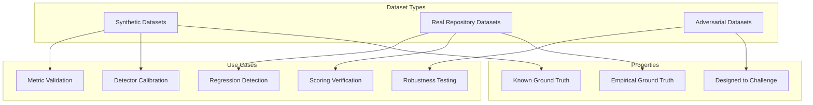
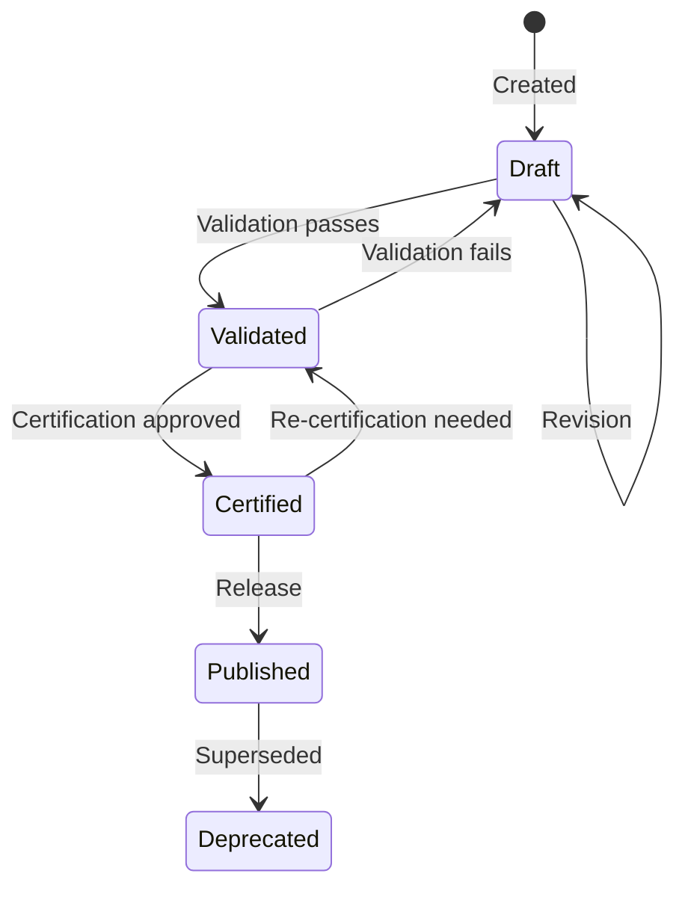
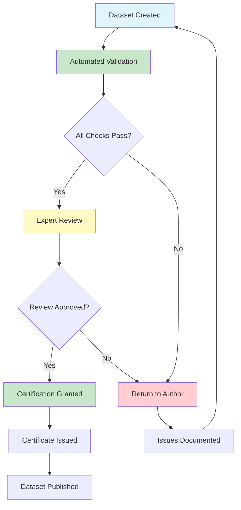

# MIIE v1.6

## 12_GROUND_TRUTH_DATASET_FRAMEWORK.md

### Ground Truth Dataset Framework & Scientific Benchmark Infrastructure

| Field | Value |
|-------|-------|
| Document Type | Scientific Infrastructure Specification |
| Version | 1.6.0 |
| Status | Canonical |
| Scope | Dataset Architecture, Benchmark Governance, Validation Infrastructure, Certification Protocol |
| Audience | Validation Scientists, Empirical Software Engineering Researchers, Benchmark Engineers |
| Last Updated | 2026-07-05 |
| Resolves | SDV Critical Finding CF-03 (G-09: No ground truth datasets) |

---

## Table of Contents

1. [Purpose](#1-purpose)
2. [Dataset Architecture](#2-dataset-architecture)
3. [Dataset Lifecycle](#3-dataset-lifecycle)
4. [Dataset Schema](#4-dataset-schema)
5. [Repository Taxonomy](#5-repository-taxonomy)
6. [Detector Benchmark Matrix](#6-detector-benchmark-matrix)
7. [Metric Benchmark Matrix](#7-metric-benchmark-matrix)
8. [Dataset Certification](#8-dataset-certification)
9. [Dataset Versioning](#9-dataset-versioning)
10. [Dataset Governance](#10-dataset-governance)
11. [Machine-Readable Schema](#11-machine-readable-schema)
12. [Implementation Integration](#12-implementation-integration)
13. [Validation](#13-validation)
14. [Threats to Validity](#14-threats-to-validity)
15. [Appendices](#15-appendices)

---

## 1. Purpose

### 1.1 Why Ground Truth Is Required

Scientific validation requires ground truth — known-correct answers against which MIIE's outputs can be measured. Without ground truth:

- Detector precision cannot be quantified
- Detector recall cannot be measured
- Metric accuracy cannot be assessed
- Scoring calibration cannot be verified
- Scientific claims remain unvalidated

Ground truth transforms MIIE from an assertion system into an evidence-based system.

### 1.2 Scope of This Document

This document defines:

- The Ground Truth Dataset Architecture
- Dataset lifecycle, schema, and metadata
- Repository taxonomy for benchmark classification
- Detector benchmark matrix (D-01, D-02, D-03)
- Metric benchmark matrix (M-01 through M-07)
- Dataset certification and versioning
- Machine-readable schema for programmatic consumption

### 1.3 Relationship to Existing Infrastructure

This framework extends and formalises the existing benchmark infrastructure:

| Existing Component | Status | Relationship |
|-------------------|--------|-------------|
| `benchmarks/ground_truth/ground_truth.py` | Module exists, no data | Formalised by this framework |
| `benchmarks/metadata/candidate_manifest.json` | 120 candidates defined | Extended with full metadata |
| `benchmarks/runner.py` | BenchmarkRunner exists | Consumes datasets defined here |
| `benchmarks/evaluation.py` | EvaluationEngine exists | Validates against ground truth defined here |
| `src/miie/benchmark/generator.py` | Generator exists | Produces datasets per this framework |

---

## 2. Dataset Architecture

### 2.1 Dataset Types

MIIE defines three dataset types, each serving a distinct validation purpose:



**Synthetic Datasets**: Constructed repositories with precisely controlled properties. Ground truth is established by construction (e.g., "this repository has metric drift injected at window 5"). Used for detector calibration and metric validation.

**Real Repository Datasets**: Actual repositories with expert-annotated labels. Ground truth is established by human judgment (e.g., "this repository exhibits healthy development patterns"). Used for scoring verification and regression detection.

**Adversarial Datasets**: Repositories designed to challenge MIIE's detection capabilities. Ground truth is established by construction (e.g., "this repository contains subtle gaming that should evade detection"). Used for robustness testing.

### 2.2 Dataset Identity

Every dataset must have a unique, immutable identity:

| Field | Type | Description |
|-------|------|-------------|
| `dataset_id` | string | Unique identifier (e.g., `GT-SYN-001`) |
| `dataset_name` | string | Human-readable name |
| `dataset_version` | string | Semantic version (e.g., `1.0.0`) |
| `dataset_type` | enum | `synthetic`, `real`, `adversarial` |
| `created_by` | string | Creator identifier |
| `created_at` | ISO 8601 | Creation timestamp |
| `status` | enum | `draft`, `validated`, `certified`, `published`, `deprecated` |

### 2.3 Dataset Provenance

Every dataset must document its origin:

| Field | Type | Description |
|-------|------|-------------|
| `source` | string | How the dataset was created |
| `methodology` | string | Creation methodology |
| `tools` | list[string] | Tools used in creation |
| `parameters` | dict | Creation parameters |
| `reproducibility` | string | How to reproduce the dataset |
| `parent_dataset` | string? | Parent dataset if derived |

---

## 3. Dataset Lifecycle

### 3.1 Lifecycle States



**Draft**: Dataset created but not yet validated. May contain errors. Must not be used for benchmarking.

**Validated**: Dataset passes all validation checks. Structural integrity confirmed. Ready for certification.

**Certified**: Dataset certified by authority. Ground truth labels verified. Approved for benchmarking.

**Published**: Dataset released for public use. Version-controlled. Immutable.

**Deprecated**: Dataset superseded by newer version. Still available but not recommended.

### 3.2 Lifecycle Transitions

| Transition | Gate | Authority |
|-----------|------|-----------|
| Draft → Validated | All validation checks pass | Automated |
| Validated → Certified | Expert review + certification criteria | Scientific Board |
| Certified → Published | Release checklist complete | Release Manager |
| Published → Deprecated | New version published | Scientific Board |
| Any → Draft | Metadata change required | Author |

---

## 4. Dataset Schema

### 4.1 Required Fields

Every ground truth dataset must contain:

```json
{
  "dataset_id": "GT-SYN-001",
  "dataset_name": "Metric Drift Detection — Moderate Drift",
  "dataset_version": "1.0.0",
  "dataset_type": "synthetic",
  "status": "certified",
  "created_by": "miie-benchmark-team",
  "created_at": "2026-07-05T00:00:00Z",
  "description": "Synthetic repository with controlled metric drift at d=0.5",
  "repository_classification": "synthetic",
  "language": "python",
  "commit_count": 200,
  "contributor_count": 5,
  "time_span_days": 365,
  "provenance": {
    "source": "generated",
    "methodology": "miie.benchmark.generator.BenchmarkDatasetGenerator",
    "tools": ["miie-benchmark-generator"],
    "parameters": {"drift_magnitude": 0.5, "drift_onset": 100},
    "reproducibility": "Run BenchmarkDatasetGenerator with seed=42, drift_magnitude=0.5"
  },
  "ground_truth": {
    "anomaly_present": true,
    "anomaly_type": "metric-drift",
    "anomaly_severity": "moderate",
    "anomaly_window_start": 5,
    "anomaly_window_end": 10,
    "expected_detector_outputs": {
      "D-01": {"detected": true, "severity": "high", "p_value_max": 0.05},
      "D-02": {"detected": false},
      "D-03": {"detected": false}
    },
    "expected_metric_values": {
      "M-01": {"range": [0.0, 1.0], "trend": "stable"},
      "M-02": {"range": [0, 500], "trend": "stable"},
      "M-03": {"range": [0.0, 1.0], "trend": "shift_at_window_5"}
    },
    "expected_scores": {
      "integrity_score_range": [0.3, 0.7],
      "confidence_score_range": [0.5, 0.9]
    }
  },
  "acceptance_criteria": {
    "D-01_sensitivity_min": 0.80,
    "D-01_specificity_min": 0.90,
    "metric_computation_tolerance": 0.01,
    "determinism_required": true
  },
  "versioning": {
    "changelog": ["Initial release"],
    "compatibility": "backward-compatible",
    "supersedes": null
  },
  "certification": {
    "certified_by": "scientific-board",
    "certified_at": "2026-07-05T00:00:00Z",
    "criteria": "all-expected-outputs-verified",
    "certificate_id": "CERT-GT-SYN-001-1.0.0"
  },
  "licensing": {
    "license": "MIT",
    "attribution": "MIIE Benchmark Dataset",
    "usage_restrictions": "none"
  }
}
```

### 4.2 Optional Fields

| Field | Type | Description |
|-------|------|-------------|
| `tags` | list[string] | Searchable tags |
| `language_distribution` | dict | Language breakdown |
| `size_bytes` | int | Repository size |
| `branch_count` | int | Number of branches |
| `pr_count` | int | Number of pull requests |
| `review_count` | int | Number of code reviews |
| `test_file_count` | int | Number of test files |
| `ci_config_present` | bool | CI configuration present |
| `known_limitations` | list[string] | Known dataset limitations |
| `references` | list[string] | Academic references |

---

## 5. Repository Taxonomy

### 5.1 Canonical Classification

MIIE classifies repositories into the following categories for benchmark purposes:

| Category | ID | Description | Purpose | Expected Behaviour |
|----------|-----|-------------|---------|-------------------|
| Healthy | `healthy` | Well-maintained, active repositories | Positive baseline | High integrity, no anomalies |
| Archived | `archived` | Inactive, archived repositories | Stability testing | Stable metrics, no changes |
| Fast Growth | `fast-growth` | Rapidly growing repositories | Stress testing | High churn, variable integrity |
| Enterprise | `enterprise` | Large, established enterprise projects | Real-world baseline | Moderate integrity |
| Experimental | `experimental` | Small, experimental projects | Edge case testing | Variable, high variance |
| Fork | `fork` | Forked repositories | Inheritance testing | May show inherited patterns |
| High Risk | `high-risk` | Repos with known integrity issues | Detector validation | Anomalies expected |
| Synthetic | `synthetic` | Generated repositories | Controlled testing | Known ground truth |
| Detector Challenge | `detector-challenge` | Designed to challenge detectors | Robustness testing | Subtle or adversarial patterns |
| Metric Validation | `metric-validation` | Known metric value distributions | Metric calibration | Expected metric values |

### 5.2 Selection Criteria

| Criterion | Inclusion | Exclusion |
|-----------|-----------|-----------|
| Minimum commits | ≥ 100 | < 100 |
| History span | ≥ 6 months | < 6 months |
| Contributors | ≥ 3 | < 3 |
| Accessibility | Public or agreed | Private, no access |
| Data quality | No corruption | Corrupted data |
| Language diversity | ≥ 1 language | None |

### 5.3 Language Coverage

| Language | Minimum Repositories | Priority |
|----------|---------------------|----------|
| Python | 5 | High |
| JavaScript/TypeScript | 5 | High |
| Java | 3 | Medium |
| Go | 3 | Medium |
| Rust | 2 | Medium |
| C/C++ | 2 | Medium |
| Other | 2 | Low |

### 5.4 Size Coverage

| Size Category | LOC | Minimum Repos |
|---------------|-----|---------------|
| Small | < 10K | 3 |
| Medium | 10K–100K | 5 |
| Large | 100K–1M | 3 |
| Very Large | > 1M | 2 |

---

## 6. Detector Benchmark Matrix

### 6.1 D-01: Distribution Drift Detector

| Dataset Type | Dataset ID | Anomaly Type | Expected D-01 Output | Precision Target | Recall Target |
|-------------|------------|--------------|---------------------|-----------------|---------------|
| Synthetic | GT-SYN-DRIFT-01 | No drift | Not detected | — | — |
| Synthetic | GT-SYN-DRIFT-02 | Small drift (d=0.2) | Not detected | — | — |
| Synthetic | GT-SYN-DRIFT-03 | Medium drift (d=0.5) | Detected | ≥ 0.80 | ≥ 0.75 |
| Synthetic | GT-SYN-DRIFT-04 | Large drift (d=0.8) | Detected | ≥ 0.80 | ≥ 0.75 |
| Synthetic | GT-SYN-DRIFT-05 | Gradual drift | Detected | ≥ 0.80 | ≥ 0.75 |
| Synthetic | GT-SYN-DRIFT-06 | Sudden drift | Detected | ≥ 0.80 | ≥ 0.75 |
| Synthetic | GT-SYN-DRIFT-07 | Intermittent drift | Detected | ≥ 0.80 | ≥ 0.70 |
| Real | GT-REAL-HEALTHY-01 | None (healthy) | Not detected | — | ≥ 0.90 |
| Real | GT-REAL-HEALTHY-02 | None (healthy) | Not detected | — | ≥ 0.90 |
| Real | GT-REAL-HEALTHY-03 | None (healthy) | Not detected | — | ≥ 0.90 |
| Adversarial | GT-ADV-DRIFT-01 | Subtle drift (d=0.3) | May evade | — | — |
| Adversarial | GT-ADV-DRIFT-02 | Seasonal pattern | Not detected | — | — |

### 6.2 D-02: Correlation Breakdown Detector

| Dataset Type | Dataset ID | Anomaly Type | Expected D-02 Output | Precision Target | Recall Target |
|-------------|------------|--------------|---------------------|-----------------|---------------|
| Synthetic | GT-SYN-CORR-01 | No breakdown | Not detected | — | — |
| Synthetic | GT-SYN-CORR-02 | Small weakening (Δr=0.1) | Not detected | — | — |
| Synthetic | GT-SYN-CORR-03 | Medium weakening (Δr=0.3) | Detected | ≥ 0.75 | ≥ 0.70 |
| Synthetic | GT-SYN-CORR-04 | Large weakening (Δr=0.5) | Detected | ≥ 0.75 | ≥ 0.70 |
| Synthetic | GT-SYN-CORR-05 | Correlation reversal | Detected | ≥ 0.75 | ≥ 0.70 |
| Synthetic | GT-SYN-CORR-06 | Correlation emergence | Detected | ≥ 0.75 | ≥ 0.70 |
| Real | GT-REAL-HEALTHY-01 | None (healthy) | Not detected | — | ≥ 0.90 |
| Real | GT-REAL-HEALTHY-02 | None (healthy) | Not detected | — | ≥ 0.90 |
| Adversarial | GT-ADV-CORR-01 | Subtle decoupling | May evade | — | — |

### 6.3 D-03: Threshold Compression Detector

| Dataset Type | Dataset ID | Anomaly Type | Expected D-03 Output | Precision Target | Recall Target |
|-------------|------------|--------------|---------------------|-----------------|---------------|
| Synthetic | GT-SYN-THRESH-01 | No compression | Not detected | — | — |
| Synthetic | GT-SYN-THRESH-02 | Weak compression | Not detected | — | — |
| Synthetic | GT-SYN-THRESH-03 | Moderate compression | Detected | ≥ 0.85 | ≥ 0.80 |
| Synthetic | GT-SYN-THRESH-04 | Strong compression | Detected | ≥ 0.85 | ≥ 0.80 |
| Synthetic | GT-SYN-THRESH-05 | Bimodal distribution | Detected | ≥ 0.85 | ≥ 0.80 |
| Real | GT-REAL-HEALTHY-01 | None (healthy) | Not detected | — | ≥ 0.90 |
| Real | GT-REAL-HEALTHY-02 | None (healthy) | Not detected | — | ≥ 0.90 |
| Adversarial | GT-ADV-THRESH-01 | Near-threshold gaming | May evade | — | — |

### 6.4 Cross-Detector Validation

Datasets must be validated across all three detectors to ensure:

- **No cross-contamination**: D-01 drift does not trigger D-02 or D-03
- **Independent detection**: Each detector responds only to its target anomaly
- **No false cascade**: One detector's output does not cause another to fire

---

## 7. Metric Benchmark Matrix

### 7.1 M-01: Commit Entropy Ratio

| Dataset | Description | Expected M-01 | Tolerance | Edge Cases |
|---------|-------------|---------------|-----------|------------|
| Uniform messages | All different categories | ~1.0 | ±0.05 | — |
| Identical messages | All same message | 0.0 | ±0.00 | Single token |
| Two categories | 50/50 split | ~1.0 | ±0.05 | — |
| Empty repository | No commits | 0.0 | ±0.00 | No data |
| Single commit | One commit | 0.0 | ±0.00 | No diversity |
| Non-ASCII messages | Unicode commit messages | ≥ 0.0 | — | Classification |
| Merge commits | Mix of merge and regular | Depends on mix | — | "other" category |

### 7.2 M-02: Commit Count

| Dataset | Description | Expected M-02 | Tolerance |
|---------|-------------|---------------|-----------|
| Empty repository | No commits | 0 | ±0 |
| Single commit | One commit | 1 | ±0 |
| 100 commits | 100 commits in window | 100 | ±0 |
| Multi-window | Commit distribution across windows | Sum = total | ±0 |

### 7.3 M-03: Code Churn Ratio

| Dataset | Description | Expected M-03 | Tolerance |
|---------|-------------|---------------|-----------|
| No changes | No insertions/deletions | 0.0 | ±0.00 |
| Small changes | 10 lines in 1000-line codebase | 0.01 | ±0.01 |
| Large changes | 500 lines in 1000-line codebase | 0.50 | ±0.05 |
| Complete rewrite | All lines changed | 1.0 | ±0.00 |
| Empty codebase | 0 total lines | Undefined | — |

### 7.4 M-04: Test Coverage Ratio

| Dataset | Description | Expected M-04 | Tolerance |
|---------|-------------|---------------|-----------|
| No tests | No test files | 0.0 | ±0.00 |
| Low coverage | 30% covered | 0.30 | ±0.05 |
| High coverage | 90% covered | 0.90 | ±0.05 |
| Full coverage | 100% covered | 1.00 | ±0.00 |

### 7.5 M-05: Review Latency

| Dataset | Description | Expected M-05 | Tolerance |
|---------|-------------|---------------|-----------|
| No reviews | No PRs reviewed | Undefined | — |
| Fast review | 1 hour latency | 1.0 | ±0.5 |
| Slow review | 48 hour latency | 48.0 | ±1.0 |
| Mixed reviews | Variable latency | Mean | ±5.0 |

### 7.6 M-06: File Change Count

| Dataset | Description | Expected M-06 | Tolerance |
|---------|-------------|---------------|-----------|
| No changes | No files changed | 0 | ±0 |
| Single file | One file changed | 1 | ±0 |
| Many files | 50 files changed | 50 | ±0 |

### 7.7 M-07: Branch Freshness Ratio

| Dataset | Description | Expected M-07 | Tolerance |
|---------|-------------|---------------|-----------|
| Fresh branch | Updated today | 1.0 | ±0.05 |
| Stale branch | Updated 90 days ago | 0.5 | ±0.10 |
| Very stale | Updated 180+ days ago | 0.0 | ±0.05 |

---

## 8. Dataset Certification

### 8.1 Certification Criteria

A dataset achieves **CERTIFIED** status when:

| Criterion | Requirement | Verification |
|-----------|-------------|-------------|
| Structural integrity | All required fields present | Schema validation |
| Ground truth completeness | All expected outputs defined | Field completeness check |
| Provenance documented | Creation methodology recorded | Provenance field check |
| Reproducibility | Dataset can be regenerated | Reproduction test |
| Expert review | Human verification of labels | Reviewer sign-off |
| Cross-detector consistency | No cross-contamination | Multi-detector test |
| Version control | Semantic version assigned | Version field check |
| Licensing | License specified | License field check |

### 8.2 Certification Levels

| Level | Criteria | Use |
|-------|----------|-----|
| **CERTIFIED** | All criteria met | Benchmark campaigns, publication |
| **CONDITIONALLY CERTIFIED** | Minor criteria unmet | Internal testing, research |
| **NOT CERTIFIED** | Major criteria unmet | Not for benchmarking |

### 8.3 Certification Workflow



---

## 9. Dataset Versioning

### 9.1 Versioning Policy

Datasets follow semantic versioning: `MAJOR.MINOR.PATCH`

| Change Type | Version Bump | Example |
|------------|-------------|---------|
| Breaking change to schema | MAJOR | 1.0.0 → 2.0.0 |
| New datasets added | MINOR | 1.0.0 → 1.1.0 |
| Bug fix in metadata | PATCH | 1.0.0 → 1.0.1 |

### 9.2 Version Compatibility

| Version Relationship | Compatibility | Migration |
|---------------------|---------------|-----------|
| Same MAJOR | Backward-compatible | None required |
| Different MAJOR | Breaking | Migration guide required |
| Same MINOR | Forward-compatible | None required |

### 9.3 Deprecation Policy

| Age | Status | Notice |
|-----|--------|--------|
| Current | Active | None |
| 1 version behind | Supported | Deprecation warning |
| 2+ versions behind | Deprecated | Removal notice |

---

## 10. Dataset Governance

### 10.1 Roles

| Role | Responsibilities |
|------|-----------------|
| **Dataset Author** | Creates datasets, documents provenance, responds to review |
| **Dataset Reviewer** | Reviews datasets for quality, completeness, correctness |
| **Certification Authority** | Grants/revokes certification status |
| **Release Manager** | Manages publication and versioning |
| **Scientific Board** | Sets criteria, resolves disputes |

### 10.2 Decision Rights

| Decision | Authority |
|----------|-----------|
| Create dataset | Any contributor |
| Validate dataset | Automated |
| Certify dataset | Certification Authority |
| Publish dataset | Release Manager |
| Deprecate dataset | Scientific Board |
| Modify schema | Scientific Board |

### 10.3 Quality Assurance

| Activity | Frequency | Owner |
|----------|-----------|-------|
| Schema validation | Per dataset | Automated |
| Cross-detector consistency | Per dataset | Automated |
| Expert review | Per certification | Reviewer |
| Dataset audit | Quarterly | Scientific Board |
| Deprecation review | Annually | Scientific Board |

---

## 11. Machine-Readable Schema

### 11.1 JSON Schema

The machine-readable schema is defined in `schemas/ground_truth_dataset.schema.json`. It validates:

- Required fields (dataset_id, version, ground_truth, etc.)
- Type constraints (string, number, enum, array)
- Value constraints (ranges, patterns, enumerations)
- Nested object structures (provenance, ground_truth, acceptance_criteria)

### 11.2 Schema Usage

```python
from miie.validation.service import ValidationService

service = ValidationService()
result = service.validate_data(dataset_dict, "ground_truth_dataset.schema.json")
assert result.is_valid
```

---

## 12. Implementation Integration

### 12.1 Integration Points

| Component | Integration | Description |
|-----------|------------|-------------|
| `BenchmarkRunner` | Consumes datasets | Runs benchmarks using dataset ground truth |
| `EvaluationEngine` | Validates against ground truth | Compares detector outputs to expected |
| `BenchmarkDatasetGenerator` | Produces synthetic datasets | Creates datasets per this framework |
| `GroundTruthDataset` | Loads/saves datasets | Python API for dataset management |
| `ValidationService` | Validates dataset schema | Schema validation |

### 12.2 Directory Conventions

```
benchmarks/
├── ground_truth/
│   ├── datasets/
│   │   ├── synthetic/
│   │   │   ├── GT-SYN-DRIFT-001/
│   │   │   │   ├── dataset.json          # Dataset metadata
│   │   │   │   ├── ground_truth.json     # Ground truth labels
│   │   │   │   └── repository/           # Generated repository
│   │   │   └── ...
│   │   ├── real/
│   │   │   ├── GT-REAL-HEALTHY-001/
│   │   │   │   ├── dataset.json
│   │   │   │   ├── ground_truth.json
│   │   │   │   └── annotations.json     # Expert annotations
│   │   │   └── ...
│   │   └── adversarial/
│   │       └── ...
│   ├── schema/
│   │   ├── ground_truth_dataset.schema.json
│   │   └── ground_truth_entry.schema.json
│   └── index.json                        # Dataset registry
├── taxonomy/
│   └── repository_taxonomy.json
└── matrices/
    ├── detector_benchmark_matrix.json
    └── metric_benchmark_matrix.json
```

---

## 13. Validation

### 13.1 Automated Validation Checks

| Check | Description | Pass Condition |
|-------|-------------|---------------|
| Schema conformance | Dataset matches JSON schema | Valid |
| Required fields | All required fields present | Complete |
| Ground truth completeness | All expected outputs defined | Complete |
| Version format | Semantic version format valid | Valid |
| Provenance documented | Source and methodology present | Documented |
| License specified | License field present | Present |
| Status valid | Status is valid lifecycle state | Valid |

### 13.2 Cross-Detector Validation

| Check | Description | Pass Condition |
|-------|-------------|---------------|
| No cross-contamination | D-01 drift does not trigger D-02/D-03 | Confirmed |
| Independent detection | Each detector responds to target only | Confirmed |
| No false cascade | One detector's output doesn't cause others | Confirmed |

---

## 14. Threats to Validity

### 14.1 Dataset Bias

**Threat**: Synthetic datasets may not capture real-world complexity.

**Mitigation**: Include real repository datasets alongside synthetic.

### 14.2 Label Noise

**Threat**: Expert annotations may be inconsistent.

**Mitigation**: Dual-reviewer annotation with adjudication.

### 14.3 Temporal Validity

**Threat**: Datasets may become outdated as development practices evolve.

**Mitigation**: Versioning policy with periodic review.

### 14.4 Coverage Gaps

**Threat**: Dataset taxonomy may not cover all repository types.

**Mitigation**: Regular taxonomy review and expansion.

---

## 15. Appendices

### Appendix A: Dataset ID Convention

Format: `GT-{TYPE}-{CATEGORY}-{NNN}`

- `GT`: Ground Truth prefix
- `TYPE`: `SYN` (synthetic), `REAL` (real), `ADV` (adversarial)
- `CATEGORY`: `DRIFT`, `CORR`, `THRESH`, `HEALTHY`, `CHALLENGE`, etc.
- `NNN`: Three-digit sequential number

### Appendix B: Anomaly Type Enumeration

| Anomaly Type | ID | Description |
|-------------|-----|-------------|
| Metric Drift | `metric-drift` | Distribution shift in metric values |
| Correlation Breakdown | `correlation-breakdown` | Weakening or reversal of metric correlations |
| Threshold Compression | `threshold-compression` | Concentration of values near threshold |
| Seasonal Pattern | `seasonal` | Natural periodic variation (not anomaly) |
| Gaming | `gaming` | Deliberate metric manipulation |
| Process Decay | `process-decay` | Gradual deterioration of practices |

### Appendix C: Severity Levels

| Severity | ID | Description |
|---------|-----|-------------|
| None | `none` | No anomaly present |
| Low | `low` | Minor deviation, may not require action |
| Moderate | `moderate` | Notable deviation, investigation recommended |
| High | `high` | Significant deviation, action required |
| Critical | `critical` | Severe deviation, immediate action required |

---

*End of Ground Truth Dataset Framework*

*This document resolves SDV Critical Finding CF-03 (G-09: No ground truth datasets).*
