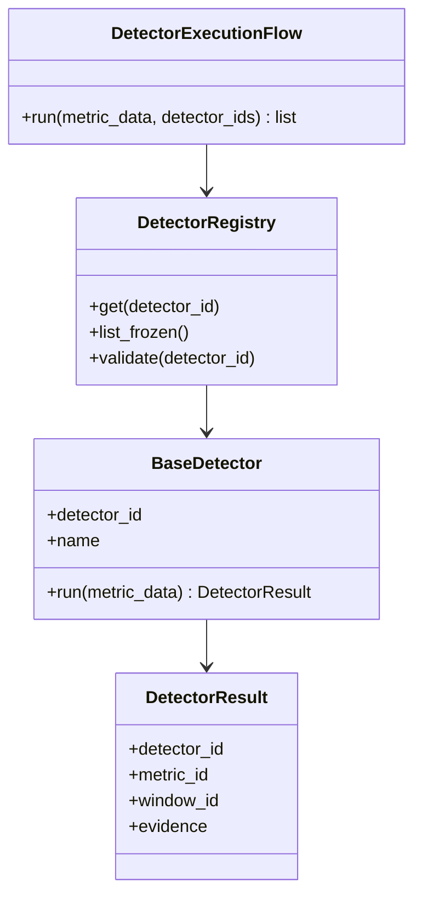

# MIIE DAY 0-10 EXECUTION OPERATING PLAN

## Executive Objective

The first 10 days are intended to turn the frozen MIIE v1.0 document stack into an executable, reviewable, research-grade engineering foundation. The outcome is not a large feature set. The outcome is reduced ambiguity: one source of truth, stable architecture, strict contracts, minimal core schemas, deterministic scaffolding, early benchmark discipline, and a dry-run pipeline that proves the team can integrate modules without inventing behavior.

The team must not attempt real detector mathematics, full metric extraction, complete benchmark suites, dashboards, SaaS features, enterprise features, developer productivity scoring, developer ranking, employee monitoring, LLM explanations, plugin systems, database persistence, or V2 capabilities. MIIE v1.0 is frozen; Days 0-10 exist to implement the frozen system correctly, not to expand it.

Reducing uncertainty is more important than producing large amounts of code because MIIE is a research artifact as well as an engineering system. Wrong abstractions, permissive schemas, unstable outputs, or undocumented contract drift would damage reproducibility and publication readiness. Architecture, contracts, schemas, benchmark foundations, and reproducibility come first because every later detector, score, report, and benchmark result depends on those foundations being deterministic and traceable.

## Success Criteria By Day 10

| Area | Measurable Day 10 Criteria |
|---|---|
| Repository Status | `miie` repository exists with IMP-aligned structure, Poetry, lockfile, GitHub Actions CI, pre-commit, README, license, contribution files, and package version `1.0.0`. |
| Architecture Status | TRD module boundaries exist; import rules are documented and tested; no processing module imports CLI/API; no non-frozen module appears. |
| Schema Status | Only `RepositoryContext`, `MetricDataFrame`, `DetectorResult`, and `EvidencePackage` are implemented; JSON Schema draft-07 validation exists; deferred schemas are documented with reasons. |
| Contract Status | ACS DTOs, Protocols, validators, error model, and contract tests exist for Days 0-10 execution surfaces. |
| Pipeline Status | Pipeline skeleton executes repository loader, metric extractor, detector engine, evidence engine, scoring mock, report mock, and benchmark mock in AFD order. |
| Benchmark Status | Benchmark directories exist; 30 synthetic benchmark candidates exist as candidates only; no claim of complete B-01/B-02/B-03 coverage; annotation workflow is documented. |
| Research Status | Literature notes, threats-to-validity log, benchmark decision log, and evidence traceability notes exist from Day 5 onward. |
| Testing Status | Unit, integration, contract, schema, architecture-boundary, dry-run, and reproducibility tests exist; scaffold coverage target is at least 70 percent. |
| Documentation Status | `freeze_register.md`, `terminology_registry.md`, `authority_matrix.md`, `docs/architecture.md`, `docs/day_10_review.md`, and dry-run usage docs exist. |
| CI/CD Status | CI runs install, lint, type check, schema tests, contract tests, unit tests, integration tests, dry-run reproducibility check, and fails on nondeterministic output. |

---

# DAY 0

## DOCUMENT RECONCILIATION & FREEZE

Purpose: Create a single source of truth before implementation begins.

## Objective

Reconcile the frozen documents into executable authority rules, terminology, scope boundaries, and conflict-resolution procedures. Day 0 produces the operating documents that prevent the team from reinterpreting MIIE v1.0 during implementation.

## Why This Day Exists

MIIE has multiple authoritative documents. Without Day 0, engineers may accidentally use the wrong document for a question, implement broad PRD concepts instead of frozen ACS contracts, or confuse strategic MES guidance with v1 implementation scope. Day 0 prevents drift.

## Required Documents

| Document | Day 0 Use |
|---|---|
| TRD | Architecture, module inventory, technology constraints, storage architecture |
| ACS | Contracts, DTOs, CLI/API/internal interface authority |
| BSD-Engineering | Data schemas, serialization, validation, filesystem artifacts |
| TFS | Frozen metrics, detectors, algorithms, scores, out-of-scope list |
| AFD | Workflow behavior, invocation order, state/error flows |
| IMP | Execution order, repository structure, team ownership, CI/CD |
| PRD | Product scope, personas, outputs, user-facing intent |
| MIBS | Benchmark assumptions, suite logic, candidate dataset discipline |
| FSR | Strategic/research justification and theory traceability |
| MES | Strategic exclusions and evolution guardrails; not v1 scope expansion |

## Inputs

- Frozen document PDFs or canonical Markdown copies.
- Previous Day 1-10 execution plan PDF as historical input only.
- Team roster: Engineer A, Engineer B, Engineer C.
- Repository name: `miie`.

## Tasks

### Task 1 - Create `freeze_register.md`

Purpose:

- Record what is frozen, what is deferred, and what cannot be changed without formal approval.

Input:

- TFS frozen scope and exclusions.
- TRD module inventory.
- ACS interface registry.
- BSD core schema list.
- IMP execution order.
- MIBS benchmark definitions.

Processing:

1. List frozen capabilities exactly as TFS defines them.
2. List frozen metrics M-01 through M-07.
3. List frozen detectors D-01 through D-03.
4. List frozen modules M-01 through M-17 from TRD.
5. List Day 0-10 implemented subset.
6. List Day 0-10 deferred items and reason.
7. List forbidden items from TFS/MES.

Output:

- `docs/governance/freeze_register.md`.

Validation:

- Pass: every frozen item maps to TRD, ACS, BSD, TFS, AFD, IMP, and MIBS where applicable.
- Fail: any V2, dashboard, SaaS, or enterprise item appears.
- Recovery: remove item, cite the violated authority, and add it to forbidden scope.

Deliverable:

- File Name: `freeze_register.md`
- Location: `docs/governance/`
- Owner: Engineer A

Definition Of Done:

- Reviewed by all three engineers.
- No uncited capability appears.
- Includes explicit "not implemented by Day 10" section.

Expected structure:

```markdown
# Freeze Register

## Frozen Product Identity
## Frozen V1 Capabilities
## Frozen Metrics
## Frozen Detectors
## Frozen Modules
## Frozen Workflows
## Frozen Interfaces
## Frozen Schemas Relevant To Days 0-10
## Day 0-10 Implementation Subset
## Deferred Until After Day 10
## Permanently Out Of Scope For V1
## Change-Control Rule
```

### Task 2 - Create `terminology_registry.md`

Purpose:

- Prevent inconsistent names across code, docs, schemas, tests, and reports.

Input:

- TRD names, ACS contract names, BSD schema names, TFS metric/detector labels, PRD product terms.

Processing:

1. Create canonical term table.
2. Add forbidden aliases.
3. Add code identifier column.
4. Add source document column.
5. Add "allowed in user-facing text" flag.

Output:

- `docs/governance/terminology_registry.md`.

Validation:

- Pass: `Measurement Integrity Intelligence Engine`, `MIIE`, `miie`, M-01..M-17, D-01..D-03, and schema names are consistent.
- Fail: aliases such as productivity engine, dashboard, analytics platform, or monitoring system appear.
- Recovery: replace alias and add forbidden-term note.

Deliverable:

- File Name: `terminology_registry.md`
- Location: `docs/governance/`
- Owner: Engineer C

Definition Of Done:

- Used by README, schemas, contracts, and test names.

Expected structure:

```markdown
# Terminology Registry

| Canonical Term | Code Identifier | Meaning | Source Authority | Forbidden Alias | Notes |
|---|---|---|---|---|---|

## Product Terms
## Module Terms
## Metric Terms
## Detector Terms
## Schema Terms
## Workflow Terms
## Forbidden Terms
```

### Task 3 - Create `authority_matrix.md`

Purpose:

- Tell engineers which document to open for each decision.

Input:

- Complete frozen document stack.

Processing:

1. Build a question-to-authority table.
2. Define conflict resolution order.
3. Mark MES, FSR, and MIBS as strategic/research authorities, not permission to expand v1 product scope.

Output:

- `docs/governance/authority_matrix.md`.

Validation:

- Pass: architecture maps to TRD, contracts to ACS, schemas to BSD, algorithms to TFS, workflows to AFD, execution to IMP, benchmark to MIBS.
- Fail: product scope decisions are made from MES alone.
- Recovery: route decision through PRD/TFS/TRD/ACS as applicable.

Deliverable:

- File Name: `authority_matrix.md`
- Location: `docs/governance/`
- Owner: Engineer A

Definition Of Done:

- Every implementation task in Days 1-10 references this matrix.

Expected structure:

```markdown
# Authority Matrix

## Conflict Resolution Order
## Question To Document Table
## Document Roles
## Day 0-10 Implementation Authorities
## Strategic Documents And Limits
## Review Signoff Rules
```

## Outputs

- `docs/governance/freeze_register.md`
- `docs/governance/terminology_registry.md`
- `docs/governance/authority_matrix.md`
- Day 0 signoff note in `docs/governance/day0_signoff.md`

## Risks

- Treating previous execution plans as authority instead of the frozen source documents.
- Using MES to add future product capabilities.
- Ambiguous M-03 naming because TRD uses M-03 for window segmentation and dataset generator variant.

## Expected Files

| File | Purpose | Owner |
|---|---|---|
| `docs/governance/freeze_register.md` | Frozen scope and deferred scope | Engineer A |
| `docs/governance/terminology_registry.md` | Canonical naming | Engineer C |
| `docs/governance/authority_matrix.md` | Decision authority guide | Engineer A |
| `docs/governance/day0_signoff.md` | Team approval note | Engineer B |

---

# DAY 1

## Repository Setup

## Objective

Create the repository, Poetry project, Git/GitHub controls, CI/CD, pre-commit, linting, and testing framework.

## Tasks

| Task | Purpose | Inputs | Processing | Outputs | Required Documents | Commands | Expected Files | Validation | Deliverables | Definition Of Done | Hours | Owner |
|---|---|---|---|---|---|---|---|---|---|---|---:|---|
| Initialize Git repository | Establish controlled implementation base | Day 0 governance docs, IMP repo structure | Create repo, protect `main`, add branch rules, add PR templates | GitHub repo with protected branch | IMP, TRD, TFS | `git init`; `git status` | `.github/PULL_REQUEST_TEMPLATE.md` | Branch protection exists; direct push blocked | Repository shell | Clean initial commit | 1.5 | Engineer A |
| Create Poetry project | Make dependency state reproducible | IMP dependency list | Create `pyproject.toml`, add pinned runtime/dev deps, lock | Poetry project | IMP Section 6 | `poetry lock`; `poetry install` | `pyproject.toml`, `poetry.lock`, `requirements.txt` | Clean install on Python 3.10 | Package scaffold | Lockfile committed | 2 | Engineer A |
| Add package entry points | Establish TRD package identity | TRD namespace and CLI entry | Add `src/miie/__init__.py`, `__main__.py`, `cli.py` version command | Importable package | TRD, ACS, TFS | `poetry run miie --version`; `poetry run python -m miie --version` | `src/miie/__init__.py`, `src/miie/__main__.py`, `src/miie/cli.py` | Both commands return `1.0.0` | Version smoke | Version test passes | 1.5 | Engineer A |
| Add CI/CD | Make every change reviewable | Poetry project | Add GitHub Actions for install, lint, type check, tests | CI workflow | IMP, ACS, BSD | CI run | `.github/workflows/ci.yml` | CI fails on test/type/lint errors | CI baseline | Green CI on initial PR | 2 | Engineer A |
| Add pre-commit and linting | Enforce style before review | IMP coding standards | Configure black, isort, flake8, mypy | Local quality gate | IMP | `poetry run black --check src tests`; `poetry run mypy src` | `.pre-commit-config.yaml`, config in `pyproject.toml` | Hooks run locally | Pre-commit baseline | Hook docs in README | 1.5 | Engineer C |
| Add testing framework | Prepare deterministic verification | IMP testing strategy | Create test folders and first version/import tests | Test scaffold | IMP, AFD | `poetry run pytest` | `tests/unit/test_version.py`, `tests/conftest.py` | Tests pass | Unit smoke tests | CI runs pytest | 1.5 | Engineer C |

## Common Failures

- Dependency versions float.
- CLI entry point is named something other than `miie`.
- CI skips mypy or schema tests.
- Repository contains unapproved folders such as `frontend`, `dashboard`, `database`, or `tenant`.

## Day 1 Deliverable Set

- `pyproject.toml`, `poetry.lock`, `requirements.txt`
- `.github/workflows/ci.yml`
- `.pre-commit-config.yaml`
- `src/miie/__init__.py`, `src/miie/__main__.py`, `src/miie/cli.py`
- `tests/unit/test_version.py`

---

# DAY 2

## Architecture Scaffolding

## Objective

Create TRD-driven module structure, dependency boundaries, package layout, import rules, and architecture validation tests.

## Tasks

| Task | Purpose | Inputs | Processing | Outputs | Required Documents | Commands | Expected Files | Validation | Deliverables | Definition Of Done | Hours | Owner |
|---|---|---|---|---|---|---|---|---|---|---|---:|---|
| Create module structure | Encode TRD module inventory | TRD M-01..M-17, IMP repo tree | Create processing, benchmark, reporting, orchestration, contracts, schemas packages | Importable package tree | TRD, IMP | `poetry run python -c "import miie"` | `src/miie/processing/*`, `benchmark/*`, `orchestration/*` | All modules import without side effects | Module scaffold | No non-frozen module | 3 | Engineer A |
| Define dependency boundaries | Prevent architecture drift | TRD layers, AFD flows | Write allowed import graph and layer rules | Architecture guide | TRD, AFD, ACS | `poetry run pytest tests/unit/test_architecture_boundaries.py` | `docs/architecture.md` | Forbidden imports fail test | Boundary rules | Test enforced in CI | 2 | Engineer A |
| Add import validation | Make architecture executable | Package tree | AST-based or simple import rule tests | Boundary tests | TRD, IMP | `poetry run pytest tests/unit/test_imports.py` | `tests/unit/test_imports.py`, `test_architecture_boundaries.py` | `processing` cannot import `cli` or `api` | Architecture tests | CI passes | 2 | Engineer C |
| Add placeholder Protocol map | Prepare ACS without behavior | ACS service contracts | Define Protocol names only; no logic | Typed interfaces | ACS, TRD | `poetry run mypy src` | `src/miie/contracts/interfaces.py` | Mypy passes | Protocol scaffold | No algorithm logic | 2 | Engineer A |

## Validation Rules

- Every module must map to TRD M-01 through M-17 or Evidence Aggregator.
- Import-time code must not read files, clone repositories, start API servers, or run detectors.
- Processing modules must not import CLI/API modules.
- Schemas must not import runtime engines.

## Day 2 Deliverable Set

- `docs/architecture.md`
- `src/miie/contracts/interfaces.py`
- `tests/unit/test_imports.py`
- `tests/unit/test_architecture_boundaries.py`

---

# DAY 3

## Core Schema Foundation

## Objective

Implement only the four schemas needed for the Day 10 dry-run slice: `RepositoryContext`, `MetricDataFrame`, `DetectorResult`, and `EvidencePackage`.

## Why Only Four Schemas

BSD-Engineering defines many schemas, but implementing all of them on Day 3 would create false confidence and increase review surface before the pipeline slice needs them. The Day 0-10 goal is to validate the minimal data path: repository input, metric table, detector output, and traceable evidence. Remaining schemas such as `ScorePackage`, `ExplanationReport`, `AnalysisResult`, `BenchmarkDataset`, `GroundTruth`, `BenchmarkRun`, and `EvaluationResult` are deferred until their modules become active.

## BSD References

- `RepositoryContext`: BSD-Engineering Section 5.
- `MetricDataFrame`: BSD-Engineering Section 6.
- `DetectorResult`: BSD-Engineering Section 8.
- `EvidencePackage`: BSD-Engineering Section 10.
- Serialization and strictness: BSD-Engineering Sections 1.4, 1.6, 1.7, and 4.

## Tasks

| Task | Purpose | Inputs | Processing | Outputs | Required Documents | Commands | Expected Files | Validation | Deliverables | Definition Of Done | Hours | Owner |
|---|---|---|---|---|---|---|---|---|---|---|---:|---|
| Implement `RepositoryContext` | Make M-01 output executable | BSD Section 5, TRD ingestion | Dataclass plus JSON schema | Repo context model | BSD, TRD, ACS, TFS, AFD, IMP, MIBS | `poetry run pytest tests/schema/test_repository_context.py` | `src/miie/schemas/models.py`, `repository_context.schema.json` | Required fields, ISO dates, no extra fields | Schema 1 | Valid/invalid tests pass | 2 | Engineer C |
| Implement `MetricDataFrame` | Make M-02 output executable | BSD Section 6, TFS metrics | Dataclass plus JSON schema; metric ID enum M-01..M-07 | Metric model | BSD, TFS, ACS | `poetry run pytest tests/schema/test_metric_dataframe.py` | `metric_dataframe.schema.json` | Unsupported metric fails; missing-data policy tested | Schema 2 | Frozen metric inventory enforced | 3 | Engineer C |
| Implement `DetectorResult` | Make D-01..D-03 mock output valid | BSD Section 8, TFS detector freeze | Dataclass plus JSON schema; detector ID enum D-01..D-03 | Detector result model | BSD, TFS, ACS | `poetry run pytest tests/schema/test_detector_result.py` | `detector_result.schema.json` | D-04 fails; mock result validates | Schema 3 | No detector math | 2 | Engineer B |
| Implement `EvidencePackage` | Make Day 9 evidence traceable | BSD Section 10, PRD evidence principle | Dataclass plus JSON schema with trace fields | Evidence model | BSD, PRD, ACS, AFD | `poetry run pytest tests/schema/test_evidence_package.py` | `evidence_package.schema.json` | Missing traceability fails | Schema 4 | Evidence requires detector/metric links | 3 | Engineer A |
| Implement deterministic serialization | Support reproducibility | BSD serialization rules | Sorted keys, stable separators, checksum helper, no generated time | Serialization helper | BSD, TFS, IMP | `poetry run pytest tests/unit/test_serialization.py` | `src/miie/schemas/serialization.py` | Two serializations byte-identical | Serialization utility | Checksum stable | 1.5 | Engineer C |

## Deferred Schemas

| Deferred Schema | Reason Deferred | Next Likely Day |
|---|---|---|
| `ScorePackage` | Scoring is mock-only through Day 10; real TFS formulas not implemented yet | Days 11-20 |
| `ExplanationReport` | Reports are mock-only and must not imply real detector findings | Day 10 mock, real after scoring/evidence matures |
| `AnalysisResult` | Full result object depends on scoring/report semantics | Days 11-20 |
| `BenchmarkDataset` | Day 8 creates candidates only, not finalized benchmark suite | Days 11-20 |
| `GroundTruth` | Annotation workflow starts, final ground truth not complete | Days 11-20 |
| `BenchmarkRun` | Benchmark engine is mock-only | Days 11-20 |
| `EvaluationResult` | No real detector evaluation before benchmark maturity | Days 11-20 |

## Tests

- JSON Schema files pass draft-07 validation.
- Unknown fields fail.
- Invalid metric and detector IDs fail.
- Serialization is deterministic.
- Evidence without traceability fails.

---

# DAY 4

## Contract Layer

## Objective

Implement ACS contracts as DTOs, interfaces, Protocols, validation rules, and contract tests for the Day 0-10 execution slice.

## Tasks

| Task | Purpose | Inputs | Processing | Outputs | Required Documents | Commands | Expected Files | Validation | Deliverables | Definition Of Done | Hours | Owner |
|---|---|---|---|---|---|---|---|---|---|---|---:|---|
| Create contracts package | Keep communication separate from implementation | ACS Sections 4-18 | Add requests, responses, errors, validators, interfaces | Contract package | ACS, BSD, TRD, TFS, AFD, IMP, MIBS | `poetry run mypy src` | `src/miie/contracts/*` | Contracts do not import engines | Contract base | Import rules pass | 2 | Engineer A |
| Add DTOs | Make payloads typed | Day 3 schemas, ACS contracts | Add ingestion, metric extraction, detector invocation, evidence generation, dry-run report DTOs | Typed DTOs | ACS, BSD | `poetry run pytest tests/contract` | `requests.py`, `responses.py` | Missing required fields fail | DTO suite | Positive/negative tests pass | 3 | Engineer A |
| Add Protocols | Decouple pipeline from concrete modules | ACS internal service contracts | Define RepositoryLoader, MetricExtractor, DetectorEngine, EvidenceEngine, ScoringEngine, ReportEngine, BenchmarkEngine Protocols | Service Protocols | ACS, TRD, AFD | `poetry run mypy src` | `interfaces.py` | Mypy validates mock implementations | Protocol suite | Pipeline can depend on Protocols | 2 | Engineer A |
| Add validation rules | Reject bad inputs early | TFS IDs, BSD strictness | Validate metric IDs, detector IDs, paths, output formats, seeds, dry-run flag | Validators | ACS, TFS, BSD | `poetry run pytest tests/contract/test_validators.py` | `validators.py` | Bad IDs/path fail | Validation suite | No silent coercion | 3 | Engineer C |
| Add error model | Standardize contract failures | ACS error framework | Add error category, severity, recovery action, user-visible message | Error DTOs | ACS, AFD | `poetry run pytest tests/contract/test_errors.py` | `errors.py` | Invalid contract returns explicit error | Error suite | Error payload schema-valid | 1.5 | Engineer A |

## Validation

- DTOs use Day 3 schemas where applicable.
- Invalid IDs fail before processing.
- Unknown fields fail.
- Contract tests include positive and negative cases.
- No detector, scoring, benchmark, or report logic appears in contracts.

---

# DAY 5

## Pipeline Skeleton

## Objective

Implement orchestration-only pipeline skeleton with mock implementations for Repository Loader, Metric Extractor, Detector Engine, Evidence Engine, Scoring Engine, Report Engine, and Benchmark Engine.

## Important Scope Rule

All Day 5 implementations are mocks or orchestration shells. No real detector logic, real scoring formula, full report generation, or benchmark execution is allowed.

## Tasks

| Task | Purpose | Inputs | Processing | Outputs | Required Documents | Commands | Expected Files | Validation | Deliverables | Definition Of Done | Hours | Owner |
|---|---|---|---|---|---|---|---|---|---|---|---:|---|
| Implement pipeline controller | Prove AFD stage order | ACS Protocols, AFD WF-01 | Constructor-inject services; call loader, extractor, detector, evidence, scoring mock, report mock | Pipeline skeleton | AFD, ACS, TRD, BSD, TFS, IMP, MIBS | `poetry run pytest tests/integration/test_pipeline_skeleton.py` | `src/miie/orchestration/pipeline.py` | Stage order asserted | Pipeline shell | No real logic | 3 | Engineer A |
| Add deterministic mocks | Enable integration without algorithms | Day 3 schemas | Fixed run ID, timestamp, seed, metric values, detector output | Test mocks | BSD, ACS, TFS | `poetry run pytest tests/fixtures` | `tests/fixtures/mock_services.py` | Two runs equal | Mock suite | No current time/random | 2 | Engineer C |
| Implement workflow dispatcher | Prepare frozen workflow routing | AFD workflow inventory | Register WF-01..WF-05; reject unknown workflows | Workflow skeleton | AFD, PRD, TRD | `poetry run pytest tests/unit/test_workflow.py` | `src/miie/orchestration/workflow.py` | Unknown workflow fails | Workflow shell | Frozen workflows only | 2 | Engineer A |
| Add mock benchmark engine | Reserve benchmark boundary | MIBS, ACS benchmark contract | Mock accepts candidate list and returns placeholder status only | Benchmark mock | MIBS, ACS, IMP | `poetry run pytest tests/unit/test_benchmark_mock.py` | `tests/fixtures/mock_benchmark.py` | Does not claim performance | Benchmark placeholder | No B-01/B-02/B-03 completion claim | 1.5 | Engineer B |

## Parallel Research Track Begins

| Track | Day 5 Work | Expected Output Files | Owner |
|---|---|---|---|
| Research Tasks | Create publication-readiness log and research question traceability notes | `research/research_traceability.md` | Engineer B |
| Paper Review Tasks | Start annotated bibliography for metric validity, Goodhart effects, detector validation, benchmark construction | `research/literature_notes.md` | Engineer B |
| Threats-To-Validity Tasks | Create initial internal/external/construct/conclusion validity risk log | `research/threats_to_validity.md` | Engineer B |
| Benchmark Tasks | Define benchmark candidate acceptance criteria, not datasets yet | `benchmarks/candidate_acceptance_criteria.md` | Engineer B |

## Validation

- Pipeline uses Protocols, not concrete implementation coupling.
- Mock output is schema-valid.
- Research files cite which authority document motivated each note.

---

# DAY 6

## Repository Ingestion

## Objective

Build M-01 repository ingestion foundation: local Git validation, repository metadata extraction, path safety, cache path planning, tests, and integration with the pipeline skeleton.

## Tasks

| Task | Purpose | Inputs | Processing | Outputs | Required Documents | Commands | Expected Files | Validation | Deliverables | Definition Of Done | Hours | Owner |
|---|---|---|---|---|---|---|---|---|---|---|---:|---|
| Validate local Git repository | Prevent invalid input entering pipeline | Local Git fixture, bad path fixture | Check path existence, directory type, Git validity, traversal safety | Validated repository input | TRD, ACS, BSD, TFS, AFD, IMP, MIBS | `poetry run pytest tests/unit/test_ingestion.py` | `src/miie/processing/ingestion.py` | Bad paths fail with ACS error | M-01 validation | No network required | 3 | Engineer B |
| Extract repository metadata | Produce `RepositoryContext` | Valid Git fixture | Extract repo ID, commit count, first/last commit date, contributor count, shallow/fork flags where available | `RepositoryContext` | TRD Section 7, BSD Section 5, ACS INT-01 | `poetry run pytest tests/unit/test_repository_context_extraction.py` | same | Schema validates | Metadata extractor | Deterministic fields | 3 | Engineer B |
| Plan cache path safely | Respect TRD storage layout | Repo ID, cache root | Resolve `~/.miie/cache/repos/{repo_id}` without writing in unit test | Cache path helper | TRD Section 16, BSD serialization | `poetry run pytest tests/unit/test_cache_paths.py` | same | Cannot escape cache root | Path helper | Safe path tests pass | 1 | Engineer A |
| Integrate M-01 into pipeline | Replace mock loader where safe | Pipeline skeleton, M-01 output | Feed real `RepositoryContext` to mock extractor | Integration pass | AFD, ACS | `poetry run pytest tests/integration/test_ingestion_to_pipeline.py` | `tests/integration/test_ingestion_to_pipeline.py` | Pipeline consumes M-01 output | Integration test | Stage order preserved | 2 | Engineer C |

## Unit Tests

- Valid local Git repository accepted.
- Missing path rejected.
- Non-Git directory rejected.
- Path traversal rejected.
- Metadata validates against `RepositoryContext`.
- Cache path cannot escape configured root.

## Integration Tests

- M-01 output accepted by mock M-02.
- M-01 error propagates through pipeline as ACS error.

## Common Failures

- Calling remote clone during tests.
- Using current timestamp instead of repository commit dates.
- Accepting arbitrary directories.
- Treating unavailable fork metadata as fatal.

## Parallel Research Track

| Track | Day 6 Work | Output File |
|---|---|---|
| Research Tasks | Record repository selection assumptions and risks | `research/repository_selection_notes.md` |
| Paper Review Tasks | Summarize repository mining reproducibility papers | `research/literature_notes.md` |
| Threats-To-Validity Tasks | Add threats from Git history incompleteness, shallow repos, bot commits | `research/threats_to_validity.md` |
| Benchmark Tasks | Draft fixture repository requirements | `benchmarks/repository_fixture_requirements.md` |

---

# DAY 7

## Metric Extraction Foundation

## Objective

Implement only Commit Frequency and Code Churn extraction foundations. Do not implement all seven metrics.

## Why Only Commit Frequency And Code Churn

Commit Frequency and Code Churn can be extracted from Git history without requiring coverage artifacts, pull request exports, issue exports, or complexity tools. They are sufficient for the Day 10 dry-run metric path and avoid fabricating unavailable metrics. M-01 Code Coverage, M-03 Review Participation, M-04 Review Latency, M-05 Issue Resolution Time, and M-07 Cyclomatic Complexity remain registered but unavailable unless their required artifacts exist.

## Tasks

| Task | Purpose | Inputs | Processing | Outputs | Required Documents | Commands | Expected Files | Validation | Deliverables | Definition Of Done | Hours | Owner |
|---|---|---|---|---|---|---|---|---|---|---|---:|---|
| Implement metric registry | Freeze M-01..M-07 inventory | TFS metric table | Register metric IDs, names, ranges, missing-data policy | Frozen metric registry | TFS, BSD, ACS, TRD, AFD, IMP, MIBS | `poetry run pytest tests/unit/test_metric_registry.py` | `src/miie/registry.py` or `src/miie/schemas/metric_registry.py` | Unsupported metrics fail | Registry | All 7 registered, only 2 implemented | 2 | Engineer A |
| Extract Commit Frequency | Implement Git-backed M-02 | `RepositoryContext`, Git fixture | Count commits per window or fixed dry-run window | M-02 metric rows | TRD Section 8, TFS Section 2, BSD Section 6 | `poetry run pytest tests/unit/test_commit_frequency.py` | `src/miie/processing/extraction.py` | Deterministic count | M-02 extractor | Schema-valid output | 3 | Engineer B |
| Extract Code Churn | Implement Git-backed M-06 foundation | Git fixture | Compute added/deleted lines from fixture commits with deterministic bounds | M-06 metric rows | TRD Section 8, TFS Section 2, BSD Section 6 | `poetry run pytest tests/unit/test_code_churn.py` | same | Fixture value stable | M-06 extractor | Schema-valid output | 3 | Engineer B |
| Encode unavailable metrics | Avoid fake values | Missing artifact policy | Return unavailable/null with warning metadata for M-01, M-03, M-04, M-05, M-07 when artifacts absent | Valid missing-data records | BSD, TFS, ACS | `poetry run pytest tests/unit/test_missing_metric_policy.py` | same | Unavailable is not zero | Missing policy | No fabricated data | 2 | Engineer C |
| Integrate extraction | Feed detector mock | M-01 output, M-02 output | `RepositoryContext -> MetricDataFrame -> mock DetectorEngine` | Integration pass | AFD, ACS | `poetry run pytest tests/integration/test_ingestion_to_extraction.py` | integration test | Schema validates | Pipeline slice | Detector mock accepts metrics | 2 | Engineer C |

## Outputs

- `MetricDataFrame` containing M-02 and M-06 real fixture-backed values.
- Unavailable markers for non-implemented metrics when requested.
- Tests proving no extra metrics exist.

## Failure Modes

- Missing metrics encoded as zero.
- PR/issue/coverage metrics invented from Git data.
- Code churn differs across platforms because fixture is unstable.
- Metric ID labels use names instead of M-IDs.

## Parallel Research Track

| Track | Day 7 Work | Output File |
|---|---|---|
| Research Tasks | Document why M-02/M-06 are first extraction targets | `research/metric_extraction_rationale.md` |
| Paper Review Tasks | Add notes on commit frequency and churn validity limitations | `research/literature_notes.md` |
| Threats-To-Validity Tasks | Add construct validity risks for Git-derived metrics | `research/threats_to_validity.md` |
| Benchmark Tasks | Define candidate metric availability matrix | `benchmarks/metric_availability_matrix.md` |

---

# DAY 8

## Detector Framework

## Objective

Implement `BaseDetector`, `DetectorRegistry`, `DetectorExecutionFlow`, and `DetectorResult` usage. No detector mathematics. No scoring.

## Responsibilities

| Component | Responsibility | Explicit Non-Responsibility |
|---|---|---|
| `BaseDetector` | Define detector ID, name, input contract, output contract | No KS, PSI, Pearson, Spearman, excess mass, or dip test |
| `DetectorRegistry` | Register D-01, D-02, D-03 only | No plugin system, no D-04 |
| `DetectorExecutionFlow` | Validate request, order detectors, collect `DetectorResult` | No scoring, no evidence generation |
| `MockDetector` | Produce fixed schema-valid test output | No real statistical claim |

## Class Diagram



## Tasks

| Task | Purpose | Inputs | Processing | Outputs | Required Documents | Commands | Expected Files | Validation | Deliverables | Definition Of Done | Hours | Owner |
|---|---|---|---|---|---|---|---|---|---|---|---:|---|
| Implement `BaseDetector` | Stable detector contract | ACS detector invocation, BSD `DetectorResult` | Abstract base or Protocol with `run` | Base class | TRD, ACS, BSD, TFS, AFD, IMP, MIBS | `poetry run mypy src` | `src/miie/processing/detection.py` | Cannot instantiate without run | Detector base | No math | 2 | Engineer B |
| Implement registry | Freeze D-01..D-03 | TFS detector inventory | Register metadata for D-01, D-02, D-03; reject D-04 | Detector registry | TFS, TRD, ACS | `poetry run pytest tests/unit/test_detector_registry.py` | same | D-04 rejected | Registry | Frozen only | 2 | Engineer B |
| Implement execution flow | Deterministic detector dispatch | MetricDataFrame, detector IDs | Validate inputs; execute mocks in D-01,D-02,D-03 order | Result list | AFD, ACS, BSD | `poetry run pytest tests/unit/test_detector_execution.py` | same | Order stable | Execution flow | Schema-valid mock results | 2.5 | Engineer B |
| Add tests | Lock no-math framework | Mock metric data | Test registry, order, invalid detector, schema result | Test suite | IMP, ACS, TFS | `poetry run pytest tests/unit/test_detector_*` | tests | No algorithm assertions | Detector tests | CI pass | 2 | Engineer C |

---

# DAY 8 PARALLEL BENCHMARK TRACK

## Objective

Create benchmark folder foundations and 30 synthetic benchmark candidates only. Do not create the full 120-dataset benchmark suite.

## Why 120 Is Deferred

The full MIBS/TFS benchmark suite requires generation discipline, annotation workflow, ground truth validation, inter-rater agreement, leakage prevention, and reproducibility checks. Creating 120 datasets on Day 8 would produce unreviewed volume, not research-grade benchmark quality. Thirty candidates are enough to test folder structure, candidate metadata, annotation workflow, and validation scripts.

## Structure

```text
benchmarks/
  datasets/
    candidates/
      candidate_001/
      ...
      candidate_030/
  ground_truth/
    draft/
  annotations/
    reviewer_a/
    reviewer_b/
    adjudication/
  metadata/
    candidate_manifest.json
```

## Tasks

| Task | Purpose | Inputs | Processing | Outputs | Required Documents | Validation | Owner |
|---|---|---|---|---|---|---|---|
| Create benchmark folders | Reserve MIBS structure | MIBS, TFS, BSD benchmark storage | Add directories and README files | Benchmark skeleton | MIBS, TFS, BSD, IMP | Paths match planned structure | Engineer B |
| Create 30 candidates | Test candidate workflow | Fixed seed, candidate spec | Generate or stub 30 candidate folders with metadata; mark as candidates | Candidate set | MIBS, TFS, TRD | Manifest count is 30; no benchmark performance claim | Engineer B |
| Draft annotation workflow | Prepare ground truth discipline | MIBS, TFS ground truth rules | Create reviewer/adjudication procedure | Annotation guide | MIBS, TFS, AFD | Workflow includes conflict resolution | Engineer B |
| Validate candidate metadata | Prevent benchmark chaos | Candidate manifest | Check IDs, seeds, pathology labels, checksums placeholders | Validation script/test | BSD, MIBS | Invalid candidate fails | Engineer C |

## Expected Deliverables

- `benchmarks/README.md`
- `benchmarks/metadata/candidate_manifest.json`
- `benchmarks/annotations/annotation_workflow.md`
- `tests/benchmark/test_candidate_manifest.py`

## Parallel Research Track

- Research Tasks: define candidate-to-detector traceability.
- Paper Review Tasks: summarize synthetic benchmark validity concerns.
- Threats-To-Validity Tasks: add synthetic-data external validity risks.
- Benchmark Tasks: create 30 candidate manifest entries.

---

# DAY 9

## Evidence Framework

## Objective

Implement `EvidencePackage`, `EvidenceBuilder`, `EvidenceValidator`, `EvidenceSerializer`, and traceability rules.

## Tasks

| Task | Purpose | Inputs | Processing | Outputs | Required Documents | Commands | Expected Files | Validation | Deliverables | Definition Of Done | Hours | Owner |
|---|---|---|---|---|---|---|---|---|---|---|---:|---|
| Implement `EvidenceBuilder` | Convert detector results into evidence | RepositoryContext, MetricDataFrame, DetectorResult | Build traceable evidence items | EvidencePackage | BSD, ACS, PRD, TRD, TFS, AFD, IMP, MIBS | `poetry run pytest tests/unit/test_evidence_builder.py` | `src/miie/processing/evidence.py` | Every item links detector/metric/window | Builder | No ungrounded claims | 3 | Engineer A |
| Implement `EvidenceValidator` | Reject incomplete evidence | EvidencePackage | Validate IDs, references, provenance, schema | Validation result | BSD, ACS | `poetry run pytest tests/unit/test_evidence_validator.py` | same | Missing trace fails | Validator | Strict validation | 2 | Engineer C |
| Implement `EvidenceSerializer` | Preserve reproducibility | EvidencePackage | Sorted JSON, stable checksum | Evidence JSON | BSD, TFS | `poetry run pytest tests/unit/test_evidence_serializer.py` | same or `schemas/serialization.py` | Two serializations equal | Serializer | Checksum stable | 1.5 | Engineer C |
| Integrate detector to evidence | Prove pipeline link | Mock DetectorResult | Feed mock result into evidence builder | Integration pass | AFD, ACS | `poetry run pytest tests/integration/test_detector_to_evidence.py` | integration test | Schema-valid output | Integration | Pipeline order preserved | 2 | Engineer A |

## Traceability Rules

- Every evidence item must reference `run_id`.
- Every evidence item must reference `detector_id`.
- Every detector evidence item must reference `metric_id`.
- Window reference is required when windowed data exists; if mock data has no real window, the evidence item must explicitly mark `window_id: "mock-window-001"`.
- Evidence text must describe observed mock data only; it must not claim real corruption.

## Parallel Research Track

| Track | Day 9 Work | Output File |
|---|---|---|
| Research Tasks | Map evidence fields to publication artifact needs | `research/evidence_publication_mapping.md` |
| Paper Review Tasks | Add notes on explainability and statistical evidence reporting | `research/literature_notes.md` |
| Threats-To-Validity Tasks | Add evidence interpretation risks | `research/threats_to_validity.md` |
| Benchmark Tasks | Map candidate benchmark labels to evidence expectations | `benchmarks/evidence_expectation_matrix.md` |

---

# DAY 10

## End-To-End Dry Run

## Objective

Execute a deterministic dry run using mock repository, mock metrics, mock detector results, mock evidence, mock reports, and pipeline execution.

## Tasks

| Task | Purpose | Inputs | Processing | Outputs | Required Documents | Commands | Expected Files | Validation | Deliverables | Definition Of Done | Hours | Owner |
|---|---|---|---|---|---|---|---|---|---|---|---:|---|
| Add dry-run CLI command | Let team execute Day 10 slice | CLI DTOs, pipeline skeleton | `miie analyze --dry-run --repo <path> --output <dir> --seed 42` | Dry-run execution | ACS, AFD, TRD, TFS, IMP | `poetry run miie analyze --dry-run --repo tests/fixtures/git_repo --output .tmp/day10-a --seed 42` | `src/miie/cli.py` | Command routes through pipeline | CLI dry run | No bypass | 3 | Engineer A |
| Generate mock artifacts | Validate TRD output layout | Mock pipeline result | Write manifest, results, metrics, evidence, run metrics, dry report | Output dir | TRD, BSD, ACS | dry-run command | `dry_run_report.md`, `manifest.json`, `results.json`, `metrics.csv`, `evidence.json`, `run_metrics.json` | Files exist and validate | Artifact set | Marked mock/dry-run | 3 | Engineer A |
| Add reproducibility test | Prove deterministic output | Same repo, seed, fixed metadata | Run twice and compare outputs | Workflow test | TFS, BSD, IMP | `poetry run pytest tests/workflow/test_day10_dry_run.py` | workflow test | Byte-identical outputs | Repro test | CI enforced | 3 | Engineer C |
| Write Day 10 review | Document built/mocked/unbuilt status | Test results, module status | Create review and next-focus list | Review doc | IMP, MES, TFS | n/a | `docs/day_10_review.md` | No overclaiming | Review | Team signoff | 2 | Engineer B |

## Expected Output

```text
output/
  manifest.json
  results.json
  dry_run_report.md
  metrics.csv
  evidence.json
  run_metrics.json
```

## Validation

- Pass: dry run produces all files, JSON validates, evidence validates, dry report states mock-only, two runs are byte-identical.
- Fail: output omits artifact, claims real detector result, contains current timestamp, or differs across identical runs.
- Recovery Steps: inject fixed metadata, remove real-analysis claims, repair writer, rerun reproducibility test.

## Common Failures

- CLI command bypasses pipeline controller.
- Report says "detected corruption" instead of "mock detector output".
- Path fields differ across two temporary directories and break byte comparison.
- Scoring mock appears to implement real TFS formula.

## Parallel Research Track

- Research Tasks: finalize Day 10 research readiness note.
- Paper Review Tasks: summarize open literature gaps.
- Threats-To-Validity Tasks: rank top risks for Days 11-20.
- Benchmark Tasks: review 30 candidate manifest and decide next candidate expansion gate.

---

# AI DEVELOPMENT GOVERNANCE

## Kiro Usage Rules

Allowed Tasks:

- Generate boilerplate matching TRD/IMP structure.
- Generate dataclasses, DTOs, Protocols, validators, tests, fixtures, and CI configuration.
- Generate mock implementations explicitly marked mock-only.
- Generate documentation from Day 0 governance files.

Forbidden Tasks:

- Invent modules, metrics, detectors, schemas, workflows, dashboards, SaaS features, enterprise features, database models, or plugin systems.
- Implement detector mathematics before benchmark gates.
- Generate reports that imply real findings during dry run.
- Modify frozen source documents.

Review Requirements:

- Every Kiro-generated file must be reviewed against `authority_matrix.md`.
- Every contract file must pass ACS review.
- Every schema file must pass BSD review.
- Every scope-sensitive file must pass TFS review.

Code Generation Standards:

- Deterministic fixtures only.
- No current time unless injected.
- No random values unless seed is explicit.
- No raw dictionaries crossing contract boundaries when DTOs exist.
- No hidden network calls in tests.

## Claude Review Rules

PR Review Workflow:

- Start with findings, not praise.
- Check scope first, then correctness, then tests.
- Reject uncited features.
- Require tests for every new contract/schema boundary.

Schema Review Workflow:

- Open BSD-Engineering first.
- Verify required fields, unknown-field rejection, version/provenance fields, deterministic serialization.
- Confirm only Day 3 approved schemas are implemented before Day 10 unless explicitly approved.

Contract Review Workflow:

- Open ACS first.
- Verify DTOs, error payloads, validators, and Protocols.
- Ensure contract code has no engine behavior.

Architecture Review Workflow:

- Open TRD and AFD.
- Verify module IDs, layer boundaries, workflow order, import rules, and absence of side effects.

## Human Review Rules

Every merge must pass:

TRD Validation:

- Module exists only if listed in TRD or approved Evidence Aggregator.
- Package layout follows IMP/TRD structure.
- Storage paths do not contradict TRD Section 16.

ACS Validation:

- Inputs and outputs use DTOs or schemas.
- Invalid IDs fail at boundary.
- Error response includes category, severity, message, and recovery action.

BSD Validation:

- Persistent JSON is schema-valid.
- Unknown fields are rejected.
- Serialization is deterministic.
- Provenance and version fields exist where required.

TFS Validation:

- Only frozen metrics and detectors are accepted.
- No unsupported metrics.
- No detector math before approved detector implementation phase.
- No V1 exclusions appear.

MIBS Validation:

- Benchmark candidates are marked candidates.
- No candidate is treated as final ground truth.
- Annotation and leakage-prevention notes exist before expanding beyond 30 candidates.

---

# DAILY PRODUCTIVITY SYSTEM

Assumption:

- Weekdays: 5-6 focused hours.
- Weekends: 8 focused hours.

## Weekday Schedule

| Block | Duration | Activity |
|---|---:|---|
| Startup Review | 20 min | Read day objective, authority matrix, previous blockers |
| Deep Work 1 | 2 hr | Primary implementation task |
| Test Pass | 45 min | Unit/contract/schema tests for current task |
| Deep Work 2 | 1.5 hr | Integration or documentation task |
| Research/Review | 45 min | Literature, threats, benchmark notes, or PR review |
| End-of-Day Review | 30 min | Commit-ready checklist, risk log, next-day handoff |

## Weekend Schedule

| Block | Duration | Activity |
|---|---:|---|
| Startup Review | 30 min | Scope and authority review |
| Deep Work 1 | 2.5 hr | Main engineering deliverable |
| Test/CI Block | 1.5 hr | Full local test pass and CI repair |
| Deep Work 2 | 2 hr | Integration or benchmark/research track |
| Documentation | 1 hr | Update deliverables and review notes |
| End-of-Day Review | 30 min | Day completion decision |

## Testing Schedule

- Run focused tests after each task.
- Run `mypy` before opening a PR.
- Run schema and contract tests before integration tests.
- Run dry-run reproducibility only after artifact writer changes.

## Research Schedule

- Day 5 onward: minimum 45 minutes daily.
- Update literature notes, benchmark notes, and threats-to-validity log each day.
- Do not let research notes create implementation scope without authority review.

## Documentation Schedule

- Update deliverable docs on the same day the deliverable is created.
- Day 0 governance docs are living references but frozen in principle; changes require review.
- Day 10 review must distinguish built, mocked, deferred, and forbidden items.

## End-Of-Day Review Process

1. Check day Definition Of Done.
2. Run required commands.
3. Update risk log.
4. Update research track if Day 5 or later.
5. Record blocked items.
6. Confirm no out-of-scope feature was introduced.
7. Commit or prepare PR only after tests pass.

---

# DOCUMENT AUTHORITY GUIDE

| Question | Document To Open |
|---|---|
| Architecture? | TRD |
| Module inventory? | TRD |
| Contracts? | ACS |
| DTOs and interface shapes? | ACS |
| Schemas? | BSD-Engineering |
| Serialization and persistent artifacts? | BSD-Engineering |
| Algorithms? | TFS |
| Frozen metrics and detectors? | TFS |
| Benchmark? | MIBS |
| Workflow? | AFD |
| Execution order? | IMP |
| Repository structure? | IMP |
| Product scope? | PRD |
| User-facing output intent? | PRD |
| Vision? | MES |
| Strategic justification? | FSR |
| V1 exclusions? | TFS first, MES second |
| Publication validity? | FSR, MIBS, PRD, TFS |

---

# DAY 10 REVIEW

## What Should Exist

- Day 0 governance documents.
- Poetry-managed `miie` repository.
- CI, pre-commit, lint, type, and test framework.
- TRD-driven module skeleton.
- Import boundary tests.
- Four core schemas only: `RepositoryContext`, `MetricDataFrame`, `DetectorResult`, `EvidencePackage`.
- ACS contract layer for the Day 0-10 slice.
- M-01 repository ingestion foundation.
- M-02/M-06 metric extraction foundations only.
- Detector framework with no mathematics.
- Benchmark candidate folder with 30 synthetic candidates.
- Evidence builder/validator/serializer.
- Deterministic dry-run artifacts and `dry_run_report.md`.
- Research logs and threats-to-validity notes from Day 5 onward.

## What Should Not Exist

- Real detector mathematics.
- Full seven-metric extraction implementation.
- Full 120-dataset benchmark suite.
- Final ground truth.
- Real scoring formulas unless separately approved after Day 10.
- Dashboard, SaaS, database, enterprise, monitoring, ranking, productivity, or enforcement functionality.
- V2 capabilities.

## What Remains Unfinished

- M-03 window segmentation.
- Complete metric extraction for artifact-dependent metrics.
- Scoring engine implementation.
- Report generator implementation beyond mock dry-run report.
- Full benchmark generation and annotation.
- Ground truth validation.
- Detector algorithms and evaluation.
- REST API implementation beyond contract placeholders.

## What Risks Remain

- Schema omissions hidden by the reduced Day 3 subset.
- Benchmark candidates may not be representative.
- Git-derived metrics may have cross-platform variance.
- Evidence traceability may need refinement once real detector outputs exist.
- Research claims must remain conservative until benchmark validation.

## What Becomes Possible Next

- Implement M-03 window segmentation.
- Promote config loader and registry manager from placeholder to production.
- Implement TFS scoring formulas with exact tests.
- Expand benchmark candidates under MIBS annotation controls.
- Prepare detector algorithm implementation after benchmark gates.

## What Days 11-20 Should Focus On

1. M-03 window segmentation.
2. M-12 config loader and M-13 registry manager.
3. M-08 scoring engine with TFS formula tests.
4. M-09 report generator templates.
5. Benchmark candidate expansion and annotation.
6. Ground truth workflow.
7. Detector implementation planning, not coding, until benchmark readiness is proven.
